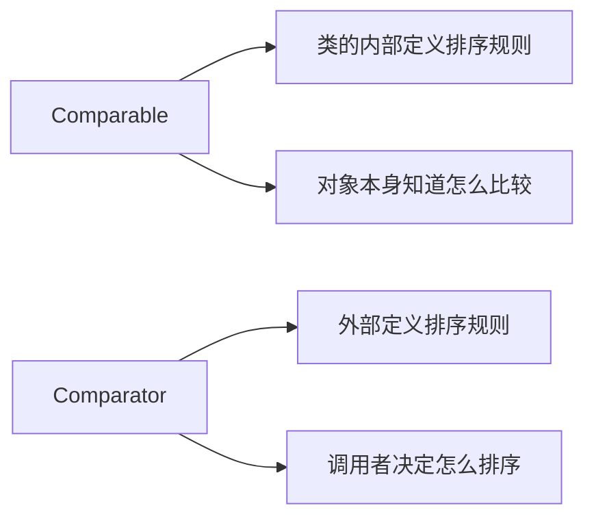

# Comparable 与 Comparator

面试官问："Java 里怎么给一个对象集合排序？"

候选人小严答："用 `Collections.sort()` 或者 `Arrays.sort()`。"

面试官追问："如果一个 User 对象，你既想按年龄排序，又想按姓名排序，怎么做？"

小严说："呃... 可以让 User 实现 `Comparable` 接口..."

面试官追问："那 `Comparable` 和 `Comparator` 有什么区别？分别在什么时候用？"

小严支支吾吾答不上来。

【面试官心理】
这道题看似简单，实际上在测试候选人对 Java 排序机制的理解深度。能说清楚两者的使用场景，说明真正写过 Comparison code，而不是只会调 API。

---

## 一、Comparable：自然排序 🔴

`Comparable` 是**自身具备的比较能力**，实现此接口的类的对象可以直接排序。

### 1.1 定义

```java
public interface Comparable<T> {
    int compareTo(T o);
}
```

### 1.2 示例：User 实现 Comparable

```java
public class User implements Comparable<User> {
    private String name;
    private int age;

    @Override
    public int compareTo(User o) {
        // 按年龄升序
        return this.age - o.age;
    }
}
```

### 1.3 使用

```java
List<User> users = new ArrayList<>();
users.add(new User("Alice", 25));
users.add(new User("Bob", 30));
users.add(new User("Charlie", 20));

Collections.sort(users); // 直接排序，调用 compareTo
// 排序后: Charlie(20), Alice(25), Bob(30)
```

### 1.4 特点

- **优点**：简单直接，类的对象天生可排序
- **缺点**：一个类只能有一个排序规则（"自然排序"）
- **适用场景**：类的开发者明确知道它应该如何排序

---

## 二、Comparator：定制排序 🔴

`Comparator` 是**外部比较器**，不修改对象类本身，灵活定义多种排序规则。

### 2.1 定义

```java
@FunctionalInterface
public interface Comparator<T> {
    int compare(T o1, T o2);
}
```

### 2.2 示例：多种排序规则

```java
List<User> users = new ArrayList<>();
users.add(new User("Alice", 25));
users.add(new User("Bob", 30));
users.add(new User("Charlie", 20));

// 按年龄升序
users.sort(Comparator.comparingInt(u -> u.getAge()));
// 或
users.sort((u1, u2) -> u1.getAge() - u2.getAge());

// 按年龄降序
users.sort(Comparator.comparingInt(User::getAge).reversed());

// 按姓名排序
users.sort(Comparator.comparing(User::getName));

// 先按年龄，再按姓名
users.sort(Comparator
    .comparingInt(User::getAge)
    .thenComparing(User::getName));
```

### 2.3 特点

- **优点**：灵活，一个类可以有多种排序规则
- **缺点**：调用时需要传入 Comparator
- **适用场景**：类的排序规则不确定，或者需要多种排序方式

---

## 三、两种接口的核心区别 🔴

| 维度 | Comparable | Comparator |
| --- | --- | --- |
| 包位置 | `java.lang` | `java.util` |
| 方法 | `compareTo(T o)` | `compare(T o1, T o2)` |
| 调用方 | `Collections.sort(list)` | `Collections.sort(list, comparator)` |
| 修改对象 | 需要修改类本身 | 不需要修改类 |
| 排序规则数量 | 只能有一个 | 可以有多个 |
| 意图 | "我天生就可以比较" | "我提供比较器" |



---

## 四、实战场景 🟡

### 4.1 JDK 类库中的 Comparable

```java
// String 实现了 Comparable，按字典顺序排序
Collections.sort(listOfStrings);

// Integer 实现了 Comparable，按数值大小排序
Collections.sort(listOfIntegers);

// BigDecimal 实现了 Comparable
Collections.sort(listOfDecimals);
```

### 4.2 JDK 类库中的 Comparator

```java
// Arrays.sort 支持传入 Comparator
String[] arr = {"banana", "apple", "cherry"};
Arrays.sort(arr, Comparator.reverseOrder()); // 降序

// Collections.reverseOrder() 返回一个倒序 Comparator
Collections.sort(list, Collections.reverseOrder());
```

### 4.3 Lambda 表达式简化 Comparator

```java
// 传统写法
users.sort(new Comparator<User>() {
    @Override
    public int compare(User u1, User u2) {
        return u1.getAge() - u2.getAge();
    }
});

// Lambda 写法
users.sort((u1, u2) -> u1.getAge() - u2.getAge());

// 方法引用 + Comparator
users.sort(Comparator.comparingInt(User::getAge));
```

---

## 五、面试官追问 🔴

**面试官**："`compareTo` 和 `equals` 有什么关系？"

**标准回答**：
- `compareTo` 返回 0 表示"相等"，但不一定和 `equals()` 一致
- 一个类的自然排序（`compareTo`）应该和 `equals()` 一致
- 如果不一致，`compareTo` 返回 0 但 `equals()` 返回 false，会导致 `HashSet` / `HashMap` 出现问题

```java
// 示例
public class Person implements Comparable<Person> {
    private int id;  // ID 相等视为同一个人
    private String name;

    @Override
    public int compareTo(Person o) {
        return this.id - o.id; // 按 ID 比较
    }

    @Override
    public boolean equals(Object o) {
        if (this == o) return true;
        if (!(o instanceof Person)) return false;
        Person p = (Person) o;
        return this.id == p.id && this.name.equals(p.name); // 按 ID 和姓名比较
    }
}
// compareTo 返回 0 表示 ID 相等
// equals 返回 true 表示 ID 和姓名都相等
// 不一致！放入 HashSet 时可能出问题
```

**面试官追问**："为什么要单独定义 `compareTo`？直接用 `equals` 不行吗？"

**标准回答**：
- `equals` 只返回 boolean，不能表达"大于/小于"的关系
- 排序需要全序关系（total order），需要知道三个结果：负数、零、正数
- `compareTo` 是"偏序关系"（partial order），`equals` 是"等价关系"（equivalence relation）

**面试官追问**："`Comparator.reversed()` 是怎么实现的？"

**标准回答**：

```java
default Comparator<T> reversed() {
    return Collections.reverseOrder(this);
}

// 底层
public static <T> Comparator<T> reverseOrder(Comparator<T> cmp) {
    Objects.requireNonNull(cmp);
    return (Comparator<T>) Collections.reverseOrder(cmp, null);
}
```

实际上返回一个**反转比较结果的 Comparator**。

---

## 六、常见误区 ⚠️

### ❌ 误区一：compareTo 返回 true/false

**错误**：
```java
@Override
public boolean compareTo(User o) {  // ❌ 返回类型不对
    return this.age > o.age;  // boolean 无法参与排序计算
}
```

**正确**：
```java
@Override
public int compareTo(User o) {
    return Integer.compare(this.age, o.age);  // ✅ 返回 int
}
```

### ❌ 误区二：Comparable 和 Comparator 混用导致不一致

**问题**：一个类同时实现了 Comparable 和 Collections.sort 传入 Comparator 时，以 Comparator 为准。

```java
public class User implements Comparable<User> {
    @Override
    public int compareTo(User o) {
        return this.age - o.age;  // 自然排序：按年龄
    }
}

// 但调用时可以覆盖
Collections.sort(users, Comparator.comparing(User::getName)); // 按姓名排序！
```

### ❌ 误区三：整数相减可能导致溢出

**错误**：
```java
@Override
public int compareTo(User o) {
    return this.age - o.age;  // ❌ age 是 int，可能溢出
}
```

**正确**：
```java
@Override
public int compareTo(User o) {
    return Integer.compare(this.age, o.age);  // ✅ 使用 API
}
```

---

## 七、总结

| 场景 | 推荐接口 |
| --- | --- |
| 类的设计者知道它需要排序 | Comparable |
| 调用者决定怎么排序 | Comparator |
| 需要多种排序规则 | Comparator |
| 只想排序一次 | Comparator（用 Lambda） |
| JDK 内置类（String、Integer） | Comparable（已实现） |
