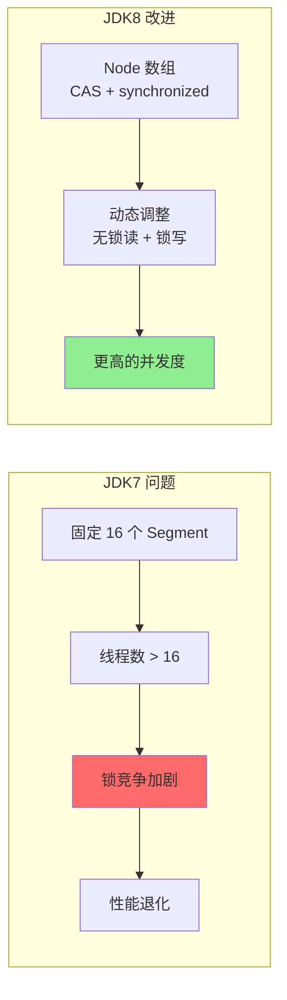
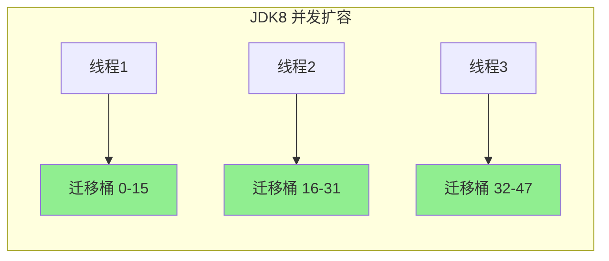

# ConcurrentHashMap JDK8 CAS+synchronized

**目标级别**：P6 / P7

---

## 快速自测

面试官问：「JDK8 的 ConcurrentHashMap 和 JDK7 有什么不同？为什么 JDK8 放弃了分段锁？」

---

## 一、核心问题

### 🔴 JDK8 ConcurrentHashMap 的数据结构是什么？

**JDK8 答案**：Node 数组 + 链表 + 红黑树（和 HashMap 一样，但支持并发）

```java
// JDK 8 ConcurrentHashMap
public class ConcurrentHashMap<K, V> extends AbstractMap<K, V>
        implements ConcurrentMap<K, V>, Serializable {

    // Node 数组，类似 HashMap，但 Node.value 和 next 是 volatile
    transient volatile Node<K, V>[] table;

    // 并发控制核心参数
    private static final int DEFAULT_CAPACITY = 16;
    private static final int NCPU = Runtime.getRuntime().availableProcessors();
    private static final int MIN_TRANSFER_STRIDE = 16;

    // 扩容相关
    private transient volatile int sizeCtl;
    private static final int MOVED = -1; // ForwardingNode 的 hash
    private static final int TREEBIN = -2; // TreeBin 的 hash
}
```

```mermaid
flowchart TB
    subgraph JDK8 数据结构
        A[table: Node[]<br/>volatile] --> B[Node 链表]
        A --> C[TreeBin 红黑树]
        B --> D[链表长度 < 8]
        C --> E[链表长度 >= 8<br/>容量 >= 64]
    end
    
    subgraph Node 结构
        F[hash: volatile]
        G[key: final]
        H[value: volatile]
        I[next: volatile]
    end
    
    style A fill:#87CEEB
    style C fill:#90EE90
```

---

## 二、为什么放弃分段锁？

### 🔴 JDK7 分段锁的问题

| 问题 | 说明 | 影响 |
|------|------|------|
| **并发度固定** | Segment 数量在构造时确定，不能动态调整 | 线程数超过 16 时，锁竞争加剧 |
| **实现复杂** | 两层结构（Segment + HashEntry），代码量很大 | 维护成本高 |
| **内存开销** | 每个 Segment 都有自己的 table、count、threshold | 内存占用大 |
| **热点 Segment** | 如果 hash 不均匀，某个 Segment 成为瓶颈 | 性能退化 |



### 💡 JDK8 的改进思路

1. **简化结构**：去掉 Segment，直接用 Node 数组
2. **CAS 优先**：对于简单操作（数组位置为空），用 CAS
3. **synchronized 保底**：对于复杂操作（链表/红黑树操作），用 synchronized
4. **支持并发扩容**：多个线程一起帮忙扩容

---

## 三、CAS + synchronized 并发控制

### 🔴 怎么用 CAS 和 synchronized？

```java
// JDK 8 putVal 简化
final V putVal(K key, V value, boolean onlyIfAbsent) {
    if (key == null || value == null) throw new NullPointerException();
    
    int hash = spread(key.hashCode());
    int binCount = 0;
    
    for (Node<K,V>[] tab = table;;) {
        Node<K,V> f;
        int n, i, fh;
        
        // 1. 初始化 table
        if (tab == null || (n = tab.length) == 0) {
            tab = initTable();
        }
        // 2. CAS 插入（数组位置为空）
        else if ((f = tabAt(tab, i = (n - 1) & hash)) == null) {
            if (casTabAt(tab, i, null, new Node<K,V>(hash, key, value, null)))
                break;
        }
        // 3. 扩容转移
        else if ((fh = f.hash) == MOVED)
            tab = helpTransfer(tab, f);
        // 4. synchronized 加锁
        else {
            V oldVal = null;
            synchronized (f) {  // 锁住链表头/红黑树根
                // 链表插入或更新
                // 红黑树插入
            }
            // ...
        }
    }
    // 5. 扩容检查
    if (binCount != 0) {
        if (binCount >= TREEIFY_THRESHOLD)
            treeifyBin(tab, i);
        if (oldVal != null)
            return oldVal;
    }
    addCount(1L, binCount);
    return null;
}
```

### 关键区别

| 操作场景 | JDK8 方案 | 说明 |
|---------|----------|------|
| table 未初始化 | CAS | 只有一个线程能成功初始化 |
| 数组位置为空 | CAS | 简单插入，无锁 |
| 数组位置有值 | synchronized | 链表/红黑树操作需要锁 |
| 扩容中 | synchronized + CAS | 协助数据迁移 |

---

## 四、CAS 操作详解

### 🔴 tabAt 和 casTabAt

```java
// 使用 UNSAFE 进行原子操作
private static final sun.misc.Unsafe U = sun.misc.Unsafe.getUnsafe();

// 获取数组指定位置的值（volatile 语义）
static final <K,V> Node<K,V> tabAt(Node<K,V>[] tab, int i) {
    return (Node<K,V>)U.getObjectVolatile(tab, ((long)i << ASHIFT) + ABASE);
}

// CAS 设置数组指定位置的值
static final <K,V> boolean casTabAt(Node<K,V>[] tab, int i,
                                    Node<K,V> c, Node<K,V> v) {
    return U.compareAndSwapObject(tab, ((long)i << ASHIFT) + ABASE, c, v);
}
```

**为什么不用 `volatile` 数组**？
- Java 的数组 volatile 语义只保证引用本身是 volatile
- `volatile Object[]` 只保证 `arr[i] = obj` 的写入对其他线程可见
- 但 `arr[i]` 的读取和写入本身不是原子的，需要额外保证

---

## 五、synchronized 加锁范围

### 💡 锁住的是什么？

```java
synchronized (f) {  // f 是链表头节点或红黑树根节点
    // ...
}
```

**不是锁住整个数组**，而是**锁住具体的桶**！

```mermaid
flowchart LR
    subgraph JDK8 锁粒度
        A[table 数组] --> B[index 0]
        A --> C[index 1]
        A --> D[index 2]
        
        C --> E[Node 链表]
        E --> F[synchronized(C)]
        F --> G[只锁 index 1]
        
        B --> H[synchronized(B)]
        D --> I[synchronized(D)]
    end
    
    style F fill:#90EE90
    style H fill:#87CEEB
    style I fill:#87CEEB
```

### 对比 JDK7

| 维度 | JDK7 | JDK8 |
|------|------|------|
| 锁对象 | Segment | 链表头/红黑树根 |
| 锁数量 | 固定（默认 16） | 动态（取决于桶数量） |
| 锁粒度 | 粗 | 细 |
| 内存开销 | 每个 Segment 有独立结构 | 只有一个 table |

---

## 六、初始化 table

### 💡 initTable 详解

```java
private final Node<K,V>[] initTable() {
    Node<K,V>[] tab;
    int sc;
    while ((tab = table) == null || tab.length == 0) {
        // sizeCtl < 0 表示正在初始化或扩容
        if ((sc = sizeCtl) < 0)
            Thread.yield();  // 让出 CPU
        // CAS 设置 sizeCtl = -1，表示正在初始化
        else if (U.compareAndSwapInt(this, SIZECTL, sc, -1)) {
            try {
                if ((tab = table) == null || tab.length == 0) {
                    int n = (sc > 0) ? sc : DEFAULT_CAPACITY;
                    @SuppressWarnings("unchecked")
                    Node<K,V>[] nt = (Node<K,V>[])new Node<?,?>[n];
                    table = tab = nt;
                    sc = n - (n >>> 2);  // threshold = 0.75 * n
                }
            } finally {
                sizeCtl = sc;
            }
            break;
        }
    }
    return tab;
}
```

---

## 七、并发扩容

### 🔴 JDK8 的并发扩容机制

```java
// 扩容核心方法
private final void transfer(Node<K,V>[] tab, Node<K,V>[] nextTab) {
    int n = tab.length;
    int stride = (NCPU > 1) ? (n >>> 3) / NCPU : n;
    if (stride < MIN_TRANSFER_STRIDE)
        stride = MIN_TRANSFER_STRIDE;  // 最小步长 16
    
    // 初始化新的 table
    if (nextTab == null) {
        try {
            @SuppressWarnings("unchecked")
            Node<K,V>[] nt = (Node<K,V>[])new Node<?,?>[n << 1];
            nextTab = nt;
        } finally {
            sizeCtl = (n << 1) - (n >>> 1);  // 1.5 倍
        }
    }
    
    // 每个线程负责一部分桶的迁移
    for (int i = 0, nextI = i; i < n; i = nextI) {
        // 迁移 tab[i] 桶
        // ...
    }
}
```

**多线程协作扩容**：



### JDK7 vs JDK8 扩容对比

| 维度 | JDK7 | JDK8 |
|------|------|------|
| 扩容方式 | 单线程扩容 | 多线程协作扩容 |
| 锁粒度 | 锁住整个 Segment | 锁住单个桶 |
| 并发度 | 受 Segment 数量限制 | 可动态增加线程 |
| 数据迁移 | 串行 | 并行 |

---

## 八、面试题精讲

### 🔴 第一层：JDK8 ConcurrentHashMap 怎么保证线程安全？

> **参考答案**：
>
> JDK8 使用 CAS + synchronized 保证线程安全：
> 1. **CAS**：对于数组位置为空的简单插入，用 `compareAndSwapObject`
> 2. **synchronized**：对于链表或红黑树的插入/更新，锁住链表头或红黑树根
> 3. **volatile**：数组、Node.value、Node.next 都是 volatile，保证可见性
> 4. **并发扩容**：多个线程协作扩容，加速扩容过程

### 🟡 第二层：JDK8 相比 JDK7 有什么改进？

> **参考答案**：
>
> 主要改进有：
> 1. **简化结构**：去掉 Segment，直接用 Node 数组，和 HashMap 类似
> 2. **锁粒度更细**：JDK7 锁 Segment，JDK8 只锁桶（链表头或红黑树根）
> 3. **并发度更高**：JDK8 的锁数量等于桶数量，可以动态调整
> 4. **并发扩容**：JDK8 支持多个线程一起帮忙扩容
> 5. **内存占用更低**：不再需要额外的 Segment 结构

### 💡 第三层：为什么不全部用 CAS，而要加 synchronized？

> **参考答案**：
>
> CAS 在简单场景下很高效，但有以下局限：
> 1. **ABA 问题**：CAS 只检查值是否变化，不适合链表插入场景
> 2. **竞争激烈时**：大量线程同时 CAS 会导致大量重试，性能下降
> 3. **复合操作**：链表遍历 + 插入是复合操作，CAS 不能保证原子性
>
> synchronized 在链表/红黑树操作时更合适，因为：
> 1. 锁住链表头后，遍历和插入是原子的
> 2. 竞争不激烈时，自旋锁的开销很小
> 3. JVM 会优化 synchronized（偏向锁、轻量级锁）

### ⚠️ 面试官挖坑点

| 陷阱 | 错误回答 | 正确回答 |
|------|---------|----------|
| 「JDK8 用的是乐观锁」 | 不了解 synchronized | synchronized 是悲观锁，CAS 是乐观锁 |
| 「JDK8 完全不用锁」 | 忽略了 synchronized | 链表/红黑树操作需要 synchronized |
| 「ConcurrentHashMap 完全没有竞争」 | 忽略了 synchronized 锁的竞争 | synchronized 仍然会有锁竞争 |

---

## 九、对比表格

| 维度 | JDK7 | JDK8 |
|------|------|------|
| 数据结构 | Segment[] + HashEntry[] | Node[] |
| 并发控制 | ReentrantLock（Segment） | CAS + synchronized |
| 锁粒度 | Segment（粗） | 桶（细） |
| 并发度 | 固定（默认 16） | 动态 |
| 初始化 | 昂贵（创建所有 Segment） | 懒加载 |
| 扩容 | 单线程 | 多线程协作 |
| 红黑树 | 无 | 支持 |

---

## 十、总结

**JDK8 ConcurrentHashMap CAS+synchronized 核心要点**：

```mermaid
flowchart LR
    A[put 操作] --> B{table[i] == null?}
    B -->|是| C[CAS 插入]
    B -->|否| D{需要扩容?}
    D -->|是| E[helpTransfer]
    D -->|否| F[synchronized 锁桶]
    
    C --> G[成功]
    F --> H[链表/红黑树操作]
    H --> I[成功]
    
    style C fill:#90EE90
    style F fill:#FFA07A
    style I fill:#90EE90
```

1. **数据结构**：Node 数组 + 链表/红黑树
2. **CAS**：用于简单插入和初始化
3. **synchronized**：用于链表/红黑树操作
4. **锁粒度**：只锁桶，不锁整个数组
5. **并发扩容**：多线程协作扩容

---

## 延伸思考

> **追问**：JDK8 的 synchronized 做了哪些优化？

JDK8 的 synchronized 相比 JDK6 有以下优化：
1. **偏向锁**：无竞争时，锁偏向第一个获取它的线程
2. **轻量级锁**：有少量竞争时，自旋而不是阻塞
3. **自适应自旋**：自旋次数由 JVM 动态调整
4. **锁消除**：JIT 编译时消除不必要的锁
