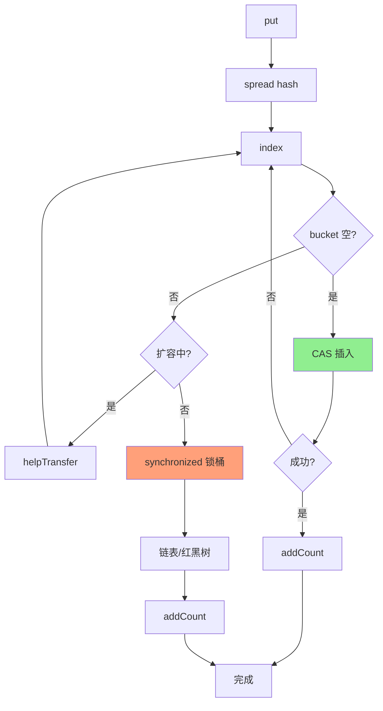

# ConcurrentHashMap put 流程

**目标级别**：P6 / P7

---

## 快速自测

面试官问：「ConcurrentHashMap put 一个元素，底层经历了哪些步骤？」

---

## 一、核心问题

### 🔴 ConcurrentHashMap put 流程是怎样的？

**流程总览**：

```mermaid
flowchart TD
    A[put(key, value)] --> B[spread 计算 hash]
    B --> C[定位桶下标<br/>(n-1) & hash]
    C --> D{table[i] == null?}
    
    D -->|是| E[CAS 插入新节点]
    E --> F{成功?}
    F -->|是| G[put 完成]
    F -->|否| C
    
    D -->|否| H[hash == MOVED?]
    H -->|是| I[helpTransfer 协助扩容]
    I --> C
    
    H -->|否| J[synchronized 锁住 f]
    
    J --> K{f 是链表?}
    K -->|是| L[遍历链表]
    L --> M{找到相同 key?}
    M -->|是| N[更新 value]
    M -->|否| O[尾部插入新节点<br/>binCount++]
    
    K -->|否| P[是红黑树]
    P --> Q[treePut 插入树]
    
    O --> R{binCount >= 8?}
    R -->|是| S[treeifyBin 链表转红黑树]
    R -->|否| T[释放锁]
    
    Q --> T
    S --> T
    
    T --> U[addCount 检查扩容]
    U --> V[put 完成]
    
    style E fill:#90EE90
    style J fill:#FFA07A
    style U fill:#87CEEB
```

---

## 二、逐行源码解析

### JDK8 putVal 完整源码

```java
final V putVal(K key, V value, boolean onlyIfAbsent) {
    // 1. null 检查
    if (key == null || value == null) throw new NullPointerException();
    
    // 2. 计算 hash
    int hash = spread(key.hashCode());
    int binCount = 0;
    
    for (Node<K,V>[] tab = table;;) {  // 死循环，保证成功
        Node<K,V> f;
        int n, i, fh;
        
        // 3. 初始化 table（懒加载）
        if (tab == null || (n = tab.length) == 0)
            tab = initTable();
        
        // 4. CAS 插入（数组位置为空）
        else if ((f = tabAt(tab, i = (n - 1) & hash)) == null) {
            if (casTabAt(tab, i, null,
                         new Node<K,V>(hash, key, value, null)))
                break;  // 插入成功，退出循环
        }
        
        // 5. 正在扩容，协助迁移
        else if ((fh = f.hash) == MOVED)
            tab = helpTransfer(tab, f);
        
        // 6. 桶不为空，synchronized 加锁
        else {
            V oldVal = null;
            synchronized (f) {  // 锁住链表头或红黑树根
                // 确认仍然是链表头
                if (tabAt(tab, i) == f) {
                    
                    // 7. 链表处理
                    if (fh >= 0) {
                        binCount = 1;
                        for (Node<K,V> e = f;; ++binCount) {
                            K ek;
                            // 找到相同 key，更新 value
                            if (e.hash == hash &&
                                ((ek = e.key) == key ||
                                 (key != null && key.equals(ek)))) {
                                oldVal = e.value;
                                if (!onlyIfAbsent)
                                    e.value = value;
                                break;
                            }
                            // 到达链表尾部，插入新节点
                            Node<K,V> pred = e;
                            if ((e = e.next) == null) {
                                pred.next = new Node<K,V>(hash, key,
                                                          value, null);
                                break;
                            }
                        }
                    }
                    
                    // 8. 红黑树处理
                    else if (f instanceof TreeBin) {
                        Node<K,V> p;
                        binCount = 2;
                        p = ((TreeBin<K,V>)f).putTreeVal(hash, key,
                                                        value);
                        if (p != null) {
                            oldVal = p.value;
                            if (!onlyIfAbsent)
                                p.value = value;
                        }
                    }
                }
            }
            
            // 9. 处理链表转红黑树
            if (binCount != 0) {
                if (binCount >= TREEIFY_THRESHOLD)
                    treeifyBin(tab, i);
                if (oldVal != null)
                    return oldVal;
                break;
            }
        }
    }
    
    // 10. 增加计数 + 检查扩容
    addCount(1L, binCount);
    return null;
}
```

---

## 三、关键步骤详解

### 第一步：spread 计算 hash

```java
// spread 方法，将 hash 打散
static final int spread(int h) {
    return (h ^ (h >>> 16)) & HASH_BITS;
}
```

**和 HashMap 的 hash 方法类似，但多了一步 `& HASH_BITS`**：

```java
// HASH_BITS 保证 hash 不为 MOVED(-1) 或 TREEBIN(-2)
static final int HASH_BITS = 0x7fffffff;
```

### 第二步：CAS 插入

```java
// 数组位置为空时，CAS 插入
if ((f = tabAt(tab, i = (n - 1) & hash)) == null) {
    if (casTabAt(tab, i, null,
                 new Node<K,V>(hash, key, value, null)))
        break;
}
```

**为什么用 CAS 而不是直接写入**？
- 多线程可能同时到达这个位置
- CAS 失败说明其他线程已经插入了
- 失败后重试，进入下一个分支

### 第三步：synchronized 加锁

```java
synchronized (f) {  // f 是链表头或红黑树根
    // 链表遍历或红黑树插入
}
```

**锁住的是桶的第一个节点，不是整个数组**！

```mermaid
flowchart LR
    subgraph table[i]
        A[f: 链表头] --> B[Node1]
        B --> C[Node2]
        C --> D[...]
    end
    
    subgraph synchronized 范围
        E[synchronized(f)] --> A
        E --> B
        E --> C
    end
    
    style A fill:#FFA07A
```

### 第四步：addCount

```java
// 增加计数
addCount(1L, binCount);
```

**作用**：
1. 更新 size（通过 CounterCell 数组支持并发更新）
2. 检查是否需要扩容

---

## 四、与 HashMap put 流程对比

```mermaid
flowchart LR
    subgraph HashMap
        A1[hash(key)] --> B1[index]
        B1 --> C1{bucket 空?}
        C1 -->|是| D1[直接插入]
        C1 -->|否| E1[bucket 加锁?]
        E1 -->|是| F1[synchronized]
        F1 --> G1[链表遍历]
        E1 -->|否| H1[遍历链表]
    end
    
    subgraph ConcurrentHashMap
        A2[spread(key)] --> B2[index]
        B2 --> C2{bucket 空?}
        C2 -->|是| D2[CAS 插入]
        C2 -->|否| E2{正在扩容?}
        E2 -->|是| F2[协助扩容]
        E2 -->|否| G2[synchronized 锁桶]
        G2 --> H2[链表/红黑树操作]
    end
```

---

## 五、并发控制总结

| 场景 | 并发控制 | 原因 |
|------|---------|------|
| table 未初始化 | CAS | 保证只初始化一次 |
| bucket 为空 | CAS | 简单插入，无竞争 |
| bucket 不为空 | synchronized | 链表/红黑树操作需要原子性 |
| 扩容中 | synchronized + CAS | 多线程协作迁移 |
| size 更新 | CounterCell + CAS | 并发计数，避免全局竞争 |

---

## 六、面试题精讲

### 🔴 第一层：ConcurrentHashMap put 流程是怎样的？

> **参考答案**：
>
> ConcurrentHashMap put 主要经历以下步骤：
> 1. 计算 key 的 hash（spread 方法）
> 2. 定位桶下标 `(n-1) & hash`
> 3. 如果 table 未初始化，先初始化
> 4. 如果 bucket 为空，CAS 尝试插入
> 5. 如果正在扩容，协助迁移数据
> 6. 否则 synchronized 锁住桶，遍历链表或红黑树
> 7. 找到相同 key 更新 value；否则插入新节点
> 8. 检查链表长度 >= 8 是否需要转红黑树
> 9. addCount 增加计数，检查是否需要扩容

### 🟡 第二层：和 HashMap put 有什么区别？

> **参考答案**：
>
> 主要区别有：
> 1. **并发控制**：HashMap 没有并发控制，ConcurrentHashMap 用 CAS + synchronized
> 2. **初始化**：HashMap 在首次 put 时初始化；ConcurrentHashMap 也支持懒加载
> 3. **扩容**：HashMap 单线程扩容；ConcurrentHashMap 支持多线程协作扩容
> 4. **size 计数**：HashMap 用 size++；ConcurrentHashMap 用 CounterCell 并发计数

### ⚠️ 面试官挖坑点

| 陷阱 | 错误回答 | 正确回答 |
|------|---------|----------|
| 「ConcurrentHashMap 完全不用锁」 | 忽略了 synchronized | 链表/红黑树操作需要 synchronized |
| 「put 时锁住整个数组」 | 不了解锁粒度 | 只锁 bucket（链表头或红黑树根） |
| 「CAS 失败就失败了」 | 不了解重试机制 | CAS 失败后会重试，循环直到成功 |

---

## 七、总结

**ConcurrentHashMap put 流程核心要点**：



1. **CAS 优先**：bucket 为空时用 CAS 插入
2. **synchronized 保底**：链表/红黑树操作用 synchronized
3. **锁粒度细**：只锁桶，不锁数组
4. **支持并发扩容**：多个线程协作扩容
5. **并发计数**：通过 CounterCell 数组并发更新 size
