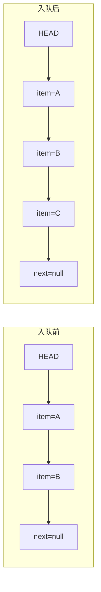
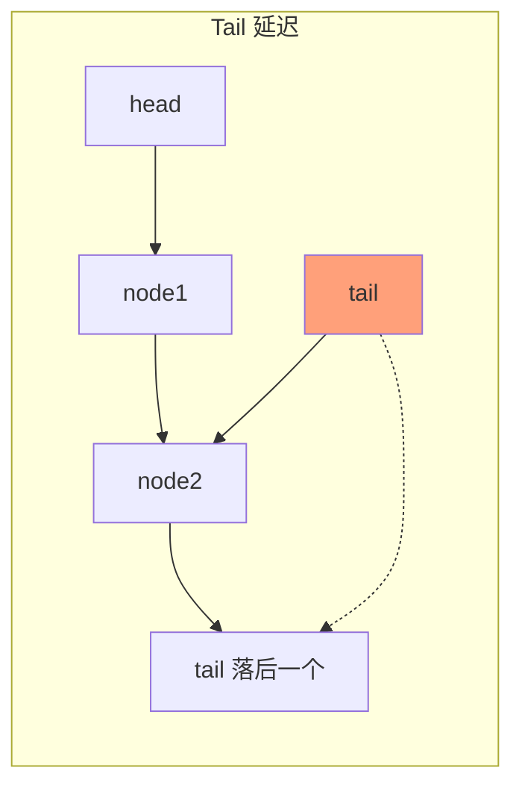
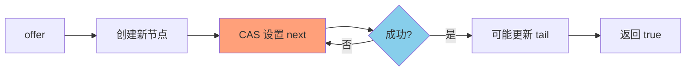

# ConcurrentLinkedQueue 原理

**目标级别**：P6

---

## 快速自测

面试官问：「ConcurrentLinkedQueue 是怎么实现的？和阻塞队列有什么区别？」

---

## 一、核心问题

### 🔴 ConcurrentLinkedQueue 是什么？

**无界、线程安全的单向链表队列**，使用 CAS 实现无锁并发。

```java
public class ConcurrentLinkedQueue<E> extends AbstractQueue<E>
        implements Queue<E>, Serializable {

    private static final Node<Object> HEAD = new Node<>(null);
    private static final Node<Object> TAIL = HEAD;

    private static class Node<E> {
        volatile E item;
        volatile Node<E> next;
    }
}
```

### 和 BlockingQueue 的区别

| 维度 | ConcurrentLinkedQueue | BlockingQueue |
|------|---------------------|---------------|
| 阻塞机制 | ❌ 无阻塞 | ✅ 支持阻塞 |
| 容量 | 无界（Integer.MAX_VALUE） | 有界或无界 |
| null 处理 | 不允许 null | 视实现而定 |
| API | offer/poll/peek | offer/poll/peek + blocking |
| 适用场景 | 高并发、无阻塞 | 生产者-消费者模式 |

---

## 二、为什么不用锁？

### 💡 锁的问题

```java
// 有锁的队列（效率低）
public synchronized void offer(E e) {
    // 所有线程排队等待
}
```

**问题**：线程竞争锁会导致上下文切换和等待。

### CAS 的优势

```java
// 无锁队列（效率高）
public boolean offer(E e) {
    Node<E> newNode = new Node<>(e);
    while (true) {
        Node<E> tail = getTail();
        Node<E> next = tail.next;
        if (tail == getTail()) {
            if (next == null) {
                // CAS 设置 tail.next
                if (casNext(tail, null, newNode)) {
                    // 成功
                    return true;
                }
            } else {
                // tail 不是真正的尾节点，移动 tail
                casTail(tail, next);
            }
        }
    }
}
```

---

## 三、offer 方法详解

### 🔴 入队是怎么实现的？

```java
public boolean offer(E e) {
    checkNotNull(e);
    final Node<E> newNode = new Node<>(e);

    // 死循环，直到成功
    for (Node<E> t = tail, p = t;;) {
        Node<E> q = p.next;
        if (q == null) {
            // q 是尾节点，尝试 CAS 设置 next
            if (p.casNext(null, newNode)) {
                // 成功，可能需要移动 tail
                if (p != t)
                    casTail(t, newNode);
                return true;
            }
        } else if (p == q) {
            // p 已经被删除，需要重新找 tail
            p = (t != (t = tail)) ? t : head;
        } else {
            // 更新 p 指向 tail 或 q
            p = (p != t && t != (t = tail)) ? t : q;
        }
    }
}
```

### 图解



---

## 四、poll 方法详解

### 🔴 出队是怎么实现的？

```java
public E poll() {
    restart:
    for (Node<E> h = head, p = h, q;;) {
        E item = p.item;
        if (item != null && p.casItem(item, null)) {
            // 成功删除
            if (p != h)
                casHead(h, (q != null) ? q : p);
            return item;
        } else if ((q = p.next) == null) {
            // 队列为空
            if (p != h)
                casHead(h, p);
            return null;
        } else if (p == q) {
            // p 已被删除，重新开始
            continue restart;
        } else {
            p = q;
        }
    }
}
```

### 惰性删除

```mermaid
flowchart LR
    subgraph 删除前
        A[HEAD] --> B[item=A]
        B --> C[item=B]
    end
    
    subgraph 删除后（惰性删除）
        D[HEAD] --> E[item=null<br/>标记删除]
        E --> F[item=B]
    end
    
    style E fill:#FFA07A
```

**注意**：ConcurrentLinkedQueue 使用**惰性删除**，不会立即删除节点，只是将 item 设为 null。

---

## 五、HOPS 和 tail 更新

### 💡 为什么 tail 更新是延迟的？

```java
// offer 方法中的 tail 更新
if (p != t)
    casTail(t, newNode);
```

**设计思想**：
1. tail 不总是指向真正的尾节点
2. tail 和 head 最多落后一个节点
3. 减少 CAS 操作，提高并发度



---

## 六、为什么 ConcurrentLinkedQueue 是无界的？

### 🔴 有界队列 vs 无界队列

| 特性 | 有界队列 | 无界队列 |
|------|---------|---------|
| 容量限制 | 有 | 无（Integer.MAX_VALUE） |
| offer 行为 | 失败/阻塞 | 总是成功 |
| 内存 | 有限 | 可能无限增长 |
| 适用场景 | 限流 | 解耦、无限制 |

### 无界的代价

```java
// 无界队列的问题
ConcurrentLinkedQueue<Object> queue = new ConcurrentLinkedQueue<>();

// 生产者不断入队
while (true) {
    queue.offer(new BigObject());  // 永远成功
    // 如果消费速度 < 生产速度，内存会不断增长
}
```

---

## 七、面试题精讲

### 🔴 第一层：ConcurrentLinkedQueue 是怎么实现的？

> **参考答案**：
>
> ConcurrentLinkedQueue 通过 CAS 实现无锁：
> 1. 内部是单向链表，head 和 tail 两个指针
> 2. offer 时，CAS 设置 tail.next，成功后可能更新 tail
> 3. poll 时，CAS 设置 head.item 为 null，成功后可能更新 head
> 4. 使用死循环（for/while）保证操作成功

### 🟡 第二层：和 BlockingQueue 有什么区别？

> **参考答案**：
>
> 主要区别有：
> 1. **阻塞机制**：ConcurrentLinkedQueue 不阻塞，BlockingQueue 支持阻塞
> 2. **容量**：ConcurrentLinkedQueue 无界，BlockingQueue 可以有界
> 3. **实现**：ConcurrentLinkedQueue 用 CAS，BlockingQueue 用 synchronized + Condition
> 4. **使用场景**：ConcurrentLinkedQueue 用于无阻塞的高并发场景，BlockingQueue 用于生产者-消费者模式

### 💡 第三层：为什么 tail 更新是延迟的？

> **参考答案**：
>
> tail 更新延迟是为了减少 CAS 操作：
> 1. 如果每次 offer 都更新 tail，会增加一次 CAS
> 2. tail 只在 p != t 时才更新，即 tail 落后于真正的尾节点
> 3. 实际上 tail 最多落后一个节点
> 4. 这样减少了并发竞争，提高了性能

### ⚠️ 面试官挖坑点

| 陷阱 | 错误回答 | 正确回答 |
|------|---------|----------|
| 「ConcurrentLinkedQueue 永远不会阻塞」 | 忽略队列满的情况 | 无界队列不会满 |
| 「offer 总是成功的」 | 不了解内存限制 | 内存不足时会失败或 OOM |
| 「ConcurrentLinkedQueue 比 BlockingQueue 快」 | 不了解各自适用场景 | 在阻塞场景下 BlockingQueue 更合适 |

---

## 八、对比表格

| 维度 | ConcurrentLinkedQueue | LinkedBlockingQueue | ArrayBlockingQueue |
|------|---------------------|-------------------|------------------|
| 锁机制 | CAS（无锁） | ReentrantLock（单锁） | ReentrantLock（单锁） |
| 阻塞 | ❌ | ✅ | ✅ |
| 有界 | ❌ | ✅（可选） | ✅ |
| 内存效率 | 高（无锁） | 中 | 中 |
| 吞吐量 | 最高 | 高 | 中 |

---

## 九、总结

**ConcurrentLinkedQueue 核心要点**：



1. **无锁实现**：使用 CAS，不阻塞线程
2. **单向链表**：head 和 tail 指针
3. **延迟更新**：tail 最多落后一个节点
4. **惰性删除**：poll 时标记删除，不立即移除节点
5. **无界队列**：容量无限制，但要注意内存
