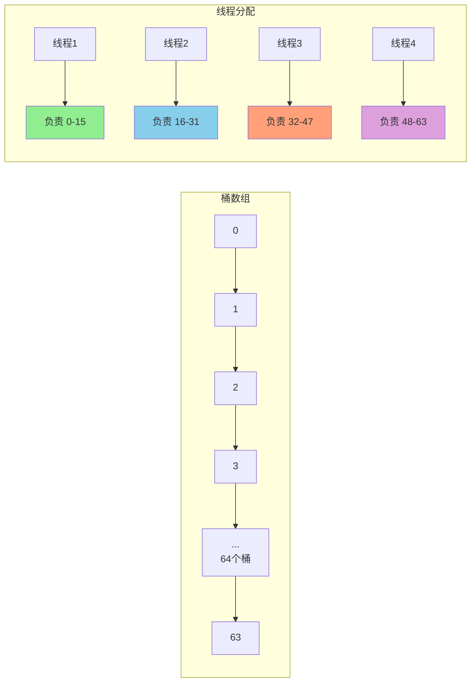
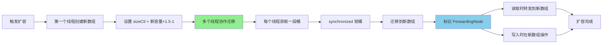

# ConcurrentHashMap 扩容机制

**目标级别**：P6 / P7

---

## 快速自测

面试官问：「ConcurrentHashMap 扩容时其他线程还能读写吗？怎么实现并发扩容的？」

---

## 一、核心问题

### 🔴 ConcurrentHashMap 扩容和 HashMap 有什么不同？

| 维度 | HashMap | ConcurrentHashMap |
|------|---------|-------------------|
| 扩容线程 | 单线程 | 多线程协作 |
| 扩容锁 | 无 | 用 synchronized 锁桶 |
| 迁移过程 | 串行 | 并行 |
| 读写影响 | 可能死循环 | 正常读写 |
| 新数组创建 | 单线程 | 多线程可能同时创建 |

---

## 二、扩容触发条件

### 🔴 什么时候会触发扩容？

```java
// addCount 方法中检查
private final void addCount(long x, int binCount) {
    CounterCell[] as;
    long b, s;
    
    // 1. 并发计数
    if ((as = counterCells) != null ||
        !U.compareAndSwapLong(this, BASECOUNT, b = baseCount, s = b + x)) {
        // CAS 失败，用 CounterCell 数组并发计数
    }
    
    // 2. 检查是否需要扩容
    if (check >= 0) {
        Node<K,V>[] tab, nt;
        int n, sc;
        while (s >= (long)(sc = sizeCtl)) {
            if (tab == table && n < MAX_ARRAY_SIZE) {
                // 触发扩容
                transfer(tab, nt);
            }
        }
    }
}
```

**触发条件**：`s >= sizeCtl`

| sizeCtl | 含义 |
|---------|------|
| 正数 | 扩容阈值（负数时表示正在扩容或初始化） |
| `-1` | 正在初始化 |
| `-n`（n > 1） | 正在扩容，有 n-1 个线程在扩容 |

---

## 三、并发扩容原理

### 💡 JDK8 的并发扩容机制

ConcurrentHashMap 的扩容是**多线程协作**的，多个线程可以同时参与数据迁移。

```java
// 扩容核心方法 transfer
private final void transfer(Node<K,V>[] tab, Node<K,V>[] nextTab) {
    int n = tab.length;
    int stride = (NCPU > 1) ? (n >>> 3) / NCPU : n;
    
    // 每个线程负责迁移的桶数
    if (stride < MIN_TRANSFER_STRIDE)
        stride = MIN_TRANSFER_STRIDE;  // 最小 16
    
    // 第一个线程负责创建新数组
    if (nextTab == null) {
        try {
            @SuppressWarnings("unchecked")
            Node<K,V>[] nt = (Node<K,V>[])new Node<?,?>[n << 1];
            nextTab = nt;
        } finally {
            // sizeCtl = 新容量 × 1.5 - 1
            sizeCtl = (n << 1) - (n >>> 1);
        }
    }
    
    int nextn = nextTab.length;
    ForwardingNode<K,V> fwd = new ForwardingNode<K,V>(nextTab);
    
    boolean advance = true;
    boolean finishing = false;
    
    for (int i = 0, nextIndex = nextIndex;;) {
        // 每个线程获取一段连续的桶来迁移
        while (advance) {
            int nexti = nextIndex - stride;
            if (--nexti >= bound) {
                // ...
            }
        }
        
        // 迁移完成
        if (i >= n || finishing) {
            table = nextTab;
            sizeCtl = (n << 1) - (n >>> 1);
            return;
        }
    }
}
```

---

## 四、多线程协作机制

### 🔴 多个线程怎么分配任务？



**每个线程**：
1. 从 `nextIndex` 获取一段连续的任务
2. 迁移完成后，再从 `nextIndex` 获取下一段
3. 直到所有桶迁移完成

---

## 五、ForwardingNode

### 🔴 什么是 ForwardingNode？

ForwardingNode 是一个特殊的节点，表示**正在扩容**，且该桶的数据已迁移完成。

```java
// ForwardingNode
static final class ForwardingNode<K,V> extends Node<K,V> {
    final Node<K,V>[] nextTable;
    
    ForwardingNode(Node<K,V>[] tab) {
        super(MOVED, null, null, null);
        this.nextTable = tab;
    }
    
    // 查找会转发到新数组
    Node<K,V> find(int h, Object k) {
        Node<K,V>[] tab = nextTable;
        // ...
    }
}
```

**作用**：
1. 标记该桶已迁移完成
2. 转发查找到新数组
3. `hash = MOVED(-1)`，标识正在扩容

---

## 六、读写在扩容时的表现

### 🔴 扩容时还能读写吗？

**可以**！ConcurrentHashMap 扩容时仍然支持读写。

```mermaid
flowchart LR
    subgraph 扩容时读取
        A[get(key)] --> B{桶已完成迁移?}
        B -->|是| C[直接在新数组查找]
        B -->|否| D{找到 ForwardingNode?}
        D -->|是| E[转发到新数组]
        D -->|否| F[在旧数组查找]
    end
    
    subgraph 扩容时写入
        G[put(key)] --> H{桶已完成迁移?}
        H -->|是| I[在新数组插入]
        H -->|否| J{找到 ForwardingNode?}
        J -->|是| K[协助迁移后插入]
        J -->|否| L[在旧数组插入]
    end
```

### helpTransfer

```java
// 帮助扩容
final Node<K,V>[] helpTransfer(Node<K,V>[] tab, Node<K,V> f) {
    Node<K,V>[] nextTab;
    int sc;
    if (tab != null &&
        f instanceof ForwardingNode &&
        (nextTab = ((ForwardingNode<K,V>)f).nextTable) != null) {
        // CAS 增加扩容线程数
        if (U.compareAndSwapInt(this, SIZECTL, sc = sizeCtl,
                                sc - 1)) {
            // 参与扩容
            transfer(tab, nextTab);
        }
    }
    return tab;
}
```

---

## 七、数据迁移

### 🔴 迁移过程中数据怎么分配？

```java
// 遍历旧数组的桶
for (int i = 0, nextI = i; i < n; i = nextI) {
    Node<K,V> f = tabAt(tab, i);
    
    if (f == null)
        advance = true;
    else if ((fh = f.hash) == MOVED)
        advance = true;  // 已迁移
    else {
        synchronized (f) {  // 锁住桶
            if (tabAt(tab, i) == f) {
                Node<K,V> loHead = null, loTail = null;
                Node<K,V> hiHead = null, hiTail = null;
                Node<K,V> next;
                
                // 和 HashMap 类似的逻辑
                do {
                    next = f.next;
                    if ((f.hash & n) == 0) {
                        // 保持原下标
                        if (loTail == null)
                            loHead = f;
                        else
                            loTail.next = f;
                        loTail = f;
                    } else {
                        // 新下标 = 原下标 + n
                        if (hiTail == null)
                            hiHead = f;
                        else
                            hiTail.next = f;
                        hiTail = f;
                    }
                } while ((f = next) != null);
                
                // 写入新数组
                setTabAt(nextTab, i, loHead);
                setTabAt(nextTab, i + n, hiHead);
                
                // 标记旧桶已迁移
                setTabAt(tab, i, fwd);
                advance = true;
            }
        }
    }
}
```

**分配逻辑**（和 HashMap 一样）：
- `hash & n == 0`：保持原下标
- `hash & n != 0`：原下标 + n

---

## 八、面试题精讲

### 🔴 第一层：ConcurrentHashMap 怎么实现并发扩容？

> **参考答案**：
>
> JDK8 的 ConcurrentHashMap 支持多线程协作扩容：
> 1. 第一个线程创建新数组（容量翻倍）
> 2. 每个参与扩容的线程从 `nextIndex` 获取一段连续的桶来迁移
> 3. 迁移时用 synchronized 锁住桶，防止其他线程写入
> 4. 迁移完成的桶标记为 ForwardingNode
> 5. 其他线程访问到 ForwardingNode 时，会协助迁移

### 🟡 第二层：扩容时还能读写吗？

> **参考答案**：
>
> 可以。扩容时：
> 1. **读取**：如果桶已迁移，在新数组查找；如果未迁移，在旧数组查找
> 2. **写入**：如果桶已迁移，在新数组写入；如果遇到 ForwardingNode，协助迁移后再写入
> 3. 读写不受扩容影响，这是 ConcurrentHashMap 相比 HashMap 的优势

### 💡 第三层：为什么 ConcurrentHashMap 扩容不需要整体加锁？

> **参考答案**：
>
> 因为扩容过程是**分段迁移**的：
> 1. 每个线程负责迁移一部分桶，锁住的是单个桶而不是整个数组
> 2. 未被迁移的桶仍然可以正常读写
> 3. ForwardingNode 标记已迁移完成的桶，起到协调作用
> 4. 这种设计让扩容对业务线程的影响降到最低

### ⚠️ 面试官挖坑点

| 陷阱 | 错误回答 | 正确回答 |
|------|---------|----------|
| 「扩容时不能读写」 | 不了解并发扩容 | 扩容时仍然可以正常读写 |
| 「所有线程一起扩容」 | 不了解分段迁移 | 每个线程负责一段连续的桶 |
| 「需要整体加锁」 | 不了解锁粒度 | 只锁被迁移的桶，不锁整个数组 |

---

## 九、对比表格

| 维度 | HashMap | ConcurrentHashMap JDK8 |
|------|---------|------------------------|
| 扩容方式 | 单线程 | 多线程协作 |
| 锁 | 无 | 锁单个桶 |
| 扩容期间读写 | 可能死循环（JDK7） | 正常 |
| 新数组创建 | 单线程 | 多线程可能同时检测到需要扩容 |

---

## 十、总结

**ConcurrentHashMap 扩容核心要点**：



1. **多线程协作**：多个线程同时参与数据迁移
2. **分段迁移**：每个线程负责一段连续的桶
3. **ForwardingNode**：标记已迁移的桶，转发读写操作
4. **读写不阻塞**：扩容期间正常读写
5. **锁粒度细**：只锁单个桶，不锁整个数组
