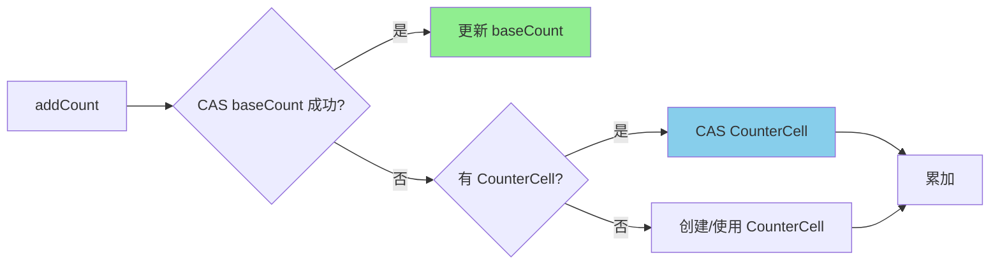

# ConcurrentHashMap size 方法

**目标级别**：P6 / P7

---

## 快速自测

面试官问：「ConcurrentHashMap 怎么统计元素个数的？线程安全吗？」

---

## 一、核心问题

### 🔴 ConcurrentHashMap size 是怎么实现的？

**简单回答**：通过 CounterCell 数组实现并发计数。

```java
// 核心字段
private transient volatile long baseCount;
private transient volatile CounterCell[] counterCells;
```

---

## 二、为什么不用 size++？

### ⚠️ size++ 不是原子操作

```java
// 普通 Map 的 size 实现
public int size() {
    return size++;  // 不是线程安全的
}
```

**问题**：
- `size++` 包含三步：读取 → 加1 → 写入
- 多线程并发时，会丢失更新

### ConcurrentHashMap 的解决方案

```mermaid
flowchart LR
    subgraph 简单方案（有问题）
        A[Thread1: size=0] --> B[read size=0]
        A --> C[+1]
        A --> D[write size=1]
        
        E[Thread2: size=0] --> F[read size=0]
        E --> G[+1]
        E --> H[write size=1]
    end
    
    subgraph ConcurrentHashMap 方案
        I[baseCount] --> J[CounterCell[]]
        J --> K[Cell1]
        J --> L[Cell2]
        J --> M[Cell3]
    end
```

---

## 三、CounterCell 并发计数

### 🔴 CounterCell 是什么？

```java
// CounterCell - 并发计数的单元格
@sun.misc.Contended
static final class CounterCell {
    volatile long value;
    
    CounterCell(long x) {
        value = x;
    }
}
```

**设计思想**：
- 每个线程更新不同的 CounterCell
- 避免所有线程竞争同一个 baseCount
- 最终求和得到总数

### 💡 @Contended 注解

```java
// @sun.misc.Contended 防止伪共享
// 缓存行伪共享：两个线程修改同一个缓存行的不同变量
// 导致一个线程的修改让另一个线程的缓存行失效

// 添加 padding，让每个 CounterCell 独占一个缓存行
@sun.misc.Contended
static final class CounterCell {
    volatile long value;
}
```

---

## 四、addCount 详解

### 🔴 计数是怎么增加的？

```java
// addCount - 增加计数
private final void addCount(long x, int binCount) {
    CounterCell[] as;
    long b, s;
    
    // 尝试 CAS 更新 baseCount
    if ((as = counterCells) != null ||
        !U.compareAndSwapLong(this, BASECOUNT, b = baseCount, s = b + x)) {
        // CAS 失败，使用 CounterCell
        CounterCell a;
        long v;
        int m;
        boolean uncontended = true;
        
        if (as == null || (m = as.length - 1) < 0 ||
            (a = as[ThreadLocalRandom.getProbe() & m]) == null ||
            !(uncontended =
              U.compareAndSwapLong(a, CELLVALUE, v = a.value, v + x))) {
            // 全部失败，调用 fullAddCount
            fullAddCount(x, uncontended, as, threadHashCode, a, false);
        }
        s = sumCount();
    }
    
    // 检查是否需要扩容
    if (check >= 0) {
        // ...
    }
}
```

### 计数流程图

```mermaid
flowchart TD
    A[addCount(x)] --> B{CAS baseCount 成功?}
    B -->|是| C[完成]
    B -->|否| D{CounterCell 可用?}
    
    D -->|是| E{CAS CounterCell 成功?}
    E -->|是| C
    E -->|否| F[重试]
    
    D -->|否| G[初始化 CounterCell]
    G --> H[fullAddCount]
    H --> C
    
    style C fill:#90EE90
    style F fill:#FFA07A
```

---

## 五、size 和 sumCount

### 🔴 size() 是怎么实现的？

```java
public int size() {
    long n = sumCount();
    return ((n < 0L) ? 0 : (n > (long)Integer.MAX_VALUE) ?
            Integer.MAX_VALUE : (int)n);
}

final long sumCount() {
    CounterCell[] as = counterCells;
    long sum = baseCount;
    if (as != null) {
        for (CounterCell a : as) {
            sum += a.value;  // 累加所有 CounterCell
        }
    }
    return sum;
}
```

### ⚠️ size() 不是精确的

```java
// size() 的语义是「近似值」
// 因为：
// 1. 累加 CounterCell 时，可能有线程正在更新
// 2. 不能为了一致性而阻塞所有线程
```

---

## 六、与 JDK7 对比

### JDK7 的 size 实现

```java
// JDK7 - 遍历所有 Segment
public int size() {
    final Segment<K,V>[] segments = this.segments;
    long sum = 0;
    int cap = 0;
    for (Segment<K,V> seg : segments) {
        seg.lock();
    }
    for (Segment<K,V> seg : segments) {
        sum += seg.count;
        cap += seg.table.length;
    }
    for (Segment<K,V> seg : segments) {
        seg.unlock();
    }
    return (int)(sum >>> 2) * cap;  // 估算
}
```

**问题**：
- 需要锁住所有 Segment
- 无法并发更新 count

### JDK8 vs JDK7

| 维度 | JDK7 | JDK8 |
|------|------|------|
| 计数方式 | Segment.count | CounterCell[] |
| size 准确性 | 需要加锁，准确 | 不加锁，近似 |
| 并发性能 | 差 | 好 |
| 内存开销 | 每个 Segment 维护 count | CounterCell 数组 |

---

## 七、面试题精讲

### 🔴 第一层：ConcurrentHashMap size 方法是怎么实现的？

> **参考答案**：
>
> ConcurrentHashMap 通过 CounterCell 数组实现并发计数：
> 1. baseCount 是基础计数，volatile 保证可见性
> 2. CounterCell 是每个线程的计数单元
> 3. 每次 addCount 时，先尝试 CAS 更新 baseCount
> 4. 如果 CAS 失败，说明有竞争，就用 CounterCell
> 5. size() 时累加 baseCount 和所有 CounterCell

### 🟡 第二层：为什么 CounterCell 用 @Contended 注解？

> **参考答案**：
>
> @Contended 防止**缓存行伪共享**：
> 1. CPU 缓存行是 64 字节
> 2. 如果两个线程修改同一缓存行的不同变量
> 3. 一个线程的修改会导致另一个线程的缓存行失效
> 4. @Contended 在每个 CounterCell 前后添加 padding
> 5. 确保每个 CounterCell 独占一个缓存行

### 💡 第三层：size() 是精确的吗？

> **参考答案**：
>
> size() 是**近似值**，不是精确的：
> 1. 累加 baseCount 和 CounterCell 时，可能有线程正在更新
> 2. 为了精确性而阻塞所有线程不值得
> 3. 如果需要精确计数，应该用 `mappingCount()` 返回 long 值
> 4. 但 mappingCount 也是近似的

### ⚠️ 面试官挖坑点

| 陷阱 | 错误回答 | 正确回答 |
|------|---------|----------|
| 「size() 是精确的」 | 不了解近似语义 | size() 是近似值 |
| 「CounterCell 解决冲突」 | 不了解伪共享问题 | CounterCell + @Contended 解决伪共享 |
| 「size++ 线程安全」 | 不了解 volatile 语义 | volatile 只保证可见性，不保证原子性 |

---

## 八、对比表格

| 维度 | Hashtable | ConcurrentHashMap JDK7 | ConcurrentHashMap JDK8 |
|------|-----------|----------------------|----------------------|
| 计数方式 | count++ | Segment.count | CounterCell[] |
| size 准确性 | 精确 | 精确 | 近似 |
| size 性能 | 加全局锁 | 加所有 Segment 锁 | 无锁（CAS） |
| 并发性能 | 差 | 一般 | 好 |

---

## 九、总结

**ConcurrentHashMap size 核心要点**：



1. **baseCount + CounterCell[]**：分离热点，避免竞争
2. **CAS 更新**：乐观并发控制
3. **@Contended**：防止伪共享
4. **size() 是近似值**：牺牲精确性换取性能
5. **比 JDK7 好**：不需要加锁统计

---

## 延伸思考

> **追问**：如果需要精确计数，有什么方案？

1. **全局锁**：用 synchronized 或 ReentrantLock 包裹所有操作
2. **LongAdder**（JDK8+）：和 CounterCell 类似，但 API 更友好
3. **AtomicLong**：单个原子变量，高竞争时性能差

```java
// LongAdder 示例
LongAdder adder = new LongAdder();
adder.increment();
long sum = adder.sum();
```

LongAdder 在高并发下比 AtomicLong 性能更好，因为它是分段计数的。
