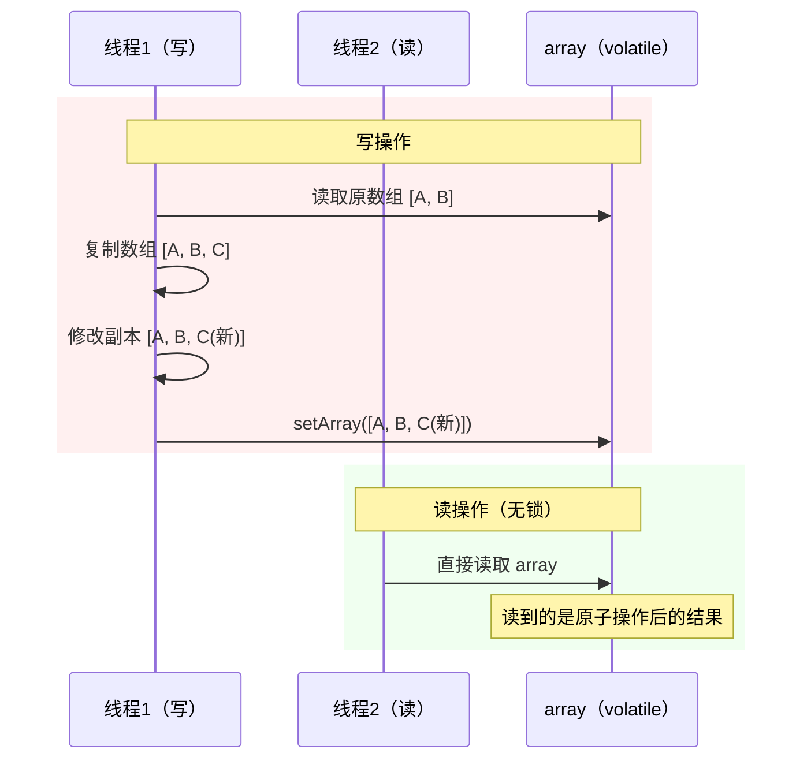
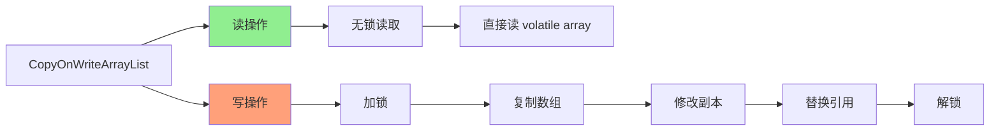

# CopyOnWriteArrayList 原理

**目标级别**：P6

---

## 快速自测

面试官问：「CopyOnWriteArrayList 是什么？和 ArrayList 有什么区别？什么时候用它？」

---

## 一、核心问题

### 🔴 CopyOnWriteArrayList 是什么？

**读写分离的 List**：写操作时复制一份数组，写完再替换。

```java
// 核心字段
private transient volatile Object[] array;

public CopyOnWriteArrayList() {
    setArray(new Object[0]);
}

final void setArray(Object[] a) {
    array = a;
}
```

### 读写分离思想

```mermaid
flowchart LR
    subgraph 读取（无锁）
        A[读操作] --> B[直接读 array]
        B --> C[读取最新数据]
    end
    
    subgraph 写入（复制）
        D[写操作] --> E[复制原数组]
        E --> F[修改副本]
        F --> G[替换 array 引用]
    end
    
    style A fill:#90EE90
    style D fill:#FFA07A
```

---

## 二、add 方法详解

### 🔴 add 是怎么实现的？

```java
public boolean add(E e) {
    // 1. 加锁
    final ReentrantLock lock = this.lock;
    lock.lock();
    try {
        // 2. 获取原数组
        Object[] elements = getArray();
        int len = elements.length;
        
        // 3. 复制数组（+1 空间）
        Object[] newElements = Arrays.copyOf(elements, len + 1);
        
        // 4. 添加新元素
        newElements[len] = e;
        
        // 5. 替换引用
        setArray(newElements);
        return true;
    } finally {
        // 6. 解锁
        lock.unlock();
    }
}
```

### 图解



---

## 三、get 方法

### 🔴 get 为什么不需要加锁？

```java
public E get(int index) {
    return get(getArray(), index);
}

private E get(Object[] a, int index) {
    return (E) a[index];
}

final Object[] getArray() {
    return array;
}
```

**因为 `array` 是 volatile 的**：
- 写操作最后一步 `setArray` 保证了写入的可见性
- 读操作直接读取 `array`，能读到最新值

---

## 四、迭代器

### 💡 COWIterator 的特点

```java
static final class COWIterator<E> implements ListIterator<E> {
    private final Object[] snapshot;  // 快照
    private int cursor;               // 游标
    
    private COWIterator(Object[] elements, int initialCursor) {
        snapshot = elements;  // 直接引用当前数组
        cursor = initialCursor;
    }
    
    // 无 remove 方法！
    public void remove() {
        throw new UnsupportedOperationException();
    }
    
    public void set(E e) {
        throw new UnsupportedOperationException();
    }
}
```

**特点**：
1. **快照迭代**：迭代器持有数组的快照
2. **不支持修改**：`remove()`、`set()` 抛出异常
3. **弱一致性**：迭代器创建后，对 List 的修改对迭代器不可见

### ⚠️ 迭代器的弱一致性

```java
CopyOnWriteArrayList<String> list = new CopyOnWriteArrayList<>();
list.add("A");
list.add("B");

Iterator<String> it = list.iterator();
list.add("C");  // 修改 List

// 迭代器仍然只看到 [A, B]
while (it.hasNext()) {
    System.out.println(it.next());  // A, B（不包括 C）
}
```

---

## 五、适用场景

### 🔴 什么时候用 CopyOnWriteArrayList？

**读多写少且数据量不大**：

| 场景 | 适合 | 不适合 |
|------|------|--------|
| 读操作 | ✅ 无锁读取 | ❌ |
| 写操作 | ❌ 需要复制数组 | ❌ |
| 数据量 | ✅ 小数据量 | ❌ 大数据量 |
| 迭代一致性 | 弱一致（快照） | ❌ 强一致 |
| 监听器列表 | ✅ | ❌ 高频更新 |

### 典型使用场景

```java
// 场景1：配置列表
CopyOnWriteArrayList<String> listeners = new CopyOnWriteArrayList<>();

// 场景2：缓存
CopyOnWriteArrayList<CacheEntry> cache = new CopyOnWriteArrayList<>();

// 场景3：黑白名单
CopyOnWriteArrayList<String> whitelist = new CopyOnWriteArrayList<>();
```

---

## 六、性能分析

### ⚠️ 写操作的开销

```java
// add 操作复杂度分析
add(E e) {
    lock.lock();           // O(1)
    try {
        Object[] elements = getArray();  // O(1)
        Object[] newElements = Arrays.copyOf(elements, len + 1);  // O(n)
        newElements[len] = e;  // O(1)
        setArray(newElements);  // O(1)
    } finally {
        lock.unlock();  // O(1)
    }
}
```

**每次写操作都需要复制整个数组**，这是最大的性能问题。

| 操作 | ArrayList | CopyOnWriteArrayList |
|------|-----------|---------------------|
| read | O(1) | O(1) |
| write | O(1) ~ O(n) | O(n)（复制数组） |
| add(size) | O(1) | O(n) |
| remove | O(n) | O(n)（复制数组） |

---

## 七、面试题精讲

### 🔴 第一层：CopyOnWriteArrayList 和 ArrayList 有什么区别？

> **参考答案**：
>
> 主要区别有：
> 1. **线程安全**：CopyOnWriteArrayList 是线程安全的，ArrayList 不是
> 2. **读写策略**：CopyOnWriteArrayList 读写分离，写时复制；ArrayList 无分离
> 3. **迭代器**：CopyOnWriteArrayList 迭代器是快照，不支持修改；ArrayList 迭代器 fail-fast
> 4. **性能**：CopyOnWriteArrayList 读快写慢；ArrayList 读写都快

### 🟡 第二层：CopyOnWriteArrayList 怎么保证线程安全的？

> **参考答案**：
>
> 通过**写时复制**保证线程安全：
> 1. 写操作需要获取锁
> 2. 复制原数组到新数组
> 3. 在新数组上修改
> 4. 用 volatile 保证新数组引用可见性
> 5. 读操作无锁，直接读取 volatile 数组

### 💡 第三层：CopyOnWriteArrayList 的迭代器为什么不能修改？

> **参考答案**：
>
> 因为迭代器持有的是数组的**快照**：
> 1. 迭代器创建时直接引用当前数组
> 2. 后续对 List 的修改会创建新数组，旧数组不变
> 3. 迭代器看不到新数组，所以不支持修改
> 4. 这是设计选择，优点是读操作完全无锁

### ⚠️ 面试官挖坑点

| 陷阱 | 错误回答 | 正确回答 |
|------|---------|----------|
| 「CopyOnWriteArrayList 读写都不用加锁」 | 忽略写操作加锁 | 写操作需要加锁 |
| 「迭代器会看到最新修改」 | 不了解快照迭代 | 迭代器是快照，弱一致性 |
| 「适合高并发写」 | 忽略了复制开销 | 写操作需要复制数组，高频写不适合 |

---

## 八、对比表格

| 维度 | ArrayList | CopyOnWriteArrayList | Vector |
|------|-----------|---------------------|--------|
| 线程安全 | ❌ | ✅ | ✅ |
| 读写策略 | 无分离 | 读写分离 | 全方法加锁 |
| 迭代器 | fail-fast | 快照，不支持修改 | fail-fast |
| 读性能 | O(1) | O(1)（无锁） | O(1)（有锁） |
| 写性能 | O(1)~O(n) | O(n)（复制） | O(1)~O(n) |
| 适用场景 | 单线程 | 读多写少 | 很少用 |

---

## 九、总结

**CopyOnWriteArrayList 核心要点**：



1. **读写分离**：读无锁，写加锁并复制数组
2. **volatile 数组**：保证引用可见性
3. **快照迭代器**：不支持修改
4. **适合读多写少**：写操作代价大
5. **弱一致性**：迭代器可能看不到最新修改
