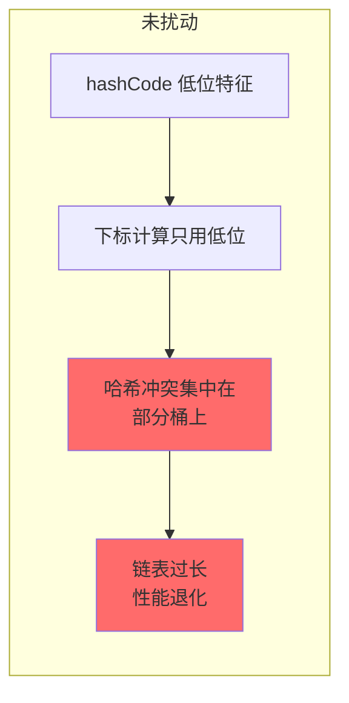

# HashMap 哈希算法

**目标级别**：P5 / P6

---

## 快速自测

面试官问：「HashMap 怎么根据 key 计算数组下标的？扰动函数有什么用？」

---

## 一、核心问题

### 🔴 HashMap 的 hash 方法是怎么实现的？

```java
// JDK 8 HashMap.hash 源码
static final int hash(Object key) {
    int h;
    return (key == null) ? 0 : (h = key.hashCode()) ^ (h >>> 16);
}
```

这个方法就是**扰动函数**（Tumbling Function），它的作用是：**将 hashCode 的高 16 位和低 16 位进行异或运算，增加随机性**。

---

## 二、为什么要扰动？

### 问题背景

假设 HashMap 的容量 `n = 16`（`n - 1 = 15`，二进制 `01111`）：

```java
// 下标计算公式
index = (n - 1) & hash = 15 & hash
```

**问题**：如果只用 `key.hashCode()`，而 hashCode 通常只使用低位的特征：

| key | hashCode() | hashCode 二进制 | 15 & hashCode | 下标 |
|-----|------------|----------------|----------------|------|
| "a" | 97 | 0000 0000 0110 0001 | 0000 0000 0001 | 1 |
| "b" | 98 | 0000 0000 0110 0010 | 0010 | 2 |
| "c" | 99 | 0000 0000 0110 0011 | 0011 | 3 |

可以看到，`15 & hashCode` 只用了 hashCode 的**低 4 位**！这会导致哈希冲突集中在低 4 位。

### ⚠️ 扰动前的问题



### 💡 扰动后的效果

扰动函数 `hash ^ (hash >>> 16)`：

```java
// hash = 0xABCD1234 (32位)
// h >>> 16 = 0x0000ABCD
// hash ^ (hash >>> 16) = 0xABCD1234 ^ 0x0000ABCD = 0xABCD9B99
```

**效果**：将 hashCode 的高位特征**混合**到低位，使得 `n-1 & hash` 时能用到更多位数。

---

## 三、图解扰动函数

### 位运算过程

```mermaid
flowchart LR
    subgraph hashCode 二进制
        A[高16位: H] --> B[低16位: L]
    end
    
    subgraph 扰动计算
        C[hashCode] --> D[hash >>> 16]
        C --> E[异或 XOR]
        D --> E
        E --> F[扰动后的 hash]
    end
    
    subgraph 下标计算
        F --> G[n-1: 全1掩码]
        G --> H[index = (n-1) & hash]
        H --> I[用到了高位和低位]
    end
```

### 具体数值示例

假设 `key.hashCode() = 0x12345678`，`n = 16`：

```java
原始 hashCode:   0001 0010 0011 0100 0101 0110 0111 1000
                       ↓ 高16位          ↓ 低16位

hash >>> 16:    0000 0000 0000 0000 0001 0010 0011 0100

hash ^ (>>>16): 0001 0010 0011 0100 0100 0100 0100 1100
                                                     ↑ 变化了

n - 1 = 15:     0000 0000 0000 0000 0000 0000 0000 1111

未扰动: 1111 & 0x12345678 = 1000 = 8
扰动后: 1111 & 0x1234544C = 1100 = 12
```

---

## 四、为什么用异或而不是与、或？

### 对比三种位运算

| 运算 | 结果 | 特点 |
|------|------|------|
| `hash \| (hash >>> 16)` | 高位全变 1 | 偏置，1 太多 |
| `hash & (hash >>> 16)` | 高位全变 0 | 偏置，0 太多 |
| `hash ^ (hash >>> 16)` | 高低位混合 | 均衡，随机性好 |

```java
// 假设 hashCode = 0xFFFFFFFF（全是1）
hash | (hash >>> 16) = 0xFFFFFFFF  // 全1，没有随机性
hash & (hash >>> 16) = 0x0000FFFF  // 全0，没有随机性
hash ^ (hash >>> 16) = 0xFFFF0000  // 混合，保留了一些特征
```

### 💡 为什么异或是最好的？

1. **异或是可逆的**：`a ^ b ^ b = a`
2. **均匀分布**：异或运算输出的每一位是其两个输入相应位的**均衡组合**
3. **位独立**：输出位的值与输入位的值相关性低

---

## 五、数组下标计算

### 🔴 为什么用 `&` 而不是 `%`？

```java
index = (n - 1) & hash  // 位运算
index = hash % n        // 取模运算
```

**数学上两者等价**，但位运算更快：

| 运算 | 时间复杂度 | CPU 指令 |
|------|-----------|----------|
| `%` | O(1) | 除法（很慢） |
| `&` | O(1) | 与运算（很快） |

### ⚠️ 前提条件

`(n - 1) & hash` **等价于** `hash % n` 的前提是：**n 必须是 2 的幂次**。

```java
// n = 16 (2^4), n-1 = 15 = 0b1111
// 1111 & xxxx 相当于保留 xxxx 的低4位 = xxxx % 16

// n = 15, n-1 = 14 = 0b1110
// 1110 & xxxx != xxxx % 15（不等价！）
```

这解释了为什么 HashMap 的容量必须是 2 的幂次。

---

## 六、面试题精讲

### 🔴 第一层：HashMap 的 hash 方法是怎么实现的？

> **参考答案**：
>
> HashMap 通过扰动函数计算 key 的 hash：
> ```java
> (key == null) ? 0 : (key.hashCode()) ^ (key.hashCode() >>> 16)
> ```
> 它的作用是将 hashCode 的高 16 位与低 16 位进行异或，增加 hash 的随机性，减少哈希冲突。

### 🟡 第二层：为什么要用扰动函数？

> **参考答案**：
>
> 因为下标计算公式是 `(n-1) & hash`，当 n=16 时相当于 `hash & 15`（只用了 hash 的低 4 位）。如果 hashCode 的高位特征没有被用到，就会导致哈希冲突集中在某些桶上。扰动函数将高位特征混合到低位，使得下标计算能利用更多 hash 的信息，分布更均匀。

### 💡 第三层：为什么用异或而不是与、或？

> **参考答案**：
>
> 异或是最好的选择：
> 1. 与运算（`&`）会让高位全变 0，偏置严重
> 2. 或运算（`|`）会让高位全变 1，偏置严重
> 3. 异或（`^`）是均衡的混合，每个输出位是输入位的均衡组合
> 4. 异或具有可逆性，数学性质好

### ⚠️ 面试官挖坑点

| 陷阱 | 错误回答 | 正确回答 |
|------|---------|----------|
| 「hash = key.hashCode()」 | 直接用 hashCode | 实际是 `hash ^ (hash >>> 16)` |
| 「任何数都能用 % 取模」 | 忽略 2 的幂次前提 | `(n-1) & hash` 等价于 `hash % n` 只在 n=2^k 时成立 |
| 「扰动函数让 hash 更随机」 | 只知道结果 | 扰动是将高位特征混合到低位，不是纯随机 |

---

## 七、完整流程图

```mermaid
flowchart TD
    A[key] --> B[key.hashCode]
    B --> C[0x12345678]
    
    C --> D{key == null?}
    D -->|是| E[hash = 0]
    D -->|否| F[hash ^ (hash >>> 16)]
    
    F --> G[0x12345678<br/>^ 0x00001234<br/>= 0x1234444C]
    
    G --> H{n = 16<br/>n-1 = 15}
    
    H --> I[15 & 0x1234444C]
    I --> J[0b1111 & 0x...4C<br/>= 0b1100 = 12]
    
    J --> K[index = 12]
    K --> L[定位到 bucket 12]
    
    style E fill:#90EE90
    style J fill:#87CEEB
    style K fill:#87CEEB
```

---

## 八、常见对象的 hashCode

### String 的 hashCode

```java
// String.hashCode 实现
public int hashCode() {
    int h = hash;
    if (h == 0 && value.length > 0) {
        char val[] = value;
        for (int i = 0; i < value.length; i++) {
            h = 31 * h + val[i];
        }
        hash = h;
    }
    return h;
}
```

**为什么用 31**？
- 31 是素数，乘法分布均匀
- JVM 会优化 `31 * i` 为 `(i << 5) - i`，快
- 31 的哈希冲突相对较少

### Integer 的 hashCode

```java
// Integer.hashCode 直接返回 value
public int hashCode() {
    return Integer.hashCode(value);
}
public static int hashCode(int value) {
    return value;
}
```

---

## 九、对比表格

| 场景 | 未扰动 | 扰动后 |
|------|--------|--------|
| hashCode 低位特征明显 | 冲突集中在低位桶 | 高低位混合，分布均匀 |
| 2^n 容量 | 低 n 位决定下标 | 混合后更多位决定下标 |
| 哈希分布 | 不均匀 | 更均匀 |

---

## 十、总结

**HashMap 哈希算法核心要点**：

```mermaid
flowchart LR
    A[key] --> B[hashCode]
    B --> C{key == null?}
    C -->|是| D[返回 0]
    C -->|否| E[hash ^ (hash >>> 16)]
    E --> F[扰动后的 hash]
    F --> G[(n-1) & hash]
    G --> H[数组下标]
    
    style D fill:#90EE90
    style E fill:#87CEEB
    style H fill:#87CEEB
```

1. **hash 方法**：`(key == null) ? 0 : (h = key.hashCode()) ^ (h >>> 16)`
2. **扰动目的**：将 hashCode 高位特征混合到低位，增加随机性
3. **位运算原因**：`&` 比 `%` 快，但要求 n 是 2 的幂次
4. **异或优势**：均衡混合，偏置最小

---

## 延伸思考

> **追问**：如果让你设计一个扰动函数，你会怎么设计？

可以考虑的方案：
1. **异或（当前方案）**：高位和低位异或，平衡性好
2. **乘法混合**：`hash * 0x9e3779b9`（黄金比例相关）
3. **多次扰动**：异或 + 移位多次混合
4. **MurmurHash**：工程中常用的哈希算法，混合效果更好

核心目标是：**让 hash 的每一位都参与到下标计算中，分布尽可能均匀**。
