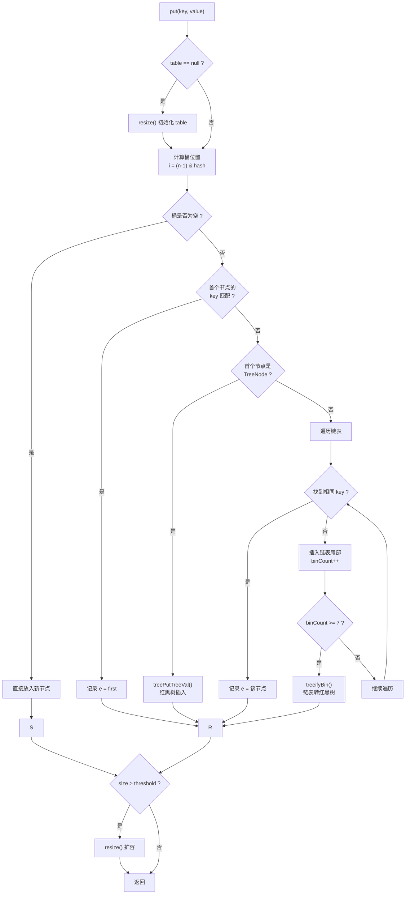

# HashMap put 流程

面试官问："HashMap 的 put 方法流程是什么？"

候选人小汤答："先计算 key 的 hash，然后找到对应的桶位置，如果是空的就直接放入，如果有冲突就加到链表后面。"

面试官点点头："JDK 8 有什么不同？"

小汤说："引入了红黑树，链表太长会转成红黑树。"

面试官追问："那 JDK 8 的 put 流程完整说一遍。"

小汤支支吾吾说不全。

【面试官心理】
这道题看似简单，但能完整说出 JDK 8 put 全流程的候选人不多。需要包括：hash 计算、桶定位、链表/红黑树插入、树化阈值判断、扩容触发条件。

## 一、put 方法入口 🔴

```java
public V put(K key, V value) {
    return putVal(hash(key), key, value, false, true);
}

// hash(key) 的实现
static final int hash(Object key) {
    int h;
    // JDK 8：key.hashCode() ^ (key.hashCode() >>> 16)
    return (key == null) ? 0 : (h = key.hashCode()) ^ (h >>> 16);
}
```

**为什么 hash 要做异或运算？**

```
key.hashCode() 返回 32 位整数
hash & (length-1) 取模
如果 length 很小（如 16），只用到了 hash 的低位
高位没有参与计算 → 哈希分布不均匀

>>> 16 将高位移到低位
再与原 hash 异或 → 让高位信息影响低位
→ 更均匀的哈希分布
```

## 二、putVal 源码解析 🔴

```java
final V putVal(int hash, K key, V value, boolean onlyIfAbsent,
               boolean evict) {
    Node<K, V>[] tab;
    Node<K, V> first;
    int n, i;

    tab = table;
    n = tab.length;

    // 步骤一：空表，第一次 put 时初始化
    if (tab == null || (n = tab.length) == 0) {
        n = (tab = resize()).length; // 扩容/初始化
    }

    // 步骤二：计算桶位置并检查
    i = (n - 1) & hash; // 相当于 hash % n（n 是 2 的幂次）
    first = tab[i];

    if (first == null) {
        // 桶为空，直接创建节点放入
        tab[i] = newNode(hash, key, value, null);
    } else {
        // 桶不为空，检查 key 是否已存在或需要插入

        Node<K, V> e;
        K k;

        if (first.hash == hash &&
            ((k = first.key) == key || (key != null && key.equals(k)))) {
            // 情况一：key 已存在（第一个节点就是），记录下来
            e = first;
        } else if (first instanceof TreeNode) {
            // 情况二：桶中是红黑树，调用树的插入方法
            e = ((TreeNode<K, V>) first).putTreeVal(this, tab, hash, key, value);
        } else {
            // 情况三：桶中是链表，遍历查找
            for (int binCount = 0; ; ++binCount) {
                if ((e = first.next) == null) {
                    // 找到链表末尾，插入新节点
                    first.next = newNode(hash, key, value, null);

                    // 判断是否需要树化
                    if (binCount >= TREEIFY_THRESHOLD - 1) { // -1 因为 binCount 从 0 开始
                        treeifyBin(tab, i);
                    }
                    break;
                }

                // 链表中找到相同的 key
                if (e.hash == hash &&
                    ((k = e.key) == key || (key != null && key.equals(k)))) {
                    break; // e 指向已存在的节点
                }
                first = first.next; // 继续遍历
            }
        }

        // 步骤三：key 已存在，更新值
        if (e != null) {
            V oldValue = e.value;
            if (!onlyIfAbsent || oldValue == null) {
                e.value = value; // 更新值
            }
            afterNodeAccess(e); // LinkedHashMap 使用，用于维护访问顺序
            return oldValue;    // 返回旧值
        }
    }

    ++modCount;
    // 步骤四：检查是否需要扩容
    if (++size > threshold) {
        resize();
    }
    afterNodeInsertion(evict); // LinkedHashMap 使用
    return null;
}
```

## 三、流程图解 🔴



## 四、关键细节 🔴

### 4.1 为什么用 `(n - 1) & hash` 而不是 `hash % n`？

```java
i = (n - 1) & hash; // n 是 2 的幂次，如 16, 32, 64...

// n = 16 时，n-1 = 15 = 0b1111
// hash = 26 = 0b11010
// (n-1) & hash = 0b1111 & 0b11010 = 0b1010 = 10
// hash % 16 = 10

// 位运算比取模快 10 倍以上！
// 条件：n 必须是 2 的幂次（HashMap 扩容时保证）
```

### 4.2 treeifyBin 不会立刻树化

```java
final void treeifyBin(Node<K, V>[] tab, int index) {
    Node<K, V> e;

    // 如果容量小于 MIN_TREEIFY_CAPACITY (64)，只做扩容
    // 不树化
    if (tab == null || (n = tab.length) < MIN_TREEIFY_CAPACITY) {
        resize(); // 先扩容试试，说不定冲突就少了
    } else {
        // 容量够大，真正树化
        // ...
    }
}
```

:::warning ⚠️
链表长度达到 8 不一定会立刻树化。如果当前 table 容量小于 64，会先扩容。只有容量大于等于 64 后，链表达到 8 才会真正树化。
:::

## 五、追问升级

**面试官**："put 的时候，如果 key 已经存在，会发生什么？"

```java
map.put("key", "value1"); // 第一次 put
map.put("key", "value2"); // 第二次 put

// 流程：
// 1. 找到 key 所在的节点
// 2. 覆盖 value
// 3. 返回旧值 "value1"
// 4. size 不变，modCount++
```

**面试官**："ConcurrentHashMap 的 put 和 HashMap 有什么区别？"

```java
// 主要区别：
// 1. ConcurrentHashMap 用 CAS + synchronized，而不是单个锁
// 2. 初始化用 casTabAt() 而非直接赋值
// 3. 红黑树节点插入后用 synchronized 加锁
// 4. 扩容是支持并发的多线程扩容
```

【面试官心理】
能说出 ConcurrentHashMap 和 HashMap put 流程差异的候选人，说明对并发集合有深入了解。这是 P6+ 的要求。
