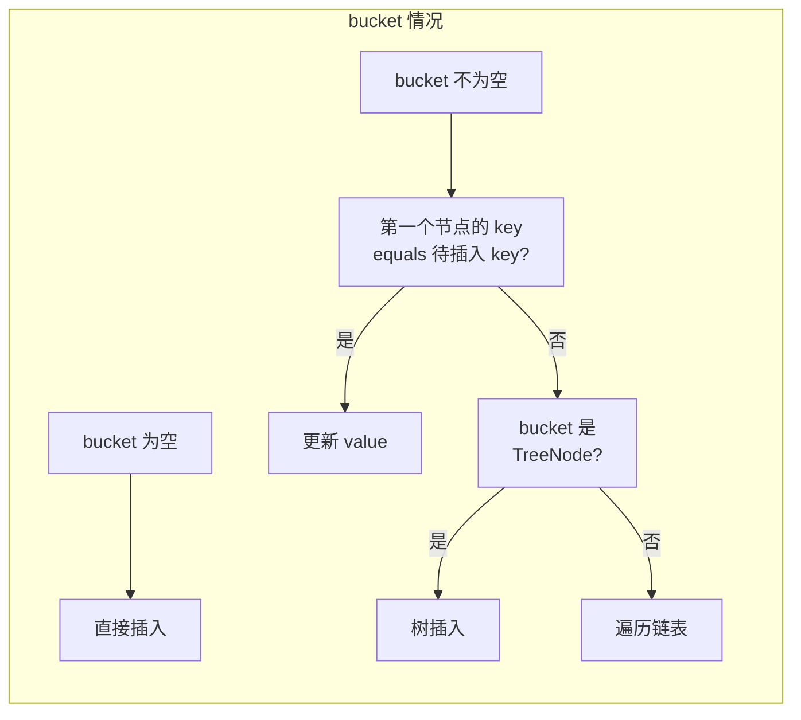
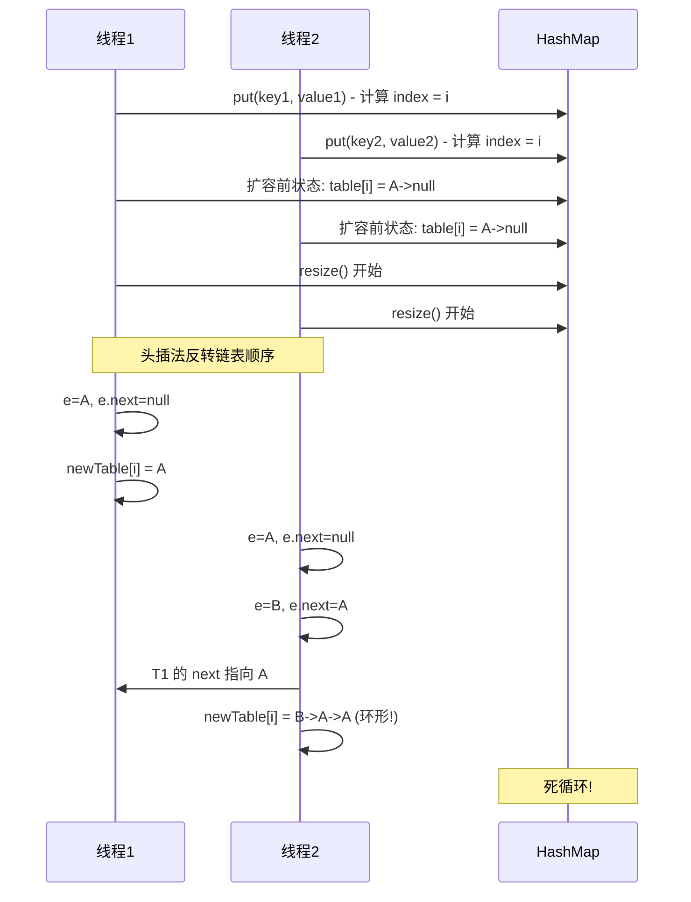
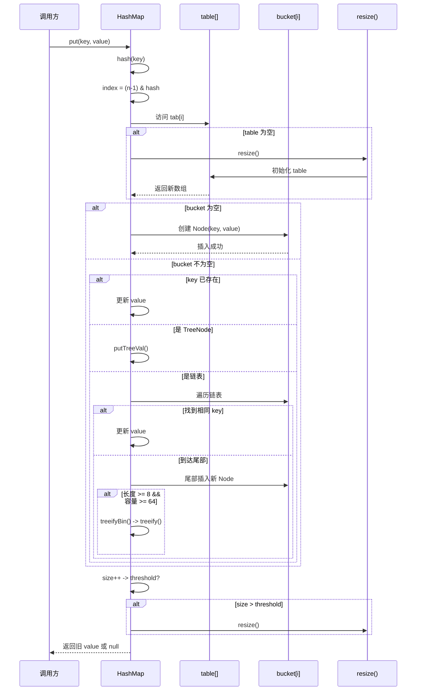

# HashMap put 流程

**目标级别**：P5 / P6

---

## 快速自测

面试官问：「HashMap put 一个元素，底层经历了哪些步骤？」

这道题能答几层？

---

## 一、核心问题

### 🔴 HashMap put 流程是怎样的？

**先看流程图**，再逐步拆解：

```mermaid
flowchart TD
    A[put(key, value)] --> B[计算 key 的 hash<br/>hash = hash(key)]
    B --> C[计算数组下标<br/>index = (n-1) & hash]
    C --> D[定位到 bucket<br/>tab[i]]
    
    D --> E{bucket 是空的吗?}
    E -->|是| F[直接创建 Node 放入]
    E -->|否| G{bucket 中 key<br/>已存在?}
    
    G -->|是| H[更新 value<br/>返回旧 value]
    G -->|否| I{bucket 是<br/>链表还是红黑树?}
    
    I -->|链表| J[遍历链表<br/>在尾部插入]
    I -->|红黑树| K[调用 treePut<br/>插入红黑树]
    
    J --> L{链表长度<br/>>= 8?}
    L -->|是| M{容量<br/>>>= 64?}
    M -->|是| N[链表转为红黑树]
    M -->|否| O[扩容而不是树化]
    
    K --> P[红黑树插入后<br/>自动平衡]
    
    N --> Q[后续用树结构查询]
    O --> R[容量翻倍<br/>重新 hash]
    
    F --> S[插入成功]
    H --> S
    J --> S
    Q --> S
    R --> B
    
    S --> T[检查是否需要扩容<br/>size++ > threshold?]
    T -->|是| U[触发扩容]
    T -->|否| V[put 完成]
    
    style A fill:#87CEEB
    style U fill:#FFA07A
    style N fill:#90EE90
```

---

## 二、逐行源码解析

### JDK8 put 方法完整源码

```java
public V put(K key, V value) {
    return putVal(hash(key), key, value, false, true);
}

/**
 * @param hash         key 的 hash 值
 * @param key          键
 * @param value        值
 * @param onlyIfAbsent 如果为 true，不覆盖已存在的值
 * @param evict        如果为 false，table 处于创建模式（LinkedHashMap 用到）
 */
final V putVal(int hash, K key, V value, boolean onlyIfAbsent,
               boolean evict) {
    Node<K,V>[] tab;
    Node<K,V> p;
    int n, i;

    // 1. 初始化：如果 table 为空，先扩容
    if ((tab = table) == null || (n = tab.length) == 0)
        n = (tab = resize()).length;

    // 2. 定位桶：如果 bucket 为空，直接创建节点
    if ((p = tab[i = (n - 1) & hash]) == null)
        tab[i] = newNode(hash, key, value, null);
    else {
        // 3. bucket 不为空，开始处理冲突
        Node<K,V> e;
        K k;

        // 4. 情况一：第一个节点的 key 和待插入 key 相同（equals 判断）
        if (p.hash == hash &&
            ((k = p.key) == key || (key != null && key.equals(k))))
            e = p;
        // 5. 情况二：第一个节点是红黑树节点，调用树插入
        else if (p instanceof TreeNode)
            e = ((TreeNode<K,V>) p).putTreeVal(this, tab, hash, key, value);
        // 6. 情况三：第一个节点是链表头，遍历链表
        else {
            for (int binCount = 0; ; ++binCount) {
                // 7. 到达链表尾部，在尾部插入新节点
                if ((e = p.next) == null) {
                    p.next = newNode(hash, key, value, null);

                    // 8. 检查是否需要树化
                    if (binCount >= TREEIFY_THRESHOLD - 1) // -1 for 1st
                        treeifyBin(tab, hash);
                    break;
                }

                // 9. 遍历过程中发现相同 key，更新 value
                if (e.hash == hash &&
                    ((k = e.key) == key || (key != null && key.equals(k))))
                    break;

                p = e;
            }
        }

        // 10. 找到了相同的 key，更新 value
        if (e != null) {
            V oldValue = e.value;
            if (!onlyIfAbsent || oldValue == null)
                e.value = value;
            afterNodeAccess(e);  // LinkedHashMap 用到
            return oldValue;     // 返回旧 value
        }
    }

    ++modCount;  // 修改计数器
    // 11. 检查是否需要扩容
    if (++size > threshold)
        resize();
    afterNodeInsertion(evict);  // LinkedHashMap 用到
    return null;  // 首次插入返回 null
}
```

---

## 三、流程拆解

### 第一步：计算 hash

```java
static final int hash(Object key) {
    int h;
    return (key == null) ? 0 : (h = key.hashCode()) ^ (h >>> 16);
}
```

**扰动函数**的作用：将 hashCode 的高 16 位和低 16 位进行异或，增加随机性，减少哈希冲突。

### 第二步：定位桶

```java
i = (n - 1) & hash
```

因为 n 必须是 2 的幂次，`n-1` 的二进制是全 1，所以 `& hash` 相当于 `hash % n`，但位运算更快。

### 第三步：处理不同情况



---

## 四、链表插入细节

### 为什么是在链表尾部插入？

```java
// JDK 7 是头插法（先插入的在前面）
new Entry<>(hash, key, value, e); // e 是原头节点

// JDK 8 是尾插法（先插入的在后面）
p.next = newNode(hash, key, value, null);
```

### ⚠️ JDK7 头插法的问题

JDK7 的头插法在**并发扩容时会导致死循环**：



> **JDK8 改成尾插法**，解决了死循环问题。

---

## 五、红黑树插入

```java
// TreeNode.putTreeVal 方法（简化版）
final TreeNode<K,V> putTreeVal(HashMap<K,V> map, Node<K,V>[] tab,
                               int h, K k, V v) {
    TreeNode<K,V> p = this;
    TreeNode<K,V> parent = null;
    do {
        parent = p;
        int dir = ph - h;  // 比较方向
        int cmp;
        // 按 hash 值比较，找到插入位置
        p = (dir <= 0) ? p.left : p.right;
    } while (p != null);

    // 创建新节点并插入
    TreeNode<K,V> x = new TreeNode<>(h, k, v, null, parent);
    if (parent != null)
        (dir <= 0 ? parent.left : parent.right) = x;
    else
        this = x;

    // 插入后平衡（红黑树自平衡）
    balanceInsertion(root, x);
    return x;
}
```

---

## 六、扩容检查

```java
// 检查是否需要扩容
if (++size > threshold) {
    resize();  // threshold = capacity * loadFactor
}
```

**时机**：插入成功后立即检查，**先插入再扩容**。

---

## 七、面试题精讲

### 🔴 第一层：HashMap put 流程是怎样的？

> **参考答案**：
>
> HashMap put 主要经历以下步骤：
> 1. 计算 key 的 hash 值（调用 hash 方法）
> 2. 根据 hash 计算数组下标：`index = (n-1) & hash`
> 3. 如果 bucket 为空，直接创建 Node 放入
> 4. 如果 bucket 不为空，分三种情况处理：
>    - key 已存在：更新 value
>    - 红黑树节点：调用 treePut 插入
>    - 链表：遍历到尾部插入
> 5. 链表插入后检查是否需要树化（长度 >= 8 且容量 >= 64）
> 6. 检查是否需要扩容

### 🟡 第二层：JDK7 和 JDK8 的 put 有什么区别？

> **参考答案**：
>
> 主要区别在于插入方式和扩容死循环：
> 1. **JDK7 头插法，JDK8 尾插法**。JDK7 头插法在并发扩容时会形成环形链表导致死循环，JDK8 改成尾插法解决了这个问题。
> 2. **JDK7 先扩容再插入，JDK8 先插入再扩容**。JDK8 在插入后判断是否需要扩容，逻辑更清晰。

### 💡 第三层：treeifyBin 和 treeify 有什么区别？

> **参考答案**：
>
> - `treeifyBin(tab, hash)`：尝试将单个 bucket 的链表转为红黑树，但**不一定真的树化**。如果容量 < 64，会优先扩容而不是树化。
> - `treeify(tab)`：**真正**将链表转为红黑树，按 hash 排序后构建。
>
> 简单说：treeifyBin 是"检查是否满足树化条件"，treeify 是"执行树化"。

### ⚠️ 面试官挖坑点

| 陷阱 | 错误回答 | 正确回答 |
|------|---------|----------|
| 「JDK8 用尾插法所以线程安全」 | 误以为尾插法解决了并发问题 | 尾插法只解决扩容死循环，其他操作仍不安全 |
| 「链表长度到 8 就树化」 | 忽略容量条件 | 必须同时满足链表 >= 8 **且**容量 >= 64 |
| 「hash = key.hashCode()」 | 只用 hashCode | 实际用了扰动函数：`(h = key.hashCode()) ^ (h >>> 16)` |

---

## 八、对比表格

| 维度 | JDK7 | JDK8 |
|------|------|------|
| 插入方式 | 头插法 | 尾插法 |
| 扩容时死循环 | 可能 | 不会 |
| 数据结构 | 数组 + 链表 | 数组 + 链表 + 红黑树 |
| 扩容判断时机 | 先扩容再插入 | 先插入再扩容 |
| 插入后判断 | 无树化判断 | 判断是否需要树化 |

---

## 九、完整流程时序图



---

## 十、总结

**HashMap put 流程核心要点**：

```mermaid
flowchart LR
    A[put] --> B[hash(key)]
    B --> C[index]
    C --> D{bucket 空?}
    D -->|是| E[直接插入]
    D -->|否| F{key 已存在?}
    F -->|是| G[更新 value]
    F -->|否| H{是树节点?}
    H -->|是| I[treePut]
    H -->|否| J[遍历链表]
    J --> K[尾部插入]
    K --> L{长度 >= 8<br/>容量 >= 64?}
    L -->|是| M[链表转红黑树]
    L -->|否| N[继续]
    E --> O[size++]
    G --> O
    I --> O
    M --> O
    N --> O
    O --> P{size > threshold?}
    P -->|是| Q[扩容]
    P -->|否| R[完成]
    Q --> R
    
    style A fill:#87CEEB
    style Q fill:#FFA07A
```

1. 计算 hash（扰动函数）
2. 计算数组下标
3. 根据 bucket 情况处理（空/链表/红黑树）
4. 链表尾部插入后检查树化
5. 插入后检查是否扩容

---

## 延伸思考

> **追问**：如果让你实现一个 put 方法，返回值怎么设计最合理？

一般有三种方案：
1. **返回 void**：只负责插入，不关心是否有旧值
2. **返回 boolean**：只关心是否插入成功
3. **返回 oldValue**（HashMap 采用）：返回被覆盖的值

第三种最灵活：
- 调用者可以判断是新增还是更新
- 可以复用旧值做业务处理
- HashMap 的语义是"放入值"，返回值是额外信息
