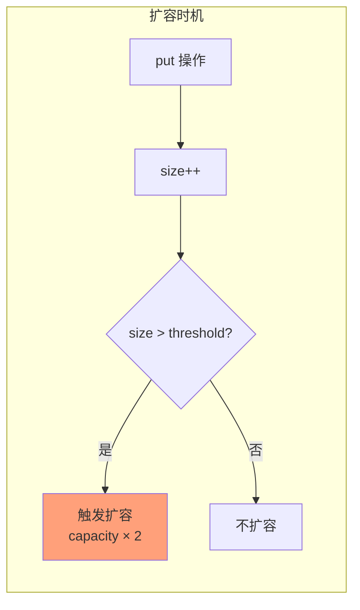
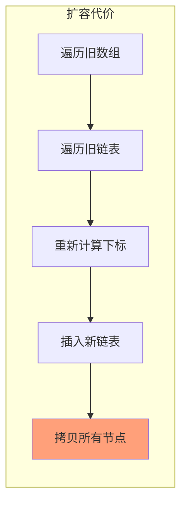
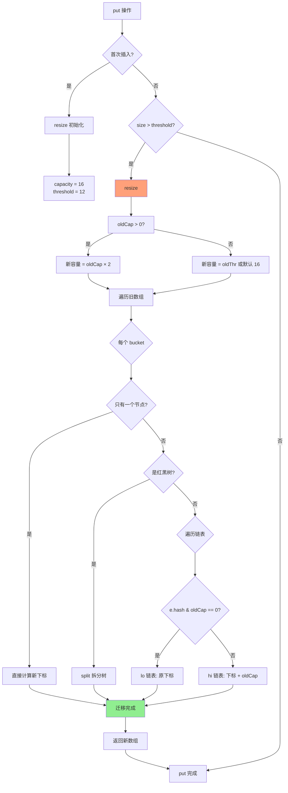
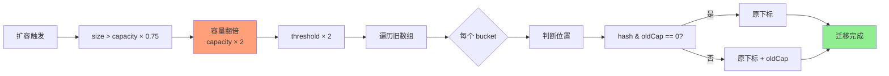

# HashMap 扩容机制

**目标级别**：P5 / P6

---

## 快速自测

面试官问：「HashMap 什么时候会扩容？扩容后元素怎么重新分配？为什么 HashMap 的容量必须是 2 的幂次？」

---

## 一、核心问题

### 🔴 HashMap 扩容机制是什么？

**扩容三要素**：

| 要素 | 值 | 说明 |
|------|-----|------|
| 初始容量 | 16 | 可指定，必须是 2 的幂次 |
| 负载因子 | 0.75 | 可调整 |
| 扩容阈值 | capacity × 0.75 | 触发扩容的元素数量 |

```java
// JDK 8 HashMap 构造方法
public HashMap(int initialCapacity, float loadFactor) {
    if (initialCapacity < 0)
        throw new IllegalArgumentException(...);
    if (loadFactor <= 0 || Float.isNaN(loadFactor))
        throw new IllegalArgumentException(...);
    this.loadFactor = loadFactor;
    this.threshold = tableSizeFor(initialCapacity);
}

// 默认负载因子
static final float DEFAULT_LOAD_FACTOR = 0.75f;

// 默认初始容量
static final int DEFAULT_INITIAL_CAPACITY = 1 << 4; // 16
```

---

## 二、扩容触发条件

### 🔴 什么时候会扩容？

```java
// putVal 方法末尾
if (++size > threshold)
    resize();
```

**触发条件**：`size`（元素数量）> `threshold`（扩容阈值 = capacity × loadFactor）



### 扩容时机示例

| 容量 | 负载因子 | 阈值 | 元素数 | 是否扩容 |
|------|---------|------|--------|---------|
| 16 | 0.75 | 12 | 12 | 下一次 put 时 |
| 16 | 0.75 | 12 | 13 | 扩容到 32 |
| 32 | 0.75 | 24 | 24 | 下一次 put 时 |
| 64 | 0.75 | 48 | 49 | 扩容到 128 |

---

## 三、扩容过程详解

### JDK8 resize 源码

```java
final Node<K,V>[] resize() {
    Node<K,V>[] oldTab = table;
    int oldCap = (oldTab == null) ? 0 : oldTab.length;
    int oldThr = threshold;

    int newCap, newThr = 0;

    // 情况一：老容量 > 0，说明不是首次初始化
    if (oldCap > 0) {
        // 超过最大容量，不再扩容，返回原数组
        if (oldCap >= MAXIMUM_CAPACITY) {
            threshold = Integer.MAX_VALUE;
            return oldTab;
        }
        // 新容量 = 老容量 × 2
        else if ((newCap = oldCap << 1) < MAXIMUM_CAPACITY &&
                 oldCap >= DEFAULT_INITIAL_CAPACITY)
            newThr = oldThr << 1;  // 新阈值也翻倍
    }
    // 情况二：老阈值 > 0，用老阈值作为新容量（指定容量构造时）
    else if (oldThr > 0)
        newCap = oldThr;
    // 情况三：老容量和老阈值都是 0，使用默认值
    else {
        newCap = DEFAULT_INITIAL_CAPACITY;  // 16
        newThr = (int)(DEFAULT_LOAD_FACTOR * DEFAULT_INITIAL_CAPACITY); // 12
    }

    // 计算新阈值
    if (newThr == 0) {
        float ft = (float)newCap * loadFactor;
        newThr = (newCap < MAXIMUM_CAPACITY && ft < (float)MAXIMUM_CAPACITY ?
                  (int)ft : Integer.MAX_VALUE);
    }
    threshold = newThr;

    // 创建新数组
    Node<K,V>[] newTab = (Node<K,V>[]) new Node[newCap];
    table = newTab;

    // 核心：迁移元素
    if (oldTab != null) {
        for (int j = 0; j < oldCap; ++j) {
            Node<K,V> e;
            if ((e = oldTab[j]) != null) {
                oldTab[j] = null;  // 释放旧桶

                // 情况一：只有一个节点，直接重新计算下标
                if (e.next == null)
                    newTab[e.hash & (newCap - 1)] = e;

                // 情况二：是红黑树节点，拆分树
                else if (e instanceof TreeNode)
                    ((TreeNode<K,V>)e).split(this, newTab, j, oldCap);

                // 情况三：链表，遍历迁移
                else {
                    // lo 链表：保持原下标
                    // hi 链表：下标 + oldCap
                    Node<K,V> loHead = null, loTail = null;
                    Node<K,V> hiHead = null, hiTail = null;
                    Node<K,V> next;
                    do {
                        next = e.next;
                        // 根据 e.hash & oldCap 判断位置
                        if ((e.hash & oldCap) == 0) {
                            if (loTail == null)
                                loHead = e;
                            else
                                loTail.next = e;
                            loTail = e;
                        } else {
                            if (hiTail == null)
                                hiHead = e;
                            else
                                hiTail.next = e;
                            hiTail = e;
                        }
                    } while ((e = next) != null);

                    // 迁移两个链表
                    if (loTail != null) {
                        loTail.next = null;
                        newTab[j] = loHead;
                    }
                    if (hiTail != null) {
                        hiTail.next = null;
                        newTab[j + oldCap] = hiHead;
                    }
                }
            }
        }
    }
    return newTab;
}
```

---

## 四、核心问题：为什么容量必须是 2 的幂次？

### ⚠️ 这个问题很关键

**答案**：为了支持 `hash & (capacity - 1)` 快速计算下标。

```java
// 下标计算
index = (n - 1) & hash
```

当 n = 2^k 时，`n - 1` 的二进制是 k 个连续的 1：

| n | n-1 二进制 | 效果 |
|---|-----------|------|
| 16 | `0b0000 1111` | hash 的低 4 位决定下标 |
| 32 | `0b0001 1111` | hash 的低 5 位决定下标 |
| 64 | `0b0011 1111` | hash 的低 6 位决定下标 |

**如果 n 不是 2 的幂次**，`(n-1) & hash` **不等于** `hash % n`，会导致分布不均匀。

### 💡 n = 2^k 的数学保证

```java
// n = 2^k => n-1 = 0b00...011...1（全1）
// hash & (n-1) 保留 hash 的低 k 位
// 这恰好等于 hash % n
```

---

## 五、链表迁移：lo 链表和 hi 链表

### 核心算法

```java
// 判断当前节点应该放在原位置还是原位置 + oldCap
if ((e.hash & oldCap) == 0) {
    // 放在原下标（lo 链表）
} else {
    // 放在原下标 + oldCap（hi 链表）
}
```

**为什么能这样判断？**

```mermaid
flowchart LR
    subgraph oldCap = 16 = 0b0001 0000
        A[bit4 = 1]
    end
    
    subgraph hash & oldCap
        B[hash 的 bit4 位]
    end
    
    B --> C{bit4 == 0?}
    C -->|是| D[原下标 j]
    C -->|否| E[原下标 + 16 = j + oldCap]
    
    style A fill:#87CEEB
    style D fill:#90EE90
    style E fill:#FFA07A
```

**示例**：

| 旧容量 oldCap | 节点 hash | hash & oldCap | 新下标 |
|--------------|-----------|---------------|--------|
| 16 | `0b...1000` | 16 | 保持 j |
| 16 | `0b...1001` | 0 | 保持 j |
| 16 | `0b...1010` | 0 | 保持 j |
| 16 | `0b...1011` | 0 | 保持 j |
| 16 | `0b...1100` | 16 | j + 16 |
| 16 | `0b...1101` | 0 | 保持 j |
| 16 | `0b...1110` | 0 | 保持 j |
| 16 | `0b...1111` | 0 | 保持 j |

### ⚠️ 为什么不是重新计算 `(n-1) & hash`？

**可以重新计算**，但用 `hash & oldCap` 更高效：

```java
// 重新计算
newIndex = (newCap - 1) & hash  // 需要一次位运算

// 用 oldCap 判断
if ((hash & oldCap) == 0) {
    newIndex = oldIndex;  // 直接用原下标
} else {
    newIndex = oldIndex + oldCap;  // 简单加法
}
```

**核心思想**：容量翻倍后，原下标 j 的元素，要么留在 j，要么移到 j + oldCap，**只有这两种可能**。

---

## 六、扩容代价分析

### 💡 为什么扩容是 O(n) 的？

扩容需要遍历所有桶，将每个链表/红黑树的节点重新计算下标并移动到新数组。



### 均摊复杂度

| 操作 | 时间复杂度 | 说明 |
|------|-----------|------|
| 单次 put | O(1) ~ O(n) | 正常 O(1)，扩容时 O(n) |
| 均摊 put | O(1) | 扩容代价分摊到每次操作 |
| n 次 put | O(n) | 总代价是线性的 |

### 💡 扩容因子 0.75 的设计哲学

| 负载因子 | 空间利用率 | 哈希冲突概率 | 扩容频率 |
|---------|-----------|-------------|---------|
| 0.5 | 低（50%） | 低 | 高（频繁扩容） |
| 0.75（推荐） | 中（75%） | 中 | 中（平衡） |
| 1.0 | 高（100%） | 高 | 低（几乎不扩容） |

**0.75 是时间和空间的平衡点**：
- 太低（0.5）：空间浪费，但哈希冲突少
- 太高（1.0）：空间利用率高，但冲突多，链表长，性能下降

---

## 七、面试题精讲

### 🔴 第一层：HashMap 什么时候会扩容？

> **参考答案**：
>
> HashMap 在元素数量（size）超过扩容阈值（threshold = capacity × loadFactor）时触发扩容。默认情况下，容量 16，负载因子 0.75，所以当元素数量超过 12 时触发扩容。扩容后容量翻倍。

### 🟡 第二层：扩容时链表怎么迁移？

> **参考答案**：
>
> JDK8 扩容时遍历每个桶，根据 `hash & oldCap` 判断节点应该放在原下标还是原下标 + oldCap：
> - `hash & oldCap == 0`：原下标不变（lo 链表）
> - `hash & oldCap != 0`：原下标 + oldCap（hi 链表）
>
> 这样不需要重新计算 hash % newCap，直接通过位运算判断位置。

### 💡 第三层：为什么 HashMap 容量必须是 2 的幂次？

> **参考答案**：
>
> 为了支持 `hash & (capacity - 1)` 快速计算下标。当 capacity = 2^k 时，`capacity - 1` 的二进制是 k 个连续的 1，`hash & (capacity - 1)` 等价于 `hash % capacity`，但位运算比取模快得多。如果容量不是 2 的幂次，这个等价关系就不成立了。

### ⚠️ 面试官挖坑点

| 陷阱 | 错误回答 | 正确回答 |
|------|---------|----------|
| 「HashMap 容量可以是任意数」 | 忽略了必须是 2 的幂次 | 容量必须是 2 的幂次，由 tableSizeFor 保证 |
| 「扩容时重新 hash」 | 理解不够深入 | 用 `hash & oldCap` 判断位置，不需要重新 hash |
| 「负载因子越小越好」 | 只考虑冲突 | 太小会浪费空间，扩容更频繁 |

---

## 八、扩容流程图



---

## 九、对比表格

| 对比维度 | JDK7 | JDK8 |
|---------|------|------|
| 扩容触发 | 先扩容再插入 | 先插入再扩容 |
| 扩容方式 | 所有元素 rehash | 用 `hash & oldCap` 判断位置 |
| 并发问题 | 头插法可能导致死循环 | 尾插法 + 扩容更安全 |
| rehash | 重新计算 hash % newCap | 用位运算判断，无需重新计算 |

---

## 十、总结

**HashMap 扩容机制核心要点**：



1. **触发条件**：`size > threshold = capacity × loadFactor`
2. **扩容倍数**：容量翻倍
3. **迁移算法**：用 `hash & oldCap` 判断位置，避免重新计算
4. **2 的幂次**：保证 `hash & (n-1)` 等价于 `hash % n`
5. **负载因子 0.75**：时间和空间的平衡点

---

## 延伸思考

> **追问**：如果 HashMap 初始化时指定容量不是 2 的幂次，会发生什么？

```java
// 例如：new HashMap<>(10)
```

HashMap 会通过 `tableSizeFor` 方法将容量调整为 >= 指定值的最小 2 的幂次：

```java
static final int tableSizeFor(int cap) {
    int n = cap - 1;
    n |= n >>> 1;
    n |= n >>> 2;
    n |= n >>> 4;
    n |= n >>> 8;
    n |= n >>> 16;
    return (n < 0) ? 1 : (n >= MAXIMUM_CAPACITY) ? MAXIMUM_CAPACITY : n + 1;
}
```

所以 `tableSizeFor(10)` 会返回 16（下一个 2 的幂次）。
