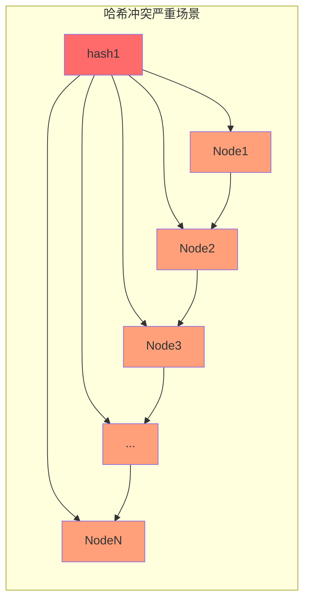
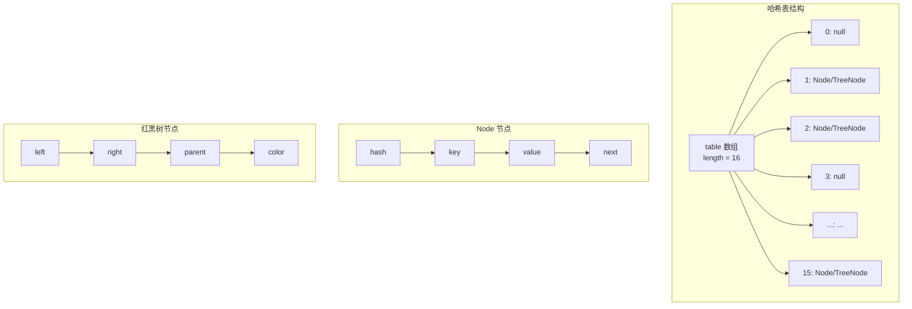
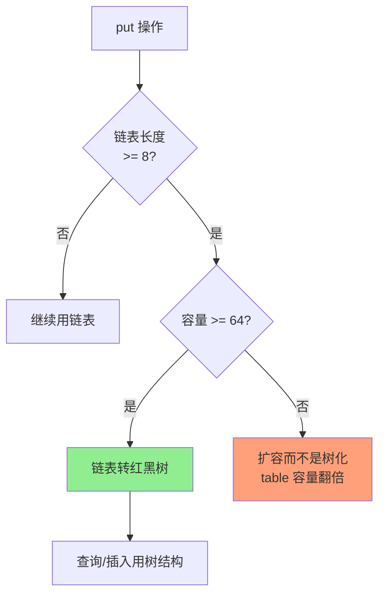

# HashMap 底层数据结构

**目标级别**：P5 / P6

---

## 快速自测

面试官问：「HashMap 底层用的什么数据结构？为什么 JDK8 要引入红黑树？」

你能回答到第几层？

---

## 一、核心问题

### 🔴 HashMap 底层数据结构是什么？

**JDK8 答案**：数组 + 链表 + 红黑树

```java
// JDK 8 HashMap 核心数据结构
public class HashMap<K,V> extends AbstractMap<K,V>
        implements Map<K,V>, Cloneable, Serializable {

    // Node 是 HashMap 的基本存储单元
    static class Node<K,V> implements Map.Entry<K,V> {
        final int hash;    // key 的 hash 值
        final K key;       // 不可变
        V value;           // 值
        Node<K,V> next;    // 指向下一个节点（链表/红黑树）
    }

    // 数组，每个元素是 Node（链表头或红黑树根）
    transient Node<K,V>[] table;
}
```

### JDK7 vs JDK8 对比

| 版本 | 数据结构 |
|------|----------|
| JDK7 | 数组 + 链表（Entry） |
| JDK8 | 数组 + 链表 + 红黑树（Node + TreeNode） |

---

## 二、数据结构演进原因

### 🔴 为什么要引入红黑树？

**背景**：当哈希冲突严重时，链表会变得很长，导致查询性能从 O(1) 退化到 O(n)。



### 💡 数据对比

| 链表长度 | 链表查询复杂度 | 红黑树查询复杂度 |
|---------|---------------|-----------------|
| 1 | O(1) | O(1) |
| 8 | O(8) | O(3) |
| 16 | O(16) | O(4) |
| 64 | O(64) | O(6) |

> **结论**：当链表长度 >= 8 时，红黑树的查找优势开始显现。

### ⚠️ 常见误解

很多人误以为「JDK8 比 JDK7 快是因为用了红黑树」，但实际上：

1. 正常情况下，链表长度很少超过 8
2. 红黑树的插入、删除比链表慢
3. 真正的原因是：**红黑树只在极端情况下作为保底**

---

## 三、核心结构解析

### 🔴 哈希表的本质

HashMap 的底层是一个 **哈希表**，它通过哈希函数将 key 映射到数组的某个位置。



### 关键概念解释

| 概念 | 说明 |
|------|------|
| **桶（Bucket）** | table 数组的每个元素称为一个桶 |
| **哈希冲突** | 不同 key 计算出的 hash 值相同，落在同一个桶 |
| **拉链法** | 用链表或红黑树解决哈希冲突 |
| **负载因子** | 当前元素数 / 容量，默认 0.75 |

---

## 四、源码解析

### JDK8 Node 源码

```java
// HashMap.Node - 链表节点
static class Node<K,V> implements Map.Entry<K,V> {
    final int hash;      // key 的 hash 值（存储以避免重复计算）
    final K key;         // final 不可变
    V value;             // value 可变
    Node<K,V> next;      // 下一个节点

    Node(int hash, K key, V value, Node<K,V> next) {
        this.hash = hash;
        this.key = key;
        this.value = value;
        this.next = next;
    }
}
```

### JDK8 TreeNode 源码

```java
// HashMap.TreeNode - 红黑树节点
static final class TreeNode<K,V> extends LinkedHashMap.Entry<K,V> {
    TreeNode<K,V> parent;   // 父节点
    TreeNode<K,V> left;    // 左子节点
    TreeNode<K,V> right;   // 右子节点
    TreeNode<K,V> prev;    // 前一个节点（删除时用到）
    boolean red;           // 颜色标记

    TreeNode(int hash, K key, V val, Node<K,V> next,
             TreeNode<K,V> parent) {
        super(hash, key, val, next);
        this.parent = parent;
    }
}
```

### 💡 为什么 TreeNode 继承 LinkedHashMap.Entry？

```java
// LinkedHashMap.Entry 继承 HashMap.Node
static class Entry<K,V> extends HashMap.Node<K,V> {
    Entry<K,V> before, after;  // 双向链表指针
}

// TreeNode 继承 Entry，相当于同时拥有：
// 1. 树节点的 parent/left/right/prev/red
// 2. 链表节点的 next
// 3. LinkedHashMap 的 before/after
```

这是为了在红黑树和链表之间转换方便。

---

## 五、红黑树化条件

### 🔴 什么情况下会转红黑树？

```java
// JDK 8 HashMap 源码
// 链表转红黑树的阈值
static final int TREEIFY_THRESHOLD = 8;

// 红黑树转链表的阈值
static final int UNTREEIFY_THRESHOLD = 6;

// 最小树化容量（桶数量）
static final int MIN_TREEIFY_CAPACITY = 64;
```

**树化条件**（同时满足）：

1. 链表长度 >= **8**
2. 数组容量 >= **64**



### 为什么阈值是 8？

> **统计学依据**：根据 Poisson 分布计算，链表长度达到 8 的概率约为 0.00000006（千万分之六），属于极端情况。

```java
// Poisson 概率分布（Collision probability）
// 0: 0.60653066
// 1: 0.30326533
// 2: 0.07581633
// 3: 0.01263606
// 4: 0.00157952
// 5: 0.00015846
// 6: 0.00001316
// 7: 0.00000094
// 8: 0.00000006  <-- 这个概率下才树化
```

### ⚠️ 树化阈值与反树化阈值为什么差 2？

| 阈值 | 值 | 说明 |
|------|-----|------|
| TREEIFY_THRESHOLD | 8 | 链表 -> 红黑树 |
| UNTREEIFY_THRESHOLD | 6 | 红黑树 -> 链表 |

**设计原因**：防止在临界点频繁转换（链表长度在 6-8 之间反复变化）。

---

## 六、面试题精讲

### 🔴 第一层：HashMap 底层数据结构是什么？

> **参考答案**：
>
> HashMap 底层是哈希表（Hash Table），JDK8 的实现是**数组 + 链表 + 红黑树**。数组的每个位置是一个桶（Bucket），存放链表头或红黑树根。当链表长度超过 8 且数组容量 >= 64 时，链表会转为红黑树，以优化极端情况下的查找性能。

### 🟡 第二层：为什么 JDK8 要引入红黑树？

> **参考答案**：
>
> JDK7 只有链表，当哈希冲突严重时，所有元素都落在同一个桶里，查询会退化成 O(n)。JDK8 引入红黑树，当链表长度 >= 8 时转为红黑树，查询复杂度从 O(n) 降为 O(log n)。但要注意，红黑树只在极端情况下才启用，正常场景下链表已经够用了。

### 💡 第三层：为什么不一开始就用红黑树？

> **参考答案**：
>
> 红黑树的插入、删除比链表复杂，需要维护平衡，有额外的旋转操作开销。在正常情况下，链表长度很短，用红黑树反而更慢。设计原则是：**简单场景用简单方案，极端情况再退化到复杂方案**。

### ⚠️ 面试官挖坑点

| 陷阱 | 错误回答 | 正确回答 |
|------|---------|----------|
| 「JDK8 用了红黑树所以更快」 | 忽略了红黑树只是保底方案 | 红黑树只在链表过长时启用 |
| 「链表长度到 8 就转红黑树」 | 忽略了容量 >= 64 的前提 | 两个条件必须同时满足 |
| 「HashMap 是数组加链表」 | 只说 JDK7 | JDK8 是数组 + 链表 + 红黑树 |

---

## 七、对比表格

| 数据结构 | 查询复杂度 | 插入复杂度 | 删除复杂度 | 适用场景 |
|---------|-----------|-----------|-----------|----------|
| 数组 | O(1) | O(n) | O(n) | 连续内存，随机访问多 |
| 链表 | O(n) | O(1) | O(1) | 插入删除多，查询少 |
| 哈希表（链表） | O(n) | O(1) | O(1) | 哈希冲突少时 |
| 哈希表（红黑树） | O(log n) | O(log n) | O(log n) | 哈希冲突严重时 |

---

## 八、总结

```mermaid
flowchart TB
    A[HashMap 底层结构] --> B[table 数组]
    B --> C[每个元素是 Bucket]
    
    C --> D{元素少}
    D --> E[链表<br/>Node.next]
    
    C --> F{元素多<br/>链表 >= 8}
    F --> G[红黑树<br/>TreeNode]
    
    E --> H[查询 O(1)~O(n)]
    G --> I[查询 O(log n)]
    
    style B fill:#87CEEB
    style E fill:#DDA0DD
    style G fill:#90EE90
```

**核心要点**：

1. HashMap 底层是 **哈希表**
2. JDK8 实现为 **数组 + 链表 + 红黑树**
3. 链表转红黑树条件：**长度 >= 8 且容量 >= 64**
4. 红黑树是**极端情况下的保底方案**
5. 阈值差 2 防止临界点频繁转换

---

## 延伸思考

> **追问**：如果让你设计一个哈希表，你会怎么处理哈希冲突？有哪些方案？

1. **开放寻址法**：线性探测、二次探测、双重哈希
2. **再哈希法**：用另一个哈希函数再算一次
3. **公共溢出区**：冲突的元素放到溢出区
4. **拉链法（HashMap 采用）**：链表或红黑树存储冲突元素

每种方案都有 trade-off：开放寻址适合数据量小、负载因子低的场景；拉链法适合数据量大、哈希冲突多的场景。
