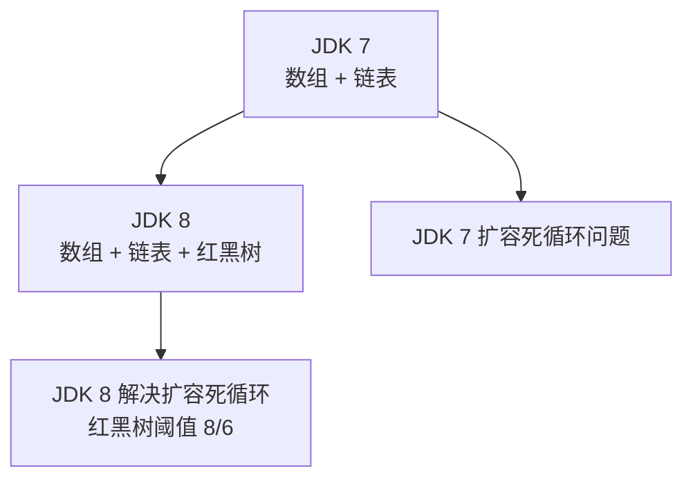

# HashMap 底层数据结构

面试官问："HashMap 底层是什么数据结构？"

候选人小梁答："JDK 8 是数组加链表，数组里存链表节点。"

面试官追问："JDK 8 之后加了什么？"

小梁说："红黑树。"

面试官追问："为什么加红黑树？什么情况下会树化？"

小梁说："链表太长的时候...大概是8？"

面试官："那为什么要用红黑树而不是其他树？"

小梁答不上来。

【面试官心理】
这道题考查的是候选人对 HashMap 演进历史的理解。能说出"JDK 7 的扩容死循环"和"JDK 8 的改进"的候选人，说明真正研究过 HashMap 的历史和设计意图。

## 一、数据结构演变 🔴



## 二、JDK 7：数组 + 链表 🔴

### 2.1 Entry 节点

```java
static class Entry<K, V> implements Map.Entry<K, V> {
    final K key;
    V value;
    Entry<K, V> next; // 指向下一个节点的指针
    int hash;         // key 的 hash 值缓存

    Entry(int h, K k, V v, Entry<K, V> n) {
        this.hash = h;
        this.key = k;
        this.value = v;
        this.next = n;
    }
}
```

### 2.2 JDK 7 HashMap 结构

```
table (Entry[])
┌─────┬─────┬─────┬─────┬─────┬─────┐
│ [0] │ [1] │ [2] │ [3] │ [4] │ ... │
└──┬──┴──┬──┴──┬──┴──┬──┴──┬──┴─────┘
   │     │     │     │
   ▼     ▼     ▼     ▼
 ┌───┐ ┌───┐
 │ A │→│ B │  链表
 └───┘ └───┘
```

所有节点组成一个 Entry 数组，每个桶（bucket）中是一个链表（通过 next 指针链接）。

### 2.3 JDK 7 的致命问题：扩容死循环

```java
// JDK 7 扩容时重新 hash 并 transfer
void transfer(Entry[] newTable) {
    Entry[] src = table;
    int newCapacity = newTable.length;

    for (int j = 0; j < src.length; j++) {
        Entry<K, V> e = src[j];
        if (e != null) {
            src[j] = null;
            do {
                Entry<K, V> next = e.next;
                // ❌ 关键问题：rehash 时链表节点顺序会反转
                int i = indexFor(e.hash, newCapacity);
                e.next = newTable[i];
                newTable[i] = e;
                e = next;
            } while (e != null);
        }
    }
}
```

**死循环的原因**：

```java
// 假设单线程扩容：
// 原始链表：A → B → null（A 在前，B 在后）
// 第一次 transfer：e=A, next=B
//   A.next = newTable[i] = null
//   newTable[i] = A
//   e = B
// 第二次 transfer：e=B, next=null
//   B.next = newTable[i] = A
//   newTable[i] = B
//   e = null，退出

// 看起来没问题...但多线程呢？

// 多线程并发 transfer（两个线程同时执行）：
// 线程1: A.next = null, newTable[0] = A
//        next = B, B.next = A, newTable[0] = B
// 线程2: A.next = null, newTable[0] = A  (覆盖！)
//        next = B, B.next = A, newTable[0] = B  (覆盖！)
// 线程1: A.next = B (被线程2覆盖的 A.next)
//        ... 最终链表形成环形
// 调用 get(key) → 死循环！
```

:::warning ⚠️
JDK 7 的 HashMap 在高并发下扩容可能导致死循环和 CPU 100%。这是 Java 历史上最著名的并发 bug 之一。JDK 8 通过改变 transfer 的顺序（非递归、头插改尾插）解决了这个问题。
:::

## 三、JDK 8：数组 + 链表 + 红黑树 🔴

### 3.1 Node 节点（JDK 8+）

```java
static class Node<K, V> implements Map.Entry<K, V> {
    final int hash;
    final K key;
    V value;
    Node<K, V> next;      // 链表指针
    Node<K, V> treeRoot;  // JDK 8 新增：如果是红黑树，指向根节点
}

// JDK 8 新增：红黑树节点
static final class TreeNode<K, V> extends LinkedHashMap.Entry<K, V> {
    TreeNode<K, V> parent;
    TreeNode<K, V> left;
    TreeNode<K, V> right;
    TreeNode<K, V> prev; // 链表指针（用于删除时快速找到前驱）
    boolean red;          // 红黑树颜色
}
```

### 3.2 JDK 8 HashMap 结构

```
table (Node[] 或 TreeNode[])
┌─────┬─────┬─────┬─────┬─────┬─────┐
│[0]  │[1]  │[2]  │[3]  │[4]  │ ... │
└──┬──┴──┬──┴──┬──┬──┴──┬──┴──┬─────┘
   │     │     │  │
   ▼     ▼     ▼  ▼
 ┌───┐ ┌───┐ ┌───────┐
 │ A │→│ B │ │   C   │  (链表: A→B)
 └───┘ └───┘ └───┬───┘
                 │
                 ▼
              ┌─────────┐
              │  R/B Tree │  (当链表长度 >= 8 时树化)
              └─────────┘
```

### 3.3 为什么用红黑树而不是其他树

| 树类型 | 查找 | 插入 | 删除 | 平衡方式 |
| --- | --- | --- | --- | --- |
| 二叉搜索树 | O(log n) | O(log n) | O(log n) | 可能退化为链表 |
| AVL 树 | O(log n) | O(log n) | O(log n) | 严格平衡（高度差 `<=` 1） |
| **红黑树** | O(log n) | O(log n) | O(log n) | 近似平衡 |
| B+ 树 | O(log n) | O(log n) | O(log n) | 多叉平衡（用于数据库） |

**为什么不用 AVL？**
- AVL 树比红黑树更严格平衡
- 查找性能更好（因为更平衡）
- 但**插入和删除的代价更高**（更多旋转操作）
- HashMap 的场景：插入和删除远多于查找，且不需要严格平衡
- **红黑树的插入/删除代价更小**，更适合 HashMap

**为什么不用 B+ 树？**
- B+ 树是多叉树，适合磁盘存储（数据库索引）
- HashMap 在内存中，不需要多叉优化

## 四、红黑树化阈值 🔴

```java
static final int TREEIFY_THRESHOLD = 8;  // 链表 → 红黑树
static final int UNTREEIFY_THRESHOLD = 6; // 红黑树 → 链表

static final int MIN_TREEIFY_CAPACITY = 64; // 树化的最小容量要求
```

**为什么是 8 和 6（不是对称的）？**

```java
// 源码注释解释：
// 理想情况下，随机 hashCode 下，链表节点的分布在泊松概率下：
// k=0 概率: 0.60653066
// k=1 概率: 0.30326533
// k=2 概率: 0.07581633
// k=3 概率: 0.01263606
// k=4 概率: 0.00157952
// k=5 概率: 0.00015795
// k=6 概率: 0.00001579
// k=7 概率: 0.00000113
// k=8 概率: 0.00000006  ← 几乎不可能达到

// 所以阈值 8 是一个非常保守的选择
// 退链表阈值用 6 而非 8，是为了避免在阈值边界反复树化/退链表
```

【面试官心理】
能说出泊松分布和阈值设计原因的候选人，说明看过 HashMap 的源码注释，这是 P6+ 的标准要求。
