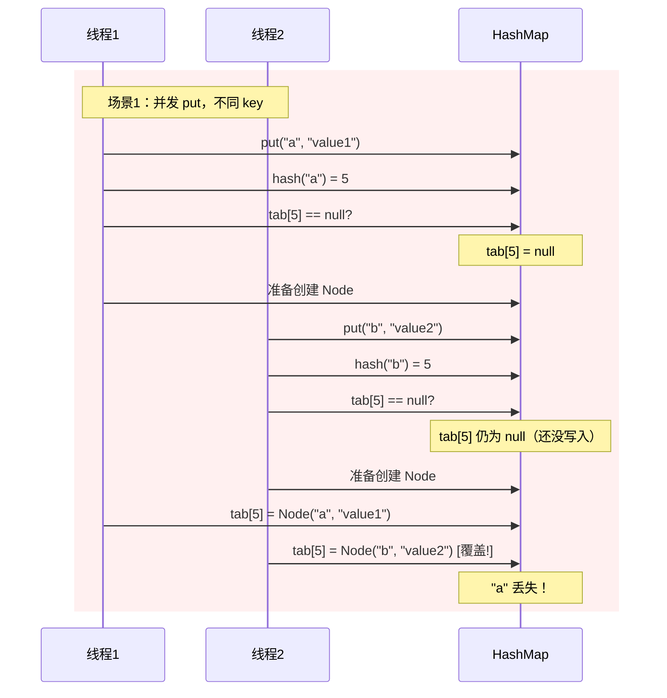
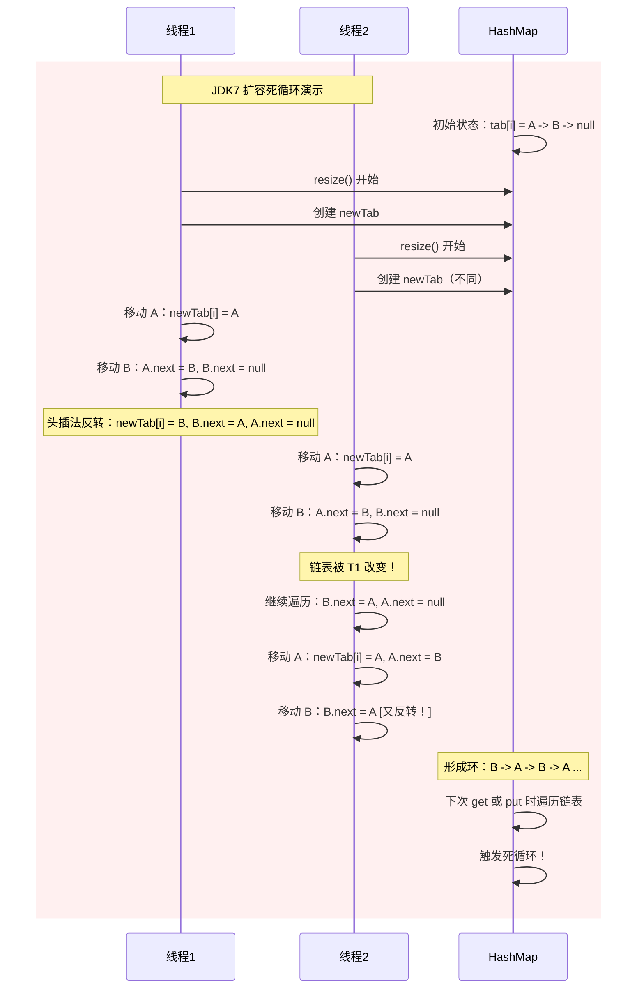
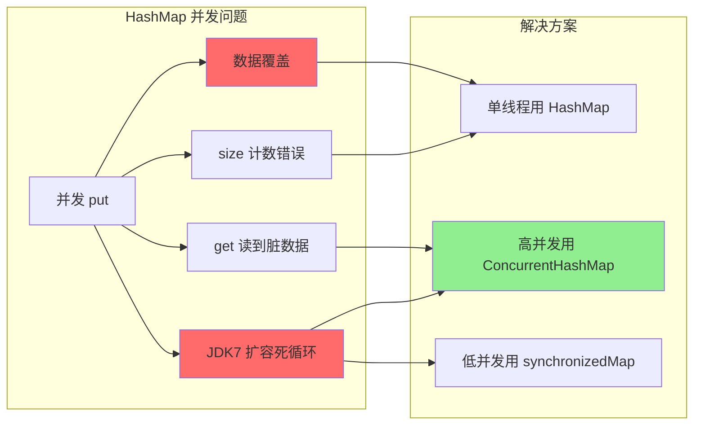

# HashMap 线程不安全表现

**目标级别**：P5 / P6

---

## 快速自测

面试官问：「HashMap 是线程安全的吗？并发使用会有什么后果？」

---

## 一、核心问题

### 🔴 HashMap 是线程安全的吗？

**答案**：不是。HashMap 不是线程安全的，在并发环境下会出现以下问题：

1. **数据覆盖**：put 操作被其他线程打断，导致数据丢失
2. **并发扩容死循环**：JDK7 头插法在扩容时形成环形链表
3. **get/put 并发问题**：数组 volatile 不保证 Node 内部可见性

---

## 二、并发场景分析

### 💡 问题一：数据覆盖

**场景**：两个线程同时 put，key 不同但 hash 相同。



**源码分析**：

```java
// putVal 简化流程
if ((p = tab[i = (n - 1) & hash]) == null) {
    // 步骤1：检查为空
    tab[i] = newNode(hash, key, value, null);
    // 步骤2：写入
}
```

问题在于 **步骤1 和步骤2 之间没有原子性**，其他线程可能在这期间修改了 tab[i]。

### 问题二：size 计数错误

```java
// putVal 末尾
if (++size > threshold)  // size++ 不是原子的
    resize();
```

两个线程同时执行 `size++`，可能只增加 1：

| 时间 | 线程1 size | 线程2 size | 实际 size |
|------|-----------|-----------|-----------|
| T1 | 12 | 12 | 12 |
| T1 | 13 | | 13 |
| T2 | | 13 | 13（应该是14）|

### ⚠️ JDK7 并发扩容死循环

这是最经典的问题，只发生在 JDK7 的头插法中。



### 💡 JDK8 为什么解决了？

JDK8 改成**尾插法**，元素顺序保持不变，不会形成环：

```java
// JDK8 的扩容逻辑
do {
    next = e.next;
    if ((e.hash & oldCap) == 0) {
        // lo 链表：保持原顺序
        if (loTail == null)
            loHead = e;
        else
            loTail.next = e;
        loTail = e;
    } else {
        // hi 链表：保持原顺序
        if (hiTail == null)
            hiHead = e;
        else
            hiTail.next = e;
        hiTail = e;
    }
} while ((e = next) != null);
```

**注意**：JDK8 虽然解决了死循环，但**仍然不是线程安全的**！

---

## 三、并发问题场景详解

### 🔴 场景一：put 和 get 并发

```java
// 线程A：put 新值
map.put(key, newValue);

// 线程B：get 值
Object value = map.get(key);  // 可能拿到旧值或 null
```

**原因**：`table` 数组是 volatile 的，但 Node 内部的 `value` 不是。

```java
// HashMap 成员变量
transient Node<K,V>[] table;  // table 是 volatile
```

```java
// Node 成员
final int hash;
final K key;
V value;  // value 不是 volatile
Node<K,V> next;
```

### ⚠️ 场景二：先 get 再 put（非原子）

```java
// 业务代码常见写法
if (map.get(key) == null) {
    map.put(key, value);  // 可能被其他线程插入
}
```

**问题**：检查和插入之间没有原子性，其他线程可能已经插入了相同的 key。

### 场景三：迭代器 fail-fast

```java
// 线程A：迭代
for (Map.Entry<String, String> entry : map.entrySet()) {
    // ...
}

// 线程B：put
map.put("newKey", "newValue");
```

HashMap 迭代器是 **fail-fast** 的，迭代过程中检测到结构性修改会抛出 `ConcurrentModificationException`。

---

## 四、并发问题总结表

| 问题类型 | JDK7 | JDK8 | 后果 |
|---------|------|------|------|
| 数据覆盖 | ✅ | ✅ | 数据丢失 |
| size 计数错误 | ✅ | ✅ | size 不准确 |
| 扩容死循环 | ✅（头插法） | ❌（尾插法） | CPU 100%，程序卡死 |
| get/put 并发 | ✅ | ✅ | 读到脏数据 |
| 迭代时修改 | ✅（fail-fast） | ✅（fail-fast） | 抛出异常 |

---

## 五、面试题精讲

### 🔴 第一层：HashMap 是线程安全的吗？为什么？

> **参考答案**：
>
> HashMap 不是线程安全的。原因是：
> 1. put/get 操作没有同步保护，多线程并发时会相互干扰
> 2. size 是 volatile 变量，但 `size++` 不是原子操作
> 3. JDK7 扩容时使用头插法，并发扩容会形成环形链表导致死循环（JDK8 已修复）
> 4. modCount 不是 volatile，多线程修改会导致迭代器 fail-fast

### 🟡 第二层：并发使用 HashMap 会出什么问题？

> **参考答案**：
>
> 主要问题有：
> 1. **数据覆盖**：两个线程同时 put 不同的 key，但 hash 相同，后面的会覆盖前面的
> 2. **size 不准确**：size++ 不是原子操作，多线程都读到相同的 size 值
> 3. **读到脏数据**：put 过程中，get 可能读到不完整的数据
> 4. **死循环**（JDK7）：并发扩容时链表可能被反转成环形
> 5. **迭代异常**：并发修改触发 ConcurrentModificationException

### 💡 第三层：JDK8 解决了死循环问题，还有什么线程安全问题？

> **参考答案**：
>
> JDK8 虽然用尾插法解决了扩容死循环，但 HashMap 仍然是线程不安全的：
> 1. **数据覆盖问题仍然存在**：putVal 中的检查和插入不是原子的
> 2. **size 计数仍然不准确**：size++ 的 race condition 仍然存在
> 3. **迭代器的 fail-fast 机制仍然会触发**
>
> 真正的问题是：HashMap 的任何操作都不是为并发设计的，任何看似安全的操作在并发下都可能出问题。

### ⚠️ 面试官挖坑点

| 陷阱 | 错误回答 | 正确回答 |
|------|---------|----------|
| 「JDK8 的 HashMap 是线程安全的」 | 误以为尾插法解决了所有问题 | 尾插法只解决扩容死循环，其他问题仍然存在 |
| 「用 synchronized 包裹 put 就安全了」 | 不了解 synchronized 的范围 | 即使 synchronized put，get 仍可能读到中间状态 |
| 「ConcurrentHashMap 可以完全替代」 | 忽略 ConcurrentHashMap 也有场景限制 | 高并发用 ConcurrentHashMap，简单并发可以用 Collections.synchronizedMap |

---

## 六、解决方案对比

| 方案 | 线程安全 | 并发性能 | 适用场景 |
|------|---------|---------|---------|
| HashMap | ❌ | 高 | 单线程 |
| Collections.synchronizedMap | ✅ | 低（全局锁） | 低并发 |
| ConcurrentHashMap | ✅ | 高（分段/CAS） | 高并发 |
| Hashtable | ✅ | 低（全方法锁） | 不推荐 |

### 💡 为什么 Hashtable 不推荐？

```java
// Hashtable 的 put 方法
public synchronized V put(K key, V value) { ... }
```

Hashtable 的每个方法都加了 `synchronized`，相当于把所有操作串行化，高并发下性能很差。

---

## 七、问题复现代码

```java
public class HashMapThreadUnsafeDemo {

    public static void main(String[] args) throws InterruptedException {
        // 问题1：数据覆盖
        Map<String, Integer> map = new HashMap<>();

        for (int i = 0; i < 100; i++) {
            new Thread(() -> {
                for (int j = 0; j < 1000; j++) {
                    map.put(Thread.currentThread().getName() + j, j);
                }
            }, "Thread-" + i).start();
        }

        Thread.sleep(2000);
        System.out.println("Expected: 100000, Actual: " + map.size());
        // 实际数量往往少于 100000
    }
}
```

```java
public class HashMapDeadLoopDemo {

    public static void main(String[] args) throws InterruptedException {
        // JDK7 扩容死循环复现
        final Map<Integer, Integer> map = new HashMap<>();

        ExecutorService executor = Executors.newFixedThreadPool(2);

        executor.submit(() -> {
            for (int i = 0; i < 100000; i++) {
                map.put(i, i);
            }
        });

        executor.submit(() -> {
            for (int i = 0; i < 100000; i++) {
                map.put(i, i);
            }
        });

        executor.shutdown();
        // 在 JDK7 环境下可能导致死循环
    }
}
```

---

## 八、总结

**HashMap 线程不安全核心要点**：



1. **不是线程安全的**：任何并发操作都可能出现数据问题
2. **JDK7 头插法**：并发扩容会形成环形链表导致死循环
3. **JDK8 尾插法**：解决了死循环，但数据覆盖等问题仍存在
4. **正确选择**：根据并发程度选择合适的并发容器

---

## 延伸思考

> **追问**：如果 HashMap 已经是线程不安全的，有什么替代方案？各自的优缺点是什么？

| 替代方案 | 优点 | 缺点 |
|---------|------|------|
| Hashtable | 线程安全 | 性能差，全局锁 |
| Collections.synchronizedMap | 简单易用 | 性能差，全局锁 |
| ConcurrentHashMap | 性能好，并发度高 | 强一致性强保证 |
| ConcurrentSkipListMap | 线程安全 + 有序 | 性能比 HashMap 差 |

核心选择原则：**根据并发量和一致性要求选择合适的方案**。
