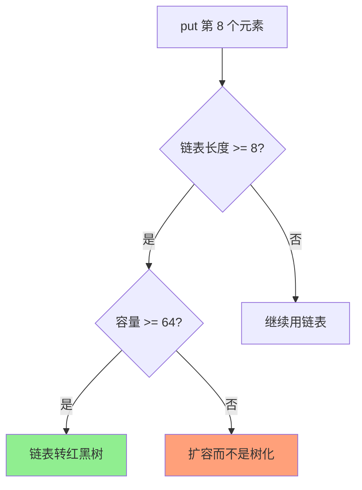
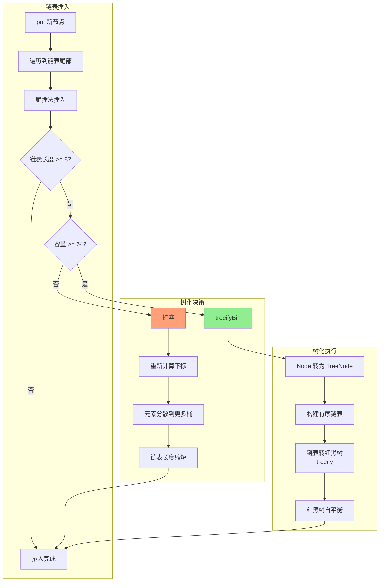
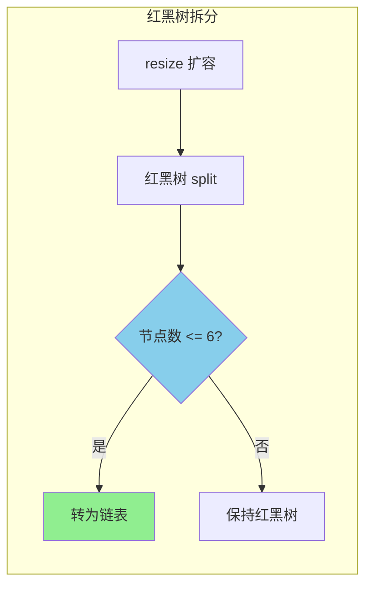
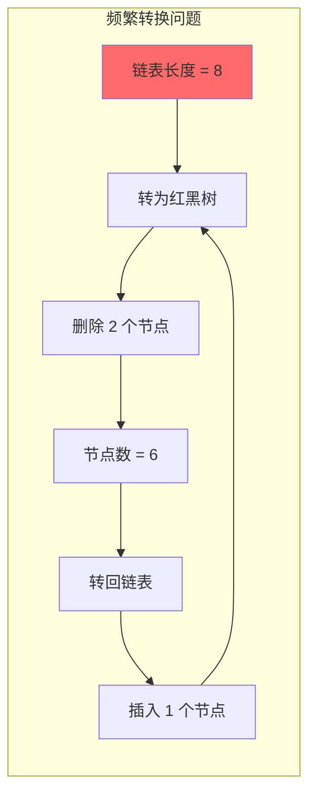
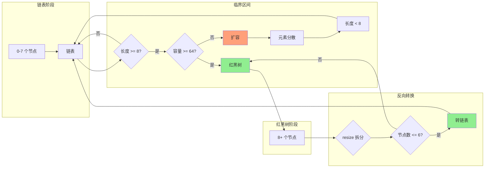

# HashMap 红黑树化阈值

**目标级别**：P5 / P6

---

## 快速自测

面试官问：「HashMap 什么情况下链表会转红黑树？为什么是 8 而不是 7？」

---

## 一、核心问题

### 🔴 HashMap 红黑树化的条件是什么？

**两个条件必须同时满足**：

| 条件 | 值 | 说明 |
|------|-----|------|
| 链表长度 | `>= 8` | binCount `>=` 7（插入第 8 个时触发） |
| 数组容量 | `>= 64` | 如果容量 `<` 64，优先扩容而不是树化 |

```java
// JDK 8 HashMap 源码
// 链表转红黑树的阈值
static final int TREEIFY_THRESHOLD = 8;

// 红黑树转链表的阈值
static final int UNTREEIFY_THRESHOLD = 6;

// 最小树化容量
static final int MIN_TREEIFY_CAPACITY = 64;

// treeifyBin 方法
final void treeifyBin(Node<K,V>[] tab, int hash) {
    int n, index;
    Node<K,V> e;
    // 如果容量 < 64，扩容而不是树化
    if (tab == null || (n = tab.length) < MIN_TREEIFY_CAPACITY)
        resize();
    else if ((e = tab[index = (n - 1) & hash]) != null) {
        // 链表转红黑树
        TreeNode<K,V> hd = null, tl = null;
        do {
            TreeNode<K,V> p = replacementTreeNode(e, null);
            if (tl == null)
                hd = p;
            else {
                p.prev = tl;
                tl.next = p;
            }
            tl = p;
        } while ((e = e.next) != null);
        // 插入红黑树
        if ((tab[index] = hd) != null)
            hd.treeify(hd);
    }
}
```

---

## 二、为什么是 8？

### 🔴 第一层：链表长度达到 8 就转红黑树

**表面答案**：链表太长，查询性能退化到 O(n)。

### 🟡 第二层：为什么是 8 而不是 7 或 10？

**统计学依据**：根据 Poisson 分布（泊松分布），链表长度达到 8 的概率极低。

```java
// HashMap 源码注释中的 Poisson 概率分布
/*
* 0: 0.60653066
* 1: 0.30326533
* 2: 0.07581633
* 3: 0.01263606
* 4: 0.00157952
* 5: 0.00015846
* 6: 0.00001316
* 7: 0.00000094
* 8: 0.00000006
*/
```

### 💡 深入分析

| 链表长度 | Poisson 概率 | 实际意义 |
|---------|-------------|---------|
| 0 | 60.65% | 大多数 bucket 是空的 |
| 1 | 30.33% | 放 1 个元素 |
| 2 | 7.58% | 放 2 个元素 |
| 3 | 1.26% | 放 3 个元素 |
| 8 | 0.000006% | 极端情况，亿分之六 |

**结论**：链表长度达到 8 是**极端罕见的小概率事件**，说明哈希冲突已经非常严重，此时转红黑树是合理的。

### 为什么不用 AVL 树？

| 对比 | AVL 树 | 红黑树 |
|------|--------|--------|
| 平衡标准 | 更严格（左右子树高度差 `<=` 1） | 相对宽松 |
| 插入/删除开销 | 大（频繁旋转） | 小（最多 3 次旋转） |
| 查询性能 | 更好（更平衡） | 稍差（不如 AVL） |
| 适用场景 | 读多写少 | 读写均衡 |

**HashMap 选择红黑树**：因为 JDK8 的优化目标是**读写均衡**，红黑树的插入/删除代价更小。

---

## 三、MIN_TREEIFY_CAPACITY = 64

### ⚠️ 很多人忽略的条件

**条件不是链表 `>=` 8 就树化，还必须容量 `>=` 64！**



### 💡 为什么容量 < 64 时优先扩容？

**理由**：扩容可以**分散**元素到更多桶，减少链表长度，比树化更有效。

| 场景 | 操作 | 效果 |
|------|------|------|
| 容量 16，链表长度 8 | 扩容到 32 | 链表长度降到 ~4（分散了） |
| 容量 16，链表长度 8 | 转为红黑树 | 复杂度 O(log n)，但容量还是 16 |

**设计哲学**：**优先通过扩容解决问题**，而不是引入更复杂的数据结构。

---

## 四、红黑树与链表转换流程

### 完整流程图



---

## 五、反向转换：红黑树转链表

### 🔴 什么时候红黑树会转回链表？

```java
// 红黑树转链表的阈值
static final int UNTREEIFY_THRESHOLD = 6;
```

**触发条件**：红黑树节点数 `<=` 6 时，转为链表。



### 💡 为什么阈值差 2 而不是 1？

**防止临界点频繁转换**：

| 链表阈值 | 红黑树阈值 | 差值 |
|---------|-----------|------|
| 8 | 6 | 2 |



**差 2 的作用**：
- 链表长度在 6-8 之间时，**不会频繁转换**
- 转换有明显的滞后，给了元素数量稳定的余地

---

## 六、源码解析：putTreeVal

```java
// TreeNode.putTreeVal 简化版
final TreeNode<K,V> putTreeVal(HashMap<K,V> map, Node<K,V>[] tab,
                               int h, K k, V v) {
    TreeNode<K,V> p = this;
    TreeNode<K,V> parent = null;
    Class<?> kc = null;
    boolean searched = false;

    // 1. 找到插入位置的父节点
    do {
        parent = p;
        int dir, pc;
        // 比较 hash 值
        if ((pc = p.hash) > h)
            dir = -1;
        else if (pc < h)
            dir = 1;
        else {
            // hash 相等，比较 key
            if ((kc == null &&
                 (kc = comparableClassFor(k)) == null) ||
                (dir = compareComparables(kc, k, p.key)) == 0) {
                // hash 和 compareTo 都无法区分，遍历查找
                if (!searched) {
                    TreeNode<K,V> q, ch;
                    searched = true;
                    if (((ch = p.left) != null &&
                         (q = ch.find(h, k, null)) != null) ||
                        ((ch = p.right) != null &&
                         (q = ch.find(h, k, null)) != null))
                        return q;
                }
                dir = tieBreakOrder(k, p.key);
            }
        }
        p = dir < 0 ? p.left : p.right;
    } while (p != null);

    // 2. 创建新节点
    TreeNode<K,V> x = new TreeNode<>(h, k, v, null, parent);
    // 3. 插入到父节点
    if (dir < 0)
        parent.left = x;
    else
        parent.right = x;
    // 4. 维护双向链表
    x.next = p;
    if (p != null)
        p.prev = x;
    if (parent != null)
        x.next = parent;

    // 5. 红黑树自平衡（着色 + 旋转）
    balanceInsertion(root, x);

    // 6. 确保根节点在数组下标位置
    moveRootToFront(tab, root);

    return x;
}
```

---

## 七、面试题精讲

### 🔴 第一层：HashMap 什么情况下链表会转红黑树？

> **参考答案**：
>
> 链表转红黑树需要同时满足两个条件：
> 1. 链表长度 `>=` 8（put 时 binCount `>=` 7，第 8 个元素触发）
> 2. 数组容量 `>=` 64
>
> 如果容量 `<` 64，即使链表长度 `>=` 8，也会优先扩容而不是树化。

### 🟡 第二层：为什么阈值是 8 而不是 7 或 10？

> **参考答案**：
>
> 这是统计学和工程权衡的结果。根据 Poisson 分布，链表长度达到 8 的概率约为千万分之六，属于极端小概率事件，说明哈希冲突已经非常严重，此时转红黑树是合理的。选择 8 而不是 10 是因为红黑树的插入开销比链表大，需要在确实需要时才转换。

### 💡 第三层：红黑树转回链表的阈值为什么是 6 而不是 8？

> **参考答案**：
>
> 差 2 是为了防止临界点频繁转换。如果树化和非树化阈值相同（比如都是 8），那么在链表长度 8 附近反复插入删除时，会频繁触发树化和非树化，性能开销很大。差 2 提供了一个缓冲区间（6-8），只有链表长度稳定在这个区间之外才会触发转换。

### ⚠️ 面试官挖坑点

| 陷阱 | 错误回答 | 正确回答 |
|------|---------|----------|
| 「链表长度到 8 就转红黑树」 | 忽略容量条件 | 必须同时满足链表 `>=` 8 **且**容量 `>=` 64 |
| 「用 AVL 树更快」 | 不了解两者区别 | AVL 插入开销大，红黑树是读写均衡的选择 |
| 「阈值是拍脑袋定的」 | 不了解统计学依据 | 有 Poisson 分布的概率计算支撑 |

---

## 八、阈值设计原理图



---

## 九、性能对比

| 数据结构 | 查询复杂度 | 插入复杂度 | 删除复杂度 | 适用场景 |
|---------|-----------|-----------|-----------|----------|
| 链表 | O(n) | O(1) | O(1) | 节点数 < 8 |
| 红黑树 | O(log n) | O(log n) | O(log n) | 节点数 >= 8 |

| 节点数 | 链表查找次数 | 红黑树查找次数 | 红黑树优势 |
|--------|-------------|---------------|-----------|
| 1 | 1 | 1 | 无 |
| 4 | 4 | 3 | 有 |
| 8 | 8 | 4 | 明显 |
| 16 | 16 | 5 | 显著 |

---

## 十、总结

**HashMap 红黑树化阈值核心要点**：

1. **树化条件**：链表长度 `>=` 8 **且**容量 `>=` 64
2. **反树化条件**：红黑树节点数 `<=` 6
3. **阈值 8**：Poisson 分布概率极低，说明需要红黑树保底
4. **阈值差 2**：防止临界点频繁转换
5. **容量 `<` 64**：优先扩容分散元素，而不是树化

---

## 延伸思考

> **追问**：如果让你设计 HashMap 的树化阈值，你会怎么设计？

需要考虑的因素：
1. **链表 vs 红黑树的切换开销**：频繁切换会降低性能
2. **概率分布**：根据实际数据分布调整
3. **内存占用**：红黑树节点比链表节点大
4. **查询 vs 插入比例**：读多写少可以用 AVL，写多读少可以用普通 BST

这是一个典型的工程权衡问题，没有绝对的最优解。
