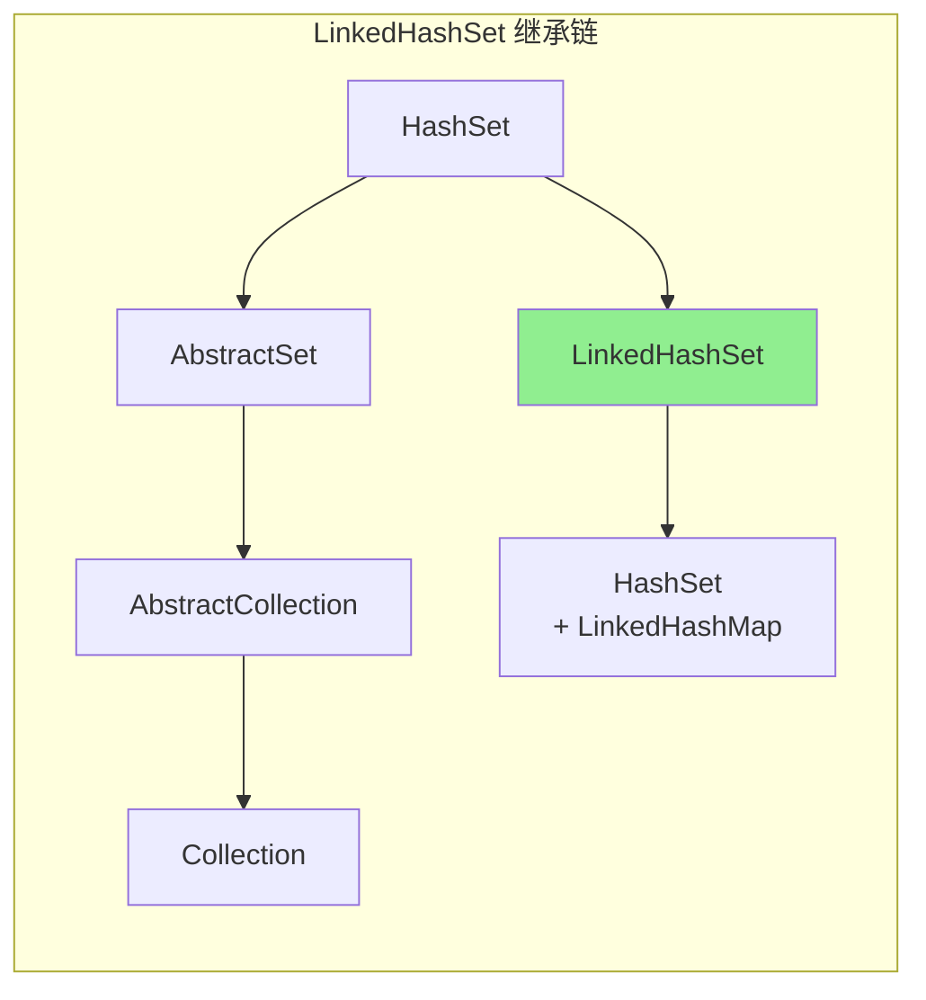
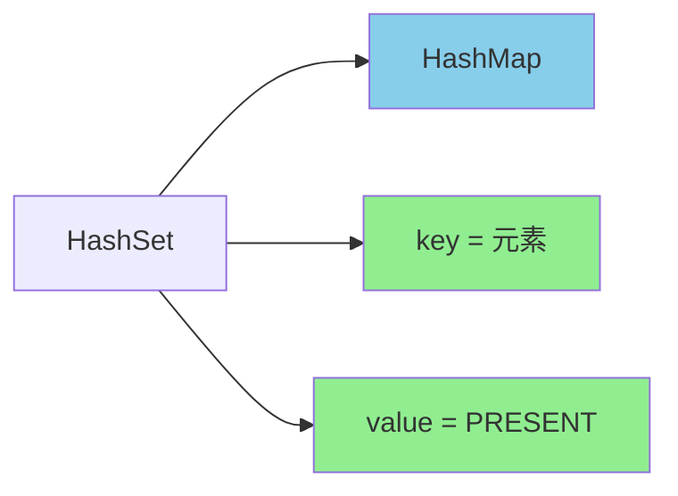

# HashSet 与 HashMap 关系

**目标级别**：P5 / P6

---

## 快速自测

面试官问：「HashSet 底层是什么？为什么 add 一个元素，内部其实是 put？」

---

## 一、核心问题

### 🔴 HashSet 和 HashMap 是什么关系？

**HashSet 内部就是一个 HashMap**

```java
public class HashSet<E> extends AbstractSet<E>
        implements Set<E>, Cloneable, Serializable {

    // HashSet 内部使用 HashMap 存储
    private transient HashMap<E,Object> map;
    
    // HashMap 中不存在的值（作为 value）
    private static final Object PRESENT = new Object();
}
```

---

## 二、源码解析

### 🔴 HashSet add 方法

```java
// HashSet.add 实际上是 HashMap.put
public boolean add(E e) {
    return map.put(e, PRESENT) == null;
}
```

**图解**：

```mermaid
flowchart LR
    subgraph HashSet
        A[add("hello")] --> B[HashMap.put]
        B --> C[map.put("hello", PRESENT)]
    end
    
    subgraph HashMap 内部
        C --> D[key = "hello"]
        C --> E[value = PRESENT]
    end
```

### 💡 为什么用 PRESENT？

PRESENT 是一个**固定的哑值**，表示「存在」：

```java
// PRESENT 是一个所有元素共用的对象
private static final Object PRESENT = new Object();

// add 操作只需要判断 key 是否存在
public boolean add(E e) {
    return map.put(e, PRESENT) == null;
}
```

---

## 三、HashSet 常用方法

### 🔴 方法对应关系

| HashSet 方法 | 内部调用 |
|-------------|----------|
| add(e) | map.put(e, PRESENT) |
| remove(e) | map.remove(e) |
| contains(e) | map.containsKey(e) |
| size() | map.size() |
| isEmpty() | map.isEmpty() |
| clear() | map.clear() |
| iterator() | map.keySet().iterator() |

### 源码验证

```java
// HashSet.remove
public boolean remove(Object o) {
    return map.remove(o) == PRESENT;
}

// HashSet.contains
public boolean contains(Object o) {
    return map.containsKey(o);
}

// HashSet.iterator
public Iterator<E> iterator() {
    return map.keySet().iterator();
}
```

---

## 四、为什么这样设计？

### 💡 设计优势

| 设计 | 优势 |
|------|------|
| 复用 HashMap | 不用重复实现哈希表逻辑 |
| PRESENT 固定值 | 所有元素的 value 相同，无需存储 |
| key 不重复 | HashMap key 不重复，自然实现 Set 不重复特性 |

### ⚠️ 潜在问题

```java
// 如果 HashSet 存了 10000 个元素
HashSet<String> set = new HashSet<>();
for (int i = 0; i < 10000; i++) {
    set.add("element" + i);
}

// 内存占用：10000 个 PRESENT 对象？
// 错！只有一个 PRESENT 对象，所有元素共享
```

**注意**：PRESENT 只有一个实例，内存开销极小。

---

## 五、LinkedHashSet

### 🔴 继承关系

```java
public class LinkedHashSet<E>
    extends HashSet<E>
    implements Set<E>, Cloneable, Serializable {
    
    public LinkedHashSet(int initialCapacity, float loadFactor) {
        super(initialCapacity, loadFactor, true);  // 第三个参数 true 表示 accessOrder=false
    }
}
```

**第三个参数 `true`**：传递给 HashMap 的 LinkedHashMap 构造，表示按插入顺序维护链表。



---

## 六、对比表格

| 维度 | HashSet | HashMap |
|------|---------|---------|
| 底层 | HashMap | 哈希表 |
| 存储 | 只有 key | key-value 对 |
| value | 固定的 PRESENT | 实际值 |
| 不重复 | HashMap key 不重复 | key 不重复，value 可重复 |
| 适用场景 | 存放不重复的元素 | key-value 映射 |

---

## 七、面试题精讲

### 🔴 第一层：HashSet 底层是什么？

> **参考答案**：
>
> HashSet 底层是 **HashMap**，它内部维护了一个 `HashMap<E, Object>`。调用 `add(e)` 时，实际上是调用 `map.put(e, PRESENT)`，其中 PRESENT 是一个固定的哑值对象。HashMap 的 key 不重复特性，自然实现了 Set 的元素不重复特性。

### 🟡 第二层：HashSet 的 PRESENT 是什么？

> **参考答案**：
>
> PRESENT 是一个固定的 Object 对象，作为所有元素的 value。设计意图：
> 1. HashSet 只关心元素（key）是否存在，不需要存储有意义的 value
> 2. PRESENT 是一个所有元素共用的对象，节省内存
> 3. add 方法通过判断 `map.put` 返回值是否为 null 来判断是否插入成功

### 💡 第三层：HashSet 和 HashMap 的区别是什么？

> **参考答案**：
>
> 1. **数据结构**：HashMap 是 key-value 对，HashSet 只有 key
> 2. **实现关系**：HashSet 内部用 HashMap 实现
> 3. **功能**：HashMap 用于映射，HashSet 用于存放不重复元素
> 4. **API**：HashSet 没有 get 方法（因为没有 value）

### ⚠️ 面试官挖坑点

| 陷阱 | 错误回答 | 正确回答 |
|------|---------|----------|
| 「HashSet 是独立实现的」 | 不了解内部关系 | 内部就是 HashMap |
| 「每个元素有自己的 value」 | 不了解 PRESENT | 只有一个 PRESENT，所有元素共享 |
| 「HashSet 比 HashMap 更快」 | 不了解实现 | HashSet 就是 HashMap 的包装 |

---

## 八、总结

**HashSet 与 HashMap 关系核心要点**：



1. **HashSet = HashMap + 固定 PRESENT**
2. **add = map.put(key, PRESENT)**
3. **remove = map.remove(key)**
4. **contains = map.containsKey(key)**
5. **PRESENT 是所有元素共享的哑值**

---

## 延伸思考

> **追问**：TreeSet 和 TreeMap 是什么关系？

TreeSet 和 TreeMap 也是类似的关系：

```java
public class TreeSet<E> extends AbstractSet<E>
        implements NavigableSet<E>, Cloneable, Serializable {
    
    private transient NavigableMap<E,Object> m;
    
    private static final Object PRESENT = new Object();
    
    public TreeSet(NavigableMap<E,Object> m) {
        this.m = m;
    }
    
    public TreeSet() {
        this(new TreeMap<E,Object>());
    }
}
```

TreeSet 内部使用 TreeMap（红黑树）存储元素，PRESENT 的作用和 HashSet 一样。
