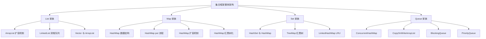
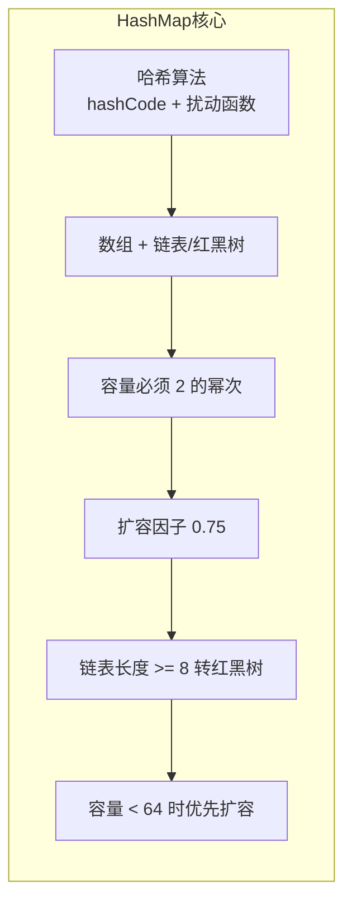

# 集合框架面试题

**目标级别**：P5 / P6

---

## 快速自测

面试前先做几道自测题，看看你能答几层：

### 🔴 HashMap 相关（8 题）

| 序号 | 题目 | 频率 | 预计用时 |
|------|------|------|----------|
| 1 | HashMap 底层数据结构是什么？ | 🔴 高频 | 3 分钟 |
| 2 | HashMap put 流程是怎样的？ | 🔴 高频 | 5 分钟 |
| 3 | HashMap 的哈希算法是怎样的？扰动函数有什么用？ | 🔴 高频 | 5 分钟 |
| 4 | HashMap 什么时候会扩容？扩容机制是什么？ | 🔴 高频 | 5 分钟 |
| 5 | HashMap 什么时候会转为红黑树？为什么？ | 🔴 高频 | 5 分钟 |
| 6 | HashMap 为什么是线程不安全的？会有哪些表现？ | 🔴 高频 | 5 分钟 |
| 7 | HashMap 与 Hashtable 有什么区别？ | 🟡 中频 | 3 分钟 |
| 8 | HashSet 和 HashMap 是什么关系？ | 🟡 中频 | 3 分钟 |

### 🔴 ConcurrentHashMap 相关（5 题）

| 序号 | 题目 | 频率 | 预计用时 |
|------|------|------|----------|
| 9 | JDK7 的 ConcurrentHashMap 是怎么保证线程安全的？ | 🔴 高频 | 5 分钟 |
| 10 | JDK8 的 ConcurrentHashMap 用了什么方案？ | 🔴 高频 | 5 分钟 |
| 11 | ConcurrentHashMap put 流程是怎样的？ | 🔴 高频 | 5 分钟 |
| 12 | ConcurrentHashMap 是怎么扩容的？ | 🟡 中频 | 5 分钟 |
| 13 | ConcurrentHashMap 的 size 方法是怎么实现的？ | 🟡 中频 | 5 分钟 |

### 🔴 集合对比（5 题）

| 序号 | 题目 | 频率 | 预计用时 |
|------|------|------|----------|
| 14 | ArrayList 和 LinkedList 有什么区别？ | 🔴 高频 | 5 分钟 |
| 15 | ArrayList 扩容机制是怎样的？ | 🟡 中频 | 5 分钟 |
| 16 | Vector 和 ArrayList 有什么区别？ | 🟡 中频 | 3 分钟 |
| 17 | LinkedList 是怎么实现双端队列的？ | 🟡 中频 | 5 分钟 |
| 18 | ArrayDeque 和 LinkedList 有什么区别？ | 🟡 中频 | 5 分钟 |

### 🟡 线程安全集合（5 题）

| 序号 | 题目 | 频率 | 预计用时 |
|------|------|------|----------|
| 19 | CopyOnWriteArrayList 是怎么保证线程安全的？ | 🟡 中频 | 5 分钟 |
| 20 | ConcurrentLinkedQueue 是怎么实现的？ | 🟢 低频 | 5 分钟 |
| 21 | BlockingQueue 有哪些实现类？有什么区别？ | 🟡 中频 | 5 分钟 |
| 22 | fail-fast 和 fail-safe 是什么？有什么区别？ | 🔴 高频 | 5 分钟 |
| 23 | 集合遍历时删除元素会出什么问题？怎么解决？ | 🔴 高频 | 5 分钟 |

### 🟡 工具类与接口（5 题）

| 序号 | 题目 | 频率 | 预计用时 |
|------|------|------|----------|
| 24 | PriorityQueue 是怎么实现的？ | 🟢 低频 | 5 分钟 |
| 25 | TreeMap 是怎么实现的？ | 🟡 中频 | 5 分钟 |
| 26 | LinkedHashMap 怎么实现 LRU 缓存？ | 🟡 中频 | 5 分钟 |
| 27 | Comparable 和 Comparator 有什么区别？ | 🟡 中频 | 5 分钟 |
| 28 | Collections 和 Arrays 工具类有哪些常用方法？ | 🟢 低频 | 3 分钟 |

### 🟢 架构理解（1 题）

| 序号 | 题目 | 频率 | 预计用时 |
|------|------|------|----------|
| 29 | 能不能画一下 Java 集合框架的整体架构图？ | 🟡 中频 | 5 分钟 |

---

## 学习路径

建议按以下顺序学习：

---

## 核心知识点速览

### HashMap 核心要点

### ConcurrentHashMap 版本对比

| 对比维度 | JDK7 | JDK8 |
|---------|------|------|
| 数据结构 | Segment 数组 + HashEntry 数组 + 链表 | Node 数组 + 链表/红黑树 |
| 并发控制 | ReentrantLock 分段锁 | CAS + synchronized |
| 并发度 | 16（Segment 个数固定） | 可动态扩展 |
| 初始化 | 昂贵（需初始化所有 Segment） | 懒加载 + CAS |
| 查询 get() | 无锁（volatile） | 无锁（volatile） |

---

## 面试官怎么说

### HashMap 是永远的热门

面试官：「HashMap 是 Java 面试中出现频率最高的集合类，没有之一。我一般会从 put 流程开始问，然后追���扩容、红黑树、线程安全……能答到第三层的候选人已经不多了。」

### 线程安全是重灾区

面试官：「很多候选人知道 HashMap 是线程不安全的，但问具体怎么不安全、什么场景下会出问题，就答不上来了。这就是没有理解底层原理的表现。」

### 对比是加分项

面试官：「如果能主动说出 ArrayList vs LinkedList 的选择策略、HashMap vs Hashtable 的历史原因，那肯定是加分的。说明你不只是背答案，而是真正理解这些设计的 trade-off。」

---

## 开始学习

- [HashMap 底层数据结构](/questions/collection/hashmap-structure)
- [HashMap put 流程](/questions/collection/hashmap-put)
- [HashMap 扩容机制](/questions/collection/hashmap-resize)
- [ConcurrentHashMap JDK7 分段锁](/questions/collection/concurrent-hashmap-jdk7)
- [ConcurrentHashMap JDK8 CAS+synchronized](/questions/collection/concurrent-hashmap-jdk8)
- [ArrayList 与 LinkedList 对比](/questions/collection/list-comparison)
- [fail-fast 与 fail-safe](/questions/collection/fail-fast)
