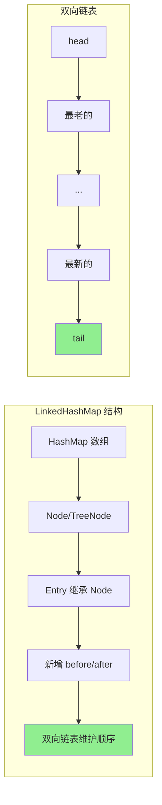
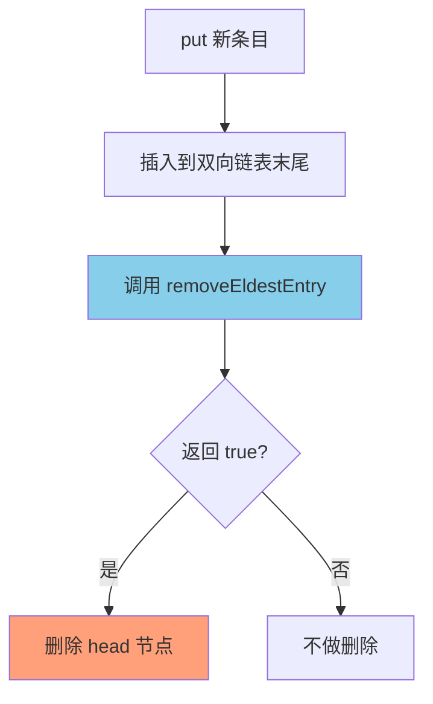
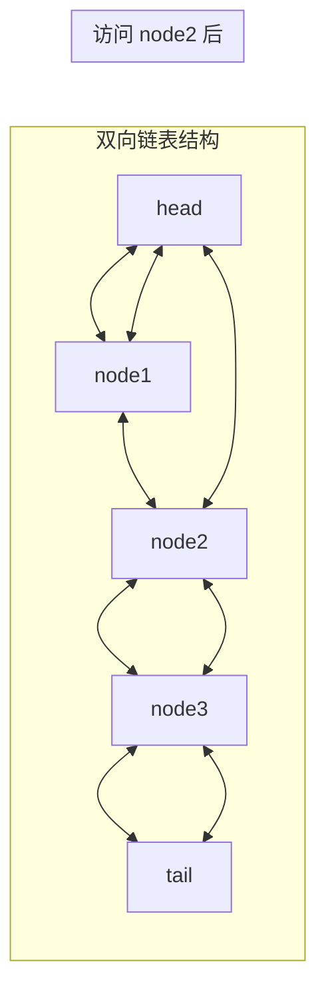
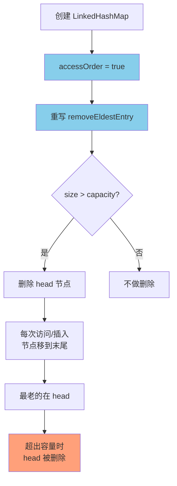

# LinkedHashMap 实现 LRU

**目标级别**：P5 / P6

---

## 快速自测

面试官问：「LinkedHashMap 怎么实现 LRU 缓存？为什么 LinkedHashMap 能保持插入顺序或访问顺序？」

---

## 一、核心问题

### 🔴 LinkedHashMap 和 HashMap 有什么区别？

**LinkedHashMap = HashMap + 双向链表**

```java
// LinkedHashMap.Entry 继承 HashMap.Node
static class Entry<K,V> extends HashMap.Node<K,V> {
    Entry<K,V> before, after;  // 双向链表指针
}

// LinkedHashMap 额外维护
transient LinkedHashMap.Entry<K,V> head;  // 头节点（最老的）
transient LinkedHashMap.Entry<K,V> tail;  // 尾节点（最新的）
```



---

## 二、插入顺序 vs 访问顺序

### 🔴 什么决定了 LinkedHashMap 的迭代顺序？

**构造函数中的 `accessOrder` 参数**：

```java
// LinkedHashMap 构造函数
public LinkedHashMap(int initialCapacity, float loadFactor, boolean accessOrder) {
    super(initialCapacity, loadFactor);
    this.accessOrder = accessOrder;
}

// 继承 HashMap 的无参构造
public LinkedHashMap() {
    super();
    this.accessOrder = false;  // 默认是插入顺序
}
```

| accessOrder | 迭代顺序 | 说明 |
|-------------|---------|------|
| `false`（默认） | **插入顺序** | 先插入的在前面 |
| `true` | **访问顺序** | 每次访问（get/put）会把节点移到末尾 |

---

## 三、LRU 实现原理

### 🔴 如何用 LinkedHashMap 实现 LRU？

**三步走**：

1. **创建 LinkedHashMap，设置 accessOrder = true**
2. **重写 `removeEldestEntry` 方法**
3. **使用 `LinkedHashMap` 而非普通 Map**

```java
// LRU 缓存实现
public class LRUCache<K, V> extends LinkedHashMap<K, V> {

    private final int capacity;

    public LRUCache(int capacity) {
        // accessOrder = true：访问顺序（每次访问移到末尾）
        super(capacity, 0.75f, true);
        this.capacity = capacity;
    }

    // 当最老的条目被访问时，如果返回 true，就会被删除
    @Override
    protected boolean removeEldestEntry(Map.Entry<K, V> eldest) {
        return size() > capacity;
    }

    public static void main(String[] args) {
        LRUCache<String, Integer> cache = new LRUCache<>(3);
        
        cache.put("A", 1);
        cache.put("B", 2);
        cache.put("C", 3);
        
        System.out.println(cache);  // {A=1, B=2, C=3}
        
        cache.get("A");  // 访问 A
        
        cache.put("D", 4);  // 插入 D，淘汰 B
        
        System.out.println(cache);  // {A=1, C=3, D=4}
        // B 被淘汰了！因为 B 是最久未访问的
    }
}
```

### 💡 removeEldestEntry 详解

```java
// LinkedHashMap 中的方法
protected boolean removeEldestEntry(Map.Entry<K,V> eldest) {
    return false;  // 默认不删除任何条目
}
```

**调用时机**：每次 `put` 或 `putAll` 时，在插入新条目**之后**，会调用此方法。



---

## 四、源码解析

### LinkedHashMap 的 put 方法

LinkedHashMap **没有重写 put 方法**，但重写了 `afterNodeInsertion` 和 `afterNodeAccess`：

```java
// LinkedHashMap.afterNodeAccess
void afterNodeAccess(Node<K,V> e) {
    LinkedHashMap.Entry<K,V> last;
    // 如果 accessOrder=true 且当前节点不是尾节点
    if (accessOrder && (last = tail) != e) {
        LinkedHashMap.Entry<K,V> p =
            (LinkedHashMap.Entry<K,V>)e, b = p.before, a = p.after;
        p.after = null;
        if (b == null)
            head = a;
        else
            b.after = a;
        if (a != null)
            a.before = b;
        else
            last = b;
        // 将当前节点移到末尾
        last.after = p;
        p.before = last;
        tail = p;
    }
}

// LinkedHashMap.afterNodeInsertion
void afterNodeInsertion(boolean evict) {
    LinkedHashMap.Entry<K,V> first;
    // 如果需要删除最老的条目
    if (evict && (first = head) != null && removeEldestEntry(first)) {
        K key = first.key;
        removeNode(hash(key), key, null, false, true);
    }
}
```

### 💡 双向链表维护



---

## 五、LRU 完整实现

### 线程安全版本

```java
public class ThreadSafeLRUCache<K, V> extends LinkedHashMap<K, V> {

    private final int capacity;
    private final Lock lock = new ReentrantLock();

    public ThreadSafeLRUCache(int capacity) {
        super(16, 0.75f, true);
        this.capacity = capacity;
    }

    @Override
    protected boolean removeEldestEntry(Map.Entry<K, V> eldest) {
        return size() > capacity;
    }

    @Override
    public V get(Object key) {
        lock.lock();
        try {
            return super.get(key);
        } finally {
            lock.unlock();
        }
    }

    @Override
    public V put(K key, V value) {
        lock.lock();
        try {
            return super.put(key, value);
        } finally {
            lock.unlock();
        }
    }

    @Override
    public void clear() {
        lock.lock();
        try {
            super.clear();
        } finally {
            lock.unlock();
        }
    }
}
```

### 💡 为什么用 LinkedHashMap 而不是 HashMap？

| 特性 | HashMap | LinkedHashMap |
|------|---------|----------------|
| 迭代顺序 | 不确定 | 插入顺序或访问顺序 |
| 额外开销 | 无 | 每个节点多两个指针 |
| 适用场景 | 只关心快速查找 | 需要维护顺序 |

---

## 六、手写 LRU 代码题

### 题目要求

```java
/**
 * 使用 LinkedHashMap 实现 LRU 缓存
 * 
 * 思路：
 * 1. 继承 LinkedHashMap
 * 2. 设置 accessOrder = true（访问顺序）
 * 3. 重写 removeEldestEntry
 */
public class LRUCache<K, V> extends LinkedHashMap<K, V> {
    
    private final int capacity;
    
    public LRUCache(int capacity) {
        // 初始容量设为 capacity + 1，避免每次 put 都触发 removeEldestEntry
        super((int) Math.ceil(capacity / 0.75) + 1, 0.75f, true);
        this.capacity = capacity;
    }
    
    @Override
    protected boolean removeEldestEntry(Map.Entry<K, V> eldest) {
        return size() > capacity;
    }
    
    public static void main(String[] args) {
        LRUCache<String, Integer> cache = new LRUCache<>(2);
        
        cache.put("A", 1);    // A
        cache.put("B", 2);    // A -> B
        cache.get("A");       // B -> A（访问 A）
        cache.put("C", 3);    // 淘汰 B（A -> C）
        
        System.out.println(cache.keySet());  // [A, C]
    }
}
```

### ⚠️ 常见错误

| 错误 | 错误写法 | 正确写法 |
|------|---------|----------|
| accessOrder | `false`（默认） | `true` |
| removeEldestEntry | 不重写 | 重写并返回 `size() > capacity` |
| 初始容量 | `capacity` | `(int) Math.ceil(capacity / 0.75) + 1` |

---

## 七、面试题精讲

### 🔴 第一层：LinkedHashMap 怎么实现 LRU？

> **参考答案**：
>
> LinkedHashMap 通过 `accessOrder = true` 开启访问顺序，每次访问（get/put）都会把节点移到双向链表末尾。重写 `removeEldestEntry` 方法返回 `size() > capacity`，这样当插入新元素且超过容量时，最老的元素（head）会被自动删除。

### 🟡 第二层：LinkedHashMap 和 HashMap 有什么区别？

> **参考答案**：
>
> LinkedHashMap 继承 HashMap，但额外维护了一个双向链表。区别有：
> 1. LinkedHashMap 维护插入顺序或访问顺序，HashMap 不保证顺序
> 2. LinkedHashMap 的每个节点多了 before 和 after 指针
> 3. LinkedHashMap 重写了 `newNode`、`afterNodeAccess`、`afterNodeInsertion` 等方法

### 💡 第三层：为什么 LinkedHashMap 要维护双向链表而不是单向链表？

> **参考答案**：
>
> 双向链表便于在 O(1) 时间内：
> 1. 删除任意节点（单向需要遍历找到前驱）
> 2. 在链表头部插入节点（LRU 需要删除最老的）
> 3. 在链表尾部插入节点（最新访问的）
>
> 如果用单向链表，删除 head 需要 O(n) 遍历找到前驱，LRU 操作就变慢了。

### ⚠️ 面试官挖坑点

| 陷阱 | 错误回答 | 正确回答 |
|------|---------|----------|
| 「accessOrder 默认是 true」 | 搞混默认值 | 默认是 false（插入顺序） |
| 「removeEldestEntry 每次 put 前检查」 | 搞混检查时机 | 是在 put 之后检查 |
| 「LinkedHashMap 比 HashMap 快」 | 不了解额外开销 | LinkedHashMap 多了指针维护，慢一点 |

---

## 八、对比表格

| 特性 | HashMap | LinkedHashMap（插入顺序） | LinkedHashMap（访问顺序） |
|------|---------|--------------------------|--------------------------|
| 迭代顺序 | 不确定 | 插入顺序 | 访问顺序 |
| get 操作 | 不影响结构 | 不影响结构 | 移动到末尾 |
| put 操作 | 不影响其他 | 不影响其他 | 可能移动 |
| 额外开销 | 无 | before/after 指针 | before/after 指针 |
| LRU 实现 | 不支持 | 不支持 | 支持 |

---

## 九、总结

**LinkedHashMap 实现 LRU 核心要点**：



1. **accessOrder = true**：开启访问顺序
2. **双向链表**：维护节点顺序，支持 O(1) 删除 head
3. **removeEldestEntry**：返回 true 时删除最老节点
4. **每次访问**：节点自动移到末尾

---

## 延伸思考

> **追问**：除了 LinkedHashMap，还有什么方式可以实现 LRU？

1. **手写双向链表 + HashMap**：类似 LinkedHashMap 的实现
2. **Guava Cache**：`CacheBuilder.newBuilder().maximumSize(n).build()`
3. **Redis**：本身就是 LRU 实现
4. **LeetCode 146 LRU 缓存**：面试常考题

核心思想都是：**维护访问顺序 + 淘汰最老数据**。
