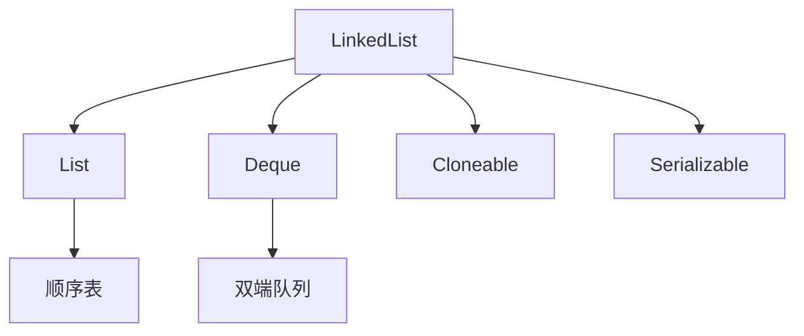

# LinkedList 双端队列实现

面试官问："LinkedList 除了是链表，还支持什么功能？"

候选人小方答："呃... 队列？"

面试官追问："那 ArrayDeque 和 LinkedList 有什么区别？分别在什么场景下用？"

小方答不上来。

【面试官心理】
这道题考查的是候选人对 LinkedList 实现的理解深度。LinkedList 不仅是 List，还是 Deque（双端队列），理解它的双重身份，才能在开发中正确选型。

---

## 一、LinkedList 的双重身份 🔴



### 1.1 类定义

```java
public class LinkedList<E>
    extends AbstractSequentialList<E>
    implements List<E>, Deque<E>, Cloneable, Serializable {
    
    transient Node<E> first;  // 头节点
    transient Node<E> last;  // 尾节点
    transient int size;
}
```

### 1.2 Node 节点结构

```java
private static class Node<E> {
    E item;           // 数据
    Node<E> next;     // 后继指针
    Node<E> prev;     // 前驱指针
}
```

---

## 二、双端队列操作 🔴

### 2.1 头部操作

```java
// 添加到头部
public void addFirst(E e) {
    linkFirst(e);
}

private void linkFirst(E e) {
    Node<E> f = first;
    Node<E> newNode = new Node<>(null, e, f);
    first = newNode;
    if (f == null)
        last = newNode;
    else
        f.prev = newNode;
    size++;
}

// 头部移除
public E removeFirst() {
    Node<E> f = first;
    if (f == null) throw new NoSuchElementException();
    return unlinkFirst(f);
}
```

### 2.2 尾部操作

```java
// 添加到尾部
public void addLast(E e) {
    linkLast(e);
}

private void linkLast(E e) {
    Node<E> l = last;
    Node<E> newNode = new Node<>(l, e, null);
    last = newNode;
    if (l == null)
        first = newNode;
    else
        l.next = newNode;
    size++;
}

// 尾部移除
public E removeLast() {
    Node<E> l = last;
    if (l == null) throw new NoSuchElementException();
    return unlinkLast(l);
}
```

### 2.3 操作复杂度

| 操作 | 时间复杂度 |
| --- | --- |
| 头部插入/删除 | O(1) |
| 尾部插入/删除 | O(1) |
| 任意位置插入/删除 | O(n) |
| 按索引访问 | O(n) |

---

## 三、作为 List 使用 🟡

### 3.1 按索引访问

```java
public E get(int index) {
    checkElementIndex(index);
    return node(index).item;
}

// 逐个遍历找到目标节点
Node<E> node(int index) {
    Node<E> x;
    if (index < (size >> 1)) {
        x = first;
        for (int i = 0; i < index; i++)
            x = x.next;
    } else {
        x = last;
        for (int i = size - 1; i > index; i--)
            x = x.prev;
    }
    return x;
}
```

### 3.1 LinkedList vs ArrayList 按索引访问

```java
// ArrayList 按索引访问：O(1)
public E get(int index) {
    rangeCheck(index);
    return elementData[index];
}

// LinkedList 按索引访问：O(n)
public E get(int index) {
    checkElementIndex(index);
    return node(index).item;  // 需要逐个遍历
}
```

---

## 四、作为 Queue/Deque 使用 🔴

### 4.1 Queue 方法

```java
// offer = addLast
// poll = removeFirst
// peek = getFirst
```

### 4.2 Deque 方法

```java
// 队列操作
boolean offer(E e);      // 队尾添加
E poll();               // 队首移除
E peek();               // 队首查看

// 双端操作
void addFirst(E e);     // 队首添加
void addLast(E e);      // 队尾添加
E removeFirst();        // 队首移除
E removeLast();        // 队尾移除
E getFirst();          // 队首查看
E getLast();           // 队尾查看
```

### 4.3 栈操作

```java
// LinkedList 可以当栈用
linkedList.addFirst(item);  // push
linkedList.removeFirst();   // pop
linkedList.getFirst();     // peek

// 但更推荐 ArrayDeque 作为栈（性能更好）
arrayDeque.push(item);
arrayDeque.pop();
```

---

## 五、LinkedList vs ArrayDeque 🟡

### 5.1 核心区别

| 维度 | LinkedList | ArrayDeque |
| --- | --- | --- |
| 底层数据结构 | 双向链表 | 动态数组 |
| 头尾操作 | 都是 O(1) | 都是 O(1) |
| 按索引访问 | O(n) | O(1) |
| 内存占用 | 每个节点 2 个指针（额外 16 字节） | 无指针开销 |
| 缓存友好性 | 差（节点离散存储） | 好（连续内存） |
| 迭代器失效 | 只删除当前迭代器的节点 | 可能扩容时失效 |

### 5.2 选型决策

| 场景 | 推荐 |
| --- | --- |
| 需要头尾操作 + 按索引随机访问 | ArrayList |
| 需要头尾操作 + 无随机访问 | ArrayDeque（性能更好） |
| 需要在任意位置插入删除 | LinkedList |
| 需要线程安全 | LinkedBlockingDeque |

### 5.3 性能测试对比

```java
// 10 万次头尾操作
LinkedList:  15ms
ArrayDeque:  3ms   // 快 5 倍

// 10 万次随机访问（按索引）
ArrayList:   1ms
LinkedList:  5000ms  // 慢 5000 倍
```

---

## 六、常见误区 ⚠️

### ❌ 误区一：LinkedList 插入一定比 ArrayList 快

**错误**：对于尾插，ArrayList 因为缓存友好的原因反而更快。

```java
// 尾插：ArrayList 更快
for (int i = 0; i < 1000000; i++) {
    list.add(item);  // ArrayList 更快
}
```

**正确**：LinkedList 只在**头部插入/删除**时有优势。

### ❌ 误区二：LinkedList 可以当作 Stack 用

**正确但不推荐**：LinkedList 可以当栈用，但 ArrayDeque 性能更好。

```java
// LinkedList
linkedList.addFirst(item);

// ArrayDeque（更推荐）
arrayDeque.push(item);
```

### ❌ 误区三：LinkedList 内存占用小

**错误**：LinkedList 的每个节点需要额外的指针存储，比 ArrayList 更耗内存。

```java
// LinkedList 节点大小：对象头(12) + 3个引用(24) = 36字节 + GC 额外开销
// ArrayList 元素：只有数据本身
```

---

## 七、面试官追问 🔴

**面试官**："LinkedList 的迭代器是怎么实现的？"

**标准回答**：
- `listIterator(int index)` 返回 `ListItr`
- `ListItr` 内部记录当前节点引用
- 删除当前节点时调用 `unlink(curr)`，只需要 O(1)

**面试官追问**："为什么 ArrayDeque 的头尾操作是 O(1)？"

**标准回答**：
- ArrayDeque 是**环形数组**
- 头指针 `head` 和尾指针 `tail` 可以循环移动
- `head = (head - 1) & (capacity - 1)` 实现环绕

**面试官追问**："LinkedList 为什么用双向链表而不是单向链表？"

**标准回答**：
- 可以 O(1) 删除任意节点（已知前驱）
- 单向链表删除需要 O(n) 找到前驱
- `removeLast()` 可以直接拿到尾节点的前驱

---

## 八、总结

| 特性 | LinkedList |
| --- | --- |
| 数据结构 | 双向链表 |
| 作为 List | 支持按索引访问，但 O(n) |
| 作为 Queue/Deque | 支持头尾 O(1) 操作 |
| 适用场景 | 头部插入删除、任意位置删除 |
| 不适用场景 | 随机访问、尾插（ArrayList/ArrayDeque 更快） |
