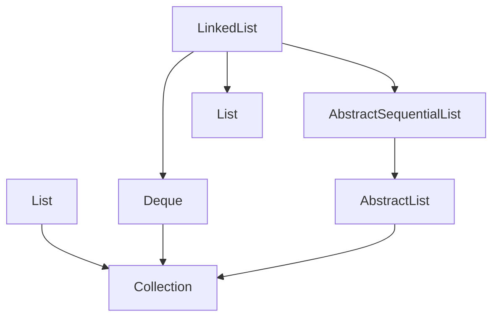
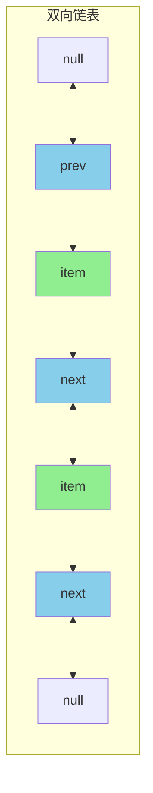
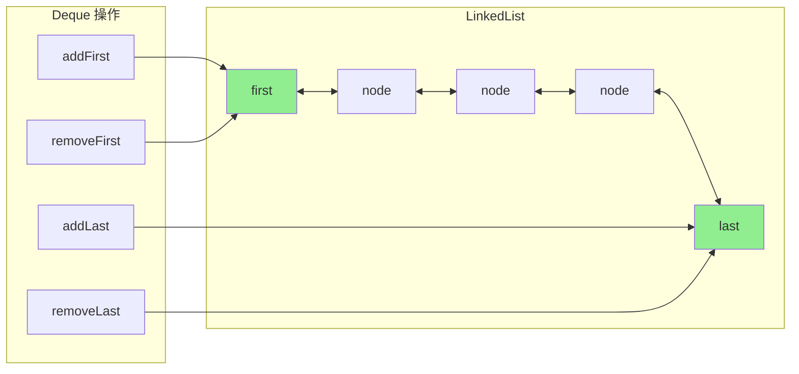

# LinkedList 双端队列实现

**目标级别**：P5 / P6

---

## 快速自测

面试官问：「LinkedList 实现了哪些接口？怎么用 LinkedList 实现栈和队列？」

---

## 一、核心问题

### 🔴 LinkedList 实现了哪些接口？

```java
public class LinkedList<E>
    extends AbstractSequentialList<E>
    implements List<E>, Deque<E>, Cloneable, Serializable {

    transient Node<E> first;
    transient Node<E> last;
    private int size = 0;
}
```

### 接口层级



---

## 二、节点结构

### 🔴 Node 节点

```java
private static class Node<E> {
    E item;
    Node<E> next;
    Node<E> prev;
}
```



---

## 三、双端队列操作

### 🔴 头部操作

```java
// 在头部插入
public void addFirst(E e) {
    linkFirst(e);
}

private void linkFirst(E e) {
    final Node<E> f = first;
    final Node<E> newNode = new Node<>(null, e, f);
    first = newNode;
    if (f == null)
        last = newNode;
    else
        f.prev = newNode;
    size++;
    modCount++;
}

// 头部删除
public E removeFirst() {
    final Node<E> f = first;
    if (f == null)
        throw new NoSuchElementException();
    return unlinkFirst(f);
}
```

### 🔴 尾部操作

```java
// 在尾部插入
public void addLast(E e) {
    linkLast(e);
}

void linkLast(E e) {
    final Node<E> l = last;
    final Node<E> newNode = new Node<>(l, e, null);
    last = newNode;
    if (l == null)
        first = newNode;
    else
        l.next = newNode;
    size++;
    modCount++;
}
```

---

## 四、栈和队列

### 🔴 用 LinkedList 实现栈

```java
// LinkedList 作为栈
LinkedList<Integer> stack = new LinkedList<>();

// push = addFirst
stack.push(1);
stack.push(2);
stack.push(3);

// pop = removeFirst
int top = stack.pop();  // 3
top = stack.pop();      // 2

// peek = getFirst
top = stack.peek();     // 1
```

### 🔴 用 LinkedList 实现队列

```java
// LinkedList 作为队列（FIFO）
LinkedList<Integer> queue = new LinkedList<>();

// offer = addLast
queue.offer(1);
queue.offer(2);
queue.offer(3);

// poll = removeFirst
int head = queue.poll();  // 1
head = queue.poll();       // 2

// peek = getFirst
head = queue.peek();       // 3
```

### 💡 操作对应表

| 栈操作 | LinkedList 方法 | 队列操作 | LinkedList 方法 |
|-------|---------------|---------|---------------|
| push | addFirst / push | offer | addLast / offer |
| pop | removeFirst / pop | poll | removeFirst / poll |
| peek | getFirst / peek | peek | getFirst / peek |

---

## 五、Deque 接口方法

### 🔴 完整方法列表

```java
// Deque 接口方法
public interface Deque<E> extends Queue<E> {
    // 头部操作
    void addFirst(E e);
    void offerFirst(E e);
    E getFirst();
    E peekFirst();
    E removeFirst();
    E pollFirst();
    
    // 尾部操作
    void addLast(E e);
    void offerLast(E e);
    E getLast();
    E peekLast();
    E removeLast();
    E pollLast();
    
    // 栈方法
    void push(E e);
    E pop();
    
    // 删除第一个出现的元素
    boolean removeFirstOccurrence(Object o);
    boolean removeLastOccurrence(Object o);
}
```

---

## 六、面试题精讲

### 🔴 第一层：LinkedList 怎么实现双端队列的？

> **参考答案**：
>
> LinkedList 内部维护了 first 和 last 两个指针分别指向头尾节点：
> 1. addFirst：在头部插入新节点，更新 first
> 2. addLast：在尾部插入新节点，更新 last
> 3. removeFirst：移除头节点，更新 first
> 4. removeLast：移除尾节点，更新 last
>
> 双向链表的头尾操作都是 O(1)，所以 LinkedList 可以高效地实现双端队列。

### 🟡 第二层：ArrayList 能不能实现栈或队列？

> **参考答案**：
>
> ArrayList 可以实现，但效率不高：
> 1. **栈**：用 add/pop 可以实现，但 pop 需要删除最后一个元素（O(1)），勉强可用
> 2. **队列**：用 add/poll 可以实现，poll 需要删除第一个元素（O(n)），效率低
>
> 建议使用 LinkedList 或专门的 Deque 实现（如 ArrayDeque）。

### ⚠️ 面试官挖坑点

| 陷阱 | 错误回答 | 正确回答 |
|------|---------|----------|
| 「LinkedList 只实现了 List」 | 忽略了 Deque | 还实现了 Deque 接口 |
| 「LinkedList 头部插入很慢」 | 搞混了 | 双向链表头部插入是 O(1) |
| 「ArrayList 适合做队列」 | 不了解复杂度 | 头部操作是 O(n)，不适合 |

---

## 七、总结

**LinkedList 双端队列核心要点**：



1. **双向链表**：first 和 last 两个指针
2. **头部/尾部操作**：都是 O(1)
3. **实现 Deque**：支持栈和队列操作
4. **方法对应**：push=addFirst，offer=addLast
