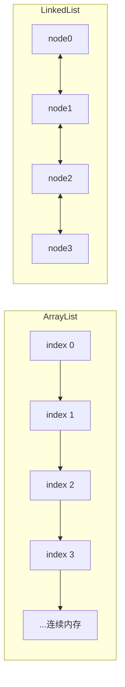
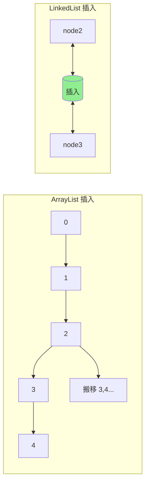
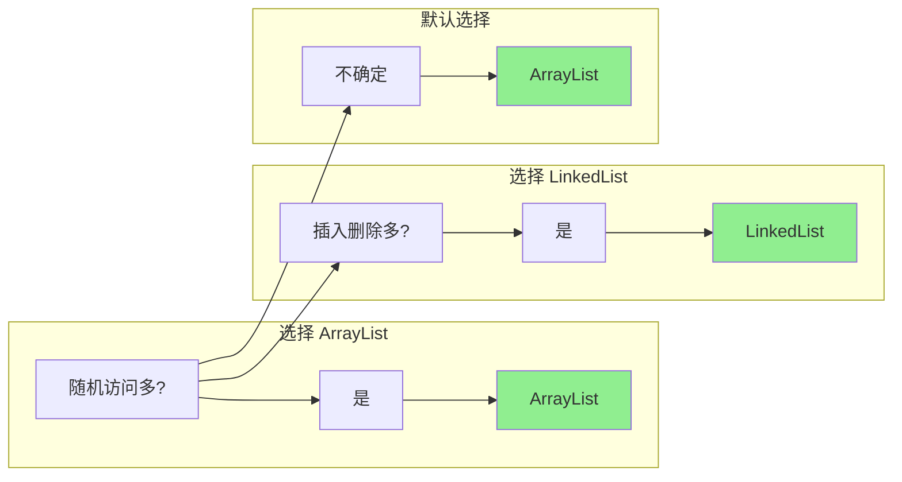

# ArrayList 与 LinkedList 对比

**目标级别**：P5 / P6

---

## 快速自测

面试官问：「ArrayList 和 LinkedList 有什么区别？什么时候用 ArrayList？什么时候用 LinkedList？」

---

## 一、核心问题

### 🔴 ArrayList 和 LinkedList 底层数据结构是什么？

| 容器 | 底层结构 | 特点 |
|------|---------|------|
| ArrayList | **动态数组** | 连续内存，随机访问快 |
| LinkedList | **双向链表** | 节点不连续，插入删除快 |



---

## 二、操作复杂度对比

### 🔴 各操作时间复杂度

| 操作 | ArrayList | LinkedList |
|------|-----------|------------|
| get(index) | O(1) | O(n) |
| add(E) | 均摊 O(1) | O(1) |
| add(index, E) | O(n) | O(1) |
| remove(index) | O(n) | O(1) |
| remove(E) | O(n) | O(n) |
| iterator.remove() | O(1) | O(1) |

### ⚠️ add(E) 的区别

```java
// ArrayList：尾部添加
list.add("A");  // 均摊 O(1)，偶尔扩容

// LinkedList：尾部添加
list.add("A");  // O(1)
```

**ArrayList 的均摊复杂度**：虽然扩容是 O(n)，但扩容发生的频率很低，均摊下来每次 add 是 O(1)。

---

## 三、随机访问对比

### 🔴 为什么 ArrayList 随机访问快？

```java
// ArrayList.get
public E get(int index) {
    rangeCheck(index);
    return elementData(index);
}

private E elementData(int index) {
    return (E) elementData[index];  // 直接按索引访问
}

// LinkedList.get
public E get(int index) {
    return node(index).item;  // 需要遍历找到节点
}

Node<E> node(int index) {
    // 优化：判断从头还是从尾遍历
    if (index < (size >> 1)) {
        Node<E> x = first;
        for (int i = 0; i < index; i++)
            x = x.next;
        return x;
    } else {
        Node<E> x = last;
        for (int i = size - 1; i > index; i--)
            x = x.prev;
        return x;
    }
}
```

### 💡 CPU 缓存友好性

```mermaid
flowchart LR
    subgraph ArrayList（连续内存）
        A[CPU 缓存] --> B[读取 0-63]
        B --> C[预取 64 字节]
        C --> D[index 0 命中]
        D --> E[index 1 命中]
        E --> F[index 2 命中]
    end
    
    subgraph LinkedList（分散内存）
        G[CPU 缓存] --> H[读取 node0]
        H --> I[跟随指针到 node1]
        I --> J[node1 不在缓存]
        J --> K[再次读取]
    end
```

ArrayList 的连续内存让 CPU 缓存可以**预取**多个元素，而 LinkedList 的节点是分散的，缓存命中率低。

---

## 四、插入删除对比

### 🔴 中间插入删除

```java
// ArrayList 中间插入
list.add(5, element);  // 需要搬移后面的元素，O(n)

// LinkedList 中间插入
list.add(5, element);  // 只需修改前后指针，O(1)
```



---

## 五、内存占用

### 💡 LinkedList 额外开销

```java
// LinkedList 节点结构
private static class Node<E> {
    E item;           // 数据
    Node<E> next;     // 下一个指针
    Node<E> prev;     // 上一个指针
}
```

**每个节点额外存储 2 个指针（16 字节）**，而 ArrayList 只需要存储数据。

| 元素数量 | ArrayList 内存 | LinkedList 内存 |
|---------|---------------|----------------|
| 1000 | ~8KB | ~40KB |
| 10000 | ~80KB | ~400KB |

---

## 六、迭代器对比

### 🔴 迭代器删除

```java
// ArrayList：iterator.remove() 是 O(1)
ListIterator<E> it = list.listIterator();
while (it.hasNext()) {
    if (condition) {
        it.remove();  // O(1)，直接前移元素
    }
}

// LinkedList：iterator.remove() 是 O(1)
ListIterator<E> it = linkedList.listIterator();
while (it.hasNext()) {
    if (condition) {
        it.remove();  // O(1)，直接修改指针
    }
}
```

**注意**：普通 remove(Object) 方法，ArrayList 是 O(n)，LinkedList 需要遍历找元素也是 O(n)。

---

## 七、选型建议

### 🔴 什么时候用 ArrayList？

| 场景 | 原因 |
|------|------|
| 随机访问多 | O(1) 随机访问 |
| 尾部操作多 | 均摊 O(1) |
| 内存敏感 | 连续内存，无额外指针开销 |
| 需要数组 | toArray() 返回真实数组 |

### 🔴 什么时候用 LinkedList？

| 场景 | 原因 |
|------|------|
| 中间插入删除多 | O(1) 插入删除 |
| 栈/队列/双端队列 | Deque 接口实现 |
| 大数据量插入删除 | 无扩容开销 |

---

## 八、面试题精讲

### 🔴 第一层：ArrayList 和 LinkedList 有什么区别？

> **参考答案**：
>
> 主要区别：
> 1. **底层结构**：ArrayList 是动态数组，LinkedList 是双向链表
> 2. **随机访问**：ArrayList 是 O(1)，LinkedList 是 O(n)
> 3. **插入删除**：ArrayList 是 O(n)，LinkedList 是 O(1)
> 4. **内存占用**：ArrayList 只需存储数据，LinkedList 额外存储前后指针
> 5. **CPU 缓存**：ArrayList 缓存友好，LinkedList 缓存命中率低

### 🟡 第二层：为什么 ArrayList 随机访问快？

> **参考答案**：
>
> 因为 ArrayList 底层是连续内存的数组：
> 1. 元素在内存中连续排列
> 2. CPU 缓存可以预取多个元素
> 3. `arr[index]` 直接用 `baseAddress + index * elementSize` 计算地址
>
> 而 LinkedList 需要从头部或尾部遍历到指定位置，且节点分散，缓存命中率低。

### 💡 第三层：什么时候应该选择 LinkedList？

> **参考答案**：
>
> 适合 LinkedList 的场景：
> 1. **大量中间插入删除**：只需修改前后指针，O(1)
> 2. **实现栈/队列/双端队列**：LinkedList 实现了 Deque 接口
> 3. **数据量大且频繁增删**：无扩容开销
>
> 但实际上，除非有明确的性能问题，ArrayList 通常是更好的选择。

### ⚠️ 面试官挖坑点

| 陷阱 | 错误回答 | 正确回答 |
|------|---------|----------|
| 「LinkedList 所有操作都快」 | 忽略了随机访问 | 随机访问是 O(n) |
| 「ArrayList 插入很慢」 | 忽略了尾部添加 | 尾部添加是均摊 O(1) |
| 「LinkedList 更省内存」 | 忽略了指针开销 | 节点需要额外存储前后指针 |

---

## 九、对比表格

| 维度 | ArrayList | LinkedList |
|------|-----------|------------|
| 底层结构 | 动态数组 | 双向链表 |
| 随机访问 | O(1) | O(n) |
| 头部插入 | O(n) | O(1) |
| 尾部插入 | 均摊 O(1) | O(1) |
| 中间插入 | O(n) | O(1) |
| 内存开销 | 小 | 大（额外指针） |
| CPU 缓存 | 友好 | 不友好 |
| 实现接口 | List | List, Deque |

---

## 十、总结

**ArrayList vs LinkedList 核心要点**：



1. **ArrayList**：连续内存，随机访问快，尾部操作多
2. **LinkedList**：节点分散，插入删除快，需要遍历
3. **实际选择**：除非有明确性能要求，默认选 ArrayList
