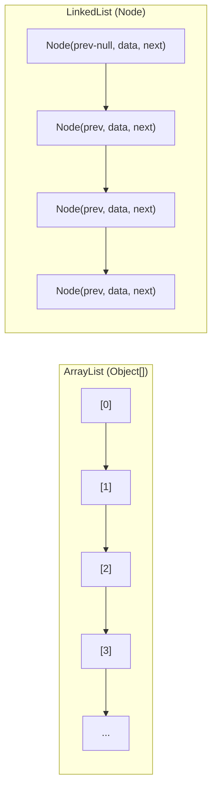

# ArrayList 与 LinkedList 对比

面试官问："ArrayList 和 LinkedList 有什么区别？"

候选人小任答："ArrayList 底层是数组，LinkedList 底层是双向链表。"

面试官点点头："那随机访问和中间插入，哪个性能更好？"

小任说："ArrayList 随机访问快，LinkedList 中间插入快。"

面试官追问："LinkedList 的中间插入真的快吗？"

小任说："是啊，因为链表插入不需要移动元素..."

面试官又问："那你估算一下，插入第 1000 个元素，ArrayList 和 LinkedList 谁更快？"

小顾答不上来了。

【面试官心理】
这道题看似简单，但 90% 的候选人不理解"链表插入快"的真实条件。能说出"需要先找到插入位置"的候选人，才能真正答对这道题。LinkedList 的 `get(i)` 是 O(n) 操作，插入前要先遍历到目标位置。

## 一、底层数据结构对比 🔴



### ArrayList

```java
public class ArrayList<E> {
    transient Object[] elementData; // 连续内存的数组
    private int size;
}
```

优点：
- 连续的内存空间，CPU 缓存友好
- 通过下标随机访问 O(1)

缺点：
- 插入/删除需要移动元素
- 扩容时需要复制整个数组

### LinkedList

```java
public class LinkedList<E> {
    transient Node<E> first;
    transient Node<E> last;
    private int size;

    private static class Node<E> {
        E item;
        Node<E> prev;
        Node<E> next;
    }
}
```

优点：
- 插入/删除不需要移动元素（如果已找到位置）
- 动态分配，无需扩容

缺点：
- 每个元素需要额外存储 prev/next 引用
- 随机访问需要从头遍历 O(n)

## 二、性能对比表 🔴

| 操作 | ArrayList | LinkedList | 原因 |
| --- | --- | --- | --- |
| 随机访问 `get(i)` | **O(1)** | O(n) | ArrayList 直接索引，LinkedList 需遍历 |
| 头部插入 `add(0, e)` | O(n)（需移动元素） | **O(1)** | ArrayList 需移动 n 个元素 |
| 尾部插入 `add(e)` | **均摊 O(1)** | **O(1)** | 两者都很快 |
| 中间插入 `add(i, e)` | O(n)（移动元素） | O(n)（查找 + 插入） | LinkedList 需要先找到位置 |
| 删除头部 | O(n) | **O(1)** | 同理 |
| 删除尾部 | **O(1)** | **O(1)** | 均摊后都很快 |
| 删除中间 | O(n) | O(n) | 同理 |
| 空间占用 | O(n)（无额外开销） | O(n)（prev+next 引用） | 链表有额外开销 |

## 三、LinkedList 插入的真实代价 🔴

### 3.1 LinkedList 中间插入的真相

```java
// LinkedList 的 add(int index, E element) 实现
public void add(int index, E element) {
    checkPositionIndex(index);
    if (index == size) {
        linkLast(element); // 尾部追加，O(1)
    } else {
        // ❌ 先找到插入位置！这是 O(n) 操作！
        Node<E> pred = node(index);
        Node<E> newNode = new Node<>(pred.prev, element, pred);
        // 插入只需要 O(1)：修改前后指针
        pred.prev.next = newNode;
        pred.prev = newNode;
    }
    size++;
}

// node(index) 遍历：
Node<E> node(int index) {
    Node<E> x = first;
    for (int i = 0; i < index; i++) {
        x = x.next; // 逐个遍历
    }
    return x;
}
```

**结论**：LinkedList 中间插入的代价 = 查找代价（O(n)）+ 插入代价（O(1)）= O(n)

### 3.2 为什么 LinkedList 查找是 O(n)

```java
// LinkedList 不支持下标直接访问
// node(500) 必须从 first 开始遍历 500 次
// 即使是双向链表，也没有变快（因为不知道从头部还是尾部更近）

// ArrayList.get(500)：elementData[500]，直接访问，O(1)
```

### 3.3 场景对比

```java
// 场景一：尾部追加 100 万个元素
ArrayList: 均摊 O(1) × 100万 = O(n)，但不需要扩容的话很快
LinkedList: O(1) × 100万 = O(n)，但每个节点需要 new，内存分配开销大

// 场景二：在第 50 万个位置插入
ArrayList: O(n) — 需要移动 50 万个元素
LinkedList: O(n) — 需要遍历 50 万次找到位置
// 两者性能相当！

// 场景三：头部插入
ArrayList: O(n) — 需要移动所有元素
LinkedList: O(1) — 只需要修改 first 指针
// LinkedList 确实更快
```

## 四、内存占用对比 🔴

```java
// ArrayList：每个元素只存储数据
Object[] elementData = new Object[1000000];
// 100万个 String 引用 = ~8MB（64位JVM）

// LinkedList：每个节点存储数据 + prev + next
// 100万个节点 = 100万 × (8 + 8 + 8) = ~24MB（三个引用）
// 是 ArrayList 的 3 倍！
```

:::warning ⚠️
LinkedList 的内存开销是 ArrayList 的 3 倍。在内存敏感场景（如 Android），这可能造成严重影响。这也是为什么阿里巴巴 Java 规约中明确"集合初始化时，指定集合初始化大小"。
:::

## 五、为什么阿里规约不推荐 LinkedList 🟡

```java
// ❌ 阿里巴巴 Java 开发规约：不推荐使用 LinkedList
List<String> list = new LinkedList<>(); // 不推荐

// ✅ 推荐：
List<String> list = new ArrayList<>(); // 推荐

// 原因：
// 1. 真实业务中，遍历、随机访问比中间插入更常见
// 2. LinkedList 的内存开销是 ArrayList 的 3 倍
// 3. LinkedList 的遍历不一定比 ArrayList 快（CPU 缓存）
// 4. LinkedList 的 GC 压力大（大量小对象）
```

### CPU 缓存的影响

```java
// ArrayList 的连续内存：
// CPU 预取（Prefetch）：访问 elementData[0] 时，CPU 可能已经预取了 elementData[1], [2], [3]
// 遍历 ArrayList 时，CPU 缓存命中率高

// LinkedList 的分散内存：
// 每个 Node 在堆中是随机分配的
// 遍历时每次访问都可能 cache miss
// 即使是 O(1) 访问，也可能有 CPU cache miss
```

## 六、选型总结 🔴

```
高频随机访问 / 遍历  → ArrayList（O(1) 随机访问，CPU 缓存友好）
仅头部插入           → LinkedList（O(1) 头部插入）
仅尾部追加（单线程）  → ArrayList（均摊 O(1)，无额外开销）
需要大量内存          → ArrayList（内存效率高 3 倍）
```

【面试官心理】
能说出"阿里规约不推荐 LinkedList"的候选人，说明有工程意识。能解释背后原因（CPU 缓存、内存开销）的，是 P6+ 的水准。
