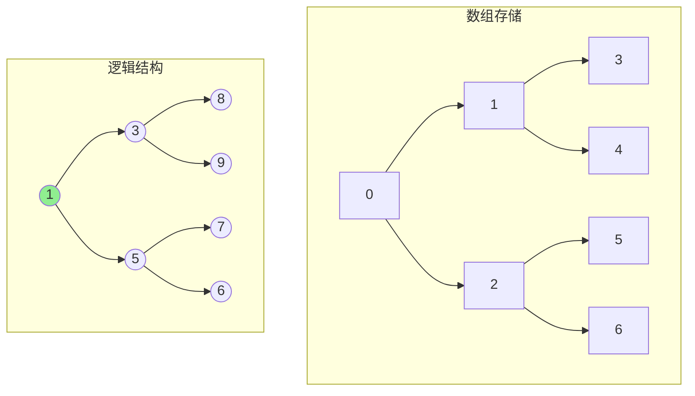
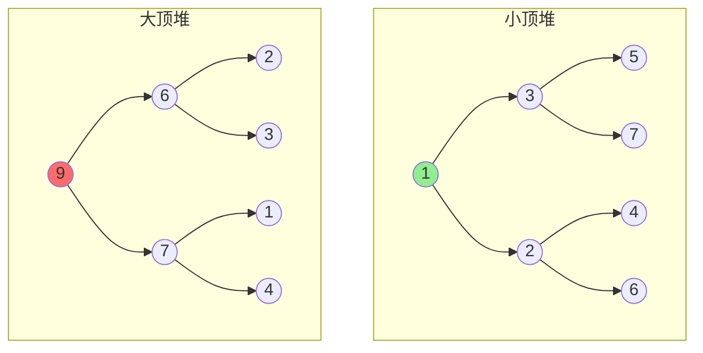
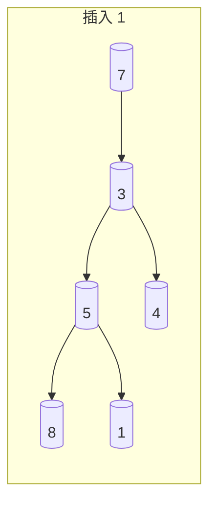
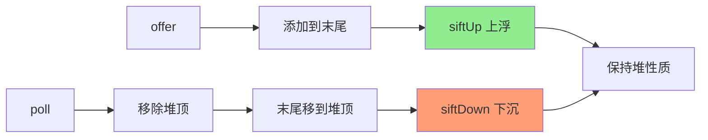

# PriorityQueue 原理

**目标级别**：P5 / P6

---

## 快速自测

面试官问：「PriorityQueue 底层是什么？元素是按什么顺序出队的？」

---

## 一、核心问题

### 🔴 PriorityQueue 底层是什么？

**小顶堆（Min-Heap）**

```java
public class PriorityQueue<E> extends AbstractQueue<E>
        implements Serializable {

    // 底层是数组实现的堆
    private transient Object[] queue;

    // 比较器
    private final Comparator<? super E> comparator;

    // 元素个数
    private int size = 0;
}
```

### 堆的存储结构



**规律**：
- 父节点索引：`(i - 1) / 2`
- 左子节点索引：`2 * i + 1`
- 右子节点索引：`2 * i + 2`

---

## 二、堆的基本性质

### 🔴 什么是堆？

**堆（Heap）**：一种完全二叉树，满足以下性质：
- **小顶堆**：父节点 `<=` 子节点，堆顶是最小元素
- **大顶堆**：父节点 >= 子节点，堆顶是最大元素



---

## 三、offer 方法

### 🔴 入队是怎么实现的？

```java
public boolean offer(E e) {
    if (e == null)
        throw new NullPointerException();
    int i = size;
    if (i >= queue.length)
        grow(i + 1);
    size = i + 1;
    if (i == 0)
        queue[0] = e;
    else
        siftUp(i, e);  // 上浮调整
    return true;
}

// 上浮：从最后一个位置开始，比较并交换，直到父节点 `<=` 新节点
private void siftUp(int k, E x) {
    if (comparator != null)
        siftUpUsingComparator(k, x);
    else
        siftUpComparable(k, x);
}
```

### 💡 上浮操作图解



**上浮过程**：
1. 插入 1 到末尾
2. 1 < 7，交换位置
3. 1 < 3，交换位置
4. 1 是堆顶，完成

---

## 四、poll 方法

### 🔴 出队是怎么实现的？

```java
public E poll() {
    if (size == 0)
        return null;
    int s = --size;
    E result = (E) queue[0];
    E x = (E) queue[s];
    queue[s] = null;
    if (s != 0)
        siftDown(0, x);  // 下沉调整
    return result;
}

// 下沉：和较小的子节点交换，直到父节点 `<=` 子节点
private void siftDown(int k, E x) {
    if (comparator != null)
        siftDownUsingComparator(k, x);
    else
        siftDownComparable(k, x);
}
```

### 💡 下沉操作图解

```mermaid
flowchart TB
    subgraph 出队前
        A((1)) --> B((3))
        A --> C[(2)]
        B --> D((7))
        B --> E((5))
    end
    
    subgraph 出队后（下沉调整）
        F((2)) --> G((3))
        F --> H((7))
        G --> I((5))
        G --> J[(空)]
    end
```

**下沉过程**：
1. 移除堆顶 1
2. 尾部元素 2 移到堆顶
3. 2 `>=` 3，交换
4. 2 `>=` 5，交换
5. 2 是叶子节点，完成

---

## 五、堆化 heapify

### 💡 批量建堆

```java
// PriorityQueue 构造时批量建堆
public PriorityQueue(Collection<? extends E> c) {
    if (c instanceof SortedSet) {
        // ...
    } else if (c instanceof PriorityQueue) {
        // ...
    } else {
        // 批量建堆：O(n)
        Object[] a = c.toArray();
        heapify(a);
    }
}

// 堆化过程：从最后一个非叶子节点开始下沉
private void heapify(Object[] a) {
    for (int i = (a.length >>> 1) - 1; i >= 0; i--)
        siftDown(a, i, a.length, (E) a[i]);
}
```

---

## 六、PriorityQueue vs Arrays.sort

### 对比

| 维度 | PriorityQueue | Arrays.sort |
|------|--------------|--------------|
| 数据结构 | 堆 | 数组 |
| 插入 | O(log n) | - |
| 获取最值 | O(1) | O(1) |
| 删除最值 | O(log n) | O(log n)（需要删除） |
| 排序全部 | O(n log n) | O(n log n) |
| 适用场景 | 动态数据流 | 静态数据 |

### 💡 选择建议

```java
// 场景1：动态获取最小值（推荐 PriorityQueue）
PriorityQueue<Integer> pq = new PriorityQueue<>();
pq.add(3);
pq.add(1);
pq.add(2);
pq.poll();  // 返回 1

// 场景2：一次性排序（推荐 Arrays.sort）
Integer[] arr = {3, 1, 2};
Arrays.sort(arr);
```

---

## 七、面试题精讲

### 🔴 第一层：PriorityQueue 底层是什么？

> **参考答案**：
>
> PriorityQueue 底层是**小顶堆（Min-Heap）**，用数组实现。堆是一种完全二叉树，父节点的值总是小于等于子节点的值，所以堆顶始终是最小元素。出队（poll）总是移除堆顶元素，入队（offer）将元素添加到末尾并上浮调整。

### 🟡 第二层：堆和普通二叉搜索树有什么区别？

> **参考答案**：
>
> 主要区别：
> 1. **结构**：堆是完全二叉树，搜索树不要求完全
> 2. **顺序**：堆只保证父节点 `<=` 子节点（最小堆），不保证左右子节点顺序；搜索树左小右大
> 3. **查找**：堆不支持快速查找任意元素（O(n)），搜索树支持（O(log n)）
> 4. **平衡**：堆天然平衡（完全二叉树），搜索树需要旋转平衡

### 💡 第三层：PriorityQueue 怎么保证元素顺序的？

> **参考答案**：
>
> 通过上浮和下沉操作：
> 1. **offer 时**：元素添加到末尾，然后上浮（siftUp）到正确位置
> 2. **poll 时**：移除堆顶，用末尾元素填充，然后下沉（siftDown）到正确位置
> 3. **每次操作后都保持堆的性质**：父节点 `<=` 子节点

### ⚠️ 面试官挖坑点

| 陷阱 | 错误回答 | 正确回答 |
|------|---------|----------|
| 「PriorityQueue 是按插入顺序排序」 | 不了解堆性质 | 按优先级（堆顶是最小/最大） |
| 「PriorityQueue 出队是有序的」 | 不了解出队顺序 | 只有堆顶出队，不是整体有序 |
| 「堆和搜索树一样」 | 不了解区别 | 堆只保证父节点 `<=` 子节点 |

---

## 八、对比表格

| 维度 | PriorityQueue | TreeSet |
|------|--------------|---------|
| 底层 | 堆 | 红黑树 |
| 元素顺序 | 不重复，堆顶优先 | 不重复，按比较器排序 |
| 添加复杂度 | O(log n) | O(log n) |
| 取最小 | O(1) | O(1)（first） |
| 有序遍历 | 无序 | 有序 |
| null 支持 | 不支持 | 需要实现 Comparable |

---

## 九、总结

**PriorityQueue 核心要点**：



1. **底层是小顶堆**：数组实现的完全二叉树
2. **offer**：添加到末尾，上浮到正确位置
3. **poll**：移除堆顶，末尾移到堆顶，下沉
4. **O(log n)**：插入和删除都是对数级别
5. **O(1)**：获取堆顶是常数级别
