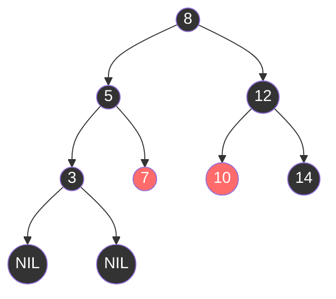
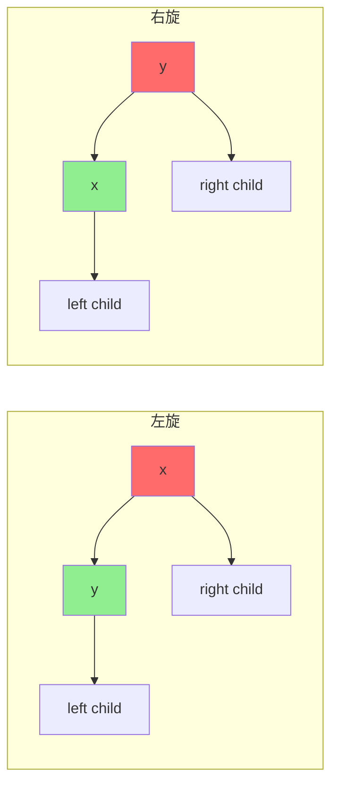

# TreeMap 与红黑树

**目标级别**：P5 / P6

---

## 快速自测

面试官问：「TreeMap 底层是什么数据结构？为什么不用其他平衡树？」

---

## 一、核心问题

### 🔴 TreeMap 底层是什么数据结构？

**红黑树（Red-Black Tree）**

```java
public class TreeMap<K,V> extends AbstractMap<K,V>
        implements NavigableMap<K,V>, Cloneable, Serializable {

    // 红黑树根节点
    private transient Entry<K,V> root;

    // 比较器
    private final Comparator<? super K> comparator;

    // 红黑树节点
    static final class Entry<K,V> implements Map.Entry<K,V> {
        K key;
        V value;
        Entry<K,V> left;
        Entry<K,V> right;
        Entry<K,V> parent;
        boolean color = BLACK;  // 默认黑色
    }
}
```

---

## 二、红黑树基本性质

### 🔴 红黑树的 5 个性质

```java
/**
 * 红黑树的性质：
 * 1. 节点是红色或黑色
 * 2. 根节点是黑色
 * 3. 叶节点（NIL）是黑色
 * 4. 红色节点的子节点都是黑色（不能有两个连续的红色）
 * 5. 从任一节点到其所有叶节点的路径上，黑高相同
 */
```



**图例**：黑色节点用深色表示，红色节点用浅色表示

---

## 三、为什么用红黑树？

### 💡 红黑树 vs AVL 树

| 对比维度 | AVL 树 | 红黑树 |
|---------|--------|--------|
| 平衡标准 | 更严格（高度差 `<=` 1） | 相对宽松 |
| 插入开销 | 大（最多 2 次旋转） | 小（最多 2 次旋转） |
| 删除开销 | 大（可能到 O(log n) 旋转） | 小（最多 3 次旋转） |
| 查询性能 | 更好（更平衡） | 稍差（高度可达 2*log(n+1)） |
| 适合场景 | 读多写少 | 读写均衡 |

### ⚠️ 为什么 TreeMap 用红黑树而不是 AVL？

1. **TreeMap 是读写均衡的**：插入和删除操作都需要平衡
2. **红黑树旋转次数少**：插入最多 2 次旋转，删除最多 3 次
3. **工程实践**：`Map` 的读写都很频繁，红黑树更合适

---

## 四、红黑树操作

### 🔴 插入操作

```java
public V put(K key, V value) {
    Entry<K,V> t = root;
    if (t == null) {
        root = new Entry<>(key, value, null);
        return null;
    }
    
    int cmp;
    Entry<K,V> parent;
    Comparator<? super K> cpr = comparator;
    
    if (cpr != null) {
        do {
            parent = t;
            cmp = cpr.compare(key, t.key);
            if (cmp < 0)
                t = t.left;
            else if (cmp > 0)
                t = t.right;
            else
                return t.setValue(value);
        } while (t != null);
    } else {
        // 使用自然排序
        // ...
    }
    
    // 创建新节点（默认红色）
    Entry<K,V> e = new Entry<>(key, value, parent);
    if (cmp < 0)
        parent.left = e;
    else
        parent.right = e;
    
    // 修复红黑树性质
    fixAfterInsertion(e);
    return null;
}
```

### 💡 插入修复

```java
// 插入修复（简化）
private void fixAfterInsertion(Entry<K,V> x) {
    x.color = RED;  // 新节点默认红色
    
    while (x != null && x != root && x.parent.color == RED) {
        if (parentOf(x) == leftOf(parentOf(parentOf(x)))) {
            // 父节点是祖父节点的左子节点
            Entry<K,V> y = rightOf(parentOf(parentOf(x)));
            if (colorOf(y) == RED) {
                // 情况1：叔叔节点是红色
                setColor(parentOf(x), BLACK);
                setColor(y, BLACK);
                setColor(parentOf(parentOf(x)), RED);
                x = parentOf(parentOf(x));
            } else {
                // 情况2：叔叔节点是黑色
                if (x == rightOf(parentOf(x))) {
                    // 需要旋转
                    x = parentOf(x);
                    rotateLeft(x);
                }
                // 情况3：重新着色
                setColor(parentOf(x), BLACK);
                setColor(parentOf(parentOf(x)), RED);
                rotateRight(parentOf(parentOf(x)));
            }
        } else {
            // 对称情况
        }
    }
    root.color = BLACK;
}
```

---

## 五、红黑树的旋转

### 左旋和右旋



### 旋转代码

```java
// 左旋
private void rotateLeft(Entry<K,V> p) {
    if (p != null) {
        Entry<K,V> r = p.right;
        p.right = r.left;
        if (r.left != null)
            r.left.parent = p;
        r.parent = p.parent;
        if (p.parent == null)
            root = r;
        else if (p.parent.left == p)
            p.parent.left = r;
        else
            p.parent.right = r;
        r.left = p;
        p.parent = r;
    }
}
```

---

## 六、TreeMap 的特点

### 🔴 有序 Map

```java
TreeMap<Integer, String> map = new TreeMap<>();
map.put(3, "C");
map.put(1, "A");
map.put(2, "B");

// 按 key 顺序遍历
map.forEach((k, v) -> System.out.println(k + "=" + v));
// 输出：1=A, 2=B, 3=C
```

### 导航方法

```java
TreeMap<String, Integer> map = new TreeMap<>();
map.put("apple", 1);
map.put("banana", 2);
map.put("cherry", 3);

// 导航方法
map.firstKey();                    // "apple"
map.lastKey();                     // "cherry"
map.lowerKey("cherry");            // "banana"
map.higherKey("apple");            // "banana"
map.floorKey("banana");            // "banana"
map.ceilingKey("banana");          // "banana"
```

---

## 七、面试题精讲

### 🔴 第一层：TreeMap 底层是什么数据结构？

> **参考答案**：
>
> TreeMap 底层是**红黑树**（Red-Black Tree），一种自平衡的二叉查找树。每个节点包含 key、value、左右子节点指针、父节点指针和颜色标记。红黑树通过着色和旋转操作保持近似平衡，保证查找、插入、删除的时间复杂度都是 O(log n)。

### 🟡 第二层：红黑树有哪些性质？

> **参考答案**：
>
> 红黑树有 5 个性质：
> 1. 每个节点是红色或黑色
> 2. 根节点是黑色
> 3. 叶节点（NIL）是黑色
> 4. 红色节点的子节点都是黑色（不能有两个连续的红色）
> 5. 从任一节点到其所有叶节点的路径上，黑高相同
>
> 这些性质保证了红黑树的高度最多是 2*log(n+1)，因此操作复杂度是 O(log n)。

### 💡 第三层：为什么用红黑树而不是 AVL 树？

> **参考答案**：
>
> TreeMap 选择红黑树是因为：
> 1. **TreeMap 是读写均衡的**：Map 的插入和删除都很频繁
> 2. **红黑树旋转次数少**：插入最多 2 次旋转，删除最多 3 次
> 3. **AVL 树插入开销大**：虽然查询更快，但插入可能需要更多旋转
> 4. **工程权衡**：红黑树是读写均衡场景的最优选择

### ⚠️ 面试官挖坑点

| 陷阱 | 错误回答 | 正确回答 |
|------|---------|----------|
| 「TreeMap 是哈希表」 | 搞混 HashMap | TreeMap 是红黑树 |
| 「红黑树是完全平衡的」 | 不了解近似平衡 | 红黑树是近似平衡（高度 `<=` 2*log(n+1)） |
| 「红黑树插入不需要旋转」 | 不了解插入修复 | 插入可能需要左旋/右旋修复 |

---

## 八、对比表格

| 维度 | HashMap | TreeMap |
|------|---------|---------|
| 底层结构 | 哈希表 | 红黑树 |
| 元素顺序 | 无序 | 按 key 排序 |
| 查找复杂度 | O(1) ~ O(n) | O(log n) |
| 插入复杂度 | O(1) ~ O(n) | O(log n) |
| null 支持 | 允许 null key | 不允许（需可比较） |
| 适用场景 | 快速查找 | 需要有序遍历 |

---

## 九、总结

**TreeMap 核心要点**：

1. **底层是红黑树**：自平衡二叉查找树
2. **5 个性质**：保证近似平衡
3. **时间复杂度**：查找、插入、删除都是 O(log n)
4. **有序 Map**：按 key 顺序遍历
5. **适用场景**：需要 key 有序的场景

---

## 延伸思考

> **追问**：红黑树的删除比插入更复杂吗？

是的。红黑树删除可能涉及：
1. 找后继节点替换
2. 删除后可能破坏红黑树性质
3. 删除修复更复杂，可能需要从兄弟节点借黑色节点

但 JDK 的实现保证最多 3 次旋转就能修复。
