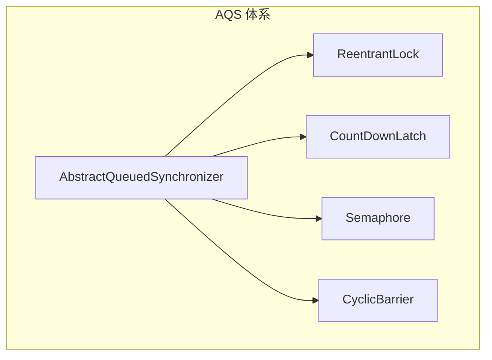
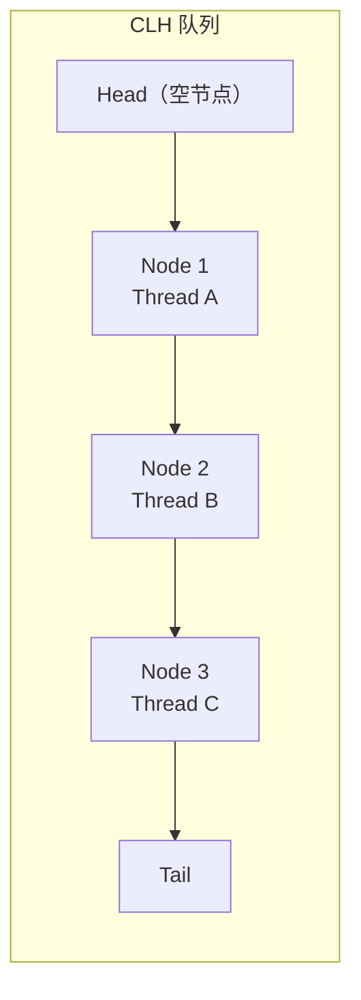
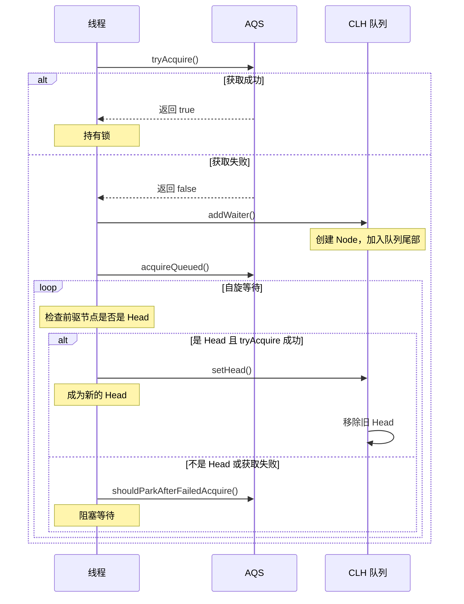

# AQS 原理

> **目标级别**：P6
> **面试频率**：🔴 高频

面试官问：「什么是 AQS？」你说「队列同步器」——然后面试官紧接着追问「那 AQS 的核心原理是什么？独占模式和共享模式的区别是什么？」你沉默了。

AQS 是 Java 并发编程的核心框架，理解它是成为并发专家的必经之路。

## 面试官最关心的 3 个问题

1. ⚠️ AQS 的核心结构是什么？
2. ⚠️ AQS 是如何实现锁的获取与释放的？
3. ⚠️ 独占模式和共享模式的区别是什么？

## 核心原理

### AQS 的定义

AbstractQueuedSynchronizer（AQS）是 JUC 包中大多数同步器的实现基础：



### AQS 的核心思想

AQS 的核心思想：**state + CLH 队列**

| 核心组件 | 说明 |
|---------|------|
| **state** | 同步状态，用 volatile int 存储 |
| **CLH 队列** | 双向链表队列，存储等待线程 |
| **模板方法** | 子类实现 tryAcquire/tryRelease 等方法 |

### AQS 的 state

```java
public abstract class AbstractQueuedSynchronizer
    extends AbstractOwnableSynchronizer {

    // 同步状态
    private volatile int state;

    // 获取状态
    protected final int getState() {
        return state;
    }

    // 设置状态
    protected final void setState(int newState) {
        state = newState;
    }

    // CAS 设置状态
    protected final boolean compareAndSetState(int expect, int update) {
        return unsafe.compareAndSwapInt(this, stateOffset, expect, update);
    }
}
```

### state 的含义

| 同步器 | state 含义 |
|--------|-----------|
| ReentrantLock | 持有锁的次数（0 表示未持有） |
| ReentrantReadWriteLock | 高 16 位读锁计数，低 16 位写锁计数 |
| CountDownLatch | 计数器初始值 |
| Semaphore | 许可数量 |
| CyclicBarrier | 等待方数量 |

### CLH 队列

CLH（Craig, Landin, Hagersten）队列是 AQS 等待队列的变体：



### Node 结构

```java
static final class Node {
    // 共享模式标记
    static final Node SHARED = new Node();
    // 独占模式标记
    static final Node EXCLUSIVE = null;

    // 节点状态
    static final int CANCELLED =  1;   // 取消
    static final int SIGNAL    = -1;  // 等待触发
    static final int CONDITION = -2;  // 等待条件
    static final int PROPAGATE = -3;  // 传播

    volatile int waitStatus;

    volatile Node prev;
    volatile Node next;

    volatile Thread thread;    // 持有线程
    Node nextWaiter;          // 下一个等待节点
}
```

### 节点状态

| 状态 | 值 | 说明 |
|------|-----|------|
| CANCELLED | 1 | 等待超时或中断，永久不参与竞争 |
| SIGNAL | -1 | 当前节点释放锁时唤醒后继节点 |
| CONDITION | -2 | 节点在条件队列中等待 |
| PROPAGATE | -3 | 共享模式下，释放时需要传播 |

## 锁获取与释放流程

### 独占模式获取锁

```java
public final void acquire(int arg) {
    if (!tryAcquire(arg) &&  // 1. 尝试获取锁
        acquireQueued(addWaiter(Node.EXCLUSIVE), arg)) { // 2. 加入等待队列
        selfInterrupt(); // 3. 中断
    }
}
```



### 独占模式释放锁

```java
public final boolean release(int arg) {
    if (tryRelease(arg)) { // 1. 尝试释放锁
        Node h = head;
        if (h != null && h.waitStatus != 0) {
            unparkSuccessor(h); // 2. 唤醒后继节点
        }
        return true;
    }
    return false;
}
```

### 共享模式获取锁

```java
public final void acquireShared(int arg) {
    if (tryAcquireShared(arg) < 0) { // < 0 表示获取失败
        doAcquireShared(arg); // 加入队列等待
    }
}

private void doAcquireShared(int arg) {
    Node node = addWaiter(Node.SHARED);
    boolean failed = true;
    try {
        boolean interrupted = false;
        for (;;) {
            Node p = node.predecessor();
            if (p == head) {
                int r = tryAcquireShared(arg);
                if (r >= 0) {
                    setHeadAndPropagate(node, r);
                    p.next = null; // 释放
                    if (interrupted) selfInterrupt();
                    failed = false;
                    return;
                }
            }
            if (shouldParkAfterFailedAcquire(p, node) &&
                parkAndCheckInterrupt())
                interrupted = true;
        }
    } finally {
        if (failed) cancelAcquire(node);
    }
}
```

## 模板方法模式

AQS 使用模板方法模式，子类必须实现以下方法：

### 独占模式

| 方法 | 说明 |
|------|------|
| `tryAcquire(int)` | 尝试获取锁 |
| `tryRelease(int)` | 尝试释放锁 |
| `isHeldExclusively()` | 是否独占持有 |

### 共享模式

| 方法 | 说明 |
|------|------|
| `tryAcquireShared(int)` | 尝试获取共享锁，返回剩余资源数 |
| `tryReleaseShared(int)` | 尝试释放共享锁 |

## 高频面试题

### 🔴 题目 1：AQS 的核心原理是什么？

**参考回答**：

AQS 的核心是 **state + CLH 队列**：

1. **state**：同步状态，通过 CAS 保证原子性
2. **CLH 队列**：双向链表存储等待线程
3. **模板方法**：子类实现 tryAcquire/tryRelease 等方法
4. **等待唤醒**：通过 LockSupport.park/unpark 实现线程阻塞/唤醒

### 🔴 题目 2：独占模式和共享模式的区别？

**参考回答**：

| 区别 | 独占模式 | 共享模式 |
|------|---------|---------|
| **tryAcquire** | 返回 boolean | 返回 int（剩余资源数） |
| **典型实现** | ReentrantLock | CountDownLatch, Semaphore |
| **锁获取** | 一个线程持有 | 多个线程同时持有 |
| **唤醒传播** | 只唤醒后继节点 | 可能传播唤醒 |

### 🔴 题目 3：ReentrantLock 是如何基于 AQS 实现的？

**参考回答**：

```java
// NonfairSync.tryAcquire
protected final boolean tryAcquire(int acquires) {
    final Thread current = Thread.currentThread();
    int c = getState();
    if (c == 0) {
        // 尝试 CAS 获取锁
        if (compareAndSetState(0, acquires)) {
            setExclusiveOwnerThread(current);
            return true;
        }
    } else if (current == getExclusiveOwnerThread()) {
        // 可重入，state++
        int nextc = c + acquires;
        setState(nextc);
        return true;
    }
    return false;
}
```

## 常见错误与陷阱

### ⚠️ 陷阱 1：混淆 AQS 和 Lock

```
AQS = AbstractQueuedSynchronizer（抽象类）
Lock = 接口（如 ReentrantLock）

ReentrantLock 内部使用 AQS 实现
```

### ⚠️ 陷阱 2：忽略模板方法

```java
// ❌ 错误：直接使用 AQS
AQS aqs = new AQS(); // 编译错误，AQS 是抽象类

// ✅ 正确：继承 AQS 实现
class MyLock extends AQS {
    protected boolean tryAcquire(int arg) { ... }
    protected boolean tryRelease(int arg) { ... }
}
```

### ⚠️ 陷阱 3：死锁

```java
// ❌ 可能死锁：tryAcquire 中调用自己
class BadLock extends AQS {
    protected boolean tryAcquire(int arg) {
        return tryAcquire(arg); // 无限递归！
    }
}
```

## 加分回答

### 💡 AQS 的公平性实现

```java
// FairSync.tryAcquire
protected final boolean tryAcquire(int acquires) {
    final Thread current = Thread.currentThread();
    int c = getState();
    if (c == 0) {
        // 公平锁：检查是否有前驱节点
        if (!hasQueuedPredecessors()) {
            if (compareAndSetState(0, acquires)) {
                setExclusiveOwnerThread(current);
                return true;
            }
        }
    }
    // ... 可重入逻辑
}

// 非公平锁：不检查前驱节点
// NonfairSync 直接尝试 CAS
```

### 💡 ConditionObject 实现

AQS 内部类 ConditionObject 实现 Condition 接口：

```java
public class ConditionObject implements Condition {
    private Node firstWaiter;
    private Node lastWaiter;

    public final void await() throws InterruptedException {
        // 加入条件队列
        Node node = addConditionWaiter();
        // 释放锁
        int savedState = fullyRelease(node);
        // 阻塞等待
        while (!isOnSyncQueue(node)) {
            LockSupport.park(this);
            if (interruptMode != 0) break;
        }
    }

    public final void signal() {
        // 唤醒条件队列中的节点
        Node first = firstWaiter;
        if (first != null) doSignal(first);
    }
}
```

## 总结对比表

| 组件 | 说明 |
|------|------|
| state | 同步状态，volatile int |
| CLH 队列 | 双向链表，存储等待线程 |
| Node | 等待节点，包含线程引用 |
| 模板方法 | 子类实现 tryAcquire/tryRelease |
| LockSupport | park/unpark 线程阻塞唤醒 |

## 延伸思考

### 面试官可能会继续追问

1. 「CLH 队列为什么是双向链表？」
2. 「Condition 和 wait/notify 有什么区别？」
3. 「AQS 的自旋超时机制是怎么实现的？」

### 回答方向

关于 CLH 双向链表的原因：
- 前驱指针：用于检查是否可以尝试获取锁
- 后继指针：用于释放锁时唤醒后继节点
- 双向指针使入队和出队操作更高效
