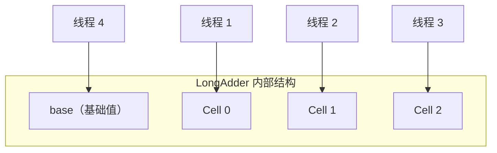

# Atomic 原子类原理

> **目标级别**：P5/P6
> **面试频率**：🔴 高频

面试官问：「AtomicInteger 是怎么保证原子性的？」你说「通过 CAS」——然后面试官紧接着追问「那 incrementAndGet 是怎么实现的？为什么不用 synchronized？」你沉默了。

Atomic 原子类是并发编程中最常用的工具之一，理解其原理才能正确使用。

## 面试官最关心的 3 个问题

1. ⚠️ AtomicInteger 的基本原理是什么？
2. ⚠️ incrementAndGet 是如何实现的？
3. ⚠️ AtomicInteger 和 synchronized 的区别是什么？

## 核心原理

### AtomicInteger 的使用

```java
public class AtomicDemo {
    private final AtomicInteger counter = new AtomicInteger(0);

    // 原子递增
    public void increment() {
        counter.incrementAndGet();
    }

    // 原子递减
    public void decrement() {
        counter.decrementAndGet();
    }

    // CAS 更新
    public void update(int expected, int newValue) {
        counter.compareAndSet(expected, newValue);
    }
}
```

### AtomicInteger 内部结构

```java
public class AtomicInteger extends Number implements java.io.Serializable {
    private volatile int value;  // 存储实际值

    private static final long valueOffset; // value 在内存中的偏移量

    static {
        try {
            valueOffset = unsafe.objectFieldOffset(
                AtomicInteger.class.getDeclaredField("value"));
        } catch (Exception e) { throw new Error(e); }
    }

    // CAS 操作
    public final boolean compareAndSet(int expectedValue, int newValue) {
        return unsafe.compareAndSwapInt(this, valueOffset, expectedValue, newValue);
    }
}
```

### incrementAndGet 的实现

```java
public final int incrementAndGet() {
    int prev, next;
    do {
        prev = get();         // 读取当前值
        next = prev + 1;      // 计算新值
    } while (!compareAndSet(prev, next)); // CAS 重试
    return next;
}
```

## 常用方法对比

| 方法 | 说明 | 返回值 |
|------|------|--------|
| `get()` | 获取当前值 | `int` |
| `set(int newValue)` | 设置新值 | `void` |
| `getAndSet(int newValue)` | 获取旧值并设置新值 | `int` |
| `compareAndSet(int expect, int update)` | CAS 设置 | `boolean` |
| `incrementAndGet()` | 递增并返回新值 | `int` |
| `getAndIncrement()` | 递增并返回旧值 | `int` |
| `decrementAndGet()` | 递减并返回新值 | `int` |
| `getAndDecrement()` | 递减并返回旧值 | `int` |
| `addAndGet(int delta)` | 增加 delta 并返回新值 | `int` |
| `getAndAdd(int delta)` | 增加 delta 并返回旧值 | `int` |

## 原子类家族

### 基本类型原子类

| 类 | 说明 |
|------|------|
| `AtomicInteger` | 整型原子类 |
| `AtomicLong` | 长整型原子类 |
| `AtomicBoolean` | 布尔型原子类 |

### 引用类型原子类

| 类 | 说明 |
|------|------|
| `AtomicReference` | 引用类型原子类 |
| `AtomicStampedReference` | 带版本号的引用类型 |
| `AtomicMarkableReference` | 带标记的引用类型 |

### 数组类型原子类

| 类 | 说明 |
|------|------|
| `AtomicIntegerArray` | 整型数组原子类 |
| `AtomicLongArray` | 长整型数组原子类 |
| `AtomicReferenceArray` | 引用类型数组原子类 |

### 字段更新器原子类

| 类 | 说明 |
|------|------|
| `AtomicIntegerFieldUpdater` | 整型字段更新器 |
| `AtomicLongFieldUpdater` | 长整型字段更新器 |
| `AtomicReferenceFieldUpdater` | 引用类型字段更新器 |

## AtomicReference 的使用

```java
public class AtomicReferenceDemo {
    private final AtomicReference<User> userRef = new AtomicReference<>();

    public void updateUser(User newUser) {
        User oldUser;
        do {
            oldUser = userRef.get();
        } while (!userRef.compareAndSet(oldUser, newUser));
    }

    // 带版本号的更新（解决 ABA 问题）
    private final AtomicStampedReference<User> stampedRef =
        new AtomicStampedReference<>(null, 0);

    public void stampedUpdate(User newUser) {
        User oldUser;
        int[] stamp = new int[1];
        do {
            oldUser = stampedRef.get(stamp);
            int newStamp = stamp[0] + 1;
        } while (!stampedRef.compareAndSet(oldUser, newUser, stamp[0], newStamp));
    }
}
```

## 高频面试题

### 🔴 题目 1：AtomicInteger 是如何保证原子性的？

**参考回答**：

AtomicInteger 通过以下机制保证原子性：

1. **Unsafe 类**：调用 CPU 的 CAS 指令
2. **volatile 关键字**：保证 value 的可见性
3. **CAS 循环**：自旋重试直到成功

```java
// 核心原理
public final boolean compareAndSet(int expectedValue, int newValue) {
    return unsafe.compareAndSwapInt(this, valueOffset, expectedValue, newValue);
}
```

### 🔴 题目 2：incrementAndGet 和 getAndIncrement 的区别？

**参考回答**：

| 方法 | 说明 | 示例 |
|------|------|------|
| `incrementAndGet()` | 先加1，返回新值 | `i = 0` → `i++` → `return 1` |
| `getAndIncrement()` | 先加1，返回旧值 | `i = 0` → `return 0` → `i = 1` |

### 🔴 题目 3：原子类可以代替 synchronized 吗？

**参考回答**：

**不能完全替代**。原子类只能保证**单个变量**的原子性：

| 场景 | 原子类 | synchronized |
|------|--------|-------------|
| 单变量操作 | ✅ | ✅ |
| 复合操作 | ❌ | ✅ |
| 代码块同步 | ❌ | ✅ |
| 需要多个条件 | ❌ | ✅ |

```java
// ❌ 不能保证复合操作的原子性
atomic.set(atomic.get() + 1); // 非原子！

// ✅ 应该使用 CAS 循环
do {
    old = atomic.get();
    new = old + 1;
} while (!atomic.compareAndSet(old, new));
```

## 常见错误与陷阱

### ⚠️ 陷阱 1：复合操作的原子性问题

```java
// ❌ 错误：复合操作不是原子的
public void withdraw(int amount) {
    if (balance.get() >= amount) { // 检查
        balance.set(balance.get() - amount); // 修改（非原子）
    }
}

// ✅ 正确：使用 CAS 循环
public void withdraw(int amount) {
    while (true) {
        int current = balance.get();
        if (current >= amount) {
            if (balance.compareAndSet(current, current - amount)) {
                return;
            }
        } else {
            return;
        }
    }
}
```

### ⚠️ 陷阱 2：忽视 ABA 问题

```java
// ❌ 可能出问题
private final AtomicReference<Node> stack = new AtomicReference<>();

// Node A → B → A 变化后，CAS 仍然成功
```

### ⚠️ 陷阱 3：字段更新器的限制

```java
// ❌ 错误：字段不能是 private
public class User {
    private volatile int age; // ❌
}

// ✅ 正确：字段必须是 volatile
public class User {
    volatile int age; // ✅
}

AtomicIntegerFieldUpdater<User> updater =
    AtomicIntegerFieldUpdater.newUpdater(User.class, "age");
```

## 加分回答

### 💡 LongAdder vs AtomicLong

在高竞争场景下，LongAdder 性能更好：

```java
// AtomicLong：所有线程竞争同一个变量
AtomicLong counter = new AtomicLong(0);
counter.incrementAndGet(); // 所有线程 CAS 同一个地址

// LongAdder：分段累加，减少竞争
LongAdder counter = new LongAdder();
counter.increment(); // 分段累加
```

### 💡 Striped64 的分段思想



## 总结对比表

| 方法 | 特点 | 使用场景 |
|------|------|---------|
| `compareAndSet` | CAS 原语 | 基础操作 |
| `incrementAndGet` | 先加后返回 | 计数器 |
| `getAndIncrement` | 先返回后加 | 需要旧值 |
| `addAndGet` | 加 delta 后返回 | 批量增加 |

## 延伸思考

### 面试官可能会继续追问

1. 「Unsafe 类是怎么操作的？为什么不直接暴露？」
2. 「LongAdder 的 sum() 方法为什么不是原子的？」
3. 「AtomicIntegerArray 和普通数组有什么区别？」

### 回答方向

关于 Unsafe 类：JDK 9+ 将 Unsafe 的部分功能迁移到了 VarHandle，不能直接调用 Unsafe，但 VarHandle 提供了类似的原子操作能力。
