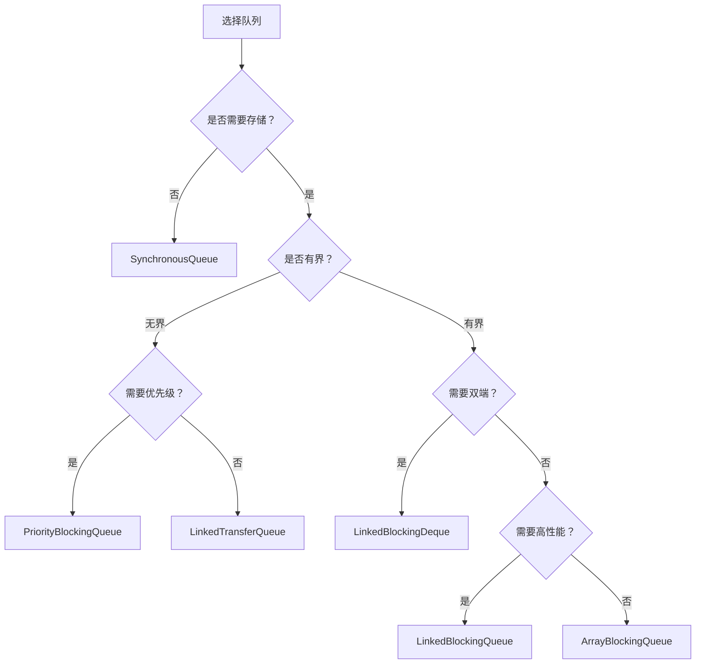

# 阻塞队列对比

> **目标级别**：P5/P6
> **面试频率**：🔴 高频

面试官问：「阻塞队列有哪些？」你说「ArrayBlockingQueue」——然后面试官紧接着追问「那它们有什么区别？什么场景用什么队列？」你沉默了。

阻塞队列是线程池的核心组件，理解其特点才能正确选择。

## 面试官最关心的 3 个问题

1. ⚠️ 阻塞队列有哪些类型？
2. ⚠️ 各队列有什么区别？
3. ⚠️ 什么场景用什么队列？

## 核心原理

### 阻塞队列接口

```java
public interface BlockingQueue<E> extends Queue<E> {
    // 添加元素
    void put(E e) throws InterruptedException;  // 阻塞添加
    boolean offer(E e, long timeout, TimeUnit unit) throws InterruptedException;

    // 获取元素
    E take() throws InterruptedException;        // 阻塞获取
    E poll(long timeout, TimeUnit unit) throws InterruptedException;

    // 其他方法
    boolean offer(E e);
    boolean add(E e);
    E remove();
}
```

### 队列操作分类

| 操作 | 抛异常 | 特殊值 | 阻塞 | 超时 |
|------|--------|--------|------|------|
| **添加** | add() | offer() | put() | offer(timeout) |
| **移除** | remove() | poll() | take() | poll(timeout) |
| **检查** | element() | peek() | - | - |

## 队列类型对比

### 1. ArrayBlockingQueue

```java
// 有界队列：数组实现
BlockingQueue<String> queue = new ArrayBlockingQueue<>(10);
```

| 特性 | 说明 |
|------|------|
| **实现** | 数组 |
| **容量** | 固定，必须指定容量 |
| **锁** | 单锁（ReentrantLock） |
| **公平性** | 支持公平/非公平 |

### 2. LinkedBlockingQueue

```java
// 可选有界队列：链表实现
BlockingQueue<String> queue1 = new LinkedBlockingQueue<>(10); // 有界
BlockingQueue<String> queue2 = new LinkedBlockingQueue<>();   // 无界（Integer.MAX_VALUE）
```

| 特性 | 说明 |
|------|------|
| **实现** | 链表 |
| **容量** | 可选有界/无界 |
| **锁** | 双锁（入队锁 + 出队锁） |
| **吞吐量** | 较高 |

### 3. LinkedBlockingDeque

```java
// 双端队列：可从两端入队/出队
BlockingDeque<String> deque = new LinkedBlockingDeque<>(10);

deque.offerFirst("first");
deque.offerLast("last");
```

### 4. PriorityBlockingQueue

```java
// 优先级队列：无界队列，元素按优先级排序
BlockingQueue<String> queue = new PriorityBlockingQueue<>();
queue.offer("low");
queue.offer("high");
queue.offer("medium");
// take() 返回顺序：high, low, medium
```

| 特性 | 说明 |
|------|------|
| **实现** | 堆 |
| **容量** | 无界（动态扩容） |
| **元素** | 必须实现 Comparable |
| **锁** | 单锁 |

### 5. DelayQueue

```java
// 延迟队列：元素必须实现 Delayed 接口
BlockingQueue<DelayedTask> queue = new DelayQueue<>();

queue.offer(new DelayedTask("task1", 1, TimeUnit.SECONDS));
queue.offer(new DelayedTask("task2", 5, TimeUnit.SECONDS));

DelayedTask task = queue.take(); // 等待直到延迟到期
```

### 6. SynchronousQueue

```java
// 同步队列：不存储元素，每个 put 必须等待 take
BlockingQueue<String> queue = new SynchronousQueue<>();

new Thread(() -> {
    try {
        String value = queue.take(); // 等待
        System.out.println("Got: " + value);
    } catch (InterruptedException e) {}
}).start();

queue.put("value"); // 必须有线程等待才能 put 成功
```

| 特性 | 说明 |
|------|------|
| **实现** | 无存储空间 |
| **容量** | 0 |
| **适用** | 线程间直接交换 |

### 7. LinkedTransferQueue

```java
// 转移队列：支持 transfer 方法，消息必须被消费
BlockingQueue<String> queue = new LinkedTransferQueue<>();

// transfer：等待消费者才返回
queue.transfer("message");

// tryTransfer：非阻塞
queue.tryTransfer("message");
```

## 对比表格

| 队列 | 有界/无界 | 底层 | 锁 | 特点 |
|------|----------|------|------|------|
| **ArrayBlockingQueue** | 有界 | 数组 | 单锁 | 公平，可选 |
| **LinkedBlockingQueue** | 可选 | 链表 | 双锁 | 吞吐量高 |
| **LinkedBlockingDeque** | 可选 | 链表 | 双锁 | 双端操作 |
| **PriorityBlockingQueue** | 无界 | 堆 | 单锁 | 优先级排序 |
| **DelayQueue** | 无界 | 堆 | 单锁 | 延迟执行 |
| **SynchronousQueue** | 0 | - | 单锁 | 直接交换 |
| **LinkedTransferQueue** | 无界 | 链表 | CAS | 支持 transfer |

## 队列选择指南



### 生产环境推荐

| 场景 | 推荐队列 | 原因 |
|------|---------|------|
| **线程池任务队列** | LinkedBlockingQueue | 吞吐量高 |
| **延迟任务** | DelayQueue | 支持延迟 |
| **直接交换** | SynchronousQueue | 无缓冲 |
| **优先级任务** | PriorityBlockingQueue | 优先级排序 |
| **生产者-消费者** | LinkedBlockingQueue | 通用 |

## 高频面试题

### 🔴 题目 1：阻塞队列有哪些？

**参考回答**：

| 队列 | 说明 |
|------|------|
| **ArrayBlockingQueue** | 有界数组队列 |
| **LinkedBlockingQueue** | 可选有界链表队列 |
| **LinkedBlockingDeque** | 双端队列 |
| **PriorityBlockingQueue** | 优先级无界队列 |
| **DelayQueue** | 延迟队列 |
| **SynchronousQueue** | 同步队列（不存储） |
| **LinkedTransferQueue** | 转移队列 |

### 🔴 题目 2：ArrayBlockingQueue 和 LinkedBlockingQueue 的区别？

**参考回答**：

| 区别 | ArrayBlockingQueue | LinkedBlockingQueue |
|------|--------------------|---------------------|
| **底层** | 数组 | 链表 |
| **容量** | 固定 | 可选有界/无界 |
| **锁** | 单锁 | 双锁（入队/出队分离） |
| **吞吐量** | 较低 | 较高 |
| **内存** | 预分配 | 动态分配 |

### 🔴 题目 3：SynchronousQueue 有什么用？

**参考回答**：

SynchronousQueue 用于直接交换场景：

1. **直接交付**：线程 A 的数据直接交给线程 B
2. **无缓冲**：没有存储空间
3. **CashedThreadPool**：使用它实现无界缓存

## 常见错误与陷阱

### ⚠️ 陷阱 1：使用无界队列导致 OOM

```java
// ❌ 无界队列可能导致 OOM
new ThreadPoolExecutor(
    10, 10, 0L, TimeUnit.SECONDS,
    new LinkedBlockingQueue<>()); // 无界！
```

### ⚠️ 陷阱 2：ArrayBlockingQueue 忘记指定容量

```java
// ❌ 编译错误
new ArrayBlockingQueue<>(); // 必须指定容量

// ✅ 正确
new ArrayBlockingQueue<>(100);
```

### ⚠️ 陷阱 3：SynchronousQueue 的 put 必须等待

```java
// ❌ 如果没有消费者等待，会阻塞
BlockingQueue<String> queue = new SynchronousQueue<>();
queue.put("message"); // ⚠️ 阻塞直到有消费者

// ✅ 使用 offer 超时
queue.offer("message", 1, TimeUnit.SECONDS);
```

## 加分回答

### 💡 双锁原理

```java
// LinkedBlockingQueue 的双锁
private final ReentrantLock takeLock = new ReentrantLock();
private final ReentrantLock putLock = new ReentrantLock();

// put 操作
putLock.lock();
try {
    enqueue(node);
    if (count.get() + 1 < capacity)
        notFull.signal();
} finally {
    putLock.unlock();
}

// take 操作
takeLock.lock();
try {
    E x = dequeue();
    if (count.decrementAndGet() > 0)
        notEmpty.signal();
} finally {
    takeLock.unlock();
}
```

### 💡 队列在线程池中的作用

```
任务提交 → 核心线程处理 → 队列等待 → 临时线程处理 → 拒绝策略
    ↓
┌─────────────────────────────────────────────┐
│         LinkedBlockingQueue(100)           │
│  [任务1] [任务2] [任务3] ... [任务100]     │
└─────────────────────────────────────────────┘
```

## 总结对比表

| 维度 | ArrayBlockingQueue | LinkedBlockingQueue |
|------|-------------------|---------------------|
| **底层结构** | 数组 | 链表 |
| **容量** | 必须指定 | 可选 |
| **锁** | 单锁 | 双锁 |
| **吞吐量** | 低 | 高 |
| **内存分配** | 预分配 | 动态 |
| **适用** | 固定容量需求 | 高并发场景 |

## 延伸思考

### 面试官可能会继续追问

1. 「为什么 LinkedBlockingQueue 用双锁？」
2. 「DelayQueue 是怎么实现的？」
3. 「队列的 put 和 offer 有什么区别？」

### 回答方向

关于双锁的好处：入队和出队使用不同的锁，可以并行执行，提高并发吞吐量。
