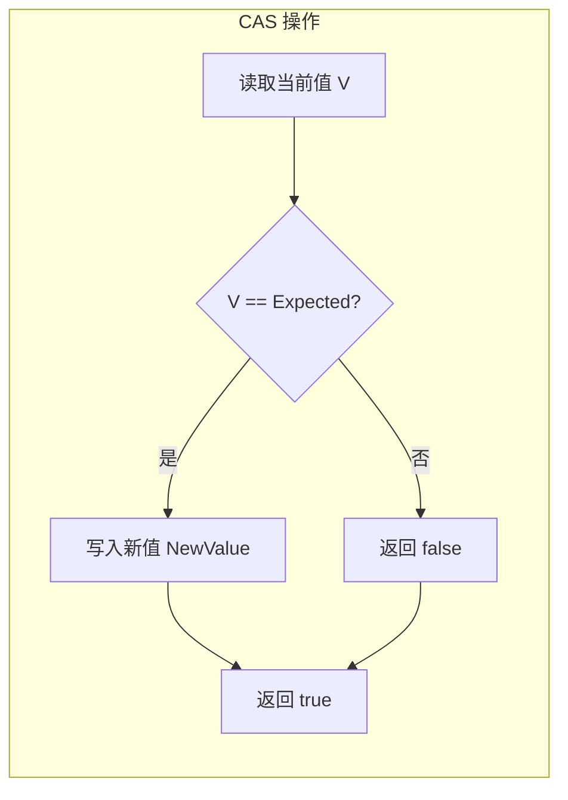
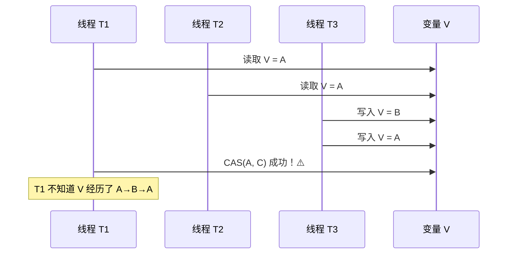
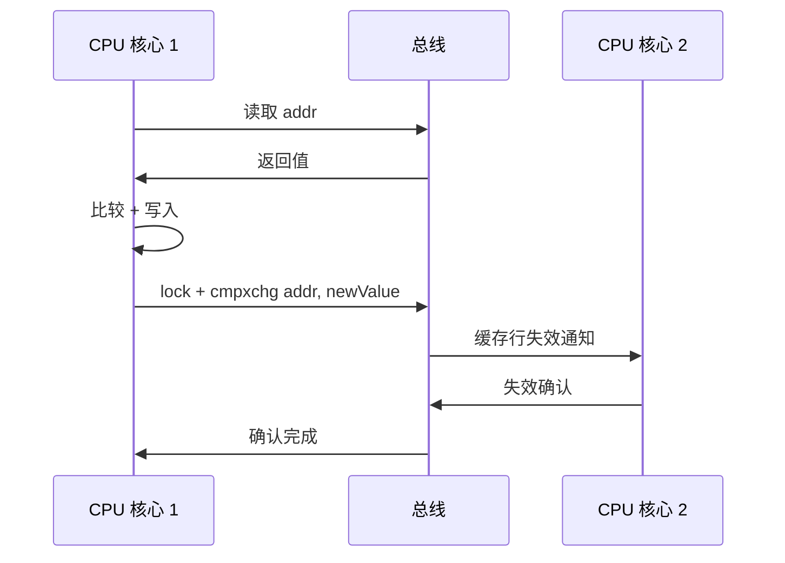

# CAS 原理与 ABA 问题

> **目标级别**：P5/P6
> **面试频率**：🔴 高频

面试官问：「CAS 是什么？」你说「比较并交换」——然后面试官紧接着追问「那 ABA 问题怎么解决？为什么 CAS 比 synchronized 快？」你沉默了。

CAS 是理解并发编程底层原理的关键，也是 AQS、Atomic 类的实现基础。

## 面试官最关心的 3 个问题

1. ⚠️ CAS 的原理是什么？
2. ⚠️ CAS 有什么缺点？ABA 问题如何解决？
3. ⚠️ CAS 和 synchronized 的区别是什么？

## 核心原理

### CAS 的概念

CAS（Compare-And-Swap，比较并交换）是 CPU 提供的原子操作指令：

```
CAS(V, Expected, NewValue) {
    if (V == Expected) {
        V = NewValue;
        return true;
    }
    return false;
}
```

### CAS 的语义



### CAS 的 CPU 指令

| CPU 架构 | CAS 指令 |
|---------|---------|
| x86/x64 | `cmpxchg`（带 lock 前缀） |
| ARM | `ldaxr` + `stlxr` |
| PowerPC | `lwarx` + `stwcx` |

### CAS 在 x86 上的实现

```asm
; CAS 操作示例（伪代码）
lock cmpxchg [addr], eax, ebx

; 原子操作：
; 1. 比较 [addr] 和 eax
; 2. 如果相等，将 ebx 写入 [addr]
; 3. 设置 ZF 标志位表示成功/失败
```

## CAS 的应用

### JUC 中的 CAS 使用

```java
public class AtomicIntegerDemo {
    private final AtomicInteger value = new AtomicInteger(0);

    public void increment() {
        int current;
        do {
            current = value.get();        // 读取
        } while (!value.compareAndSet(current, current + 1)); // CAS
    }
}
```

### CAS 循环（CAS Loop）

```java
public final int incrementAndGet() {
    int prev, next;
    do {
        prev = get();            // 读取当前值
        next = prev + 1;        // 计算新值
    } while (!compareAndSet(prev, next)); // CAS 重试
    return next;
}
```

## CAS 的三大问题

### 1. ABA 问题

**问题描述**：线程 T1 和 T2 读取同一个值 A，线程 T3 将值改为 B 再改回 A，T1 的 CAS 成功，但实际值已经被修改过。



### 2. 自旋开销

**问题描述**：在高竞争场景下，CAS 可能长时间失败，导致 CPU 空转。

```java
// 极端情况：大量线程竞争
while (!atomic.compareAndSet(expected, newValue)) {
    // 重试，可能持续很久
    expected = atomic.get(); // 每次重试都要读取
}
```

### 3. 只能保证单个变量

**问题描述**：CAS 只能保证一个变量的原子性，多个变量需要其他机制。

```java
// ❌ 不能保证复合操作的原子性
if (atomic1.get() == X && atomic2.get() == Y) {
    atomic1.set(X + 1);
    atomic2.set(Y + 1); // 可能被其他线程打断
}
```

## ABA 问题解决方案

### 方案一：AtomicStampedReference

使用版本号（时间戳）解决 ABA 问题：

```java
public class AtomicStampedReferenceDemo {
    private final AtomicStampedReference<Integer> ref =
        new AtomicStampedReference<>(100, 0);

    public void update() {
        int[] stampHolder = new int[1];
        Integer current = ref.get(stampHolder);
        int stamp = stampHolder[0];

        // 期望值和版本号都匹配时才更新
        ref.compareAndSet(current, current + 1, stamp, stamp + 1);
    }
}
```

### 方案二：AtomicMarkableReference

使用标记（boolean）解决 ABA 问题：

```java
public class AtomicMarkableReferenceDemo {
    private final AtomicMarkableReference<String> ref =
        new AtomicMarkableReference<>("valid", false);

    public boolean tryMark() {
        String current = ref.getReference();
        boolean[] markHolder = new boolean[1];
        ref.get(markHolder);
        boolean currentMark = markHolder[0];

        return ref.compareAndSet(current, current, currentMark, !currentMark);
    }
}
```

## CAS vs synchronized

| 对比维度 | CAS | synchronized |
|---------|-----|-------------|
| **实现方式** | 乐观锁，无阻塞 | 悲观锁，互斥 |
| **阻塞方式** | 自旋重试 | 线程阻塞/唤醒 |
| **响应性** | 高（不阻塞线程） | 低（线程阻塞） |
| **吞吐量** | 高（竞争不激烈时） | 低（竞争激烈时） |
| **适用场景** | 竞争不激烈 | 竞争激烈 |
| **复杂性** | 简单 | 简单 |
| **原子性保证** | 单变量 | 代码块 |
| **ABA 问题** | 存在 | 不存在 |

## 高频面试题

### 🔴 题目 1：CAS 的原理是什么？

**参考回答**：

CAS（Compare-And-Swap）是 CPU 提供的原子指令，分为三步：

1. **读取**：读取变量的当前值
2. **比较**：比较当前值与期望值
3. **交换**：如果相等，写入新值

在 x86 架构上，使用 `lock cmpxchg` 指令实现。在多核 CPU 上，lock 前缀保证操作的原子性。

### 🔴 题目 2：什么是 ABA 问题？如何解决？

**参考回答**：

**ABA 问题**：变量从 A 变成 B 再变回 A，CAS 检查时发现仍是 A，但实际已被修改过。

**解决方案**：

1. **AtomicStampedReference**：使用版本号，每次修改都更新版本
2. **AtomicMarkableReference**：使用布尔标记
3. **不关心中间状态**：如果业务允许，不解决

### 🔴 题目 3：CAS 比 synchronized 快吗？

**参考回答**：

在竞争不激烈的场景下：
- CAS 是乐观锁，不阻塞线程，开销小
- synchronized 会阻塞线程，有线程切换开销

在竞争激烈的场景下：
- CAS 自旋开销大，可能不如 synchronized
- synchronized 的阻塞/唤醒机制更高效

## 常见错误与陷阱

### ⚠️ 陷阱 1：忽视 ABA 问题

```java
// ❌ 可能出问题
private final AtomicReference<Node> top = new AtomicReference<>();

public void push(Node node) {
    Node oldTop;
    do {
        oldTop = top.get();
        node.next = oldTop;
    } while (!top.compareAndSet(oldTop, node));
    // 如果有人修改了 top 再改回来，这里可能有问题
}
```

### ⚠️ 陷阱 2：CAS 循环时间过长

```java
// ❌ 高竞争场景下的无限循环
while (!atomic.compareAndSet(expected, newValue)) {
    expected = atomic.get();
    // 可能是真正的无限循环
}
```

### ⚠️ 陷阱 3：混淆 CAS 和 ABA

```
CAS ≠ ABA
CAS = Compare-And-Swap（比较并交换）
ABA = A→B→A（值变化的问题）
```

## 加分回答

### 💡 CAS 的底层实现

CAS 依赖 CPU 的缓存一致性协议（MESI）：



### 💡 LongAdder 的分段思想

LongAdder 解决了高竞争下的 CAS 问题：

```java
public class LongAdder extends Striped64 {
    // 分段累加，多个 Cell 减少竞争
    transient volatile Cell[] cells;

    public void increment() {
        add(1);
    }

    final void add(long x) {
        Cell[] cs;
        long n, v;
        int m;
        Cell c;
        if ((cs = cells) != null || !casBase(v = base, v + x)) {
            // 竞争激烈，分段累加
            int i = getProbe();
            if ((c = cs[(m = cs.length - 1) & i]) != null ||
                (cs = setupCells(true)) != null) {
                boolean uncontended = true;
                if (c == null ||
                    (uncontended = c.cas(v = c.value, v + x))) {
                    // 成功
                }
            }
        }
    }
}
```

## 总结对比表

| CAS 问题 | 描述 | 解决方案 |
|---------|------|---------|
| **ABA 问题** | 值变化后恢复原值，CAS 误判成功 | 版本号/标记 |
| **自旋开销** | 竞争激烈时 CAS 循环时间长 | LongAdder 分段 |
| **单变量限制** | 只保证一个变量原子性 | synchronized/Lock |

## 延伸思考

### 面试官可能会继续追问

1. 「Unsafe 类中的 CAS 方法是怎么实现的？」
2. 「synchronized 轻量级锁的 CAS 和这里说的 CAS 有什么关系？」
3. 「如何实现一个无锁栈？」

### 回答方向

关于无锁栈的实现：使用 AtomicReference + CAS 循环：
```java
public class LockFreeStack<T> {
    private final AtomicReference<Node<T>> top = new AtomicReference<>();

    public void push(T value) {
        Node<T> newNode = new Node<>(value);
        Node<T> oldTop;
        do {
            oldTop = top.get();
            newNode.next = oldTop;
        } while (!top.compareAndSet(oldTop, newNode));
    }
}
```
