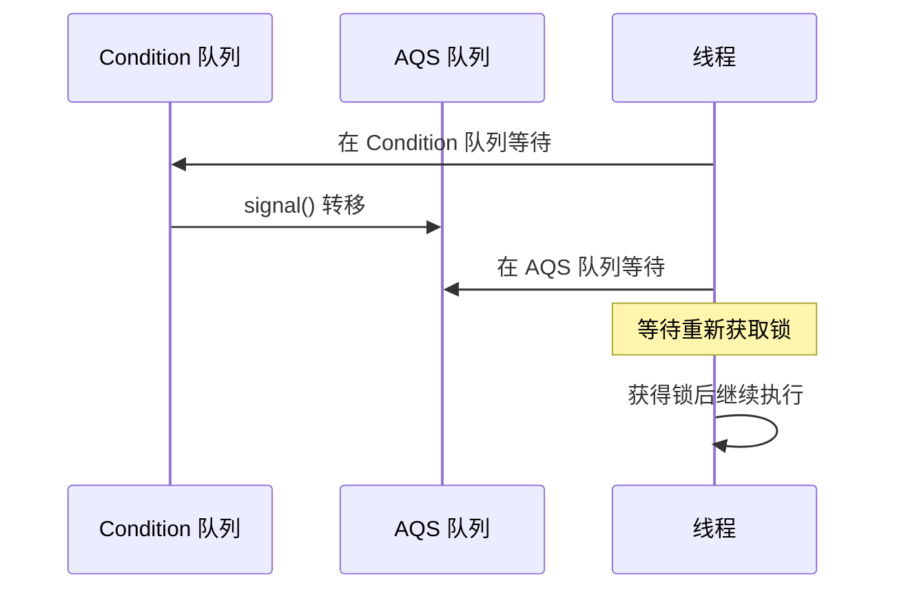
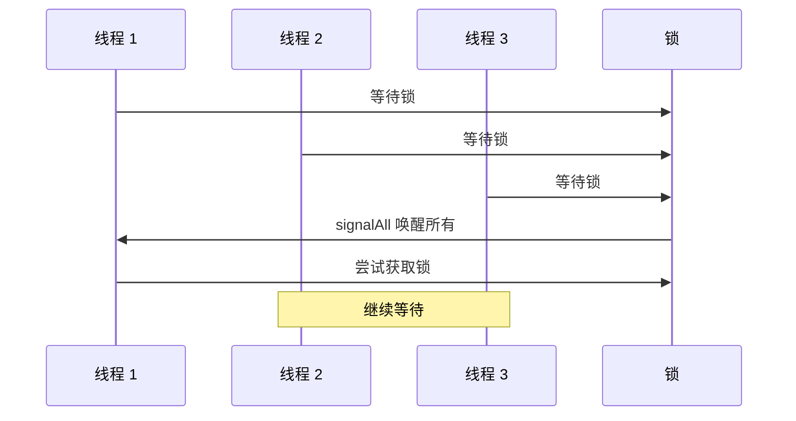

# Condition 条件队列

> **目标级别**：P6
> **面试频率**：🟡 中频

面试官问：「Condition 和 wait/notify 有什么区别？」你说「都可以等待」——然后面试官紧接着追问「那 Condition 的优势是什么？为什么需要 Condition？」你沉默了。

Condition 是 Lock 的配套工具，提供了更灵活的线程协作机制。

## 面试官最关心的 3 个问题

1. ⚠️ Condition 和 Object 的 wait/notify 有什么区别？
2. ⚠️ Condition 是如何实现的？
3. ⚠️ Condition 的 await 和 signal 方法是什么原理？

## 核心原理

### 为什么需要 Condition？

Object 的 wait/notify 有以下限制：

| 限制 | 说明 |
|------|------|
| 只能有一个条件队列 | 多个条件需要多个 wait/notify |
| 必须先持有对象锁 | 使用不便 |
| signal 可能唤醒错误线程 | 不够精确 |

### Condition 的优势

```java
public class BoundedBuffer<E> {
    private final Lock lock = new ReentrantLock();
    private final Condition notFull = lock.newCondition();
    private final Condition notEmpty = lock.newCondition();

    public void put(E e) throws InterruptedException {
        lock.lock();
        try {
            while (isFull()) {
                notFull.await(); // 等待不满
            }
            doPut(e);
            notEmpty.signal(); // 唤醒等待不空的线程
        } finally {
            lock.unlock();
        }
    }

    public E take() throws InterruptedException {
        lock.lock();
        try {
            while (isEmpty()) {
                notEmpty.await(); // 等待不空
            }
            E e = doTake();
            notFull.signal(); // 唤醒等待不满的线程
            return e;
        } finally {
            lock.unlock();
        }
    }
}
```

### Condition vs wait/notify

| 特性 | Object wait/notify | Condition |
|------|-------------------|-----------|
| 条件队列数量 | 1 个 | 多个 |
| 锁对象 | 任意对象 | Lock 接口 |
| 是否自动释放锁 | 否（需手动） | 是（await 自动释放） |
| 可中断等待 | 否 | 是（awaitUninterruptibly） |
| 超时等待 | 否 | 是（awaitNanos） |
| 公平性 | 否 | 可选（取决于 Lock） |

## 实现原理

### ConditionObject 结构

```java
public class ConditionObject implements Condition, Serializable {
    // 条件队列
    private transient Node firstWaiter;
    private transient Node lastWaiter;

    // 等待状态
    private static final int REINTERRUPT =  1;
    private static final int THROW_IE    = -1;
}
```

### await 方法

```java
public final void await() throws InterruptedException {
    if (Thread.interrupted()) {
        throw new InterruptedException();
    }

    // 1. 加入条件队列
    Node node = addConditionWaiter();

    // 2. 释放锁（关键！）
    int savedState = fullyRelease(node);

    // 3. 阻塞等待
    int interruptMode = 0;
    while (!isOnSyncQueue(node)) {
        LockSupport.park(this);
        if ((interruptMode = checkInterruptWhileParked(node)) != 0) {
            break;
        }
    }

    // 4. 重新获取锁
    if (acquireQueued(node, savedState) && interruptMode != THROW_IE) {
        interruptMode = REINTERRUPT;
    }

    if (node.nextWaiter != null) {
        unlinkCancelledWaiters();
    }

    if (interruptMode != 0) {
        reportInterruptAfterWait(interruptMode);
    }
}
```

### signal 方法

```java
public final void signal() {
    if (!isHeldExclusively()) {
        throw new IllegalMonitorStateException();
    }
    Node first = firstWaiter;
    if (first != null) {
        doSignal(first);
    }
}

private void doSignal(Node first) {
    do {
        firstWaiter = first.nextWaiter;
        first.nextWaiter = null;
        // 转移到 AQS 队列
    } while (!transferForSignal(first) && (first = firstWaiter) != null);
}

final boolean transferForSignal(Node node) {
    if (!compareAndSetWaitStatus(node, Node.CONDITION, 0)) {
        return false; // 已经被取消
    }
    // 加入 AQS 队列，等待唤醒
    Node p = enq(node);
    int ws = node.waitStatus;
    if (ws > 0 || !compareAndSetWaitStatus(node, 0, Node.SIGNAL)) {
        LockSupport.unpark(node.thread);
    }
    return true;
}
```

## await 方法族

| 方法 | 说明 |
|------|------|
| `await()` | 等待，可响应中断 |
| `awaitUninterruptibly()` | 等待，不可响应中断 |
| `awaitNanos(long nanos)` | 等待指定纳秒，返回剩余时间 |
| `await(long time, TimeUnit unit)` | 等待指定时间 |
| `awaitUntil(Date deadline)` | 等待直到指定时间 |

```java
public class AwaitDemo {
    private final Lock lock = new ReentrantLock();
    private final Condition condition = lock.newCondition();

    public void awaitExample() throws InterruptedException {
        lock.lock();
        try {
            // 可中断等待
            condition.await();

            // 不可中断等待
            condition.awaitUninterruptibly();

            // 超时等待（5 秒）
            long nanosRemaining = condition.awaitNanos(5_000_000_000L);
            if (nanosRemaining <= 0) {
                // 超时
            }

            // 指定时间等待
            boolean signaled = condition.await(5, TimeUnit.SECONDS);
        } finally {
            lock.unlock();
        }
    }
}
```

## signal vs signalAll

| 方法 | 说明 |
|------|------|
| `signal()` | 唤醒一个等待线程 |
| `signalAll()` | 唤醒所有等待线程 |

```java
// signal 示例：生产者-消费者
public class ProducerConsumer {
    private final Lock lock = new ReentrantLock();
    private final Condition notFull = lock.newCondition();
    private final Condition notEmpty = lock.newCondition();

    public void put(Object item) {
        lock.lock();
        try {
            while (isFull()) {
                notFull.await(); // 等待不满
            }
            doPut(item);
            notEmpty.signal(); // 唤醒一个消费者
        } finally {
            lock.unlock();
        }
    }
}

// signalAll 示例：状态变化需要通知所有等待者
public class StateChange {
    private final Lock lock = new ReentrantLock();
    private final Condition stateChanged = lock.newCondition();
    private volatile boolean state = false;

    public void waitForStateChange() throws InterruptedException {
        lock.lock();
        try {
            while (!state) {
                stateChanged.await(); // 等待状态变化
            }
        } finally {
            lock.unlock();
        }
    }

    public void changeState() {
        lock.lock();
        try {
            state = true;
            stateChanged.signalAll(); // 通知所有等待者
        } finally {
            lock.unlock();
        }
    }
}
```

## 高频面试题

### 🔴 题目 1：Condition 和 wait/notify 的区别？

**参考回答**：

| 区别 | Condition | Object wait/notify |
|------|-----------|-------------------|
| 条件队列 | 多个 | 一个 |
| 锁获取 | 必须先获取 Lock | 必须先获取对象锁 |
| 锁释放 | await 自动释放 | 需要手动 synchronized 块外等待 |
| 超时等待 | 支持 | 不支持 |
| 中断支持 | 支持 | 不支持 |

### 🔴 题目 2：await 为什么自动释放锁？

**参考回答**：

`await()` 方法内部调用了 `fullyRelease(node)`，在阻塞前释放锁：

```java
private void await() {
    Node node = addConditionWaiter();
    int savedState = fullyRelease(node); // 释放锁
    LockSupport.park(this); // 阻塞
    // ...
}
```

这与 `wait()` 不同，`wait()` 需要在 synchronized 块内手动等待释放。

### 🔴 题目 3：signal 之后等待线程会立即执行吗？

**参考回答**：

不会。`signal()` 只是将线程从 Condition 队列转移到 AQS 队列：



## 常见错误与陷阱

### ⚠️ 陷阱 1：不在锁内使用 Condition

```java
// ❌ 错误：IllegalMonitorStateException
Condition condition = lock.newCondition();
condition.await(); // 不持有锁

// ✅ 正确
lock.lock();
try {
    condition.await();
} finally {
    lock.unlock();
}
```

### ⚠️ 陷阱 2：虚假唤醒

```java
// ❌ 错误：使用 if 判断
if (!condition) {
    condition.await(); // 可能被意外唤醒
}

// ✅ 正确：使用 while 循环
while (!condition) {
    condition.await();
}
```

### ⚠️ 陷阱 3：忘记唤醒

```java
// ❌ 可能导致永久等待
lock.lock();
try {
    while (!ready) {
        readyCondition.await();
    }
    // 忘记调用 readyCondition.signal();
} finally {
    lock.unlock();
}
```

## 加分回答

### 💡 signalAll 的开销

`signalAll()` 会唤醒所有等待线程，但只有一个能获取锁：



## 总结对比表

| 方法 | 说明 | 特点 |
|------|------|------|
| `await()` | 等待 | 可中断 |
| `awaitUninterruptibly()` | 等待 | 不可中断 |
| `awaitNanos()` | 等待 | 超时返回剩余时间 |
| `signal()` | 唤醒一个 | 随机 |
| `signalAll()` | 唤醒全部 | 全部唤醒 |

## 延伸思考

### 面试官可能会继续追问

1. 「Condition 的实现原理是什么？」
2. 「为什么 await 要先加入条件队列再释放锁？」
3. 「Lock 和 synchronized 哪个更好？」

### 回答方向

关于 signal 的实现：signal 只是把节点从 Condition 队列转移到 AQS 队列，并不立即唤醒线程。线程被唤醒后还需要重新竞争锁才能继续执行。
