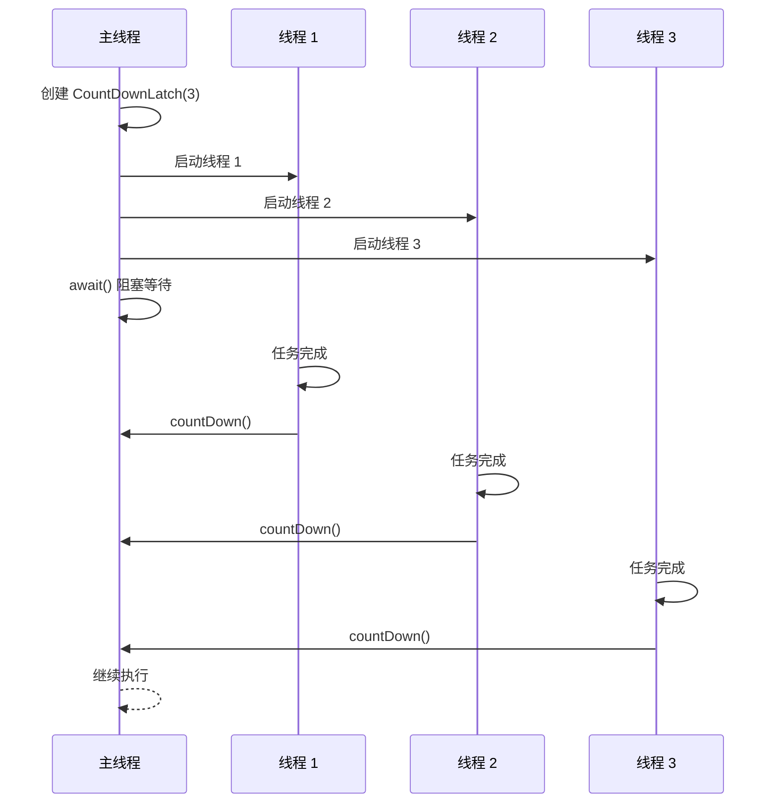
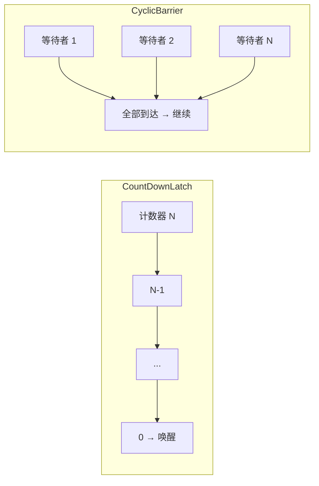

# CountDownLatch 原理

> **目标级别**：P5/P6
> **面试频率**：🔴 高频

面试官问：「CountDownLatch 是什么？」你说「计数器」——然后面试官紧接着追问「那 CountDownLatch 和 CyclicBarrier 有什么区别？」你沉默了。

CountDownLatch 是并发编程中最常用的工具之一，理解其原理才能正确使用。

## 面试官最关心的 3 个问题

1. ⚠️ CountDownLatch 的原理是什么？
2. ⚠️ CountDownLatch 和 CyclicBarrier 的区别是什么？
3. ⚠️ CountDownLatch 适合什么场景？

## 核心原理

### 基本概念

CountDownLatch（倒计时锁）是一种同步工具，允许一个或多个线程等待其他线程完成操作。



### 基本使用

```java
public class CountDownLatchDemo {
    public static void main(String[] args) throws InterruptedException {
        CountDownLatch latch = new CountDownLatch(3);

        // 启动 3 个线程
        for (int i = 0; i < 3; i++) {
            final int threadNum = i;
            new Thread(() -> {
                try {
                    System.out.println("线程 " + threadNum + " 执行中");
                    Thread.sleep(1000);
                    System.out.println("线程 " + threadNum + " 执行完成");
                } catch (InterruptedException e) {
                    e.printStackTrace();
                } finally {
                    latch.countDown();
                }
            }).start();
        }

        // 等待所有线程完成
        latch.await();
        System.out.println("所有线程执行完成，主线程继续");
    }
}
```

## 实现原理

### AQS 共享模式

```java
// CountDownLatch 内部
public class CountDownLatch {
    private final Sync sync;

    private static final class Sync extends AbstractQueuedSynchronizer {
        protected int tryAcquireShared(int acquires) {
            return getState() == 0 ? 1 : -1;
        }

        protected boolean tryReleaseShared(int decrements) {
            for (;;) {
                int c = getState();
                if (c == 0) return false; // 已经是 0
                int nextc = c - 1;
                if (compareAndSetState(c, nextc)) {
                    return nextc == 0; // 只有变为 0 才返回 true
                }
            }
        }
    }
}
```

### await 方法

```java
public void await() throws InterruptedException {
    sync.acquireSharedInterruptibly(1);
}

public final void acquireSharedInterruptibly(int arg) {
    if (Thread.interrupted()) {
        throw new InterruptedException();
    }
    if (tryAcquireShared(arg) < 0) {
        doAcquireSharedInterruptibly(arg); // 进入 AQS 队列等待
    }
}
```

### countDown 方法

```java
public void countDown() {
    sync.releaseShared(1);
}

public final boolean releaseShared(int arg) {
    if (tryReleaseShared(arg)) {
        doReleaseShared(); // 唤醒等待线程
        return true;
    }
    return false;
}
```

## CountDownLatch vs CyclicBarrier

| 区别 | CountDownLatch | CyclicBarrier |
|------|---------------|---------------|
| **用途** | 一个或多个线程等待其他线程 | 一组线程互相等待 |
| **重置** | 不可重置 | 可重置 |
| **计数方向** | 递减到 0 | 递增到指定值 |
| **重用** | 一次性 | 可循环使用 |
| **等待线程** | 主线程 | 所有参与线程 |
| **实现** | AQS 共享模式 | ReentrantLock + Condition |

### 对比图示



### 使用场景对比

**CountDownLatch 场景**：

```java
// 场景：主线程等待多个子任务完成
public class TaskDemo {
    public void process() throws InterruptedException {
        CountDownLatch latch = new CountDownLatch(3);

        // 启动 3 个子任务
        for (int i = 0; i < 3; i++) {
            executor.submit(() -> {
                try {
                    doTask();
                } finally {
                    latch.countDown();
                }
            });
        }

        // 主线程等待
        latch.await();
        System.out.println("所有子任务完成");
    }
}
```

**CyclicBarrier 场景**：

```java
// 场景：多线程协同工作
public class GameDemo {
    public void startGame() throws InterruptedException {
        CyclicBarrier barrier = new CyclicBarrier(4, () -> {
            System.out.println("所有人都准备好了，开始！");
        });

        for (int i = 0; i < 4; i++) {
            final int player = i;
            executor.submit(() -> {
                try {
                    prepare();
                    barrier.await(); // 等待其他人准备好
                    play();
                } catch (Exception e) {
                    e.printStackTrace();
                }
            });
        }
    }
}
```

## 高频面试题

### 🔴 题目 1：CountDownLatch 的原理是什么？

**参考回答**：

CountDownLatch 基于 AQS 的共享模式实现：

1. **state**：计数器值，初始为 N
2. **await**：线程调用 acquireShared，检查 state 是否为 0
3. **countDown**：线程完成任务后调用 releaseShared，state -1
4. **唤醒**：state 变为 0 时，唤醒所有等待线程

### 🔴 题目 2：CountDownLatch 和 CyclicBarrier 的区别？

**参考回答**：

| 区别 | CountDownLatch | CyclicBarrier |
|------|---------------|---------------|
| **线程关系** | 主线程等待子线程 | 线程之间互相等待 |
| **重置** | 不可重置 | 可重置，可复用 |
| **计数器** | 递减到 0 | 递增到 N |
| **执行顺序** | 主线程最后执行 | 所有线程同时继续 |

### 🔴 题目 3：CountDownLatch 适合什么场景？

**参考回答**：

1. **多线程任务合并**：主线程等待多个子任务完成
2. **初始化操作**：等待多个资源初始化完成
3. **关闭操作**：等待多个任务优雅关闭

## 常见错误与陷阱

### ⚠️ 陷阱 1：忘记 countDown

```java
// ❌ 可能导致永久等待
try {
    doTask();
    // 忘记调用 latch.countDown();
} catch (Exception e) {
    // ...
}
```

### ⚠️ 陷阱 2：线程池中的 countDown

```java
// ❌ 如果线程池拒绝任务，countDown 可能不执行
executor.submit(() -> {
    doTask();
    latch.countDown();
});

// ✅ 使用 try-finally 确保执行
executor.submit(() -> {
    try {
        doTask();
    } finally {
        latch.countDown();
    }
});
```

### ⚠️ 陷阱 3：countDown 后 state 不会恢复

```java
CountDownLatch latch = new CountDownLatch(2);
latch.countDown();
latch.countDown();
// state = 0，无法重置
latch.await(); // 立即返回
// 无法再次使用
```

## 加分回答

### 💡 await 的超时版本

```java
public class TimeoutDemo {
    public void waitWithTimeout() throws InterruptedException {
        CountDownLatch latch = new CountDownLatch(2);

        // 等待 5 秒
        boolean completed = latch.await(5, TimeUnit.SECONDS);
        if (!completed) {
            System.out.println("等待超时");
        }
    }
}
```

### 💡 Semaphore 模拟 CountDownLatch

```java
// 使用 Semaphore 模拟 CountDownLatch
public class SemaphoreLatch {
    private final Semaphore semaphore;

    public SemaphoreLatch(int count) {
        this.semaphore = new Semaphore(0);
    }

    public void countDown() {
        semaphore.release();
    }

    public void await() throws InterruptedException {
        semaphore.acquire();
    }
}
```

## 总结对比表

| 维度 | CountDownLatch | CyclicBarrier |
|------|---------------|---------------|
| **计数方向** | 递减到 0 | 递增到 N |
| **是否可重置** | 否 | 是 |
| **等待线程** | 通常是主线程 | 所有参与线程 |
| **典型场景** | 等待完成 | 协同开始 |
| **异常中断** | 不影响其他线程 | 可通过 barrierAction 恢复 |

## 延伸思考

### 面试官可能会继续追问

1. 「CountDownLatch 可以用 join 替代吗？」
2. 「CyclicBarrier 的 barrierAction 是什么时候执行的？」
3. 「如何实现一个可重置的 CountDownLatch？」

### 回答方向

关于 join vs CountDownLatch：
- join 只能等待线程结束，无法实现更灵活的控制
- CountDownLatch 可以创建时就指定计数，不依赖线程数量
- CountDownLatch 支持超时和中断
