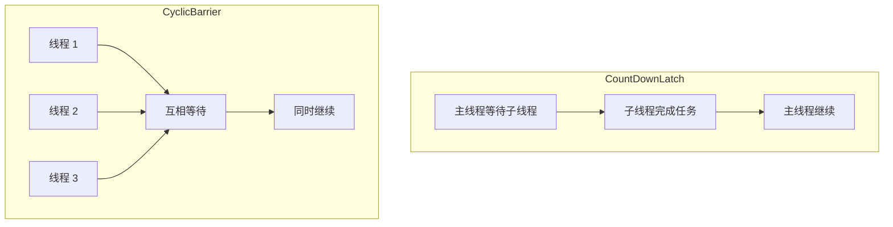

# CyclicBarrier 原理

> **目标级别**：P5/P6
> **面试频率**：🔴 高频

面试官问：「CyclicBarrier 是什么？」你说「可以循环使用的屏障」——然后面试官紧接着追问「那 CyclicBarrier 和 CountDownLatch 有什么区别？」你沉默了。

CyclicBarrier 是多线程协同工作的利器，理解其与 CountDownLatch 的区别才能正确选择。

## 面试官最关心的 3 个问题

1. ⚠️ CyclicBarrier 的原理是什么？
2. ⚠️ CyclicBarrier 和 CountDownLatch 的区别是什么？
3. ⚠️ CyclicBarrier 的 barrierCommand 是什么时候执行的？

## 核心原理

### 基本概念

CyclicBarrier（循环屏障）是一种同步工具，让一组线程相互等待，直到所有线程都到达某个点后再一起继续执行。

```mermaid
sequenceDiagram
    participant T1 as 线程 1
    participant T2 as 线程 2
    participant T3 as 线程 3
    participant B as Barrier

    T1->>B: 到达 barrier
    Note over B: 等待
    T2->>B: 到达 barrier
    Note over B: 等待
    T3->>B: 到达 barrier
    Note over B: 全部到达
    B-->>T1: 全部释放
    B-->>T2: 全部释放
    B-->>T3: 全部释放
    Note over T1,T2,T3: 继续执行
```

### 基本使用

```java
public class CyclicBarrierDemo {
    public static void main(String[] args) {
        CyclicBarrier barrier = new CyclicBarrier(3, () -> {
            System.out.println("所有线程都准备好了，执行 barrierCommand");
        });

        for (int i = 0; i < 3; i++) {
            final int threadNum = i;
            new Thread(() -> {
                try {
                    System.out.println("线程 " + threadNum + " 准备中...");
                    barrier.await(); // 等待其他线程
                    System.out.println("线程 " + threadNum + " 开始执行");
                } catch (Exception e) {
                    e.printStackTrace();
                }
            }).start();
        }
    }
}
```

## 实现原理

### 核心结构

```java
public class CyclicBarrier {
    private final ReentrantLock lock = new ReentrantLock();
    private final Condition trip = lock.newCondition();
    private final int parties;
    private final Runnable barrierCommand;

    private int count;          // 剩余等待线程数
    private Generation generation; // 代，用于 reset
}
```

### await 方法

```java
public int await() throws InterruptedException, BrokenBarrierException {
    return dowait(false, 0L);
}

private int dowait(boolean timed, long nanos) throws InterruptedException, BrokenBarrierException {
    lock.lock();
    try {
        Generation g = generation;

        if (g.broken) {
            throw new BrokenBarrierException();
        }

        if (Thread.interrupted()) {
            breakBarrier();
            throw new InterruptedException();
        }

        int index = --count;
        if (index == 0) { // 最后一个线程到达
            boolean ranAction = false;
            try {
                final Runnable command = barrierCommand;
                if (command != null) {
                    command.run(); // 执行 barrierCommand
                    ranAction = true;
                }
                nextGeneration();
                return 0;
            } finally {
                if (!ranAction) {
                    breakBarrier();
                }
            }
        }

        // 不是最后一个线程，等待
        for (;;) {
            if (!timed) {
                trip.await();
            } else if (nanos > 0L) {
                nanos = trip.awaitNanos(nanos);
            }

            if (g.broken) {
                throw new BrokenBarrierException();
            }

            if (g != generation) {
                return index;
            }

            if (timed && nanos <= 0) {
                breakBarrier();
                throw new TimeoutException();
            }
        }
    } finally {
        lock.unlock();
    }
}
```

### nextGeneration 方法

```java
private void nextGeneration() {
    trip.signalAll(); // 唤醒所有等待线程
    count = parties;  // 重置计数器
    generation = new Generation();
}
```

## CyclicBarrier vs CountDownLatch

| 区别 | CyclicBarrier | CountDownLatch |
|------|---------------|---------------|
| **线程关系** | 线程之间互相等待 | 主线程等待子线程 |
| **重置** | 可重置（循环使用） | 不可重置 |
| **计数器** | 递减到 0 | 递减到 0 |
| **执行时机** | 最后一个到达时执行 barrierCommand | 到达 0 时全部唤醒 |
| **重用** | 可循环使用 | 一次性 |
| **等待线程** | 所有参与线程 | 通常是主线程 |

### 场景对比



## 高频面试题

### 🔴 题目 1：CyclicBarrier 的原理是什么？

**参考回答**：

CyclicBarrier 基于 ReentrantLock 和 Condition 实现：

1. **ReentrantLock**：保证计数器操作的原子性
2. **Condition**：等待和唤醒线程
3. **计数器**：初始化为 parties，每次 await 减 1
4. **Generation**：标记当前「代」，用于 reset

当最后一个线程调用 await 时，会执行 barrierCommand（如果有），然后唤醒所有等待线程，并重置计数器。

### 🔴 题目 2：CyclicBarrier 和 CountDownLatch 的区别？

**参考回答**：

| 区别 | CyclicBarrier | CountDownLatch |
|------|---------------|---------------|
| **线程关系** | 线程互相等待 | 主线程等待子线程 |
| **可重用** | ✅ 可循环 | ❌ 一次性 |
| **barrierCommand** | 最后线程执行 | 无 |
| **继续执行** | 同时继续 | 主线程继续 |

### 🔴 题目 3：CyclicBarrier 适合什么场景？

**参考回答**：

1. **多线程计算**：多线程分段计算后合并结果
2. **游戏多人同步**：等待所有玩家准备后开始
3. **并行加载**：多线程加载数据后统一处理

## 常见错误与陷阱

### ⚠️ 陷阱 1：BrokenBarrierException

```java
// ❌ 如果一个线程超时，其他线程会进入 BrokenBarrierException
CyclicBarrier barrier = new CyclicBarrier(3);

new Thread(() -> {
    barrier.await(1, TimeUnit.SECONDS); // 超时
}).start();

new Thread(() -> {
    barrier.await(); // BrokenBarrierException！
}).start();
```

### ⚠️ 陷阱 2：reset 导致异常

```java
// ❌ reset 可能导致正在 await 的线程抛异常
barrier.await();
// 其他线程正在等待
barrier.reset(); // 打破屏障
```

### ⚠️ 陷阱 3：忘记 barrierCommand 的顺序

```java
// barrierCommand 在最后一个线程到达时执行
// 但所有线程会同时被唤醒

CyclicBarrier barrier = new CyclicBarrier(2, () -> {
    System.out.println("A"); // 最后执行
});

new Thread(() -> {
    barrier.await();
    System.out.println("B"); // 和 "A" 顺序不确定
}).start();
```

## 加分回答

### 💡 多轮使用示例

```java
public class MultiRoundDemo {
    public void multiRound() throws InterruptedException {
        CyclicBarrier barrier = new CyclicBarrier(3);

        for (int round = 0; round < 3; round++) {
            System.out.println("=== 第 " + round + " 轮 ===");
            for (int i = 0; i < 3; i++) {
                final int threadNum = i;
                new Thread(() -> {
                    try {
                        System.out.println("线程 " + threadNum + " 准备");
                        barrier.await();
                        System.out.println("线程 " + threadNum + " 执行");
                    } catch (Exception e) {
                        e.printStackTrace();
                    }
                }).start();
            }
            Thread.sleep(1000);
        }
    }
}
```

### 💡 isBroken 检查

```java
CyclicBarrier barrier = new CyclicBarrier(3);

barrier.await();

// 检查屏障是否被打破
if (barrier.isBroken()) {
    System.out.println("屏障已被打破");
}

// 重置屏障
barrier.reset();
```

## 总结对比表

| 特性 | CountDownLatch | CyclicBarrier |
|------|---------------|---------------|
| **是否可以重用** | ❌ | ✅ |
| **是否自动重置** | ❌ | ✅ |
| **barrierCommand** | 无 | 有 |
| **线程关系** | 等待其他线程完成 | 线程间互相等待 |
| **最后到达时** | 唤醒等待线程 | 执行 action + 唤醒 |

## 延伸思考

### 面试官可能会继续追问

1. 「CyclicBarrier 的 Generation 是干什么的？」
2. 「Phaser 和 CyclicBarrier 有什么区别？」
3. 「如何在 CyclicBarrier 中实现超时处理？」

### 回答方向

关于 Generation：Generation 用于标记每一轮的执行。当 reset 或屏障被打破时，会创建新的 Generation，已有的等待线程会通过检查 generation 判断是否需要继续等待。
