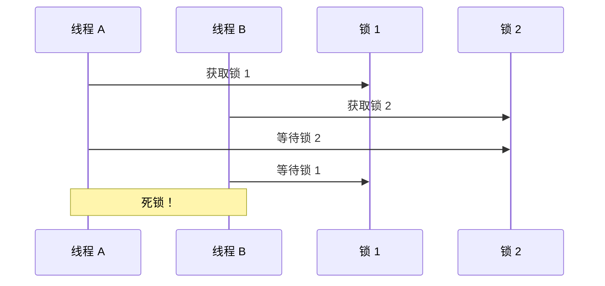
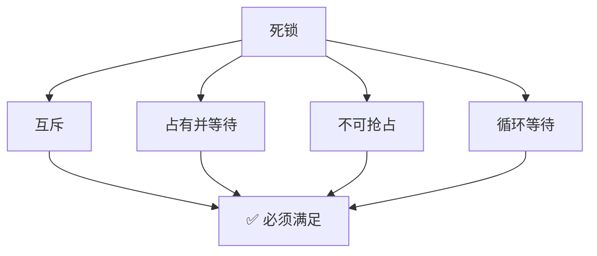

# 死锁条件与排查

> **目标级别**：P5/P6
> **面试频率**：🔴 高频

面试官问：「什么是死锁？」你说「两个线程互相等待」——然后面试官紧接着追问「那如何排查和解决死锁？」你沉默了。

死锁是并发编程中最严重的问题之一，理解其条件才能预防和解决。

## 面试官最关心的 3 个问题

1. ⚠️ 死锁的四个必要条件是什么？
2. ⚠️ 如何检测和排查死锁？
3. ⚠️ 如何预防死锁？

## 核心原理

### 死锁的定义

死锁是指两个或多个线程相互持有对方需要的资源，形成循环等待，导致线程无法继续执行。



### 死锁的四个必要条件

| 条件 | 说明 |
|------|------|
| **互斥条件** | 资源只能被一个线程持有 |
| **占有并等待** | 线程持有资源并等待其他资源 |
| **不可抢占** | 资源不能被强制释放 |
| **循环等待** | 线程之间形成循环等待 |

### 只有四个条件同时满足才会死锁



## 死锁示例

### 最简单的死锁

```java
public class SimpleDeadlock {
    private final Object lock1 = new Object();
    private final Object lock2 = new Object();

    public void method1() {
        synchronized (lock1) {
            synchronized (lock2) {
                System.out.println("Method 1");
            }
        }
    }

    public void method2() {
        synchronized (lock2) { // ⚠️ 顺序与 method1 相反
            synchronized (lock1) {
                System.out.println("Method 2");
            }
        }
    }
}
```

### 账户转账死锁

```java
public class Account {
    private final int id;
    private int balance;

    public void transfer(Account target, int amount) {
        Account first = this.hashCode() < target.hashCode() ? this : target;
        Account second = this.hashCode() < target.hashCode() ? target : this;

        synchronized (first) {
            synchronized (second) {
                this.balance -= amount;
                target.balance += amount;
            }
        }
    }
}
```

## 死锁检测

### 1. Jstack 检测

```bash
# 查看 Java 进程
jps -l

# 生成线程 dump
jstack <pid>

# 输出示例
Found one Java-level deadlock:
=====================
"Thread-1":
  waiting for lock on java/lang/Object@7a811fdd, held by Thread-0
"Thread-0":
  waiting for lock on java/lang/Object@6bc261d4, held by Thread-1
```

### 2. JConsole 检测

```bash
# 启动 JConsole
jconsole
```

连接进程后，在「线程」标签页可以查看死锁。

### 3. VisualVM 检测

```bash
# 启动 VisualVM
jvisualvm
```

### 4. 代码检测

```java
// 通过 ThreadMXBean 检测死锁
import java.lang.management.*;

ThreadMXBean threadMXBean = ManagementFactory.getThreadMXBean();
long[] deadLockThreadIds = threadMXBean.findDeadlockedThreads();

if (deadLockThreadIds != null && deadLockThreadIds.length > 0) {
    ThreadInfo[] infos = threadMXBean.getThreadInfo(deadLockThreadIds);
    for (ThreadInfo info : infos) {
        System.out.println("Deadlock thread: " + info.getThreadName());
    }
}
```

## 死锁解决策略

### 策略一：破坏循环等待

**按固定顺序获取锁**

```java
public class FixedOrderTransfer {
    public void transfer(Account from, Account to, int amount) {
        Account first = from.id < to.id ? from : to;
        Account second = from.id < to.id ? to : from;

        synchronized (first) {
            synchronized (second) {
                from.balance -= amount;
                to.balance += amount;
            }
        }
    }
}
```

### 策略二：破坏不可抢占

**使用 tryLock**

```java
public class TryLockTransfer {
    public void transfer(Account from, Account to, int amount) {
        while (true) {
            if (from.lock.tryLock()) {
                try {
                    if (to.lock.tryLock()) {
                        try {
                            from.balance -= amount;
                            to.balance += amount;
                            return;
                        } finally {
                            to.lock.unlock();
                        }
                    }
                } finally {
                    from.lock.unlock();
                }
            }
            Thread.sleep(100); // 等待后重试
        }
    }
}
```

### 策略三：超时机制

```java
public class TimeoutTransfer {
    public void transfer(Account from, Account to, int amount) {
        long timeout = 1000; // 1 秒超时
        long deadline = System.currentTimeMillis() + timeout;

        while (System.currentTimeMillis() < deadline) {
            if (from.lock.tryLock(timeout, TimeUnit.MILLISECONDS)) {
                try {
                    if (to.lock.tryLock(timeout, TimeUnit.MILLISECONDS)) {
                        try {
                            from.balance -= amount;
                            to.balance += amount;
                            return;
                        } finally {
                            to.lock.unlock();
                        }
                    }
                } finally {
                    from.lock.unlock();
                }
            }
        }
        throw new RuntimeException("Transfer timeout");
    }
}
```

## 高频面试题

### 🔴 题目 1：死锁的四个必要条件是什么？

**参考回答**：

死锁的四个必要条件：

1. **互斥条件**：资源只能被一个线程持有
2. **占有并等待**：线程持有资源并等待其他资源
3. **不可抢占**：资源不能被强制从持有线程中抢走
4. **循环等待**：线程之间形成循环等待链

### 🔴 题目 2：如何排查死锁？

**参考回答**：

排查死锁的方法：

1. **Jstack**：生成线程 dump，查看死锁信息
2. **JConsole**：图形化查看线程状态
3. **VisualVM**：查看线程和锁信息
4. **代码检测**：使用 ThreadMXBean.findDeadlockedThreads()

### 🔴 题目 3：如何预防死锁？

**参考回答**：

| 策略 | 方法 |
|------|------|
| **破坏互斥** | 使用无锁数据结构（如 ConcurrentHashMap） |
| **破坏占有并等待** |一次性获取所有需要的锁 |
| **破坏不可抢占** | 使用 tryLock，超时后回滚 |
| **破坏循环等待** | 按固定顺序获取锁 |

## 常见错误与陷阱

### ⚠️ 陷阱 1：加锁顺序不一致

```java
// ❌ 不同方法加锁顺序不一致
public void method1() {
    synchronized (A) { synchronized (B) {} }
}

public void method2() {
    synchronized (B) { synchronized (A) {} } // ⚠️ 死锁
}
```

### ⚠️ 陷阱 2：锁嵌套过深

```java
// ❌ 锁嵌套过深容易死锁
synchronized (A) {
    synchronized (B) {
        synchronized (C) {
            synchronized (D) {} // 风险大
        }
    }
}
```

### ⚠️ 陷阱 3：在持有锁时调用外部方法

```java
// ❌ 持有锁时调用外部方法
synchronized (this) {
    externalService.doSomething(); // ⚠️ 可能回调导致死锁
}
```

## 加分回答

### 💡 活锁

活锁是线程不会阻塞，但无法继续执行：

```java
// 活锁示例：两个线程都在重试
while (true) {
    if (lock.tryLock()) {
        try {
            // 业务逻辑
        } finally {
            lock.unlock();
        }
    } else {
        Thread.sleep(10); // 等待后重试
    }
}
```

### 💡 饥饿

饥饿是指线程长期得不到 CPU 时间片：

| 问题 | 原因 |
|------|------|
| 线程饥饿 | 优先级过低 |
| 锁饥饿 | 长时间等待同一锁 |
| 资源饥饿 | 资源分配不均 |

## 总结对比表

| 死锁问题 | 解决策略 |
|---------|---------|
| 循环等待 | 按固定顺序获取锁 |
| 不可抢占 | 使用 tryLock |
| 占有并等待 | 一次性获取所有锁 |
| 互斥 | 无锁数据结构 |

## 延伸思考

### 面试官可能会继续追问

1. 「除了死锁，还有哪些并发问题？」
2. 「什么是活锁？如何解决？」
3. 「哲学家就餐问题怎么解决？」

### 回答方向

关于哲学家就餐问题：
- 资源排序：编号低的先拿
- 领导选举：一个线程主动放弃
- 超时机制：拿不到就放弃
- 服务员检查：限制同时拿筷子的人数
