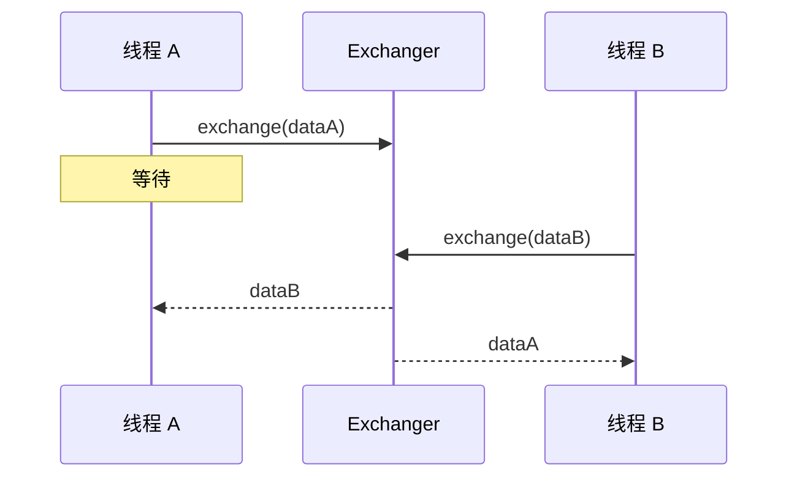
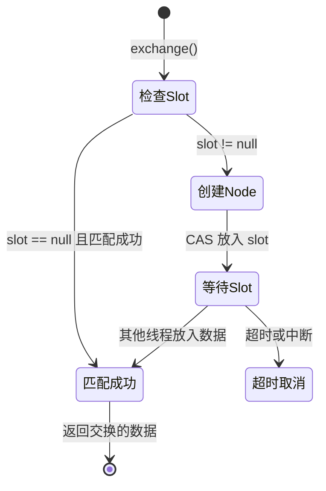
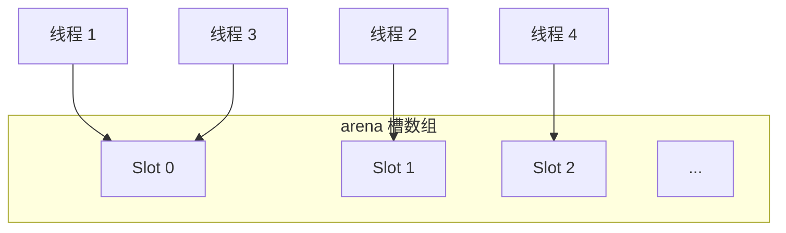

# Exchanger 原理

> **目标级别**：P6
> **面试频率**：🟢 低频

面试官问：「Exchanger 是什么？」你说「线程间交换数据」——然后面试官紧接着追问「那 Exchanger 是怎么实现的？为什么只能两两交换？」你沉默了。

Exchanger 是并发工具中比较冷门的一个，理解其原理有助于深入理解并发编程。

## 面试官最关心的 3 个问题

1. ⚠️ Exchanger 的原理是什么？
2. ⚠️ Exchanger 适合什么场景？
3. ⚠️ Exchanger 只能两两交换吗？

## 核心原理

### 基本概念

Exchanger（交换器）用于两个线程之间交换数据。



### 基本使用

```java
public class ExchangerDemo {
    public static void main(String[] args) {
        Exchanger<String> exchanger = new Exchanger<>();

        new Thread(() -> {
            try {
                String data = "A 的数据";
                String received = exchanger.exchange(data);
                System.out.println("线程 A 收到: " + received);
            } catch (InterruptedException e) {
                e.printStackTrace();
            }
        }).start();

        new Thread(() -> {
            try {
                String data = "B 的数据";
                String received = exchanger.exchange(data);
                System.out.println("线程 B 收到: " + received);
            } catch (InterruptedException e) {
                e.printStackTrace();
            }
        }).start();
    }
}
```

### 带超时的交换

```java
Exchanger<String> exchanger = new Exchanger<>();

String received = exchanger.exchange("data", 5, TimeUnit.SECONDS);
```

## 实现原理

### Slot 和 Node

```java
public class Exchanger<V> {
    private final Exchanger.Node[] arena;    // 槽数组
    private final Exchanger.Node slot;       // 单槽
    private final Exchanger.Node EMPTY;      // 空节点
}

static final class Node {
    final int index;           // 节点索引
    final int bound;           // 边界值
    final int collides;        // 冲突计数
    final int hash;            // 伪随机哈希
    final Object item;         // 交换的数据
    volatile Object hit;        // 匹配线程的数据
    volatile int status;        // 节点状态
}
```

### 交换流程



### 多线程竞争

Exchanger 使用**槽数组**处理多线程竞争：



## 典型应用场景

### 1. 遗传算法

```java
public class GeneticAlgorithm {
    private final Exchanger<Individual> exchanger = new Exchanger<>();

    public void evolve() throws InterruptedException {
        for (int i = 0; i < GENERATIONS; i++) {
            Individual mate = exchanger.exchange(currentBest);
            currentBest = crossover(currentBest, mate);
            mutate(currentBest);
        }
    }
}
```

### 2. 数据管道

```java
public class DataPipeline {
    private final Exchanger<Buffer> exchanger = new Exchanger<>();

    // 生产者
    public void produce() throws InterruptedException {
        Buffer full = createFullBuffer();
        Buffer empty = exchanger.exchange(full);
        fillBuffer(empty);
    }

    // 消费者
    public void consume() throws InterruptedException {
        Buffer empty = createEmptyBuffer();
        Buffer full = exchanger.exchange(empty);
        processBuffer(full);
    }
}
```

### 3. 双缓冲

```java
public class DoubleBuffering<T> {
    private final Exchanger<Buffer<T>> exchanger = new Exchanger<>();

    public void process() throws InterruptedException {
        Buffer<T> writeBuffer = new Buffer<>();
        Buffer<T> readBuffer = null;

        while (true) {
            // 写入数据
            writeToBuffer(writeBuffer);

            // 交换缓冲区
            readBuffer = exchanger.exchange(writeBuffer);

            // 处理数据
            processBuffer(readBuffer);

            // 清空缓冲区
            writeBuffer = readBuffer;
            clearBuffer(writeBuffer);
        }
    }
}
```

## 高频面试题

### 🔴 题目 1：Exchanger 的原理是什么？

**参考回答**：

Exchanger 基于 **槽（Slot）机制** 实现：

1. **单槽模式**：两个线程时，使用单个 slot 直接交换
2. **多槽模式**：多个线程时，使用 arena 数组分散竞争
3. **CAS 原子交换**：通过 CAS 保证数据交换的原子性
4. **自旋等待**：未匹配时自旋等待，提高响应速度

### 🔴 题目 2：Exchanger 适合什么场景？

**参考回答**：

1. **双缓冲**：读写分离，减少锁竞争
2. **数据管道**：生产者-消费者场景
3. **遗传算法**：个体交换
4. **任何需要两线程交换数据的场景**

### 🟡 题目 3：Exchanger 只能两两交换吗？

**参考回答**：

是的，Exchanger 只能两两交换数据。如果需要多线程数据交换，需要组合多个 Exchanger 或使用其他机制。

## 常见错误与陷阱

### ⚠️ 陷阱 1：超时处理不当

```java
// ❌ 没有超时，可能永久等待
exchanger.exchange(data);

// ✅ 使用超时
try {
    exchanger.exchange(data, 5, TimeUnit.SECONDS);
} catch (TimeoutException e) {
    // 处理超时
}
```

### ⚠️ 陷阱 2：只有一个线程调用 exchange

```java
// ❌ 永久等待！
new Thread(() -> {
    exchanger.exchange("data");
}).start();
// 没有其他线程调用 exchange

// ✅ 确保有两个线程
```

### ⚠️ 陷阱 3：交换 null 值

```java
// ⚠️ 交换 null 是允许的
exchanger.exchange(null); // 合法

// 但可能导致混淆
```

## 加分回答

### 💡 Exchanger 与 SynchronousQueue

Exchanger 可以看作双向的 SynchronousQueue：

| 特性 | SynchronousQueue | Exchanger |
|------|-----------------|-----------|
| 数据流 | 单向 | 双向 |
| 匹配 | 读写匹配 | 数据交换 |
| 容量 | 0 | 0 |
| 用途 | 生产者-消费者 | 数据交换 |

## 总结对比表

| 方法 | 说明 |
|------|------|
| `exchange(V x)` | 交换数据，阻塞等待 |
| `exchange(V x, long timeout, TimeUnit unit)` | 超时交换 |

## 延伸思考

### 面试官可能会继续追问

1. 「Exchanger 为什么不能多对多交换？」
2. 「Exchanger 的 arena 是如何工作的？」
3. 「Exchanger 和 LinkedBlockingQueue 有什么区别？」

### 回答方向

关于多对多交换：Exchanger 设计目标是两线程高效交换，多对多需要更复杂的匹配算法。实现上可以组合多个 Exchanger 或使用其他数据结构。
