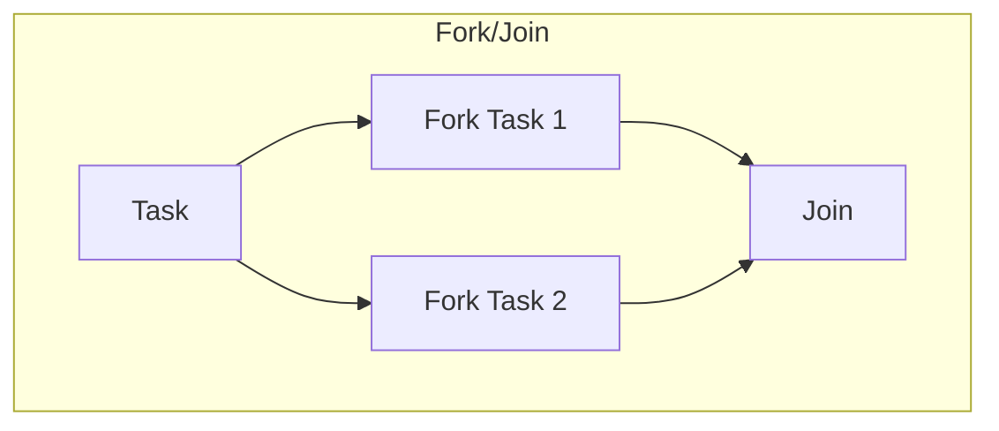
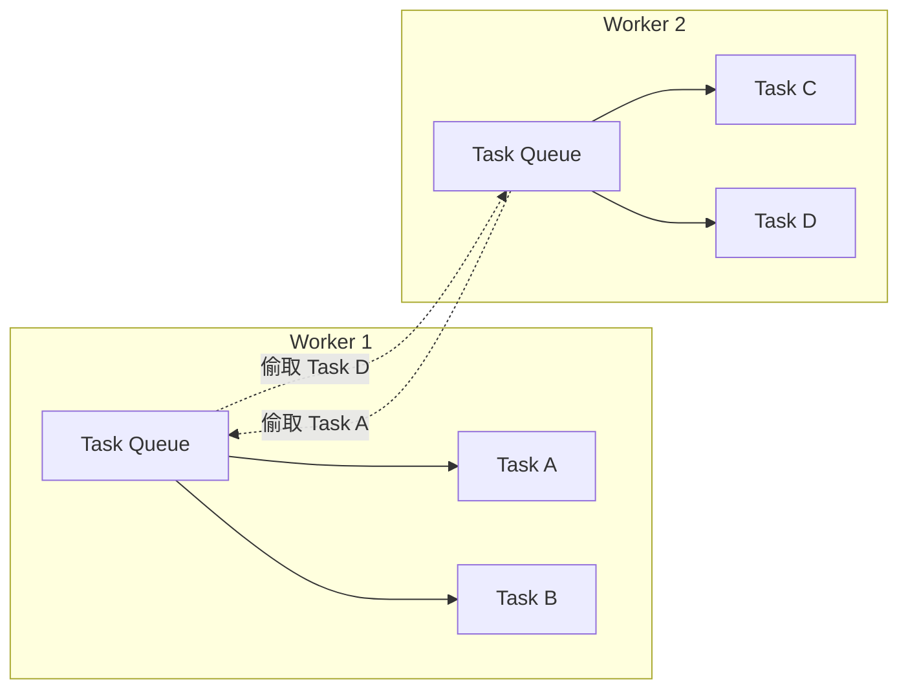
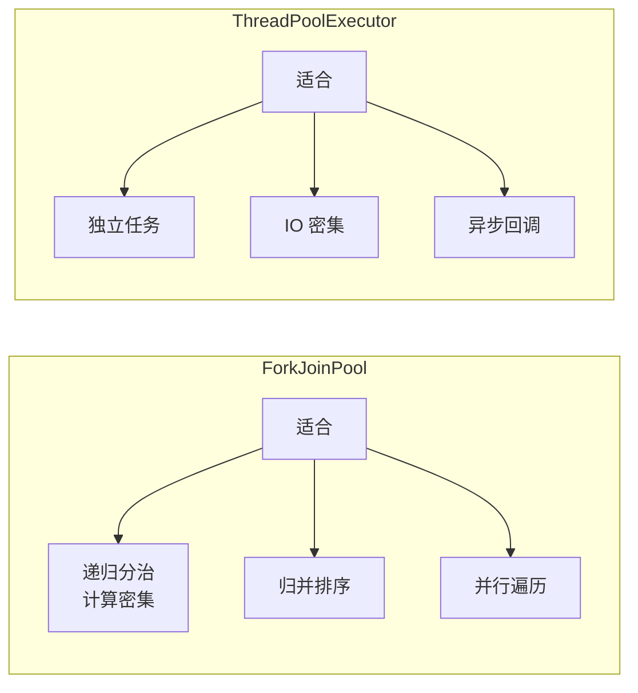

# Fork/Join 框架

> **目标级别**：P6
> **面试频率**：🟡 中频

面试官问：「Fork/Join 是什么？」你说「分治框架」——然后面试官紧接着追问「那 Fork/Join 和线程池有什么区别？什么是工作窃取？」你沉默了。

Fork/Join 是 Java 7 引入的分治并行框架，理解其原理才能正确使用。

## 面试官最关心的 3 个问题

1. ⚠️ Fork/Join 的原理是什么？
2. ⚠️ Fork/Join 和普通线程池有什么区别？
3. ⚠️ 什么是工作窃取？

## 核心原理

### Fork/Join 框架概述



### ForkJoinPool

```java
// ForkJoinPool 的基本使用
ForkJoinPool pool = new ForkJoinPool();

ForkJoinTask<Integer> task = new RecursiveTask<Integer>() {
    @Override
    protected Integer compute() {
        if (problem.size() <= THRESHOLD) {
            return solveDirectly(problem);
        } else {
            ForkJoinTask<Integer> left = new SubTask().fork();
            ForkJoinTask<Integer> right = new SubTask().fork();
            return left.join() + right.join();
        }
    }
};

Integer result = pool.invoke(task);
```

## 实现原理

### 工作窃取算法



| 特点 | 说明 |
|------|------|
| **双端队列** | 每个 Worker 有自己的任务队列 |
| **LIFO** | Worker 从自己队列头部获取任务 |
| **FIFO** | 偷取者从其他队列尾部获取任务 |

### ForkJoinTask

```java
public abstract class ForkJoinTask<V> extends FutureTask<V> {
    // 分叉：异步执行子任务
    public final ForkJoinTask<V> fork();

    // 合并：等待并获取结果
    public final V join();

    // 执行
    public final V invoke();

    // 抽象方法：子类实现具体计算
    protected abstract boolean exec();
}
```

### RecursiveTask 和 RecursiveAction

```java
// 有返回值
public class SumTask extends RecursiveTask<Long> {
    private final long[] array;
    private final int start;
    private final int end;

    protected Long compute() {
        if (end - start <= THRESHOLD) {
            return Arrays.stream(array, start, end).sum();
        }

        int middle = (start + end) / 2;
        SumTask left = new SumTask(array, start, middle);
        SumTask right = new SumTask(array, middle, end);

        left.fork();
        right.fork();
        return left.join() + right.join();
    }
}

// 无返回值
public class PrintTask extends RecursiveAction {
    protected void compute() {
        if (end - start <= THRESHOLD) {
            for (int i = start; i < end; i++) {
                System.out.println(array[i]);
            }
        } else {
            // 分治
        }
    }
}
```

## Fork/Join vs ThreadPoolExecutor

| 区别 | ForkJoinPool | ThreadPoolExecutor |
|------|-------------|-------------------|
| **设计目标** | 分治任务 | 通用任务 |
| **工作窃取** | ✅ 支持 | ❌ 不支持 |
| **任务队列** | 每个线程独立队列 | 共享队列 |
| **适合任务** | 递归分治 | 独立任务 |
| **线程利用率** | 更高 | 一般 |

### 适用场景对比



## 实际应用

### 1. 归并排序

```java
public class MergeSort extends RecursiveAction {
    private final int[] array;
    private final int left;
    private final int right;
    private static final int THRESHOLD = 1024;

    @Override
    protected void compute() {
        if (right - left <= THRESHOLD) {
            Arrays.sort(array, left, right);
            return;
        }

        int mid = (left + right) / 2;
        MergeSort leftTask = new MergeSort(array, left, mid);
        MergeSort rightTask = new MergeSort(array, mid, right);

        leftTask.fork();
        rightTask.fork();

        leftTask.join();
        rightTask.join();
        merge(left, mid, right);
    }
}
```

### 2. 并行求和

```java
public class ParallelSum extends RecursiveTask<Long> {
    private final long[] array;
    private final int start;
    private final int end;
    private static final int THRESHOLD = 1_000_000;

    @Override
    protected Long compute() {
        int length = end - start;
        if (length <= THRESHOLD) {
            return Arrays.stream(array, start, end).sum();
        }

        int mid = start + length / 2;
        ParallelSum left = new ParallelSum(array, start, mid);
        ParallelSum right = new ParallelSum(array, mid, end);

        left.fork();
        right.fork();

        return left.join() + right.join();
    }
}
```

### 3. 并行计算

```java
// 并行计算 Fibonacci（虽然不适合）
public class Fibonacci extends RecursiveTask<Integer> {
    private final int n;

    protected Integer compute() {
        if (n <= 1) return n;

        Fibonacci f1 = new Fibonacci(n - 1);
        Fibonacci f2 = new Fibonacci(n - 2);

        f1.fork();
        f2.fork();

        return f1.join() + f2.join();
    }
}
```

## 高频面试题

### 🔴 题目 1：Fork/Join 的原理是什么？

**参考回答**：

Fork/Join 的核心是**工作窃取算法**：

1. **Fork**：将任务分叉成子任务
2. **Join**：等待子任务完成并合并结果
3. **Work Stealing**：空闲线程从其他线程队列尾部偷取任务

### 🔴 题目 2：工作窃取是什么？

**参考回答**：

工作窃取（Work Stealing）的特点：

1. 每个 Worker 有一个双端队列
2. Worker 从自己队列头部获取任务（LIFO）
3. 空闲时从其他队列尾部偷取任务（FIFO）
4. 减少线程空闲时间，提高 CPU 利用率

### 🔴 题目 3：Fork/Join 和 ThreadPoolExecutor 有什么区别？

**参考回答**：

| 区别 | ForkJoinPool | ThreadPoolExecutor |
|------|-------------|-------------------|
| **任务队列** | 每个线程独立队列 | 共享队列 |
| **工作窃取** | ✅ | ❌ |
| **适合任务** | 递归分治 | 独立任务 |
| **执行线程** | ForkJoinWorkerThreadFactory | ThreadFactory |

## 常见错误与陷阱

### ⚠️ 陷阱 1：任务粒度太小

```java
// ❌ 任务粒度太小，线程开销大于计算
new RecursiveTask() {
    protected Integer compute() {
        if (size <= 1) return computeDirectly();
        splitAndCompute(); // 过度分叉
    }
};

// ✅ 设置合理的阈值
private static final int THRESHOLD = 10000;
```

### ⚠️ 陷阱 2：使用不当导致栈溢出

```java
// ❌ 递归过深可能导致栈溢出
new RecursiveTask() {
    protected Long compute() {
        if (n <= 1) return n;
        return compute(n - 1) + compute(n - 2); // 递归过深
    }
};

// ✅ 改用迭代或更大的阈值
```

### ⚠️ 陷阱 3：共享可变状态

```java
// ❌ 不要修改共享状态
public class BadTask extends RecursiveTask<Integer> {
    private static int counter = 0; // ⚠️ 共享状态

    protected Integer compute() {
        counter++; // 非线程安全
    }
}
```

## 加分回答

### 💡 ForkJoinPool 的并发度

```java
// 默认并发度 = CPU 核心数
ForkJoinPool pool = ForkJoinPool.commonPool();

// 指定并发度
ForkJoinPool pool = new ForkJoinPool(8); // 8 个线程
```

### 💡 异步执行模式

```java
ForkJoinPool pool = new ForkJoinPool();

// fire-and-forget
pool.execute(forkJoinTask);

// 等待完成
pool.invoke(forkJoinTask);

// 异步获取 Future
ForkJoinTask<V> task = pool.submit(forkJoinTask);
```

## 总结对比表

| 类 | 说明 |
|------|------|
| **ForkJoinPool** | Fork/Join 线程池 |
| **ForkJoinTask** | Fork/Join 任务基类 |
| **RecursiveTask** | 有返回值任务 |
| **RecursiveAction** | 无返回值任务 |
| **CountedCompleter** | 完成后触发回调 |

## 延伸思考

### 面试官可能会继续追问

1. 「ForkJoinPool 的 commonPool 是什么？」
2. 「RecursiveTask 和 RecursiveAction 有什么区别？」
3. 「Java 8 Stream 的并行实现和 Fork/Join 有什么关系？」

### 回答方向

关于 Stream 并行：Java 8 Stream 的并行使用 ForkJoinPool.commonPool()：
```java
// 这两个等价
Arrays.stream(array).parallel().sum();
new ForkJoinPool().invoke(new SumTask(...));
```
