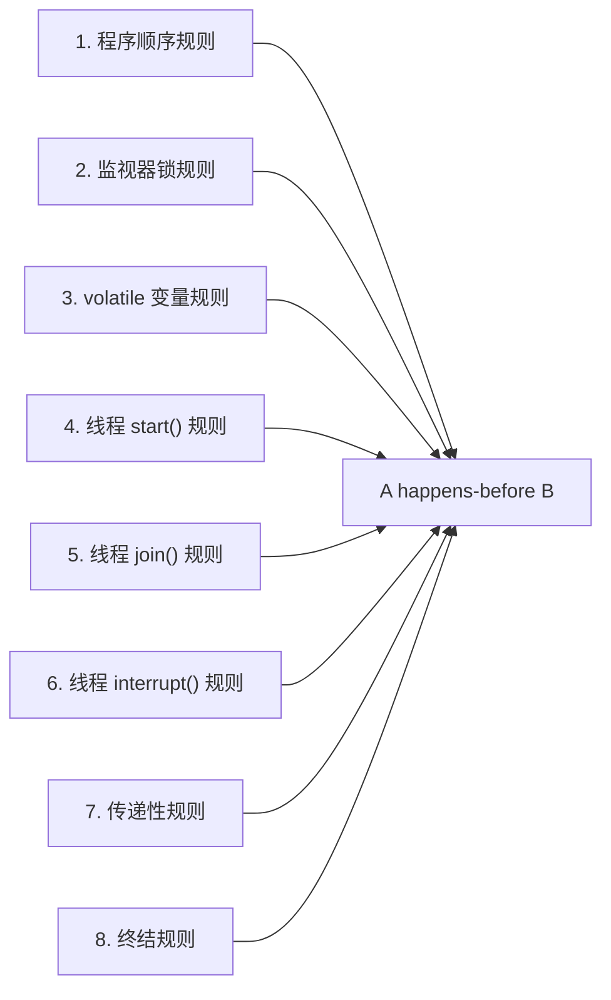
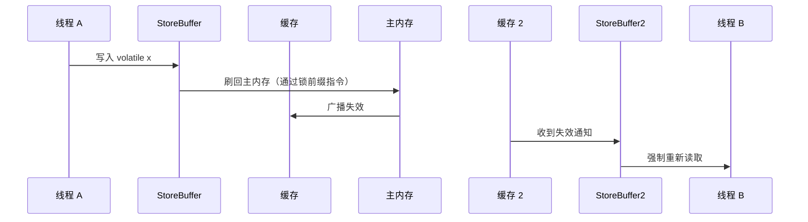

# happens-before 原则

> **目标级别**：P5/P6
> **面试频率**：🔴 高频

面试官问：「什么是 happens-before？」你说「先执行的在前」——然后面试官紧接着追问「那 as-if-serial 和 happens-before 有什么关系？为什么需要 happens-before？」你沉默了。

happens-before 是 JMM 的核心规则，理解它才能理解为什么 synchronized 和 volatile 能保证线程安全。

## 面试官最关心的 3 个问题

1. ⚠️ happens-before 的定义是什么？
2. ⚠️ happens-before 的 8 条规则是什么？
3. ⚠️ happens-before 和 as-if-serial 有什么区别？

## 核心原理

### happens-before 的定义

> 如果操作 A happens-before 操作 B，那么 A 的执行结果对 B 可见，且 A 的执行顺序在 B 之前。

**关键点**：
1. 不是「先后执行」，而是「可见性 + 有序性」
2. 只约束两个操作之间的关系，不约束单个操作
3. 编译器/CPU 可以重排序，只要满足 happens-before 约束

### happens-before 的哲学

happens-before 规则的设计哲学：

```
┌─────────────────────────────────────────────────────────────┐
│                        JMM 的目标                          │
├─────────────────────────────────────────────────────────────┤
│  1. 给程序员一个强内存模型（容易理解）                       │
│  2. 给实现者足够的优化空间                                  │
└─────────────────────────────────────────────────────────────┘
                              ↓
┌─────────────────────────────────────────────────────────────┐
│                    happens-before 规则                     │
├─────────────────────────────────────────────────────────────┤
│  定义了「什么顺序不能打破」，而不是「所有顺序都固定」          │
└─────────────────────────────────────────────────────────────┘
```

### as-if-serial vs happens-before

| 概念 | 说明 | 关系 |
|------|------|------|
| **as-if-serial** | 单线程内，程序看起来是串行执行的 | 保障单线程语义 |
| **happens-before** | 多线程间，操作的可见性和顺序性 | 保障多线程语义 |

```
单线程内：as-if-serial（看起来是串行的）
         ↓
多线程间：happens-before（约束跨线程的可见性）
```

## happens-before 8 条规则

JMM 定义了 8 条 happens-before 规则：

### 规则列表



### 详细说明

#### 1. 程序顺序规则（Program Order Rule）

```java
// 线程内
int a = 1;      // A
int b = 2;      // B
// A happens-before B
```

同一个线程中，前面的操作 happens-before 后面的操作。

#### 2. 监视器锁规则（Monitor Lock Rule）

```java
synchronized (lock) {
    x = 10; // A
} // 释放锁
          // ↓
synchronized (lock) {
    int y = x; // B
} // 获取锁
// A happens-before B
```

监视器锁的解锁 happens-before 后续对这个锁的加锁。

#### 3. volatile 变量规则（Volatile Variable Rule）

```java
volatile boolean flag = false;

Thread A:
    flag = true; // A（写）

Thread B:
    while (!flag) { // B（读）
        // 等待
    }
// A happens-before B
```

volatile 变量的写 happens-before 后续对这个变量的读。

#### 4. Thread start() 规则

```java
Thread B = new Thread(() -> {
    int x = 100; // B1
});

B.start(); // A

// A happens-before B 中的任何操作
// 即 main 线程启动 B 线程之前的操作，B 线程都可见
```

线程的 start() happens-before 线程内的任何操作。

#### 5. Thread join() 规则

```java
Thread B = new Thread(() -> {
    int x = 100; // B1
});
B.start();
B.join(); // 等待 B 结束

int y = x; // A
// B 中所有操作 happens-before join() 返回后的操作
```

线程的所有操作 happens-before join() 返回。

#### 6. Thread interrupt() 规则

```java
Thread B = new Thread(() -> {
    // ...
});
B.interrupt(); // A

// 抛出 InterruptedException 或检测 isInterrupted()
// A happens-before 异常抛出或 isInterrupted() 返回 true
```

线程的 interrupt() happens-before 检测到中断状态。

#### 7. 传递性规则

```java
// A happens-before B
// B happens-before C
// → A happens-before C
```

如果 A happens-before B，且 B happens-before C，则 A happens-before C。

#### 8. 终结规则（Finalizer Rule）

```java
// Object 构造函数结束 happens-before Finalizer.start()
```

对象的构造函数 happens-before 终结器的 start()。

## 应用场景

### volatile + happens-before

```java
public class VolatileDemo {
    private volatile int x = 0;

    public void writer() {
        x = 10; // A（volatile 写）
    }

    public void reader() {
        int y = x; // B（volatile 读）
        // A happens-before B
        // y 一定等于 10
    }
}
```

### synchronized + happens-before

```java
public class SyncDemo {
    private int x = 0;

    public synchronized void writer() {
        x = 10; // A（加锁）
    }

    public synchronized void reader() {
        int y = x; // B（加锁）
        // 解锁 happens-before 加锁
        // A happens-before B
        // y 一定等于 10
    }
}
```

## 高频面试题

### 🔴 题目 1：happens-before 是什么意思？

**参考回答**：

happens-before 表示两个操作之间的偏序关系：
1. **可见性**：前一个操作的结果对后一个操作可见
2. **有序性**：前一个操作在顺序上排在后一个操作之前

**注意**：happens-before 不要求前一个操作必须在后一个操作之前执行，只要求「如果 A happens-before B，那么 A 的结果对 B 可见」。

### 🔴 题目 2：volatile 为什么不保证原子性？

**参考回答**：

volatile 只保证 happens-before 中的 **volatile 变量规则**：volatile 写 happens-before 后续的 volatile 读。

但这不保证复合操作的原子性：

```java
private volatile int counter = 0;

// 线程 A
counter++; // 非原子操作：读取→修改→写入

// 线程 B
counter++; // 可能覆盖 A 的修改
```

`counter++` 是三个操作（读-改-写），volatile 不能保证这三个步骤不被其他线程插入。

### 🟡 题目 3：happens-before 和因果一致性有什么关系？

**参考回答**：

happens-before 是**先行发生**关系，是**强因果一致性**。它保证：

1. 如果 A happens-before B，那么 A 的结果对 B 可见
2. 所有 happens-before 的操作都必须按顺序执行

因果一致性是更弱的一致性模型，只保证有因果关系的操作按顺序执行。

## 常见错误与陷阱

### ⚠️ 陷阱 1：混淆 happens-before 和「执行在前」

```java
// 线程 A
x = 10; // A1
y = x;  // A2

// 线程 B
x = 20; // B1
```

**问题**：A1 和 B1 谁先执行？

**答案**：不确定！happens-before 只约束同一线程内或特定同步操作间的关系，跨线程的无同步操作没有 happens-before 约束。

### ⚠️ 陷阱 2：以为 volatile 可以替代 synchronized

```java
// ❌ 不安全的双重检查锁定
private volatile static Singleton instance;

public static Singleton getInstance() {
    if (instance == null) { // 第一次检查
        synchronized (Singleton.class) {
            if (instance == null) { // 第二次检查
                instance = new Singleton(); // 问题在这里！
            }
        }
    }
    return instance;
}
```

**问题**：`instance = new Singleton()` 不是原子操作，可能导致其他线程看到未完全构造的对象。

**解决方案**：需要 synchronized 保护，不能只用 volatile。

### ⚠️ 陷阱 3：忽略传递性

```java
// A happens-before B
// B happens-before C
// 但 A 和 C 没有直接的同步关系
```

## 加分回答

### 💡 happens-before 的实现机制

happens-before 规则是如何保证的？

1. **编译器重排序**：编译器根据规则禁止某些重排序
2. **内存屏障（Memory Barrier）**：插入内存屏障禁止 CPU 重排序
3. **缓存一致性协议**：MESI 等协议保证可见性



### 💡 JMM 的内存屏障

不同 CPU 架构需要不同的内存屏障：

| 屏障类型 | x86/x64 | ARM/Power |
|---------|---------|----------|
| StoreLoad | 需要（最耗时） | 需要 |
| StoreStore | 不需要 | 需要 |
| LoadStore | 需要 | 需要 |
| LoadLoad | 不需要 | 需要 |

## 总结对比表

| 规则 | 操作 A | 操作 B | 说明 |
|------|--------|--------|------|
| 程序顺序 | 同一线程内 A 在 B 前 | 同一线程内 A 在 B 后 | 单线程内有效 |
| 监视器锁 | 释放锁 | 获取锁 | 同一锁 |
| volatile | volatile 写 | volatile 读 | 同一变量 |
| Thread.start() | start() | 线程内任意操作 | 父子线程 |
| Thread.join() | 线程内任意操作 | join() 返回 | 父子线程 |
| 传递性 | A hb B，B hb C | A hb C | 推导 |

## 延伸思考

### 面试官可能会继续追问

1. 「如何利用 happens-before 分析多线程代码？」
2. 「为什么 volatile 在 x86 上开销相对较小？」
3. 「如何设计一个线程安全的单例？」

### 回答方向

关于单例设计：JDK 5+ 中可以使用 enum 或双重检查锁定 + volatile：
```java
private volatile static Singleton instance;

public static Singleton getInstance() {
    if (instance == null) {
        synchronized (Singleton.class) {
            if (instance == null) {
                instance = new Singleton();
            }
        }
    }
    return instance;
}
```
volatile 解决了重排序和可见性问题，synchronized 解决了原子性问题。
