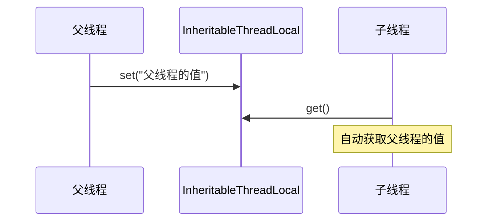
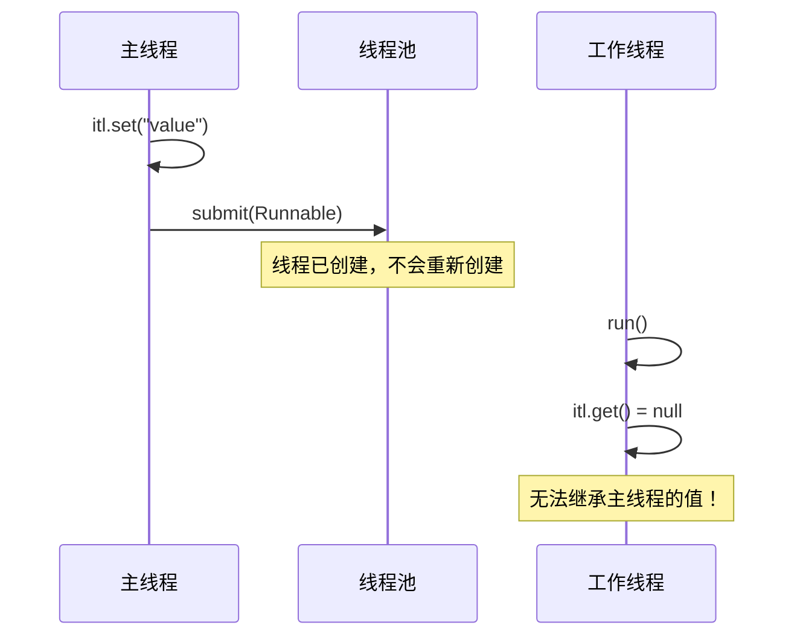

# InheritableThreadLocal 原理

> **目标级别**：P6
> **面试频率**：🟡 中频

面试官问：「InheritableThreadLocal 是什么？」你说「可以继承的 ThreadLocal」——然后面试官紧接着追问「那 InheritableThreadLocal 和 ThreadLocal 有什么区别？为什么需要它？」你沉默了。

InheritableThreadLocal 是 ThreadLocal 的扩展，用于父子线程间的数据传递。

## 面试官最关心的 3 个问题

1. ⚠️ InheritableThreadLocal 的原理是什么？
2. ⚠️ InheritableThreadLocal 和 ThreadLocal 的区别是什么？
3. ⚠️ InheritableThreadLocal 有哪些坑？

## 核心原理

### 基本概念

InheritableThreadLocal 让子线程可以继承父线程的 ThreadLocal 值。



### 基本使用

```java
public class ITLDemo {
    private static final InheritableThreadLocal<String> itl =
        new InheritableThreadLocal<>();

    public static void main(String[] args) {
        itl.set("父线程的值");

        new Thread(() -> {
            String value = itl.get(); // 获取到 "父线程的值"
            System.out.println("子线程获取: " + value);
        }).start();
    }
}
```

## 实现原理

### Thread 初始化时的复制

```java
public class Thread implements Runnable {
    ThreadLocalMap threadLocals = null;
    ThreadLocalMap inheritableThreadLocals = null;

    private void init(ThreadGroup g, Runnable target, String name,
                      long stackSize, AccessControlContext acc,
                      boolean inheritThreadLocals) {
        // ...

        if (inheritThreadLocals && parent.inheritableThreadLocals != null)
            this.inheritableThreadLocals =
                ThreadLocal.createInheritedMap(parent.inheritableThreadLocals);
    }
}
```

### createInheritedMap

```java
static ThreadLocalMap createInheritedMap(ThreadLocalMap parentMap) {
    return new ThreadLocalMap(parentMap);
}

private ThreadLocalMap(ThreadLocalMap parentMap) {
    Entry[] parentTable = parentMap.table;
    int len = parentTable.length;
    table = new Entry[len];

    for (int j = 0; j < len; j++) {
        Entry e = parentTable[j];
        if (e != null) {
            @SuppressWarnings("unchecked")
            ThreadLocal<Object> key = (ThreadLocal<Object>) e.get();
            if (key != null) {
                // 复制 Entry 到子线程的 map
                Object value = key.childValue(e.value);
                Entry c = new Entry(key, value);
                table[h] = c;
            }
        }
    }
}
```

### childValue 方法

```java
protected T childValue(T parentValue) {
    return parentValue;
}
```

子类可以重写这个方法进行值转换：

```java
InheritableThreadLocal<List<String>> itl = new InheritableThreadLocal<>() {
    @Override
    protected List<String> childValue(List<String> parentValue) {
        return new ArrayList<>(parentValue); // 深拷贝
    }
};
```

## InheritableThreadLocal vs ThreadLocal

| 区别 | ThreadLocal | InheritableThreadLocal |
|------|-------------|------------------------|
| **继承** | ❌ 不继承 | ✅ 继承父线程的值 |
| **存储位置** | threadLocals | inheritableThreadLocals |
| **初始化** | 线程初始化时复制 | 线程初始化时复制 |
| **使用场景** | 线程隔离 | 父子线程数据传递 |
| **线程池场景** | 同样有泄漏风险 | 泄漏风险更大 |

## 线程池场景的问题

### 问题：子线程无法继承主线程

```java
public class ThreadPoolProblem {
    private static final InheritableThreadLocal<String> itl =
        new InheritableThreadLocal<>();

    public static void main(String[] args) {
        ExecutorService executor = Executors.newFixedThreadPool(1);

        itl.set("主线程的值");

        executor.submit(() -> {
            // ❌ 获取不到主线程的值
            // 线程池中的线程不是由主线程创建的
            String value = itl.get(); // null
        });

        executor.shutdown();
    }
}
```

### 原因分析



### 解决方案：TransmittableThreadLocal

阿里开源的 TransmittableThreadLocal 可以解决线程池场景的问题：

```java
// 使用 TransmittableThreadLocal
private static final TransmittableThreadLocal<String> ttl =
    new TransmittableThreadLocal<>();

public static void main(String[] args) {
    ExecutorService executor = Executors.newFixedThreadPool(1);

    ttl.set("主线程的值");

    // 使用 TtlRunnable 包装
    executor.submit(TtlRunnable.get(() -> {
        String value = ttl.get(); // ✅ 获取到 "主线程的值"
        System.out.println(value);
    }));

    executor.shutdown();
}
```

## 典型应用场景

### 1. 请求链路追踪

```java
public class TraceContext {
    private static final InheritableThreadLocal<String> traceId =
        new InheritableThreadLocal<>();

    public static void setTraceId(String traceId) {
        TraceContext.traceId.set(traceId);
    }

    public static String getTraceId() {
        return traceId.get();
    }

    public static void clear() {
        traceId.remove();
    }
}

// 使用
public class Filter {
    public void doFilter(...) {
        try {
            TraceContext.setTraceId(UUID.randomUUID().toString());
            chain.doFilter(request, response);
        } finally {
            TraceContext.clear();
        }
    }
}
```

### 2. 用户上下文传递

```java
public class UserContext {
    private static final InheritableThreadLocal<User> userContext =
        new InheritableThreadLocal<>();

    public static void setUser(User user) {
        userContext.set(user);
    }

    public static User getUser() {
        return userContext.get();
    }
}
```

### 3. 性能监控

```java
public class MetricsContext {
    private static final InheritableThreadLocal<Metrics> metrics =
        new InheritableThreadLocal<>();

    public static void startSpan() {
        metrics.set(new Metrics());
    }

    public static Metrics getMetrics() {
        return metrics.get();
    }
}
```

## 高频面试题

### 🔴 题目 1：InheritableThreadLocal 的原理是什么？

**参考回答**：

InheritableThreadLocal 的原理：

1. **不同的 Map**：使用 `inheritableThreadLocals` 而不是 `threadLocals`
2. **创建时复制**：线程创建时，复制父线程的 inheritableThreadLocals
3. **childValue**：可以重写 childValue 进行值转换
4. **复制时机**：只在 Thread 初始化时复制一次，之后独立

### 🔴 题目 2：为什么 InheritableThreadLocal 在线程池场景会失效？

**参考回答**：

失效的原因：

1. **线程已创建**：线程池中的线程在创建时已复制过主线程的值
2. **不再复制**：任务提交到线程池时，不会重新复制主线程的值
3. **解决方案**：使用 TransmittableThreadLocal

### 🔴 题目 3：InheritableThreadLocal 有什么坑？

**参考回答**：

| 坑 | 说明 |
|------|------|
| **线程池失效** | 无法继承线程池中主线程的值 |
| **内存泄漏** | 同样有内存泄漏风险 |
| **值类型** | 浅拷贝，子线程修改会影响父线程 |

## 常见错误与陷阱

### ⚠️ 陷阱 1：修改引用类型

```java
// ❌ 浅拷贝问题
InheritableThreadLocal<List<String>> itl = new InheritableThreadLocal<>();
List<String> list = new ArrayList<>();
itl.set(list);

new Thread(() -> {
    List<String> childList = itl.get();
    childList.add("child"); // ⚠️ 也会影响父线程的 list
}).start();
```

### ⚠️ 陷阱 2：忘记清理

```java
// ❌ 更容易泄漏
InheritableThreadLocal<Object> itl = new InheritableThreadLocal<>();
// 在线程池场景下，必须手动清理
```

### ⚠️ 陷阱 3：深拷贝开销

```java
// 深拷贝可能影响性能
@Override
protected List<String> childValue(List<String> parentValue) {
    return new ArrayList<>(parentValue); // 深拷贝，有开销
}
```

## 加分回答

### 💡 TransmittableThreadLocal 原理

```java
// TtlRunnable 包装
public class TtlRunnable implements Runnable {
    private final Runnable runnable;
    private final Snapshot snapshot;

    @Override
    public void run() {
        // 1. 设置当前线程的快照
        TransmittableThreadLocal.runWithCapturedSnapshot(snapshot, () -> {
            runnable.run();
        });
        // 2. 恢复原值
    }
}
```

### 💡 为什么 InheritableThreadLocal 使用浅拷贝

```java
// 浅拷贝：复制引用
protected T childValue(T parentValue) {
    return parentValue;
}

// 深拷贝：需要显式实现
@Override
protected List<String> childValue(List<String> parentValue) {
    return parentValue == null ? null : new ArrayList<>(parentValue);
}
```

## 总结对比表

| 特性 | ThreadLocal | InheritableThreadLocal |
|------|-------------|------------------------|
| **继承父线程** | ❌ | ✅ |
| **线程池场景** | 失效 | 失效 |
| **内存泄漏风险** | 有 | 有（更大） |
| **值拷贝方式** | 无 | 浅拷贝 |
| **适用场景** | 线程隔离 | 父子线程传递 |

## 延伸思考

### 面试官可能会继续追问

1. 「TransmittableThreadLocal 和 InheritableThreadLocal 的区别？」
2. 「InheritableThreadLocal 的 childValue 可以返回 null 吗？」
3. 「如何在 Spring 中使用 InheritableThreadLocal？」

### 回答方向

关于 TransmittableThreadLocal 的优势：
- 每次任务执行时复制当前线程的值
- 任务完成后自动恢复原值
- 支持线程池、线程组、ForkJoinPool 等多种场景
