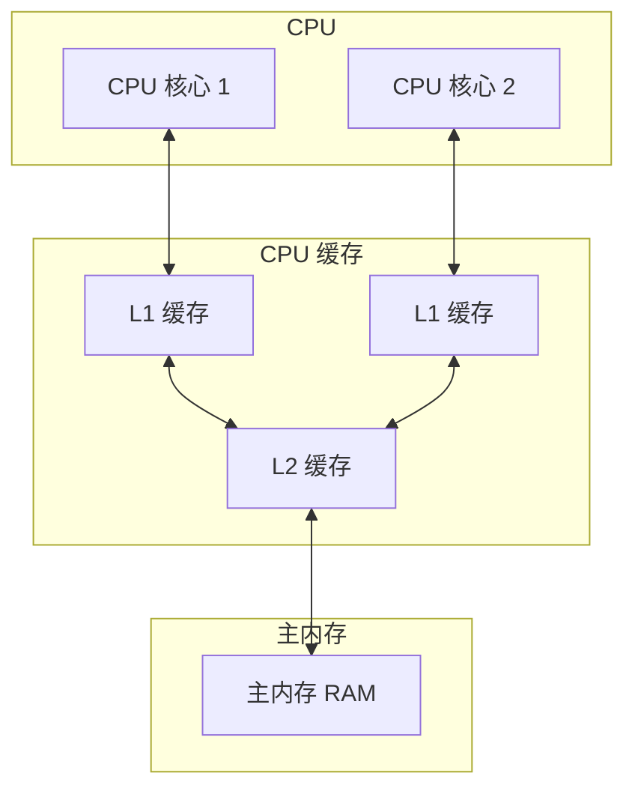
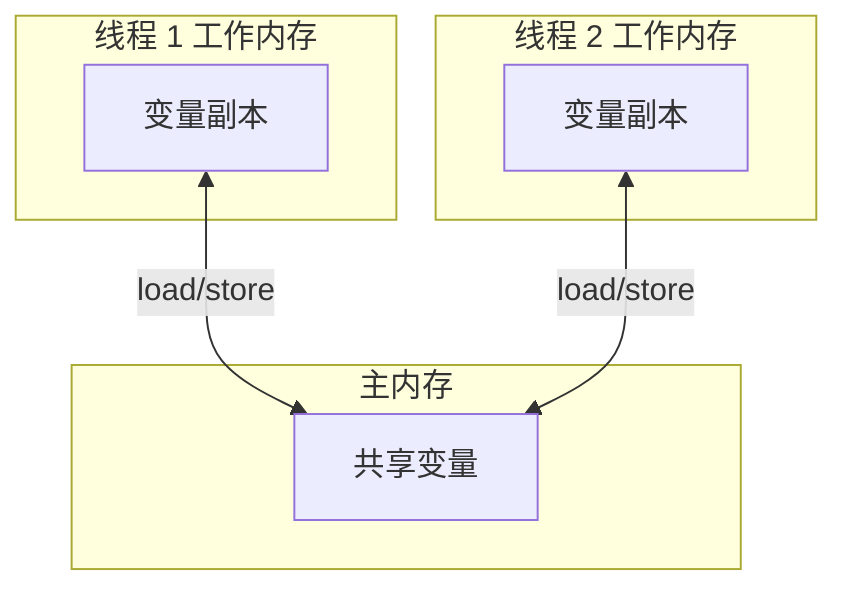
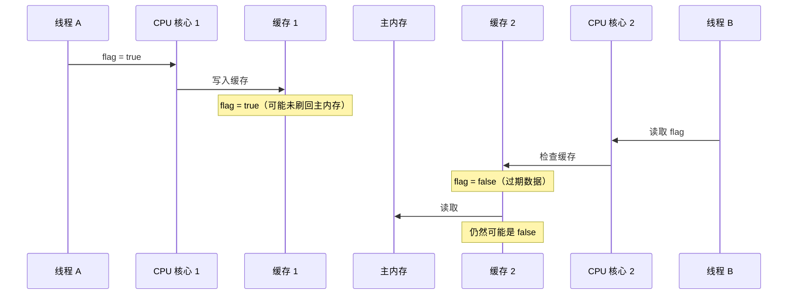

# Java 内存模型

> **目标级别**：P5/P6
> **面试频率**：🔴 高频

面试官问：「什么是 Java 内存模型？」你说「堆和栈」——然后面试官紧接着追问「那 JMM 的三大特性是什么？主内存和工作内存是什么关系？」你沉默了。

JMM 是理解并发编程的基石，不理解 JMM 就无法真正理解 synchronized、volatile 等关键字的作用。

## 面试官最关心的 3 个问题

1. ⚠️ Java 内存模型的三大特性是什么？
2. ⚠️ 什么是主内存和工作内存？
3. ⚠️ 为什么需要 JMM？

## 核心原理

### 为什么需要 JMM？

现代计算机的硬件架构：



问题：

- **缓存一致性问题**：多个 CPU 核心可能同时读写同一内存地址
- **指令重排序问题**：编译器和 CPU 为了性能可能打乱指令顺序
- **可见性问题**：一个线程的修改对另一个线程不可见

**JMM 的出现，就是为了解决这些问题。**

### JMM 的定义

Java Memory Model（JMM）是 Java 并发编程的核心抽象，它定义了：

1. 变量存储在哪（主内存和工作内存）
2. 如何在多线程间通信
3. 哪些操作是原子的
4. 哪些操作不会被重排序

### 主内存与工作内存



| 概念 | 说明 |
|------|------|
| **主内存（Main Memory）** | 所有线程共享的内存，存放实例对象、静态字段、数组元素 |
| **工作内存（Working Memory）** | 每个线程独占的内存区域，存放线程操作的变量副本 |

**注意**：工作内存是 JMM 的抽象概念，实际可能对应 CPU 寄存器、L1/L2/L3 缓存。

### JMM 的三大特性

JMM 有三大特性，是理解所有并发问题的关键：

| 特性 | 说明 | 相关问题 |
|------|------|---------|
| **原子性（Atomicity）** | 一个操作不可中断 | 基础类型的读写是原子的 |
| **可见性（Visibility）** | 一个线程的修改对其他线程可见 | volatile、synchronized、final |
| **有序性（Ordering）** | 操作按一定顺序执行 | volatile、synchronized、happens-before |

## 可见性问题详解

### 问题场景

```java
public class VisibilityDemo {
    private boolean flag = false;

    public void writer() {
        flag = true; // 线程 A 写入
    }

    public void reader() {
        while (!flag) {
            // 线程 B 循环读取
        }
        System.out.println("读取到 flag = true");
    }
}
```

**问题**：线程 B 可能永远看不到线程 A 的修改！

### 原因分析



### 解决方案

| 解决方案 | 说明 |
|---------|------|
| `volatile` | 强制刷新到主内存，强制读取主内存 |
| `synchronized` | 解锁前强制刷新到主内存 |
| `final` | 构造器中初始化后，其他线程可见 |

## 有序性问题详解

### 指令重排序

编译器、CPU、缓存都可能会进行重排序，目的是提高性能：

```java
public class ReorderingDemo {
    private int a = 0;
    private int b = 0;
    private int x = 0;
    private int y = 0;

    public void test() {
        // 线程 A
        a = 1;
        x = b;

        // 线程 B
        b = 1;
        y = a;
    }
}
```

**问题**：可能产生 `x = 0` 和 `y = 0` 的结果！

### 重排序分类

| 重排序类型 | 发生阶段 | 说明 |
|-----------|---------|------|
| **编译器重排序** | 编译期 | 编译器可以在不改变单线程语义的前提下重排序 |
| **指令级重排序** | 运行期 | CPU 流水线技术 |
| **内存系统重排序** | 运行期 | 缓存写入主内存的顺序与实际执行顺序不同 |

### happens-before 规则

happens-before 是 JMM 的核心概念，定义了哪些操作必须按顺序执行：

> 如果操作 A happens-before 操作 B，那么 A 的执行结果对 B 可见，且 A 的执行顺序在 B 之前。

## 高频面试题

### 🔴 题目 1：什么是 Java 内存模型？

**参考回答**：

JMM 是 Java 并发编程的核心抽象，定义了线程间如何通过内存交互。它规定了：

1. **主内存和工作内存**：所有变量存在主内存，每个线程有自己的工作内存
2. **三大特性**：原子性、可见性、有序性
3. **happens-before 规则**：定义了哪些操作不能重排序

**追问**：JMM 和 JVM 内存区域有什么区别？

- JVM 内存区域是物理划分：堆、栈、方法区等
- JMM 是逻辑模型：主内存、工作内存，是对 JVM 内存的抽象

### 🔴 题目 2：JMM 三大特性是什么？

**参考回答**：

1. **原子性**：一个操作不可分割，要么全部执行，要么全部不执行
2. **可见性**：一个线程修改了共享变量，其他线程能立即看到
3. **有序性**：指令按程序顺序执行（单线程内）

### 🔴 题目 3：可见性和有序性的关系？

**参考回答**：

可见性和有序性是紧密关联的：

- **有序性**保证的是「不重排序」，但即使不重排序，也可能因为缓存导致不可见
- **可见性**保证的是「刷新到主内存」，但如果没有 happens-before 约束，仍然可能被重排序

## 常见错误与陷阱

### ⚠️ 陷阱 1：以为 long/double 的读写是原子的

在 JVM 规范中，对 long/double 的非 volatile 读写可能分两次执行（32位机器上）。虽然现代 64 位 JVM 通常保证原子性，但标准规范不保证。

### ⚠️ 陷阱 2：混淆 JMM 和 JVM 内存模型

```
┌─────────────────────────────────────────────────────────────┐
│                      JMM（逻辑模型）                        │
│  ┌─────────────────┐      ┌─────────────────┐              │
│  │   主内存         │ ←→   │   工作内存       │              │
│  │  (共享变量)      │      │  (线程私有)       │              │
│  └─────────────────┘      └─────────────────┘              │
└─────────────────────────────────────────────────────────────┘
                          ↓ JVM 实现
┌─────────────────────────────────────────────────────────────┐
│                    JVM 内存模型（物理划分）                  │
│  ┌──────────┐  ┌──────────┐  ┌──────────┐  ┌──────────┐    │
│  │  堆       │  │  栈      │  │  方法区   │  │  程序计数器│    │
│  └──────────┘  └──────────┘  └──────────┘  └──────────┘    │
└─────────────────────────────────────────────────────────────┘
```

### ⚠️ 陷阱 3：认为 synchronized 只保证原子性

`synchronized` 同时保证原子性、可见性和有序性（通过独占锁和 happens-before 规则）。

## 加分回答

### 💡 x86 架构的内存模型

不同 CPU 架构有不同的内存模型：

| 架构 | 特性 | 说明 |
|------|------|------|
| **x86/x64** | TSO（Total Store Order） | 写缓冲，StoreBuffer，可能导致写后读延迟 |
| **ARM/Power** | Relaxed Memory Order | 更激进的重排序，更复杂 |

### 💡 JMM 的设计哲学

JMM 在设计时平衡了两个目标：

1. **程序员友好**：提供足够强的内存模型，让程序员容易理解
2. **实现友好**：给编译器和 JVM 足够的优化空间

这就是为什么 JMM 使用 happens-before 规则而不是直接禁止所有重排序。

## 总结对比表

| 特性 | 实现方式 | 相关关键字/方法 |
|------|---------|----------------|
| **原子性** | synchronized | synchronized、Lock |
| **可见性** | 缓存刷新 | volatile、synchronized、final |
| **有序性** | 禁止重排序 | volatile、synchronized、happens-before |

## 延伸思考

### 面试官可能会继续追问

1. 「happens-before 和因果一致性有什么关系？」
2. 「volatile 的底层实现是什么？」
3. 「synchronized 是怎么保证可见性的？」

### 回答方向

关于 volatile 底层实现：使用 `lock` 前缀指令，实现缓存一致性协议（MESI），包括：
- 写操作：写穿（Write Through）或写回（Write Back）+ 失效信号
- 读操作：强制从主内存读取
- 插入内存屏障（Memory Barrier）
