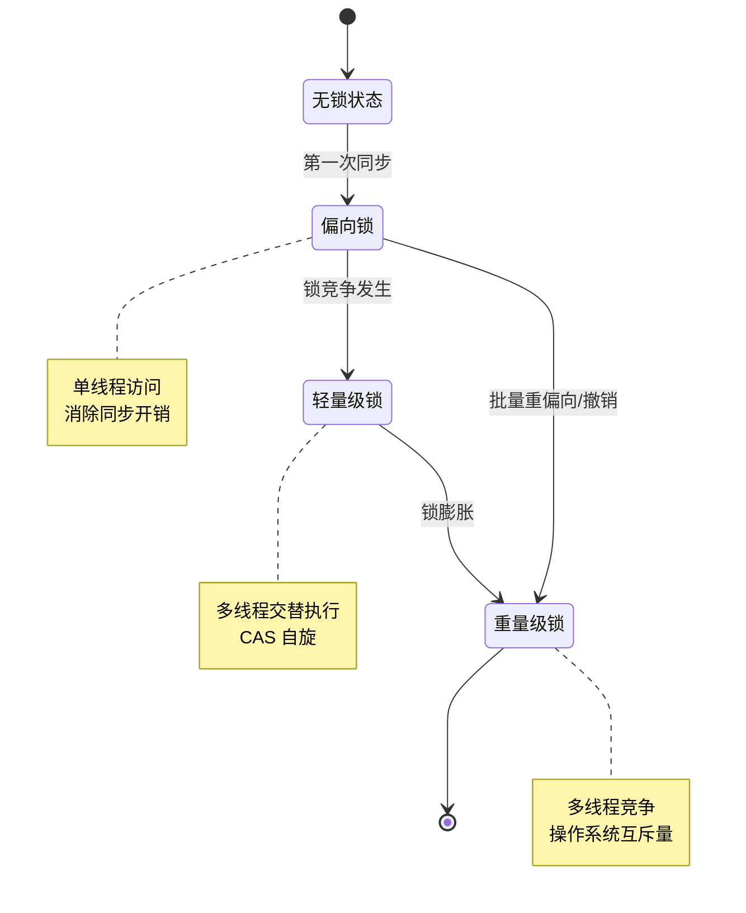
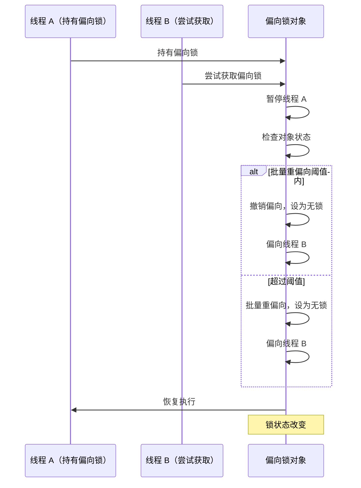
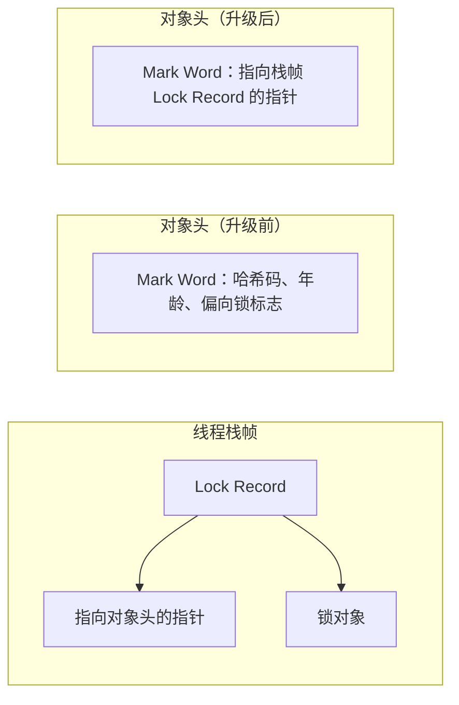
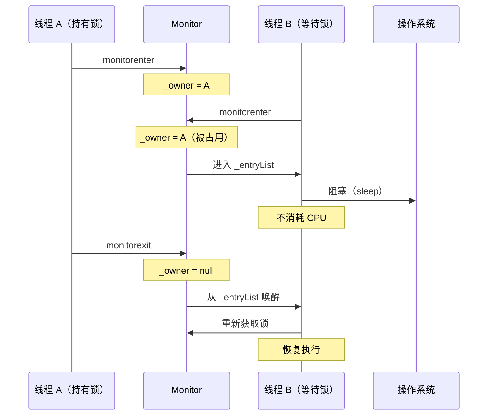
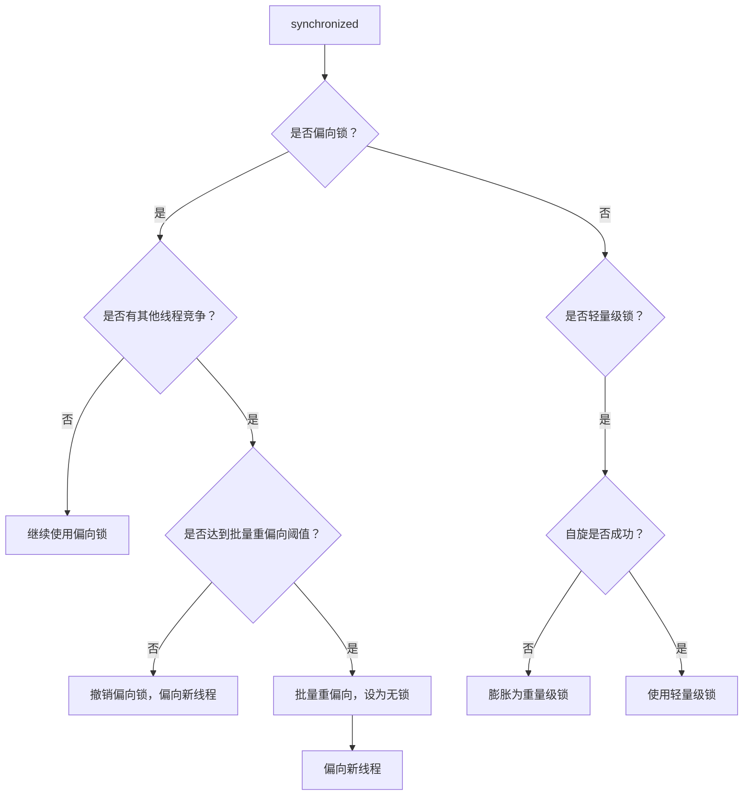

# synchronized 锁升级过程

> **目标级别**：P6
> **面试频率**：🔴 高频

面试官问：「synchronized 锁升级过程是怎样的？」你说「无锁→偏向锁→轻量级锁→重量级锁」——然后面试官紧接着追问「撤销偏向锁的条件是什么？轻量级锁是怎么膨胀的？」你沉默了。

理解锁升级过程，是深入理解 synchronized 原理的关键。

## 面试官最关心的 3 个问题

1. ⚠️ 锁升级的完整过程是什么？
2. ⚠️ 偏向锁的撤销条件是什么？
3. ⚠️ 轻量级锁是如何升级到重量级锁的？

## 核心原理

### 锁升级的四阶段



### 各阶段特征对比

| 阶段 | 锁对象头 | 线程持有 | 优点 | 缺点 |
|------|---------|---------|------|------|
| **无锁** | 对象哈希码 | 无 | - | - |
| **偏向锁** | 线程 ID | 单线程 | 消除同步开销 | 多线程竞争有开销 |
| **轻量级锁** | 指向栈帧的指针 | 线程栈帧 | 非阻塞获取 | 自旋消耗 CPU |
| **重量级锁** | 指向互斥量的指针 | 持有线程 | 不消耗 CPU | 阻塞开销 |

## 偏向锁

### 偏向锁的原理

偏向锁在第一次获取锁时，将锁对象头的 **Mark Word** 记录线程 ID，后续该线程进入同步块时，只需检查 Mark Word 是否指向当前线程。

```java
// 第一次获取偏向锁
if (mark_word.has_bias()) {
    if (mark_word.thread_id() == current_thread_id) {
        // 同一线程，直接进入
    } else {
        // 撤销偏向锁
    }
}
```

### Mark Word 结构（偏向锁状态）

| 字段 | 说明 |
|------|------|
| 偏向锁标志位（1 位） | 0 → 1 |
| 分代年龄标志位（2 位） | 保持不变 |
| 对象哈希码（31 位） | 无（延迟计算） |
| 线程 ID（54 位） | 持有偏向锁的线程 ID |
| Epoch（2 位） | 偏向时间戳 |

### 偏向锁的撤销条件

| 条件 | 说明 |
|------|------|
| **其他线程尝试获取** | 某线程尝试获取偏向锁 |
| **调用 hashCode()** | 计算并存储对象哈希码 |
| **调用 wait/notify** | wait 会导致锁膨胀 |



## 轻量级锁

### 轻量级锁的原理

轻量级锁通过 **CAS（Compare-And-Swap）** 操作，在线程的栈帧中创建锁记录（Lock Record），并尝试用 CAS 将对象头的 Mark Word 替换为指向锁记录的指针。



### 轻量级锁的获取过程

```java
// 1. 在当前线程栈帧中创建锁记录
LockRecord* lr = allocate_lock_record();

// 2. 将 Mark Word 复制到锁记录
lr->set_displaced_mark_word(object->mark());

// 3. CAS 替换对象头的 Mark Word
if (compare_and_swap(object->mark(), lr, mark)) {
    // 成功：轻量级锁获取成功
    // object->mark 指向 lr
} else {
    // 失败：自旋重试或膨胀为重量级锁
}
```

### 轻量级锁的释放

```java
// CAS 将锁记录中的 Mark Word 恢复到对象头
if (compare_and_swap(object->mark(), lr, lr->displaced_mark_word())) {
    // 成功：释放轻量级锁
} else {
    // 失败：膨胀为重量级锁，需要唤醒等待线程
}
```

## 重量级锁

### 重量级锁的原理

重量级锁使用操作系统的 **Mutex（互斥量）** 实现，线程获取锁失败后会进入阻塞状态，不消耗 CPU。



### 自旋优化

轻量级锁失败后，不会立即膨胀为重量级锁，而是会 **自旋重试**：

```java
// 自旋获取锁
for (int i = 0; i < max_spin_attempts; i++) {
    if (try_acquire_lock()) {
        return SUCCESS;
    }
    cpu_pause(); // CPU 暂停指令
}
// 自旋失败，膨胀为重量级锁
inflate_to_heavyweight_lock();
```

## 锁升级的触发条件



## 高频面试题

### 🔴 题目 1：synchronized 锁升级过程？

**参考回答**：

synchronized 锁有四种状态，依次升级：

1. **无锁状态**：对象创建时
2. **偏向锁**：第一次获取锁时，记录线程 ID
3. **轻量级锁**：有其他线程竞争时，使用 CAS 自旋
4. **重量级锁**：自旋失败后膨胀，使用 OS 互斥量

**升级是单向的，不可降级**。

### 🔴 题目 2：偏向锁的撤销条件？

**参考回答**：

1. 其他线程尝试获取该锁
2. 调用对象的 `hashCode()` 方法
3. 调用 `wait()` 或 `notify()`
4. 达到批量重偏向/撤销阈值

### 🔴 题目 3：为什么 synchronized 会先偏向再轻量级？

**参考回答**：

大多数场景下，同一对象的同步块只会被同一线程访问。偏向锁消除了这种「单线程无竞争」场景下的同步开销。

如果使用轻量级锁，第一次获取也需要 CAS，开销反而更大。只有在出现竞争时，才会升级到轻量级锁。

## 常见错误与陷阱

### ⚠️ 陷阱 1：认为锁可以降级

锁升级是单向的，只能升级不能降级。这是设计决策，因为：
- 降级需要额外的同步机制
- 实际场景中，锁竞争模式通常是「先少后多」

### ⚠️ 陷阱 2：忽视偏向锁在多线程竞争时的开销

```java
// 场景：多个线程交替访问
Thread A: access() → Thread B: access() → Thread A: access() → ...
```

每次切换线程都需要撤销偏向锁 → 轻量级锁 → 撤销偏向锁，开销反而比直接使用轻量级锁大。

### ⚠️ 陷阱 3：Java 15 默认禁用偏向锁

JDK 15+ 默认禁用了偏向锁，因为：
- 现代应用多是多线程竞争场景
- 偏向锁的撤销开销在高竞争场景下不可忽视

## 加分回答

### 💡 批量重偏向与批量撤销

JVM 维护了两个阈值：

| 阈值 | 说明 |
|------|------|
| `BiasedLockingReblBiasThreshold` | 偏向锁重偏向次数阈值（默认 20） |
| `BiasedLockingBulkRevokeBiasThreshold` | 偏向锁批量撤销阈值（默认 40） |

```java
// 场景：大量线程依次访问同一对象
// 线程 1 → 线程 2 → 线程 3 → ... → 线程 20 → 线程 21

// 线程 1-20：每次撤销偏向锁，重新偏向
// 线程 21：触发批量重偏向，之后的线程直接偏向（不再撤销）
```

### 💡 逃逸分析与锁消除

JIT 编译器会分析对象的逃逸范围：

```java
public void process() {
    Object lock = new Object(); // 局部变量，不逃逸
    synchronized (lock) {
        // JIT 可能消除这个锁，因为 lock 不会逃逸
    }
}
```

## 总结对比表

| 锁类型 | 原理 | 优点 | 缺点 | 适用场景 |
|--------|------|------|------|---------|
| **偏向锁** | Mark Word 记录线程 ID | 无同步开销 | 竞争时有撤销开销 | 单线程访问 |
| **轻量级锁** | CAS 替换 Mark Word | 非阻塞 | 自旋消耗 CPU | 多线程交替 |
| **重量级锁** | OS 互斥量 | 不消耗 CPU | 阻塞开销 | 多线程竞争 |

## 延伸思考

### 面试官可能会继续追问

1. 「为什么 Mark Word 需要存储这么多信息？」
2. 「轻量级锁和自旋锁有什么区别？」
3. 「如何关闭偏向锁？」

### 回答方向

关于关闭偏向锁：
```bash
-XX:-UseBiasedLocking=false
```
但现代应用建议保留偏向锁（JDK 15+ 默认禁用），因为大多数服务器应用启动后有稳定的热代码阶段。
