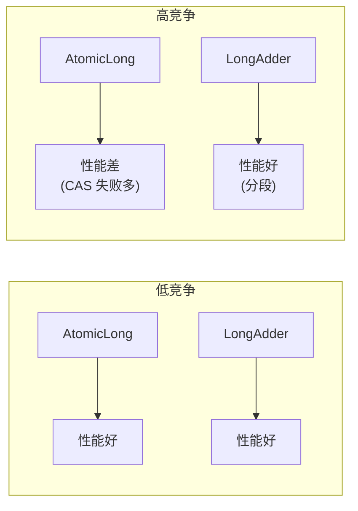
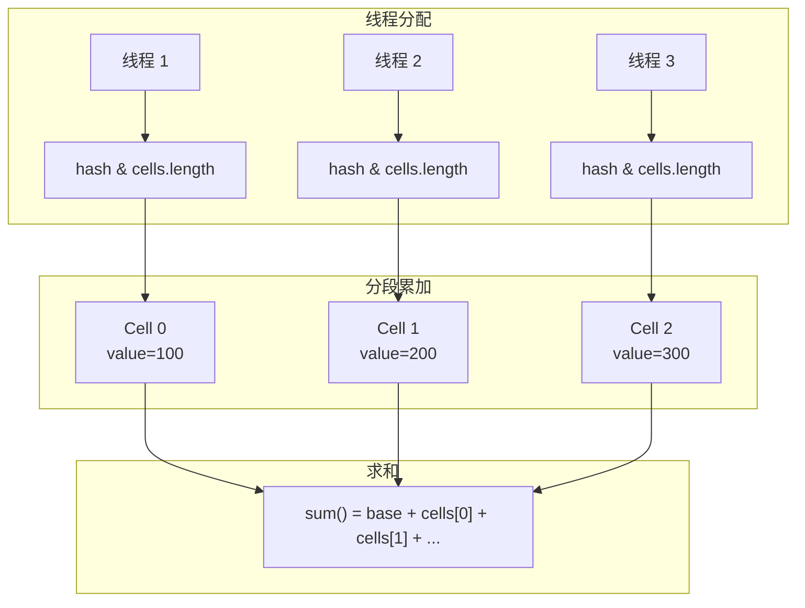
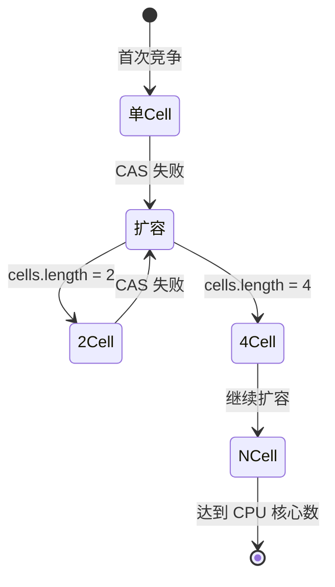

# LongAdder 与 AtomicLong 对比

> **目标级别**：P5/P6
> **面试频率**：🟡 中频

面试官问：「LongAdder 和 AtomicLong 有什么区别？」你说「LongAdder 更快」——然后面试官紧接着追问「为什么更快？什么场景下应该用 LongAdder？」你沉默了。

理解两者区别的本质，才能在实际开发中做出正确选择。

## 面试官最关心的 3 个问题

1. ⚠️ LongAdder 为什么比 AtomicLong 快？
2. ⚠️ LongAdder 的分段机制是什么？
3. ⚠️ 什么场景应该用 LongAdder？

## 核心原理

### 基本对比

| 特性 | AtomicLong | LongAdder |
|------|-----------|-----------|
| **并发方式** | 乐观锁（CAS） | 分段累加 |
| **竞争场景** | 高竞争下性能下降 | 高竞争下仍高效 |
| **精度** | 精确值 | 最终一致 |
| **内存占用** | 较小 | 较大 |
| **API** | 简单 | 更丰富 |

### 性能对比图



## LongAdder 的分段机制

### Striped64 实现原理

LongAdder 继承自 Striped64，内部维护：

```java
public class LongAdder extends Striped64 implements Serializable {
    // 分段数组（懒加载）
    transient volatile Cell[] cells;

    // 基础值（无竞争时使用）
    transient volatile long base;

    // 冲突标记
    transient volatile int cellsBusy;
}
```

### Cell 结构

```java
//@sun.misc.Contended
static final class Cell {
    volatile long value;

    Cell(long initialValue) {
        value = initialValue;
    }

    // CAS 更新
    final boolean cas(long cmp, long val) {
        return UNSAFE.compareAndSwapLong(this, valueOffset, cmp, val);
    }
}
```

### 分段累加原理



### add 方法流程

```java
public void add(long x) {
    Cell[] cs;
    long n, v;
    int m;
    Cell c;

    // 步骤 1：尝试 base 操作（无竞争）
    if ((cs = cells) != null || !casBase(v = base, v + x)) {
        // 步骤 2：竞争激烈，使用 cells 分段
        boolean uncontended = true;
        int h = getProbe();
        if ((cs = cells) == null || (m = cs.length - 1) < 0 ||
            (c = cs[h & m]) == null ||
            !(uncontended = c.cas(v = c.value, v + x))) {
            // 步骤 3：分段 CAS 失败，扩容 cells
            longAccumulate(x, null, uncontended, h);
        }
    }
}
```

## 扩容机制

### 扩容触发条件

1. cells 为 null（首次竞争）
2. cells 长度小于 CPU 核心数
3. 当前 Cell 的 CAS 失败
4. cellsBusy 获取失败

### 扩容过程



### 扩容特点

- **不收缩**：cells 只扩容不收缩
- **最大长度**：CPU 核心数（避免过度竞争）
- **迁移**：旧的 Cell 值保留，继续累加

## sum 方法的问题

### 非原子性

```java
public long sum() {
    Cell[] cs = cells;
    long sum = base;
    if (cs != null) {
        for (Cell c : cs) {
            if (c != null) {
                sum += c.value;
            }
        }
    }
    return sum;
}
```

:::warning sum 方法非原子
`sum()` 遍历 cells 并求和时，可能有其他线程正在修改 Cell 的值，导致结果不是精确值。但对于统计场景，这是可接受的。
:::

## 使用场景对比

### AtomicLong 适用场景

| 场景 | 说明 |
|------|------|
| **低并发** | 竞争不激烈，CAS 很少失败 |
| **需要精确值** | 任何时刻都需要准确的当前值 |
| **简单计数** | 只需要基本的增减操作 |

### LongAdder 适用场景

| 场景 | 说明 |
|------|------|
| **高并发** | 竞争激烈，需要高吞吐量 |
| **统计场景** | 可以容忍最终一致（如 UV 统计） |
| **计数器** | 大量的 increment 操作 |

## 高频面试题

### 🔴 题目 1：LongAdder 为什么比 AtomicLong 快？

**参考回答**：

LongAdder 通过**分段机制**减少竞争：

1. 内部维护 `Cell[]` 数组，每个 Cell 独立累加
2. 不同线程写入不同的 Cell，减少 CAS 冲突
3. 只有在 Cell 数组为空或扩容时才使用 base
4. 适合高竞争场景

### 🔴 题目 2：LongAdder 的缺点是什么？

**参考回答**：

1. **内存占用大**：需要维护 Cell 数组
2. **sum() 非原子**：求和时可能有并发修改
3. **非精确值**：不适合需要精确值的场景
4. **API 不同**：没有 `compareAndSet` 方法

### 🟡 题目 3：如何选择 LongAdder 和 AtomicLong？

**参考回答**：

| 判断条件 | 选择 |
|---------|------|
| 竞争激烈？ | LongAdder |
| 需要精确值？ | AtomicLong |
| 统计场景？ | LongAdder |
| 低并发？ | 两者皆可 |

## 常见错误与陷阱

### ⚠️ 陷阱 1：混淆 add 和 increment

```java
// AtomicLong
atomic.getAndIncrement(); // 返回旧值
atomic.incrementAndGet(); // 返回新值

// LongAdder
adder.increment(); // 无返回值
long result = adder.sum(); // 需要单独求和
```

### ⚠️ 陷阱 2：sum() 的非原子性问题

```java
LongAdder adder = new LongAdder();

// ❌ 错误：可能在遍历时被修改
long v1 = adder.sum();
long v2 = adder.sum();
long diff = v2 - v1; // diff 不准确

// ✅ 正确：如果需要精确差值，应该用 AtomicLong
AtomicLong counter = new AtomicLong(0);
```

### ⚠️ 陷阱 3：Cell 的缓存行伪共享

```java
// @Contended 注解解决伪共享问题
@sun.misc.Contended
static final class Cell {
    volatile long value;
    // ...
}
```

## 加分回答

### 💡 Striped64 的设计哲学

Striped64 的核心思想：**分段锁 + CAS = 高并发**

```
AtomicLong：                        LongAdder：
┌─────────────────┐                 ┌─────────────────┐
│    value        │                 │      base        │
│    (单点)        │                 │    (单点)        │
└────────┬────────┘                 └────────┬────────┘
         │                                   │
         ▼                                   ▼
    ┌─────────┐                        ┌─────────┐
    │ CAS     │                        │ Cell[0] │ ─┐
    │ (竞争)  │                        ├─────────┤  │
    └─────────┘                        │ Cell[1] │  │ 分段
         │                              ├─────────┤  │
         ▼                              │ Cell[2] │ ─┘
    (所有线程竞争)                       │   ...  │
                                       └─────────┘
                                    (不同线程竞争不同 Cell)
```

### 💡 DoubleAdder 和 DoubleAccumulator

JDK 8 提供了类似的双精度版本：

```java
DoubleAdder sum = new DoubleAdder();
sum.add(1.5);

DoubleAccumulator max = new DoubleAccumulator(Double::max, 0.0);
max.accumulate(10.5);
```

## 总结对比表

| 维度 | AtomicLong | LongAdder |
|------|-----------|-----------|
| **原理** | CAS 乐观锁 | 分段累加 |
| **并发性能** | 低竞争好，高竞争差 | 高竞争下仍好 |
| **内存占用** | 1 个变量 | Cell 数组 |
| **精度** | 精确 | 最终一致 |
| **API** | 丰富 | 简单 |
| **适用场景** | 需要精确值 | 统计计数 |

## 延伸思考

### 面试官可能会继续追问

1. 「什么是伪共享？如何解决？」
2. 「LongAdder 的 cells 什么时候初始化？」
3. 「JDK 17 有没有其他优化？」

### 回答方向

关于伪共享：CPU 缓存行是 64 字节，如果多个变量在同一缓存行，一个线程修改会导致其他 CPU 的缓存行失效。LongAdder 的 Cell 类使用 `@Contended` 注解解决此问题。
