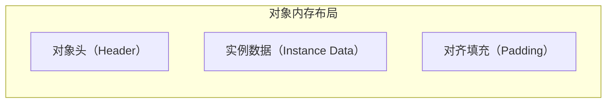
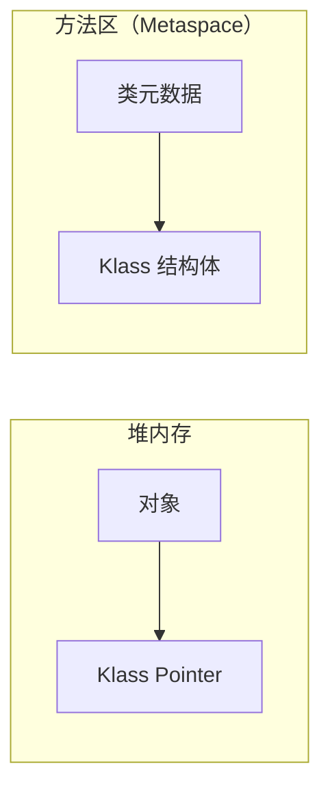

# 对象头与 Mark Word

> **目标级别**：P6
> **面试频率**：🔴 高频

面试官问：「Mark Word 的结构是什么？」你说「哈希码、GC 信息等」——然后面试官紧接着追问「64 位 JVM 和 32 位 JVM 的 Mark Word 结构一样吗？为什么？」你沉默了。

理解 Mark Word 是理解 synchronized 锁升级的基石。

## 面试官最关心的 3 个问题

1. ⚠️ 对象的内存布局是什么？
2. ⚠️ Mark Word 在不同锁状态下的结构是什么？
3. ⚠️ 64 位 JVM 的 Mark Word 是如何压缩的？

## 核心原理

### 对象的内存布局

在 HotSpot JVM 中，对象的内存布局分为三部分：



| 部分 | 说明 | 大小（64 位 JVM） |
|------|------|------------------|
| **对象头（Header）** | 存储对象运行时数据 | 12 字节（压缩后） |
| **实例数据（Instance Data）** | 成员变量、对齐填充 | 可变 |
| **对齐填充（Padding）** | 保证对象大小是 8 的倍数 | 可变 |

### Mark Word 的作用

Mark Word 是对象头的核心部分，存储对象的运行时数据：

| 数据 | 说明 |
|------|------|
| **哈希码** | Object.hashCode() 的结果 |
| **GC 分代年龄** | 对象 Survivor 区的年龄 |
| **锁状态** | 无锁/偏向锁/轻量级锁/重量级锁 |
| **偏向线程 ID** | 持有偏向锁的线程 ID |
| **指向锁记录的指针** | 轻量级锁指向栈帧的指针 |
| **指向 Monitor 的指针** | 重量级锁指向 ObjectMonitor |

## 32 位 JVM 的 Mark Word

### 结构

| 锁状态 | Mark Word (32 bits) |
|--------|---------------------|
| **无锁** | 25 bits: hashcode, 4 bits: age, 2 bits: lock, 1 bit: biased_lock |
| **偏向锁** | 23 bits: thread, 2 bits: epoch, 4 bits: age, 2 bits: lock, 1 bit: biased_lock |
| **轻量级锁** | 30 bits: 指向栈帧锁记录的指针 |
| **重量级锁** | 30 bits: 指向 Monitor 的指针 |

### 分布图

```
┌────────────────────────────────────────────────────────────┐
│ 无锁状态（Unlocked）                                        │
├────────────────────────────────────────────────────────────┤
│ [      hashcode (25)      ][ age (4) ][ 0 ][ 01 ]         │
│           对象哈希码                 年龄   未偏向  锁标志  │
├────────────────────────────────────────────────────────────┤
│ 偏向锁状态（Biased）                                        │
├────────────────────────────────────────────────────────────┤
│ [      thread (23)       ][epoch(2)][ age (4) ][ 1 ][ 01 ]│
│           线程 ID              Epoch  年龄  偏向   锁标志   │
├────────────────────────────────────────────────────────────┤
│ 轻量级锁/重量级锁（Lock）                                   │
├────────────────────────────────────────────────────────────┤
│ [              pointer to lock record (30)                 ][ 00 ]│
│                      指向锁记录的指针                        锁标志  │
└────────────────────────────────────────────────────────────┘
```

## 64 位 JVM 的 Mark Word

### 未压缩（未启用指针压缩）

| 锁状态 | Mark Word (64 bits) |
|--------|---------------------|
| **无锁** | 25 bits: hashcode, 1 bit: unused, 4 bits: age, 2 bits: lock, 1 bit: biased_lock, 31 bits: unused |
| **偏向锁** | 54 bits: thread, 2 bits: epoch, 4 bits: age, 1 bit: biased_lock, 2 bits: lock |
| **轻量级锁** | 62 bits: 指向栈帧锁记录的指针 |
| **重量级锁** | 62 bits: 指向 Monitor 的指针 |

### 压缩指针（-XX:+UseCompressedOops，默认开启）

| 锁状态 | Mark Word (64 bits) |
|--------|---------------------|
| **无锁** | 25 bits: hashcode, 3 bits: unused, 4 bits: age, 1 bit: biased_lock, 2 bits: lock |
| **偏向锁** | 54 bits: thread, 2 bits: epoch, 4 bits: age, 1 bit: biased_lock, 2 bits: lock |
| **轻量级锁** | 62 bits: 指向栈帧锁记录的指针 |
| **重量级锁** | 62 bits: 指向 Monitor 的指针 |

### 压缩后的无锁状态

```
┌────────────────────────────────────────────────────────────────────┐
│ 无锁状态（Compressed，64 位 JVM）                                    │
├────────────────────────────────────────────────────────────────────┤
│ [          hashcode (25)         ][  unused (3) ][ age (4) ][0][01]│
│              对象哈希码                       未使用   年龄 未偏向  │
├────────────────────────────────────────────────────────────────────┤
│ 偏向锁状态（Compressed，64 位 JVM）                                   │
├────────────────────────────────────────────────────────────────────┤
│ [                    thread (54)                     ][ep(2)][1][01]│
│                         线程 ID                            Epoch  偏向│
├────────────────────────────────────────────────────────────────────┤
│ 轻量级锁/重量级锁（64 位 JVM）                                        │
├────────────────────────────────────────────────────────────────────┤
│ [                     lock record / monitor pointer (62)            ][  00 ]│
│                          锁记录或 Monitor 指针                         锁标志│
└────────────────────────────────────────────────────────────────────┘
```

## 锁状态判断

JVM 通过 Mark Word 的最后两位判断锁状态：

| biased_lock (1) | lock (2) | 锁状态 |
|-----------------|----------|--------|
| 0 | 01 | 无锁 |
| 1 | 01 | 偏向锁 |
| - | 00 | 轻量级锁 |
| - | 10 | 重量级锁 |
| - | 11 | GC 标记 |

## 源码分析

### Mark Word 定义（OpenJDK hotspot/src/share/vm/oops/markOop.hpp）

```cpp
// Mark Word 的结构定义
class MarkOopDesc: public OopDesc {
 private:
  // Mark Word 的值存储在这里
  markOop _mark;

 public:
  // 锁状态的枚举
  enum {
    locked_value             = 0,  // 00: 轻量级锁
    unlocked_value           = 1,  // 01: 无锁或偏向锁
    monitor_value            = 2,  // 10: 重量级锁
    marked_value             = 3,  // 11: GC 标记
    biased_lock_bit          = 1,  // 偏向锁标志位
  };
};
```

### Mark Word 提取操作

```cpp
// 获取锁状态
inline markOop MarkOopDesc::decode_locked() const {
  return markOop((intptr_t) this & ~lock_mask_in_place);
}

// 检查是否是偏向锁
inline bool MarkOopDesc::has_bias_pattern() const {
  return (mask_bits(value(), biased_lock_mask_in_place) == biased_lock_value);
}

// 获取偏向线程 ID
inline intptr_t MarkOopDesc::biased_locker() const {
  return mask_bits(value(), aligned_bias_mask);
}
```

## 高频面试题

### 🔴 题目 1：对象的内存布局是什么？

**参考回答**：

对象的内存布局分为三部分：

1. **对象头（Object Header）**：存储对象运行时的数据
   - Mark Word（运行时数据）
   - Klass Pointer（类型指针，指向类元数据）
2. **实例数据（Instance Data）**：成员变量和父类成员变量
3. **对齐填充（Padding）**：保证对象大小是 8 的倍数

### 🔴 题目 2：Mark Word 在不同锁状态下的结构是什么？

**参考回答**：

| 锁状态 | Mark Word 结构 |
|--------|--------------|
| **无锁** | 哈希码(25) + 未使用(3) + 年龄(4) + 未偏向(0) + 01 |
| **偏向锁** | 线程ID(54) + Epoch(2) + 年龄(4) + 偏向(1) + 01 |
| **轻量级锁** | 指向栈帧锁记录的指针(62) + 00 |
| **重量级锁** | 指向Monitor的指针(62) + 10 |

### 🔴 题目 3：为什么 Mark Word 要存储这么多信息？

**参考回答**：

Mark Word 是对象头中唯一的可变区域，为了节省空间：
1. 无锁时存储哈希码
2. 偏向锁时存储线程 ID
3. 轻量级锁时存储锁记录指针
4. 重量级锁时存储 Monitor 指针

通过最后 2-3 位区分状态，前面的位复用存储不同数据。

## 常见错误与陷阱

### ⚠️ 陷阱 1：混淆 Mark Word 和对象头

```
对象头（Object Header）
├── Mark Word（运行时数据，可变）
└── Klass Pointer（类型指针，指向类的元数据）

Mark Word ≠ 对象头
```

### ⚠️ 陷阱 2：忽视压缩指针的影响

```java
// 未开启压缩指针时
class User {
    private int id;       // 4 字节
    private String name;   // 8 字节（指针）
}

// 开启压缩指针后
class User {
    private int id;       // 4 字节
    private String name;   // 4 字节（压缩指针）
}
```

### ⚠️ 陷阱 3：计算对象大小时忘记对齐填充

```java
// 计算对象大小
class Example {
    boolean a;   // 1 字节
    // 3 字节 padding
    long b;      // 8 字节
    int c;       // 4 字节
    // 4 字节 padding（对齐到 8 的倍数）
}

// 对象大小 = 1 + 3 + 8 + 4 + 4 = 20
// 填充后 = 24（8 的倍数）
```

## 加分回答

### 💡 Klass Pointer 与类元数据

Klass Pointer 指向方法区（Metaspace）中的类元数据：



### 💡 对象头大小计算

| JVM 配置 | 对象头大小 |
|---------|-----------|
| 32 位 JVM | 8 字节 |
| 64 位 JVM（指针压缩） | 12 字节 |
| 64 位 JVM（无压缩） | 16 字节 |

## 总结对比表

| 锁状态 | 标志位 | Mark Word 内容 |
|--------|--------|--------------|
| **无锁** | 01 | 对象哈希码 + GC 年龄 + 未偏向 |
| **偏向锁** | 01 | 线程 ID + Epoch + GC 年龄 + 偏向 |
| **轻量级锁** | 00 | 指向栈帧锁记录的指针 |
| **重量级锁** | 10 | 指向 ObjectMonitor 的指针 |
| **GC 标记** | 11 | 无用（预留） |

## 延伸思考

### 面试官可能会继续追问

1. 「什么是指针压缩？为什么需要？」
2. 「对象头中的 Klass Pointer 可以关闭吗？」
3. 「为什么对象要对齐到 8 字节？」

### 回答方向

关于对齐填充：
- JVM 要求对象起始地址是 8 的倍数
- 对齐到 8 字节可以提高 CPU 访问效率（一次读取完整对象）
- 填充的是对齐填充，不是对象头的一部分
