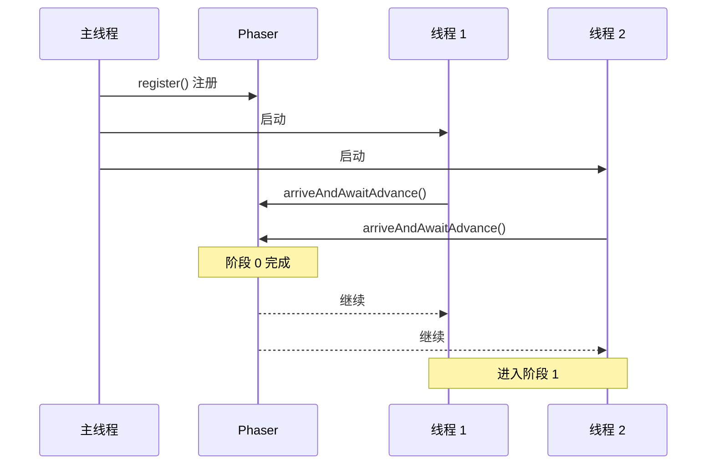

# Phaser 原理

> **目标级别**：P6
> **面试频率**：🟢 低频

面试官问：「Phaser 是什么？」你说「可以分阶段的屏障」——然后面试官紧接着追问「那 Phaser 和 CyclicBarrier 有什么区别？」你沉默了。

Phaser 是 JDK 7 引入的同步工具，提供了更灵活的阶段性同步能力。

## 面试官最关心的 3 个问题

1. ⚠️ Phaser 的原理是什么？
2. ⚠️ Phaser 和 CyclicBarrier 的区别是什么？
3. ⚠️ Phaser 适合什么场景？

## 核心原理

### 基本概念

Phaser（阶段器）是一种可重用的同步屏障，支持多个阶段。



### 基本使用

```java
public class PhaserDemo {
    public static void main(String[] args) throws InterruptedException {
        Phaser phaser = new Phaser(3); // 初始 3 个参与者

        for (int i = 0; i < 3; i++) {
            final int threadNum = i;
            new Thread(() -> {
                for (int phase = 0; phase < 3; phase++) {
                    System.out.println("线程 " + threadNum + " 执行阶段 " + phase);
                    phaser.arriveAndAwaitAdvance(); // 等待其他线程
                }
                phaser.arriveAndDeregister(); // 完成后注销
            }).start();
        }

        phaser.awaitAdvance(0); // 等待阶段 0 完成
        System.out.println("主线程继续");
    }
}
```

## Phaser vs CyclicBarrier

| 区别 | Phaser | CyclicBarrier |
|------|--------|---------------|
| **阶段数** | 动态，可重置 | 固定 |
| **参与者** | 动态注册/注销 | 固定 |
| **返回值** | 返回阶段号 | 无 |
| **arrive** | 到达不等待 | 必须等待 |
| **继承** | 支持 | 不支持 |

### 动态注册

```java
Phaser phaser = new Phaser(1); // 初始 1 个

// 注册
phaser.register();          // +1
phaser.bulkRegister(5);      // +5

// 注销（完成）
phaser.arriveAndDeregister();
```

### 多阶段执行

```java
public class MultiPhaseDemo {
    public void process() {
        Phaser phaser = new Phaser(3);

        for (int i = 0; i < 3; i++) {
            final int threadNum = i;
            new Thread(() -> {
                // 阶段 0：准备
                prepare();
                phaser.arriveAndAwaitAdvance();

                // 阶段 1：执行
                execute();
                phaser.arriveAndAwaitAdvance();

                // 阶段 2：清理
                cleanup();
                phaser.arriveAndDeregister();
            }).start();
        }
    }
}
```

## 核心方法

### 注册与注销

| 方法 | 说明 |
|------|------|
| `register()` | 注册一个新参与者 |
| `bulkRegister(int parties)` | 批量注册 |
| `arriveAndDeregister()` | 到达并注销 |

### 同步方法

| 方法 | 说明 |
|------|------|
| `arriveAndAwaitAdvance()` | 到达并等待其他线程 |
| `arrive()` | 到达但不等待（不阻塞） |
| `awaitAdvance(int phase)` | 等待指定阶段完成 |

### 查询方法

| 方法 | 说明 |
|------|------|
| `getRegisteredParties()` | 获取注册方数 |
| `getArrivedParties()` | 获取已到达方数 |
| `getUnarrivedParties()` | 获取未到达方数 |
| `getPhase()` | 获取当前阶段号 |

## 典型应用场景

### 1. 多阶段数据处理

```java
public class DataProcessor {
    public void process(List<String> data) {
        Phaser phaser = new Phaser(3);

        // 阶段 1：数据验证
        executor.submit(() -> {
            validate(data);
            phaser.arriveAndAwaitAdvance();
        });

        // 阶段 2：数据转换
        executor.submit(() -> {
            transform(data);
            phaser.arriveAndAwaitAdvance();
        });

        // 阶段 3：数据持久化
        executor.submit(() -> {
            persist(data);
            phaser.arriveAndAwaitAdvance();
        });
    }
}
```

### 2. 动态参与者

```java
public class DynamicParticipants {
    public void dynamicJoin() {
        Phaser phaser = new Phaser(1); // 主线程已注册

        // 动态加入新线程
        for (int i = 0; i < 3; i++) {
            phaser.register(); // 注册新参与者
            final int taskId = i;
            executor.submit(() -> {
                process(taskId);
                phaser.arriveAndDeregister();
            });
        }

        // 等待所有任务完成
        phaser.arriveAndAwaitAdvance();
    }
}
```

### 3. 子任务分批处理

```java
public class BatchProcessing {
    public void processBatch(List<Task> tasks) {
        int batchSize = 100;
        int totalBatches = (tasks.size() + batchSize - 1) / batchSize;
        Phaser phaser = new Phaser(1);

        for (int batch = 0; batch < totalBatches; batch++) {
            int start = batch * batchSize;
            int end = Math.min(start + batchSize, tasks.size());

            phaser.register(); // 注册新批次
            executor.submit(() -> {
                processBatch(tasks.subList(start, end));
                phaser.arriveAndDeregister();
            });
        }

        phaser.arriveAndAwaitAdvance();
    }
}
```

## 高频面试题

### 🔴 题目 1：Phaser 的原理是什么？

**参考回答**：

Phaser 基于 **AQS 的共享模式** 实现：

1. **state**：存储阶段号和参与者数量
2. **arriveAndAwaitAdvance**：到达并等待其他线程
3. **onAdvance**：阶段转换时的回调
4. **动态注册**：支持运行时注册和注销参与者

### 🔴 题目 2：Phaser 和 CyclicBarrier 的区别？

**参考回答**：

| 区别 | Phaser | CyclicBarrier |
|------|--------|---------------|
| **阶段数** | 动态，无限 | 固定 |
| **参与者** | 动态注册/注销 | 固定 |
| **回调** | onAdvance 方法 | barrierCommand |
| **返回值** | 返回阶段号 | 无 |

### 🔴 题目 3：Phaser 的 onAdvance 是什么？

**参考回答**：

`onAdvance` 是 Phaser 的扩展点，在每个阶段完成后调用：

```java
Phaser phaser = new Phaser(3) {
    @Override
    protected boolean onAdvance(int phase, int registeredParties) {
        System.out.println("阶段 " + phase + " 完成");
        // 返回 true 终止 phaser
        return registeredParties == 0;
    }
};
```

## 常见错误与陷阱

### ⚠️ 陷阱 1：忘记注销

```java
// ❌ 不注销会影响下一阶段
phaser.register();
doTask();
// 忘记注销

// ✅ 完成后注销
phaser.arriveAndDeregister();
```

### ⚠️ 陷阱 2：阶段号溢出

```java
// ⚠️ Phaser 的阶段号是 int，可能会溢出
// 但实际上要执行 int.MAX_VALUE 次才能溢出
```

### ⚠️ 陷阱 3：提前到达

```java
// ⚠️ arrive 不等待，可能导致不平衡
phaser.arrive(); // 到达，不等待
// 可能导致某些线程一直等待
```

## 加分回答

### 💡 自定义终止条件

```java
Phaser phaser = new Phaser(3) {
    @Override
    protected boolean onAdvance(int phase, int parties) {
        // 当任务完成时终止
        return parties == 0 || someTask.isComplete();
    }
};
```

### 💡 树形 Phaser

```java
// 大规模并行时使用树形结构
Phaser root = new Phaser(2);
Phaser child1 = new Phaser(root, 3);
Phaser child2 = new Phaser(root, 2);
```

## 总结对比表

| 方法 | 说明 |
|------|------|
| `register()` | 注册参与者 |
| `arriveAndAwaitAdvance()` | 到达并等待 |
| `arriveAndDeregister()` | 到达并注销 |
| `onAdvance()` | 阶段转换回调 |
| `bulkRegister(int)` | 批量注册 |
| `forceTermination()` | 强制终止 |

## 延伸思考

### 面试官可能会继续追问

1. 「Phaser 的 state 是如何存储的？」
2. 「Phaser 如何实现无锁？」
3. 「Phaser 和 CountDownLatch 哪个性能更好？」

### 回答方向

关于 Phaser vs CountDownLatch：
- Phaser 更灵活，支持多阶段和动态注册
- CountDownLatch 更简单，适合一次性场景
- 性能上两者相差不大
