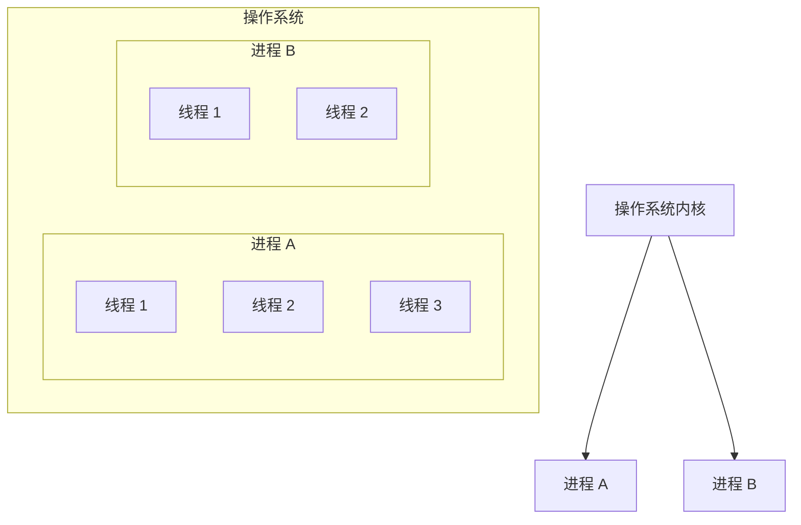

# 进程与线程的区别

> **目标级别**：P5
> **面试频率**：🔴 高频

面试官问：「进程和线程有什么区别？」你说「线程是轻量级的进程」——然后面试官紧接着追问「那为什么不能直接用进程？为什么需要线程？」你沉默了。

这道题看似简单，实际上考察的是你对操作系统核心概念的理解深度。

## 面试官最关心的 3 个问题

1. ⚠️ 进程与线程的本质区别是什么？
2. ⚠️ 为什么说线程是 CPU 调度的基本单位？
3. ⚠️ 多线程编程的优势与风险是什么？

## 核心原理

### 概念定义

**进程（Process）**是操作系统分配资源的基本单位，每个进程都有独立的地址空间，包括：

- 代码段、数据段、堆、栈
- 独立的文件描述符表
- 独立的内存地址空间
- 独立的 PID（进程标识符）

**线程（Thread）**是 CPU 调度的基本单位，同一进程的所有线程共享进程的地址空间和资源：

- 共享进程的代码段和数据段
- 共享进程的打开文件
- 共享进程的信号处理
- 拥有独立的栈、寄存器和程序计数器



### 关键区别对比

| 对比维度 | 进程 | 线程 |
|---------|------|------|
| **资源分配** | 操作系统分配资源的基本单位 | CPU 调度的基本单位 |
| **地址空间** | 独立地址空间 | 共享进程地址空间 |
| **通信方式** | IPC（管道、消息队列、共享内存等） | 直接通过共享内存 |
| **开销** | 创建/切换开销大 | 创建/切换开销小 |
| **隔离性** | 完全隔离，一个崩溃不影响另一个 | 共享资源，一个崩溃可能导致整个进程崩溃 |
| **同步方式** | 需要进程间通信 | 直接使用线程同步原语 |

### 为什么需要线程？

想象一个没有线程的世界：如果你需要同时处理多个任务，比如一边听音乐一边写代码，你可能需要启动两个进程。但问题是：

1. **进程间通信开销大**：进程切换需要切换地址空间，而线程切换不需要
2. **资源共享困难**：进程间的数据共享需要额外的 IPC 机制
3. **资源浪费**：每个进程都要维护独立的资源，而线程可以共享大部分资源

线程的优势正是进程的劣势反义词：轻量、共享、快速切换。

## 线程分类

Java 线程在操作系统层面分为两类：

1. **用户线程（User Thread）**：运行在用户空间，由 JVM 管理
2. **守护线程（Daemon Thread）**：后台服务线程，如 GC 线程

```java
Thread daemonThread = new Thread(() -> {
    // 后台任务
});
daemonThread.setDaemon(true); // 设置为守护线程
daemonThread.start();
```

:::tip 守护线程特性
当 JVM 中只剩下守护线程时，JVM 会直接退出。这意味着守护线程不适合执行关键业务逻辑。
:::

## 高频面试题

### 🔴 题目 1：进程与线程的区别？

**参考回答**：

进程是操作系统分配资源的基本单位，每个进程有独立的地址空间；线程是 CPU 调度的基本单位，同一进程的线程共享地址空间。

**追问 1**：为什么线程切换比进程切换快？

因为线程共享进程的地址空间，切换时不需要切换页表、缓存等，只需要切换寄存器、栈等线程上下文。

**追问 2**：进程间通信有哪些方式？

管道（匿名管道和命名管道）、消息队列、信号量、共享内存、套接字（Socket）。

### 🔴 题目 2：多线程编程的优势是什么？

**参考回答**：

1. **提高 CPU 利用率**：多核 CPU 下可以真正并行执行
2. **提高程序吞吐量**：IO 阻塞时可以切换到其他线程
3. **提高响应速度**：可以将耗时操作放到后台执行
4. **资源共享**：同一进程的线程可以共享数据和资源

**追问**：多线程编程的风险是什么？

1. **线程安全问题**：多个线程同时访问共享资源可能导致数据不一致
2. **死锁问题**：不当的加锁顺序可能导致死锁
3. **上下文切换开销**：线程切换有性能损耗
4. **编程复杂度增加**：需要考虑线程同步和通信

### 🟡 题目 3：Java 中 main 方法是线程吗？

**参考回答**：

是的，main 方法是主线程执行的入口。Java 程序启动时，JVM 会创建一个主线程来执行 `main` 方法。主线程是用户线程，而 JVM 的垃圾回收线程是守护线程。

```java
public class MainThreadDemo {
    public static void main(String[] args) {
        // 获取当前线程
        Thread currentThread = Thread.currentThread();
        System.out.println("主线程名称：" + currentThread.getName());
        System.out.println("主线程优先级：" + currentThread.getPriority());
        System.out.println("主线程是否守护线程：" + currentThread.isDaemon());
    }
}
```

## 常见错误与陷阱

### ⚠️ 陷阱 1：混淆进程和线程的资源分配

很多人认为线程和进程一样都有独立的资源。实际上，线程共享进程的大部分资源，只有栈、寄存器和程序计数器是独立的。

### ⚠️ 陷阱 2：认为线程一定比进程好

线程虽好，但不是万能的。在以下场景下，使用多进程可能更合适：

- 需要完全隔离的任务
- 一个任务崩溃不能影响其他任务
- 需要利用多台机器的分布式场景

### ⚠️ 陷阱 3：忽视线程安全问题

新手容易认为「多线程就是快」，忽视共享资源的同步问题。CPU 缓存、编译器优化、指令重排都可能导致线程安全问题。

## 加分回答

### 💡 从 Linux 内核角度理解线程

在 Linux 内核中，线程和进程都是用 `task_struct` 结构体表示的。区别在于：

- 进程：`task_struct` 之间的资源相互独立
- 线程：`task_struct` 之间共享部分资源（如地址空间、文件描述符等）

Linux 通过 `clone()` 系统调用创建线程，`clone()` 可以指定共享哪些资源。

### 💡 Windows 的线程模型

Windows 的线程模型与 Linux 不同，Windows 中线程是最小的调度单位，进程只是线程的容器。这种设计使得 Windows 的线程切换开销相对较小。

## 总结对比表

| 维度 | 进程 | 线程 |
|------|------|------|
| 英文 | Process | Thread |
| 资源分配者 | 操作系统 | 操作系统（调度），进程（管理） |
| 地址空间 | 独立 | 共享进程的地址空间 |
| 通信方式 | IPC | 共享内存 + 同步原语 |
| 创建/切换开销 | 大（需要切换地址空间） | 小（只需切换寄存器/栈） |
| 安全性 | 高（完全隔离） | 低（共享资源需同步） |
| 适用场景 | 需要隔离的任务 | 需要共享数据的并发任务 |

## 延伸思考

### 面试官可能会继续追问

1. 「协程和线程有什么区别？」
2. 「Go 语言的 goroutine 和线程有什么关系？」
3. 「Java 的虚拟线程（Project Loom）是什么？」

### 回答方向

协程是用户态的轻量级线程，由程序自身调度而非操作系统调度。Go 的 goroutine 是基于 GMP 模型（goroutine - M - P）的协程实现，由 Go 运行时管理，可以创建上万个。Java 虚拟线程是 JDK 21 引入的特性，目的是降低线程的创建成本。
