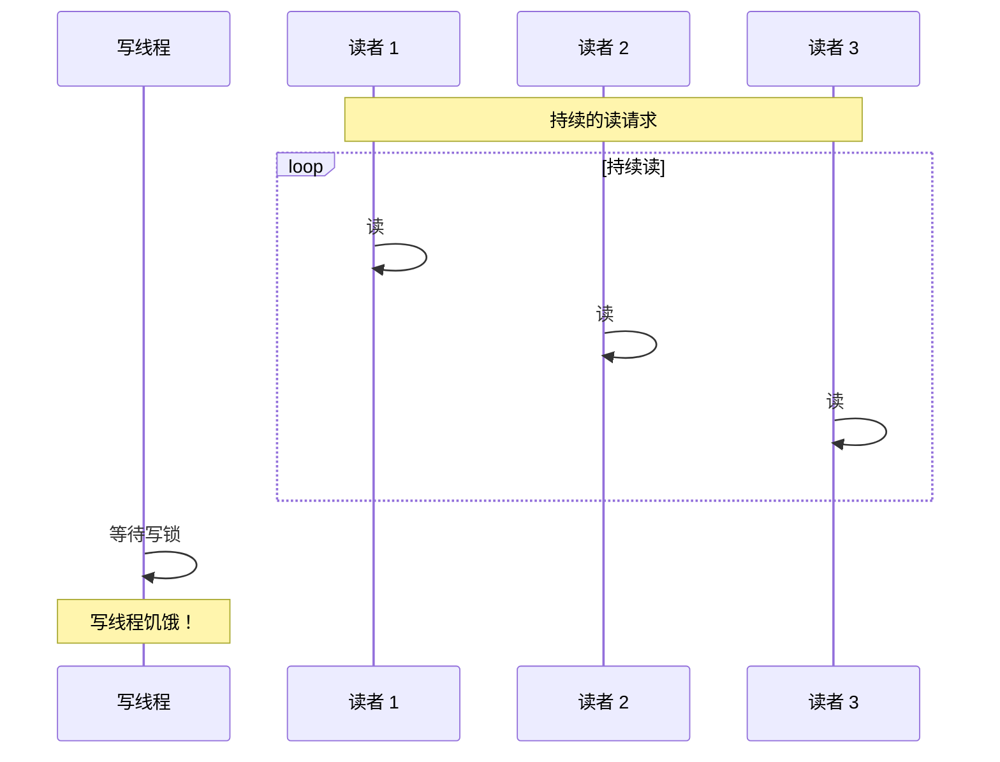

# ReentrantReadWriteLock 读写锁

> **目标级别**：P6
> **面试频率**：🟡 中频

面试官问：「读写锁是什么？」你说「读和写用不同的锁」——然后面试官紧接着追问「那读写锁会不会导致写饥饿？读写锁和 ReentrantLock 有什么区别？」你沉默了。

读写锁是读多写少场景的最佳选择，理解其实现才能正确使用。

## 面试官最关心的 3 个问题

1. ⚠️ 读写锁的基本原理是什么？
2. ⚠️ 读写锁如何实现读写分离？
3. ⚠️ 读写锁可能导致什么问题？

## 核心原理

### 读写锁的概念

读写锁允许多个线程同时读，但写操作必须独占：

```mermaid
graph TB
    subgraph "读操作"
        R1["读者 1"]
        R2["读者 2"]
        R3["读者 3"]
    end

    subgraph "锁状态"
        L["读锁：共享"]
    end

    R1 --> L
    R2 --> L
    R3 --> L
    Note over L: 可以同时持有

    subgraph "写操作"
        W["写者"]
    end

    subgraph "锁状态2"
        L2["写锁：独占"]
    end

    W --> L2
    Note over L2: 独占，必须等待所有读者
```

### 基本使用

```java
public class Cache<K, V> {
    private final Map<K, V> cache = new HashMap<>();
    private final ReadWriteLock rwLock = new ReentrantReadWriteLock();
    private final Lock readLock = rwLock.readLock();
    private final Lock writeLock = rwLock.writeLock();

    // 读操作：多个线程可以同时读
    public V get(K key) {
        readLock.lock();
        try {
            return cache.get(key);
        } finally {
            readLock.unlock();
        }
    }

    // 写操作：独占，写时不能读
    public void put(K key, V value) {
        writeLock.lock();
        try {
            cache.put(key, value);
        } finally {
            writeLock.unlock();
        }
    }
}
```

### AQS 的 state 分段

读写锁使用 AQS 的 state，高 16 位和低 16 位分别存储读锁和写锁计数：

```
┌────────────────┬────────────────┐
│   读锁计数      │   写锁计数      │
│   (高 16 位)    │   (低 16 位)    │
│   shared count  │   exclusive    │
└────────────────┴────────────────┘
```

```java
// 获取写锁计数
static int getExclusiveCount(int c) { return c & EXCLUSIVE_MASK; }

// 获取读锁计数
static int getSharedCount(int c) { return c >>> SHARED_SHIFT; }
```

## 读写锁的实现

### HoldCounter 记录读锁持有

```java
// 记录每个线程持有的读锁数量
static final class HoldCounter {
    int count = 0;
    final long tid = Thread.currentThread().getId();

    // ThreadLocal 版本
    static final ThreadLocal<HoldCounter> counts = new ThreadLocal<>();
}
```

### 读锁获取

```java
protected final int tryAcquireShared(int unused) {
    Thread current = Thread.currentThread();
    int c = getState();

    // 写锁被占用？不能获取读锁
    if (getExclusiveCount(c) != 0 &&
        getExclusiveOwnerThread() != current) {
        return -1;
    }

    int r = getSharedCount(c);
    if (!readerShouldBlock() &&  // 是否应该阻塞
        r < MAX_COUNT &&         // 未超过最大读锁数
        compareAndSetState(c, c + SHARED_UNIT)) {
        // CAS 成功，获取读锁
        if (firstReader == null) {
            firstReader = current;
            firstReaderHoldCount = 1;
        } else if (firstReader == current) {
            firstReaderHoldCount++;
        } else {
            HoldCounter hc = counts.get();
            hc.count++;
        }
        return 1;
    }
    // CAS 失败，自旋获取
    return fullTryAcquireShared(current);
}
```

### 写锁获取

```java
protected final boolean tryAcquire(int acquires) {
    Thread current = Thread.currentThread();
    int c = getState();
    int w = getExclusiveCount(c);

    if (c != 0) { // 已经有锁
        if (w == 0 || current != getExclusiveOwnerThread()) {
            // 有读锁或有其他写锁，不能获取
            return false;
        }
        // 同一线程持有写锁，可重入
        if (w + acquires > MAX_COUNT) {
            throw new Error("Maximum lock count exceeded");
        }
        setState(c + acquires);
        return true;
    }

    // 没有锁，尝试 CAS 获取
    if (writerShouldBlock() ||
        !compareAndSetState(c, c + acquires)) {
        return false;
    }
    setExclusiveOwnerThread(current);
    return true;
}
```

## 读写锁的问题

### 1. 写饥饿问题



### 2. 读写冲突问题

```java
// ❌ 读写不能同时发生
readLock.lock();
try {
    writeLock.lock(); // ❌ 死锁！已经持有读锁
    try {
        // ...
    } finally {
        writeLock.unlock();
    }
} finally {
    readLock.unlock();
}
```

## 高频面试题

### 🔴 题目 1：读写锁的原理是什么？

**参考回答**：

读写锁基于 AQS 实现，使用 state 的高 16 位存储读锁计数，低 16 位存储写锁计数：

1. **读锁**：共享模式，多个线程可以同时持有
2. **写锁**：独占模式，获取时必须没有读锁和写锁
3. **读写互斥**：读时不能写，写时不能读

### 🔴 题目 2：读写锁可能导致什么问题？

**参考回答**：

1. **写饥饿**：持续不断的读请求可能导致写操作长期等待
2. **锁升级死锁**：持有读锁时尝试获取写锁会死锁
3. **锁降级安全**：可以持有写锁时获取读锁，但不能反过来

### 🟡 题目 3：读写锁和普通锁的区别？

| 区别 | 普通锁 | 读写锁 |
|------|--------|--------|
| **并发读** | ❌ 不支持 | ✅ 支持 |
| **写互斥** | ✅ | ✅ |
| **复杂度** | 简单 | 复杂 |
| **适用场景** | 写多 | 读多写少 |

## 常见错误与陷阱

### ⚠️ 陷阱 1：读写锁升级

```java
// ❌ 死锁：读锁 → 写锁
readLock.lock();
try {
    writeLock.lock(); // ❌ 永久等待
    try {
        // ...
    } finally {
        writeLock.unlock();
    }
} finally {
    readLock.unlock();
}
```

### ⚠️ 陷阱 2：读写锁降级

```java
// ✅ 正确：写锁 → 读锁
writeLock.lock();
try {
    readLock.lock(); // ✅ 安全
    try {
        // 持有写锁和读锁
    } finally {
        readLock.unlock();
    }
} finally {
    writeLock.unlock();
}
```

### ⚠️ 陷阱 3：忽视读写锁开销

```java
// ⚠️ 读多写少才适合读写锁
// 读写操作很快时，普通锁可能更快
// 因为读写锁有额外的计数和 CAS 开销
```

## 加分回答

### 💡 StampedLock 改进

JDK 8 引入了 StampedLock，提供乐观读：

```java
StampedLock sl = new StampedLock();

// 乐观读：不需要获取锁
long stamp = sl.tryOptimisticRead();
V v = cache.get(key);

// 验证：如果有写操作，stamp 失效
if (!sl.validate(stamp)) {
    stamp = sl.readLock();
    try {
        v = cache.get(key);
    } finally {
        sl.unlockRead(stamp);
    }
}
```

### 💡 读写锁的公平性

```java
// 公平读写锁
ReentrantReadWriteLock fairLock =
    new ReentrantReadWriteLock(true);

// 非公平读写锁
ReentrantReadWriteLock unfairLock =
    new ReentrantReadWriteLock(false);
```

## 总结对比表

| 维度 | ReentrantLock | ReentrantReadWriteLock |
|------|---------------|----------------------|
| **读并发** | ❌ | ✅ |
| **写互斥** | ✅ | ✅ |
| **state 结构** | 单值 | 分段计数 |
| **复杂度** | 低 | 高 |
| **适用场景** | 通用 | 读多写少 |

## 延伸思考

### 面试官可能会继续追问

1. 「StampedLock 和 ReadWriteLock 的区别是什么？」
2. 「为什么 StampedLock 不能重入？」
3. 「如何实现一个读写锁的缓存？」

### 回答方向

关于 StampedLock：
- 支持乐观读（tryOptimisticRead）
- 不支持重入
- 不支持 Condition
- 性能比 ReadWriteLock 更好
