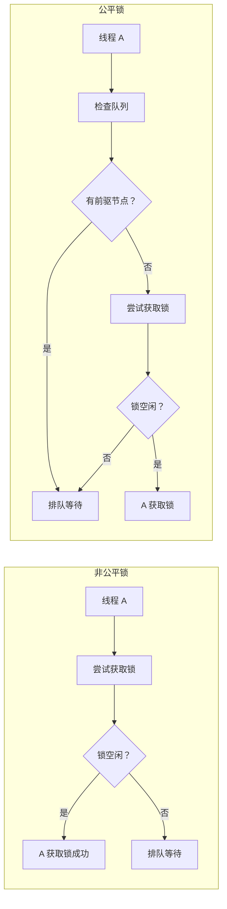
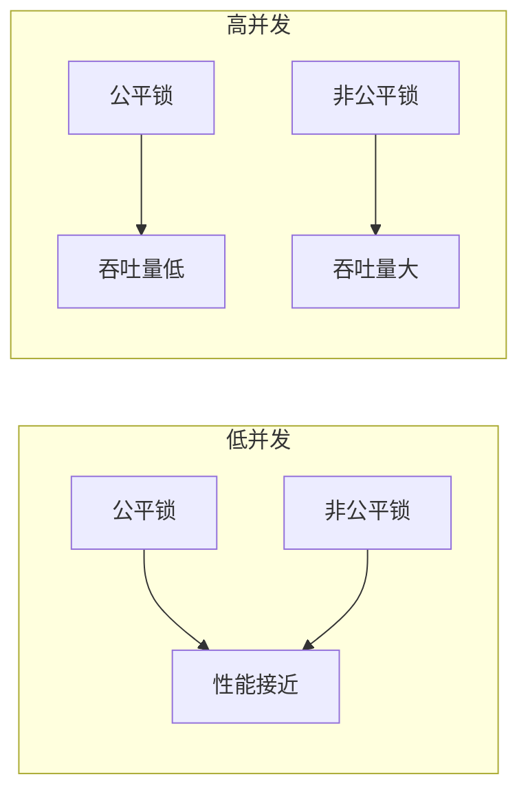
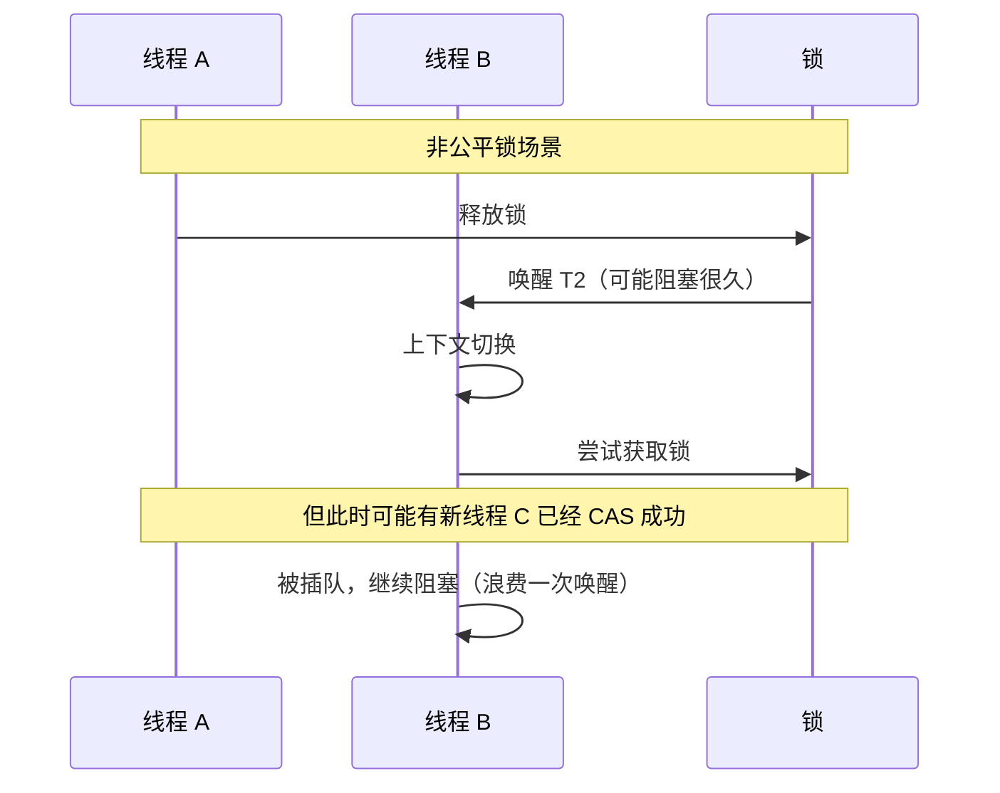

# ReentrantLock 公平锁与非公平锁

> **目标级别**：P5/P6
> **面试频率**：🔴 高频

面试官问：「ReentrantLock 的公平锁和非公平锁有什么区别？」你说「非公平锁更快」——然后面试官紧接着追问「为什么非公平锁更快？什么场景下应该用公平锁？」你沉默了。

理解公平与非公平的 trade-off，才能在实际开发中做出正确选择。

## 面试官最关心的 3 个问题

1. ⚠️ 公平锁和非公平锁的区别是什么？
2. ⚠️ 为什么非公平锁性能更好？
3. ⚠️ 什么场景应该用公平锁？

## 核心原理

### 基本区别



| 区别 | 公平锁 | 非公平锁 |
|------|--------|---------|
| **等待队列** | FIFO，严格按顺序 | 不保证顺序 |
| **吞吐量** | 较低 | 较高 |
| **响应延迟** | 较高 | 较低 |
| **饥饿风险** | 低 | 存在 |

### 创建方式

```java
// 非公平锁（默认）
ReentrantLock unfairLock = new ReentrantLock();
ReentrantLock unfairLock2 = new ReentrantLock(false);

// 公平锁
ReentrantLock fairLock = new ReentrantLock(true);
```

## 实现对比

### 非公平锁实现

```java
// NonfairSync
static final class NonfairSync extends Sync {
    protected final boolean tryAcquire(int acquires) {
        // 1. 直接尝试 CAS 获取锁
        if (compareAndSetState(0, acquires)) {
            setExclusiveOwnerThread(Thread.currentThread());
            return true;
        }

        // 2. 再检查是否可重入
        if (checkNonfairTryAcquire(acquires)) {
            return true;
        }

        // 3. 获取失败，加入等待队列
        return false;
    }
}
```

**非公平锁的特点**：
1. 尝试直接 CAS 获取锁
2. 不检查等待队列
3. 可能让新线程「插队」

### 公平锁实现

```java
// FairSync
static final class FairSync extends Sync {
    protected final boolean tryAcquire(int acquires) {
        Thread current = Thread.currentThread();
        int c = getState();

        if (c == 0) {
            // 关键区别：检查是否有前驱节点
            if (!hasQueuedPredecessors()) {
                if (compareAndSetState(0, acquires)) {
                    setExclusiveOwnerThread(Thread.currentThread());
                    return true;
                }
            }
        } else if (current == getExclusiveOwnerThread()) {
            int nextc = c + acquires;
            setState(nextc);
            return true;
        }
        return false;
    }
}
```

**公平锁的特点**：
1. 检查等待队列
2. 只有没有前驱节点时才尝试获取
3. 保证 FIFO 顺序

### hasQueuedPredecessors 方法

```java
public final boolean hasQueuedPredecessors() {
    Node t = tail;
    Node h = head;
    Node s;
    // head 和 tail 之间有节点，且第一个节点的线程不是当前线程
    return h != t &&
        ((s = h.next) == null || s.thread != Thread.currentThread());
}
```

## 性能对比

### 吞吐量对比



### 线程切换开销



## 适用场景

### 非公平锁适用场景

| 场景 | 说明 |
|------|------|
| **高并发** | 追求高吞吐量 |
| **短期持有锁** | 锁持有时间短，自旋成本低 |
| **无严格顺序要求** | 不关心获取顺序 |

### 公平锁适用场景

| 场景 | 说明 |
|------|------|
| **低并发** | 竞争不激烈，开销可接受 |
| **需要顺序** | 必须按请求顺序执行 |
| **避免饥饿** | 不希望某些线程长期等待 |

### 生产者-消费者示例

```java
public class FairLockDemo {
    private final ReentrantLock lock = new ReentrantLock(true);
    private final Condition notFull = lock.newCondition();
    private final Condition notEmpty = lock.newCondition();
    private final int[] buffer = new int[10];
    private int count = 0;

    public void put(int value) throws InterruptedException {
        lock.lock();
        try {
            while (count == buffer.length) {
                notFull.await(); // 等待不满
            }
            buffer[count++] = value;
            notEmpty.signal(); // 唤醒消费者
        } finally {
            lock.unlock();
        }
    }

    public int take() throws InterruptedException {
        lock.lock();
        try {
            while (count == 0) {
                notEmpty.await(); // 等待不空
            }
            int value = buffer[--count];
            notFull.signal(); // 唤醒生产者
            return value;
        } finally {
            lock.unlock();
        }
    }
}
```

## 高频面试题

### 🔴 题目 1：公平锁和非公平锁的区别？

**参考回答**：

| 区别 | 公平锁 | 非公平锁 |
|------|--------|---------|
| **等待队列** | FIFO，严格顺序 | 不保证顺序 |
| **获取方式** | 先检查队列再获取 | 直接尝试 CAS |
| **吞吐量** | 较低 | 较高 |
| **响应延迟** | 较高 | 较低 |
| **饥饿风险** | 低 | 可能 |

### 🔴 题目 2：为什么非公平锁性能更好？

**参考回答**：

1. **减少线程切换**：新线程可能直接 CAS 成功，不需要阻塞/唤醒
2. **减少等待时间**：释放锁时立即尝试获取，避免排队
3. **更高的并发度**：锁持有时间短时，非阻塞获取更高效

### 🔴 题目 3：什么场景下应该用公平锁？

**参考回答**：

- 需要严格的请求顺序（如数据库事务、FIFO 队列）
- 不希望线程饥饿
- 低并发场景，开销可接受
- 锁持有时间长（此时非公平优势不明显）

## 常见错误与陷阱

### ⚠️ 陷阱 1：默认使用非公平锁

```java
// ⚠️ 默认是非公平锁
ReentrantLock lock = new ReentrantLock();

// 在需要顺序的场景下，应该用公平锁
ReentrantLock fairLock = new ReentrantLock(true);
```

### ⚠️ 陷阱 2：混淆公平性和可重入

```java
ReentrantLock lock = new ReentrantLock(true); // 公平 + 可重入

lock.lock();
lock.lock(); // ✅ 可以重入，即使在公平锁下
```

### ⚠️ 陷阱 3：忽视饥饿问题

```java
// 非公平锁可能导致线程饥饿
// 新线程不断「插队」，导致队列中的线程长时间得不到执行
```

## 加分回答

### 💡 TryLock 的公平性

```java
// tryLock 不受公平性影响
ReentrantLock fairLock = new ReentrantLock(true);
fairLock.tryLock(); // 不检查队列，直接尝试
```

### 💡 读写锁的公平性

```java
// 公平读写锁
ReentrantReadWriteLock fairRWLock = new ReentrantReadWriteLock(true);

// 非公平读写锁
ReentrantReadWriteLock unfairRWLock = new ReentrantReadWriteLock(false);
```

## 总结对比表

| 维度 | 公平锁 | 非公平锁 |
|------|--------|---------|
| **hasQueuedPredecessors** | 必须检查 | 不检查 |
| **CAS 时机** | 队列检查之后 | 队列检查之前 |
| **吞吐量** | 低 | 高 |
| **响应时间** | 稳定，可能较长 | 不稳定，可能很短 |
| **适用场景** | 需要顺序 | 高性能优先 |
| **饥饿风险** | 低 | 存在 |

## 延伸思考

### 面试官可能会继续追问

1. 「StampedLock 的公平性是怎么实现的？」
2. 「为什么 synchronized 不是公平锁？」
3. 「如何实现一个公平的 TryLock？」

### 回答方向

关于 StampedLock 的乐观读：
```java
StampedLock sl = new StampedLock();
long stamp = sl.readLock(); // 悲观读，阻塞
// 或
long stamp = sl.tryOptimisticRead(); // 乐观读，不阻塞
if (!sl.validate(stamp)) {
    stamp = sl.readLock(); // 验证失败，降级为悲观读
}
```
