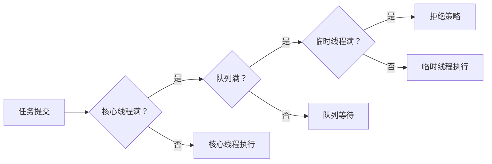

# 线程池拒绝策略

> **目标级别**：P5/P6
> **面试频率**：🔴 高频

面试官问：「线程池的拒绝策略有哪些？」你说「AbortPolicy」——然后面试官紧接着追问「那默认的拒绝策略是什么？自定义拒绝策略怎么做？」你沉默了。

理解拒绝策略才能在系统过载时做出正确的处理。

## 面试官最关心的 3 个问题

1. ⚠️ 线程池有哪些内置拒绝策略？
2. ⚠️ 什么时候会触发拒绝策略？
3. ⚠️ 如何自定义拒绝策略？

## 核心原理

### RejectedExecutionHandler 接口

```java
public interface RejectedExecutionHandler {
    void rejectedExecution(Runnable r, ThreadPoolExecutor executor);
}
```

### 触发条件



## 内置拒绝策略

### 1. AbortPolicy（默认）

```java
public static class AbortPolicy implements RejectedExecutionHandler {
    public void rejectedExecution(Runnable r, ThreadPoolExecutor e) {
        throw new RejectedExecutionException(
            "Task " + r.toString() +
            " rejected from " +
            e.toString());
    }
}
```

**特点**：抛出异常，中断任务执行。

### 2. CallerRunsPolicy

```java
public static class CallerRunsPolicy implements RejectedExecutionHandler {
    public void rejectedExecution(Runnable r, ThreadPoolExecutor e) {
        if (!e.isShutdown()) {
            // 由调用者线程执行任务
            r.run();
        }
    }
}
```

**特点**：由调用者线程执行任务，起到限流作用。

### 3. DiscardPolicy

```java
public static class DiscardPolicy implements RejectedExecutionHandler {
    public void rejectedExecution(Runnable r, ThreadPoolExecutor e) {
        // 静默丢弃，不做任何处理
    }
}
```

**特点**：直接丢弃任务，不抛出异常。

### 4. DiscardOldestPolicy

```java
public static class DiscardOldestPolicy implements RejectedExecutionHandler {
    public void rejectedExecution(Runnable r, ThreadPoolExecutor e) {
        if (!e.isShutdown()) {
            // 丢弃队列中最旧的任务
            e.getQueue().poll();
            e.execute(r);
        }
    }
}
```

**特点**：丢弃队列中最旧的任务，执行新任务。

## 对比表格

| 策略 | 行为 | 影响 |
|------|------|------|
| **AbortPolicy** | 抛出异常 | 任务失败 |
| **CallerRunsPolicy** | 调用者执行 | 调用者被拖累，限流 |
| **DiscardPolicy** | 静默丢弃 | 任务丢失 |
| **DiscardOldestPolicy** | 丢弃最旧 | 新任务可能更重要 |

## 自定义拒绝策略

### 场景 1：记录日志并重试

```java
public class LoggingPolicy implements RejectedExecutionHandler {
    private static final Logger logger =
        LoggerFactory.getLogger(LoggingPolicy.class);

    @Override
    public void rejectedExecution(Runnable r, ThreadPoolExecutor executor) {
        logger.warn("Task {} rejected from {}", r, executor);
        // 记录到监控系统
        Metrics.counter("threadpool.rejected").increment();

        // 可选：重试逻辑
        if (!executor.isShutdown()) {
            // 等待后重试
            try {
                Thread.sleep(100);
                executor.execute(r);
            } catch (InterruptedException e) {
                Thread.currentThread().interrupt();
            }
        }
    }
}
```

### 场景 2：放入内存队列

```java
public class QueueFallbackPolicy implements RejectedExecutionHandler {
    private final BlockingQueue<Runnable> fallbackQueue =
        new LinkedBlockingQueue<>(1000);

    @Override
    public void rejectedExecution(Runnable r, ThreadPoolExecutor executor) {
        if (!fallbackQueue.offer(r)) {
            // 队列也满了，记录指标
            Metrics.counter("threadpool.fallback.full").increment();
        }
    }

    // 后台线程处理 fallbackQueue
    public void startFallbackProcessor() {
        Executors.newSingleThreadExecutor().submit(() -> {
            while (true) {
                try {
                    Runnable task = fallbackQueue.take();
                    task.run();
                } catch (InterruptedException e) {
                    break;
                }
            }
        });
    }
}
```

### 场景 3：监控告警

```java
public class AlertingPolicy implements RejectedExecutionHandler {
    private final AlertService alertService;

    public AlertingPolicy(AlertService alertService) {
        this.alertService = alertService;
    }

    @Override
    public void rejectedExecution(Runnable r, ThreadPoolExecutor executor) {
        // 发送告警
        alertService.send(new Alert(
            AlertLevel.HIGH,
            "Thread pool rejected",
            executor.toString()
        ));

        // 可选：使用 CallerRunsPolicy 作为兜底
        new CallerRunsPolicy().rejectedExecution(r, executor);
    }
}
```

## 高频面试题

### 🔴 题目 1：线程池有哪些拒绝策略？

**参考回答**：

JDK 内置 4 种拒绝策略：

| 策略 | 说明 |
|------|------|
| **AbortPolicy** | 抛出 RejectedExecutionException |
| **CallerRunsPolicy** | 由调用者线程执行 |
| **DiscardPolicy** | 静默丢弃 |
| **DiscardOldestPolicy** | 丢弃队列中最旧的任务 |

### 🔴 题目 2：什么时候触发拒绝策略？

**参考回答**：

触发拒绝策略的条件：
1. 核心线程已满
2. 工作队列已满
3. 最大线程数已满
4. 线程池处于非 RUNNING 状态

### 🔴 题目 3：如何选择拒绝策略？

**参考回答**：

| 场景 | 推荐策略 |
|------|---------|
| **非核心任务** | DiscardPolicy |
| **需要所有任务都执行** | CallerRunsPolicy |
| **需要优先执行新任务** | DiscardOldestPolicy |
| **金融交易等** | AbortPolicy + 监控 |
| **需要自定义处理** | 自定义策略 |

## 常见错误与陷阱

### ⚠️ 陷阱 1：使用 DiscardPolicy 丢失重要任务

```java
// ❌ 可能导致重要任务丢失
new ThreadPoolExecutor(10, 10, 0L,
    TimeUnit.MILLISECONDS,
    new LinkedBlockingQueue<>(1000),
    new DiscardPolicy()); // 可能丢失重要任务
```

### ⚠️ 陷阱 2：CallerRunsPolicy 导致调用者阻塞

```java
// ❌ 在主线程中使用可能导致死锁
public static void main(String[] args) {
    ThreadPoolExecutor executor = new ThreadPoolExecutor(
        1, 1, 0L, TimeUnit.SECONDS,
        new LinkedBlockingQueue<>(1),
        new CallerRunsPolicy());

    executor.submit(() -> {
        executor.submit(() -> {
            // 任务在主线程执行，可能死锁
        });
    });
}
```

### ⚠️ 陷阱 3：拒绝策略中再次 execute

```java
// ❌ 可能导致无限循环
public class BadPolicy implements RejectedExecutionHandler {
    @Override
    public void rejectedExecution(Runnable r, ThreadPoolExecutor e) {
        e.execute(r); // ⚠️ 可能无限重试
    }
}
```

## 加分回答

### 💡 拒绝策略的监控

```java
ThreadPoolExecutor executor = new ThreadPoolExecutor(
    10, 20, 60L, TimeUnit.SECONDS,
    new LinkedBlockingQueue<>(100),
    new ThreadPoolExecutor.AbortPolicy());

// 监控拒绝次数
executor.getRejectedExecutionHandler();

// 在 RejectedExecutionHandler 中记录指标
public class MonitoredPolicy implements RejectedExecutionHandler {
    private final RejectedExecutionHandler defaultHandler;

    public MonitoredPolicy() {
        this.defaultHandler = new ThreadPoolExecutor.AbortPolicy();
    }

    @Override
    public void rejectedExecution(Runnable r, ThreadPoolExecutor e) {
        Metrics.counter("rejected.tasks").increment();
        defaultHandler.rejectedExecution(r, e);
    }
}
```

## 总结对比表

| 策略 | 任务丢失 | 调用者阻塞 | 异常抛出 | 适用场景 |
|------|---------|-----------|---------|---------|
| **AbortPolicy** | ❌ | ❌ | ✅ | 金融交易 |
| **CallerRunsPolicy** | ❌ | ✅ | ❌ | 限流 |
| **DiscardPolicy** | ✅ | ❌ | ❌ | 非重要任务 |
| **DiscardOldestPolicy** | ✅（最旧的） | ❌ | ❌ | 新任务优先 |

## 延伸思考

### 面试官可能会继续追问

1. 「如何实现一个带超时的拒绝策略？」
2. 「拒绝策略中如何记录上下文信息？」
3. 「线程池拒绝后，原任务的状态是什么？」

### 回答方向

关于任务状态：任务被拒绝后，原任务对象仍然存在，可以被重新提交或记录。关键是确定如何处理被拒绝的任务。
