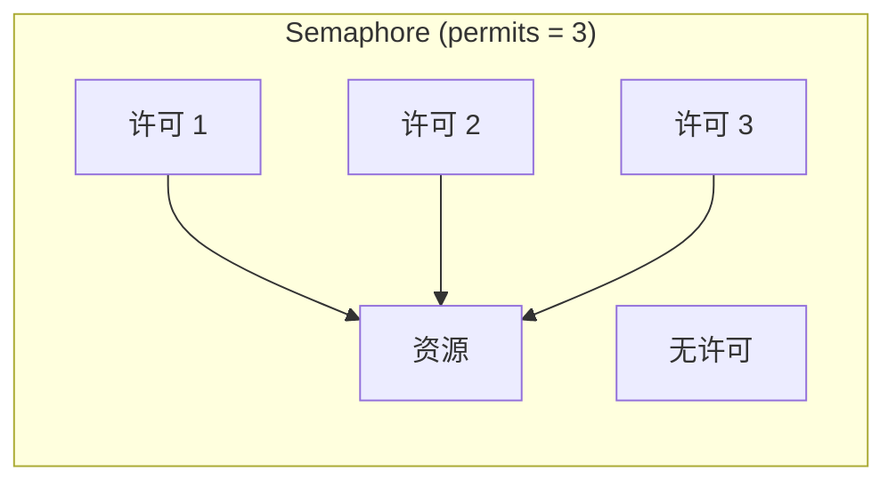

# Semaphore 原理

> **目标级别**：P5/P6
> **面试频率**：🔴 高频

面试官问：「Semaphore 是什么？」你说「信号量」——然后面试官紧接着追问「那 Semaphore 和锁有什么区别？为什么需要 Semaphore？」你沉默了。

Semaphore 是控制并发访问资源数量的利器，理解其原理才能正确使用。

## 面试官最关心的 3 个问题

1. ⚠️ Semaphore 的原理是什么？
2. ⚠️ Semaphore 和 Lock 的区别是什么？
3. ⚠️ Semaphore 适合什么场景？

## 核心原理

### 基本概念

Semaphore（信号量）是一种计数器，用于控制同时访问特定资源的线程数量。



### 基本使用

```java
public class SemaphoreDemo {
    public static void main(String[] args) {
        // 创建许可数为 3 的信号量
        Semaphore semaphore = new Semaphore(3);

        for (int i = 0; i < 10; i++) {
            final int threadNum = i;
            new Thread(() -> {
                try {
                    // 获取许可
                    semaphore.acquire();
                    System.out.println("线程 " + threadNum + " 获取许可");
                    Thread.sleep(1000);
                    System.out.println("线程 " + threadNum + " 释放许可");
                    // 释放许可
                    semaphore.release();
                } catch (InterruptedException e) {
                    e.printStackTrace();
                }
            }).start();
        }
    }
}
```

### 公平 vs 非公平

```java
// 非公平信号量（默认）
Semaphore unfair = new Semaphore(3);

// 公平信号量
Semaphore fair = new Semaphore(3, true);
```

## 实现原理

### AQS 共享模式

```java
public class Semaphore implements java.io.Serializable {
    private final Sync sync;

    abstract static class Sync extends AbstractQueuedSynchronizer {
        final int nonfairTryAcquireShared(int acquires) {
            for (;;) {
                int available = getState();
                int remaining = available - acquires;
                if (remaining < 0 ||
                    compareAndSetState(available, remaining)) {
                    return remaining;
                }
            }
        }
    }
}
```

### acquire 方法

```java
public void acquire() throws InterruptedException {
    sync.acquireSharedInterruptibly(1);
}

public final void acquireSharedInterruptibly(int arg) throws InterruptedException {
    if (Thread.interrupted()) {
        throw new InterruptedException();
    }
    int tryAcquireShared(arg);
    if (tryAcquireShared(arg) < 0) {
        doAcquireSharedInterruptibly(arg);
    }
}
```

### release 方法

```java
public void release() {
    sync.releaseShared(1);
}

public final boolean releaseShared(int arg) {
    if (tryReleaseShared(arg)) {
        doReleaseShared();
        return true;
    }
    return false;
}
```

## Semaphore vs Lock

| 区别 | Semaphore | Lock |
|------|-----------|------|
| **资源数量** | 可以是任意数 | 通常为 1 |
| **持有者** | 不需要记录 | 记录持有线程 |
| **可重入** | 否 | 是（ReentrantLock） |
| **用途** | 控制并发数量 | 保证互斥 |
| **释放者** | 不一定必须是获取者 | 必须是持有者 |

### 使用对比

```java
// Lock：互斥访问
ReentrantLock lock = new ReentrantLock();
lock.lock();
try {
    // 只有一个线程能进入
} finally {
    lock.unlock();
}

// Semaphore：控制并发数量
Semaphore semaphore = new Semaphore(3);
semaphore.acquire();
try {
    // 最多 3 个线程同时进入
} finally {
    semaphore.release();
}
```

## 典型应用场景

### 1. 连接池限流

```java
public class ConnectionPool {
    private final Semaphore semaphore;
    private final Connection[] connections;

    public ConnectionPool(int poolSize) {
        this.semaphore = new Semaphore(poolSize);
        this.connections = new Connection[poolSize];
        for (int i = 0; i < poolSize; i++) {
            connections[i] = createConnection();
        }
    }

    public Connection getConnection() throws InterruptedException {
        semaphore.acquire();
        return connections[next()];
    }

    public void releaseConnection(Connection conn) {
        connections[findIndex(conn)] = conn;
        semaphore.release();
    }
}
```

### 2. 限流器

```java
public class RateLimiter {
    private final Semaphore semaphore;
    private final int maxPermits;

    public RateLimiter(int maxPermits) {
        this.maxPermits = maxPermits;
        this.semaphore = new Semaphore(maxPermits);
    }

    public boolean tryAcquire() {
        return semaphore.tryAcquire();
    }

    public void acquire() throws InterruptedException {
        semaphore.acquire();
    }

    public void release() {
        semaphore.release();
    }

    public int getAvailablePermits() {
        return semaphore.availablePermits();
    }
}
```

### 3. 令牌桶

```java
public class TokenBucket {
    private final Semaphore semaphore;
    private final Timer timer;

    public TokenBucket(int capacity) {
        this.semaphore = new Semaphore(capacity);
        this.timer = new Timer();

        // 每秒补充一个令牌
        timer.scheduleAtFixedRate(new TimerTask() {
            @Override
            public void run() {
                if (semaphore.availablePermits() < capacity) {
                    semaphore.release();
                }
            }
        }, 0, 1000);
    }

    public void acquire() throws InterruptedException {
        semaphore.acquire();
    }
}
```

## 高频面试题

### 🔴 题目 1：Semaphore 的原理是什么？

**参考回答**：

Semaphore 基于 AQS 的共享模式实现：

1. **permits**：信号量计数，表示可用资源数
2. **acquire**：线程尝试获取 permit，如果 permits > 0，则 permits -1
3. **release**：线程释放 permit，permits +1
4. **公平性**：支持公平和非公平模式

### 🔴 题目 2：Semaphore 和 Lock 的区别？

**参考回答**：

| 区别 | Semaphore | Lock |
|------|-----------|------|
| **并发控制** | 控制 N 个线程 | 控制 1 个线程 |
| **持有者** | 不记录 | 记录 |
| **可重入** | 否 | 是（ReentrantLock） |
| **释放者** | 任意线程 | 必须获取者 |

### 🔴 题目 3：Semaphore 适合什么场景？

**参考回答**：

1. **资源池**：限制数据库连接池、线程池大小
2. **流量控制**：限制并发请求数
3. **令牌桶**：实现限流器

## 常见错误与陷阱

### ⚠️ 陷阱 1：忘记 release

```java
// ❌ 可能导致资源耗尽
semaphore.acquire();
// 忘记 release
```

### ⚠️ 陷阱 2：release 次数超过 acquire

```java
// ❌ permits 会超过初始值
semaphore.release();
semaphore.release();
semaphore.release();
```

### ⚠️ 陷阱 3：在 finally 中 release

```java
// ✅ 正确
try {
    semaphore.acquire();
    // 业务逻辑
} finally {
    semaphore.release();
}
```

## 加分回答

### 💡 tryAcquire 方法

```java
// 尝试获取，不阻塞
if (semaphore.tryAcquire()) {
    try {
        // 业务逻辑
    } finally {
        semaphore.release();
    }
} else {
    // 获取失败，处理降级逻辑
}
```

### 💡 超时获取

```java
// 等待 5 秒获取许可
if (semaphore.tryAcquire(5, TimeUnit.SECONDS)) {
    try {
        // 业务逻辑
    } finally {
        semaphore.release();
    }
} else {
    // 超时处理
}
```

## 总结对比表

| 方法 | 说明 |
|------|------|
| `acquire()` | 获取许可，阻塞 |
| `acquire(int permits)` | 获取多个许可 |
| `tryAcquire()` | 尝试获取，非阻塞 |
| `tryAcquire(long timeout, TimeUnit)` | 超时获取 |
| `release()` | 释放许可 |
| `release(int permits)` | 释放多个许可 |
| `availablePermits()` | 获取可用许可数 |
| `drainPermits()` | 获取并清空所有许可 |

## 延伸思考

### 面试官可能会继续追问

1. 「Semaphore 的 permits 可以是负数吗？」
2. 「CountDownLatch 能模拟 Semaphore 吗？」
3. 「如何实现一个公平信号量？」

### 回答方向

关于负数 permits：Semaphore 允许在创建时 permits 为 0，此时所有 acquire 都会阻塞。可以通过 release 增加 permits。
