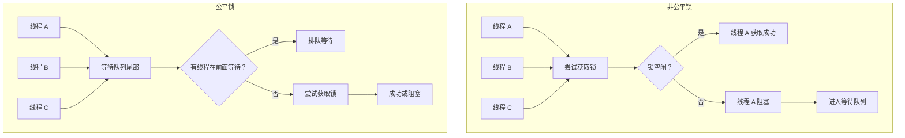
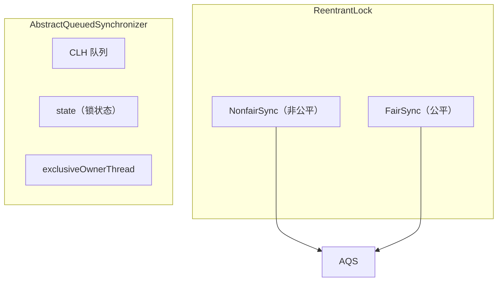

# synchronized 与 ReentrantLock 对比

> **目标级别**：P5/P6
> **面试频率**：🔴 高频

面试官问：「synchronized 和 ReentrantLock 有什么区别？」你说「一个是关键字，一个是类」——然后面试官紧接着追问「那为什么需要 ReentrantLock？synchronized 不能实现的功能是什么？」你沉默了。

理解两者的区别，才能在实际开发中做出正确的选择。

## 面试官最关心的 3 个问题

1. ⚠️ synchronized 和 ReentrantLock 的核心区别是什么？
2. ⚠️ ReentrantLock 的公平锁和非公平锁有什么区别？
3. ⚠️ 什么场景下应该选择 synchronized，什么场景下应该选择 ReentrantLock？

## 核心原理

### synchronized 的局限性

| 局限性 | 说明 |
|--------|------|
| **不可中断** | 等待获取锁时无法响应中断 |
| **不可超时** | 无法设置获取锁的超时时间 |
| **单一条件变量** | 只有一个隐式的 wait/notify 条件 |
| **非公平** | 无法实现公平锁 |
| **隐式获取释放** | 容易忘记释放锁 |

### ReentrantLock 的优势

| 特性 | synchronized | ReentrantLock |
|------|-------------|---------------|
| 可中断 | ❌ | ✅ |
| 可超时 | ❌ | ✅ |
| 多条件 | ❌（一个） | ✅（多个） |
| 公平锁 | ❌ | ✅ |
| 尝试获取 | ❌ | ✅ |
| 读写锁 | ❌ | ✅（配合 ReadWriteLock） |

## 核心对比

### 基本使用对比

```java
// synchronized 方式
public class SyncDemo {
    public synchronized void method() {
        // 同步代码
    }
}

// ReentrantLock 方式
public class LockDemo {
    private final ReentrantLock lock = new ReentrantLock();

    public void method() {
        lock.lock();
        try {
            // 同步代码
        } finally {
            lock.unlock(); // 必须手动释放
        }
    }
}
```

### ReentrantLock 的特性

#### 1. 可重入性

```java
ReentrantLock lock = new ReentrantLock();

public void methodA() {
    lock.lock();
    try {
        methodB(); // 可以重入
    } finally {
        lock.unlock();
    }
}

public void methodB() {
    lock.lock();
    try {
        // 同步代码
    } finally {
        lock.unlock();
    }
}
```

#### 2. 可中断等待

```java
ReentrantLock lock = new ReentrantLock();

public void interruptibleLock() throws InterruptedException {
    lock.lockInterruptibly(); // 可中断获取锁
    try {
        // 同步代码
    } finally {
        lock.unlock();
    }
}

// 调用方
Thread thread = new Thread(() -> {
    try {
        interruptibleLock();
    } catch (InterruptedException e) {
        // 线程被中断
    }
});
thread.start();
thread.interrupt(); // 中断等待中的线程
```

#### 3. 超时获取

```java
ReentrantLock lock = new ReentrantLock();

public boolean tryLockWithTimeout() {
    try {
        // 等待 5 秒获取锁
        if (lock.tryLock(5, TimeUnit.SECONDS)) {
            try {
                // 同步代码
                return true;
            } finally {
                lock.unlock();
            }
        }
    } catch (InterruptedException e) {
        Thread.currentThread().interrupt();
    }
    return false;
}
```

#### 4. 多条件变量

```java
ReentrantLock lock = new ReentrantLock();
Condition notFull = lock.newCondition();
Condition notEmpty = lock.newCondition();

private int count = 0;
private static final int CAPACITY = 10;

public void put(int value) throws InterruptedException {
    lock.lock();
    try {
        while (count == CAPACITY) {
            notFull.await(); // 等待不满
        }
        // 添加元素
        count++;
        notEmpty.signal(); // 唤醒等待不空的线程
    } finally {
        lock.unlock();
    }
}

public int take() throws InterruptedException {
    lock.lock();
    try {
        while (count == 0) {
            notEmpty.await(); // 等待不空
        }
        // 取出元素
        int value = count;
        count--;
        notFull.signal(); // 唤醒等待不满的线程
        return value;
    } finally {
        lock.unlock();
    }
}
```

### 公平锁 vs 非公平锁



| 对比 | 非公平锁 | 公平锁 |
|------|---------|--------|
| **等待队列** | 不保证 FIFO | 严格 FIFO |
| **吞吐量** | 高 | 低 |
| **响应延迟** | 低 | 高 |
| **实现** | 简单 | 复杂 |
| **饥饿风险** | 可能 | 较低 |

```java
// 非公平锁（默认）
ReentrantLock unfairLock = new ReentrantLock();

// 公平锁
ReentrantLock fairLock = new ReentrantLock(true);
```

## 高频面试题

### 🔴 题目 1：synchronized 和 ReentrantLock 有什么区别？

**参考回答**：

| 区别 | synchronized | ReentrantLock |
|------|-------------|---------------|
| **来源** | JVM 内置关键字 | JUC 包提供的类 |
| **获取/释放** | 自动 | 手动（必须 finally 释放） |
| **可中断** | 否 | 是（lockInterruptibly） |
| **可超时** | 否 | 是（tryLock） |
| **多条件** | 否 | 是（newCondition） |
| **公平锁** | 否 | 是 |
| **锁粒度** | 方法/代码块 | 代码块 |
| **特性** | 可重入 | 可重入、等待可中断 |

### 🔴 题目 2：ReentrantLock 是如何实现可重入的？

**参考回答**：

ReentrantLock 内部使用 AQS 的 state 记录重入次数：

```java
// ReentrantLock.Sync
protected final boolean tryRelease(int releases) {
    int c = getState() - releases;
    if (Thread.currentThread() != getExclusiveOwnerThread()) {
        throw new IllegalMonitorStateException();
    }
    if (c == 0) {
        setExclusiveOwnerThread(null);
        return true;
    }
    setState(c);
    return false; // state != 0，未完全释放
}
```

同一线程每次 lock()，state +1；每次 unlock()，state -1；state = 0 时才完全释放。

### 🟡 题目 3：为什么需要 ReentrantLock？

**参考回答**：

synchronized 无法满足以下场景：

1. **需要响应中断的等待**：线程等待时可以被中断
2. **需要设置超时**：避免无限等待
3. **需要多个条件变量**：如生产者-消费者模型中的「不满」和「不空」两个条件
4. **需要公平锁**：按等待顺序获取锁

## 常见错误与陷阱

### ⚠️ 陷阱 1：忘记释放锁

```java
// ❌ 错误：可能抛异常导致死锁
public void badLock() {
    lock.lock();
    doSomething();
    // 如果这里抛异常，锁永远不会释放
}

// ✅ 正确：使用 finally 确保释放
public void goodLock() {
    lock.lock();
    try {
        doSomething();
    } finally {
        lock.unlock();
    }
}
```

### ⚠️ 陷阱 2：混用 synchronized 和 ReentrantLock

```java
// ❌ 错误：混用导致死锁
public void mixedLock() {
    synchronized (this) {
        lock.lock(); // 死锁！synchronized 已经持有 this 锁
        try {
            // ...
        } finally {
            lock.unlock();
        }
    }
}
```

### ⚠️ 陷阱 3：非公平锁的性能陷阱

```java
// 非公平锁在高竞争场景下可能导致线程饥饿
ReentrantLock lock = new ReentrantLock(); // 默认非公平

// 在高并发场景下：
// 新线程可能「插队」获取锁
// 等待队列中的线程可能长期得不到执行
```

## 加分回答

### 💡 ReentrantLock 与 AQS

ReentrantLock 内部使用 AQS（AbstractQueuedSynchronizer）实现：



### 💡 synchronized 的进化

JDK 6+ 的 synchronized 已经优化很多：

1. 偏向锁
2. 轻量级锁
3. 自旋锁
4. 适应性自旋

在大多数场景下，synchronized 的性能已经接近甚至超过 ReentrantLock。

## 总结对比表

| 特性 | synchronized | ReentrantLock |
|------|-------------|---------------|
| **可重入** | ✅ | ✅ |
| **可中断** | ❌ | ✅ |
| **可超时** | ❌ | ✅ |
| **多条件变量** | ❌ | ✅ |
| **公平锁** | ❌ | ✅ |
| **尝试获取** | ❌ | ✅ |
| **性能** | JDK 6+ 已优化 | 好 |
| **使用简便性** | ✅ | ❌ |

## 选择建议

| 场景 | 推荐 |
|------|------|
| 简单同步 | synchronized |
| 需要响应中断 | ReentrantLock |
| 需要超时 | ReentrantLock |
| 需要多个条件 | ReentrantLock |
| 需要公平锁 | ReentrantLock |
| 生产代码 | 两者皆可，看团队习惯 |

## 延伸思考

### 面试官可能会继续追问

1. 「ReentrantReadWriteLock 读写锁是怎么实现的？」
2. 「StampedLock 是什么？有什么优势？」
3. 「Condition 和 Object 的 wait/notify 有什么区别？」

### 回答方向

关于 StampedLock：
- JDK 8 引入的读写锁改进
- 支持乐观读（不阻塞写）
- 性能比 ReadWriteLock 更好
- 但 API 更复杂，且不支持条件变量
