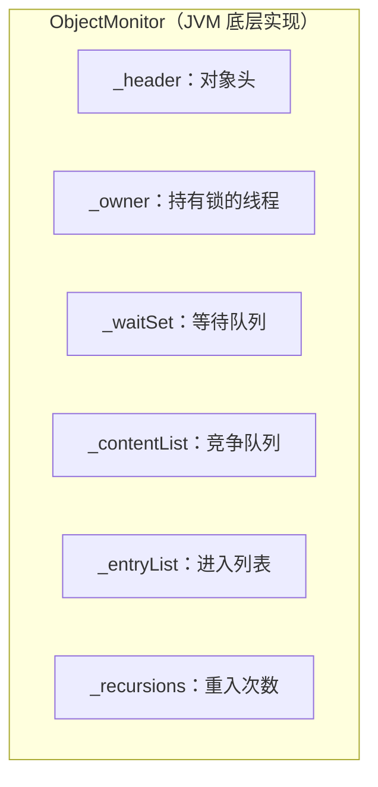
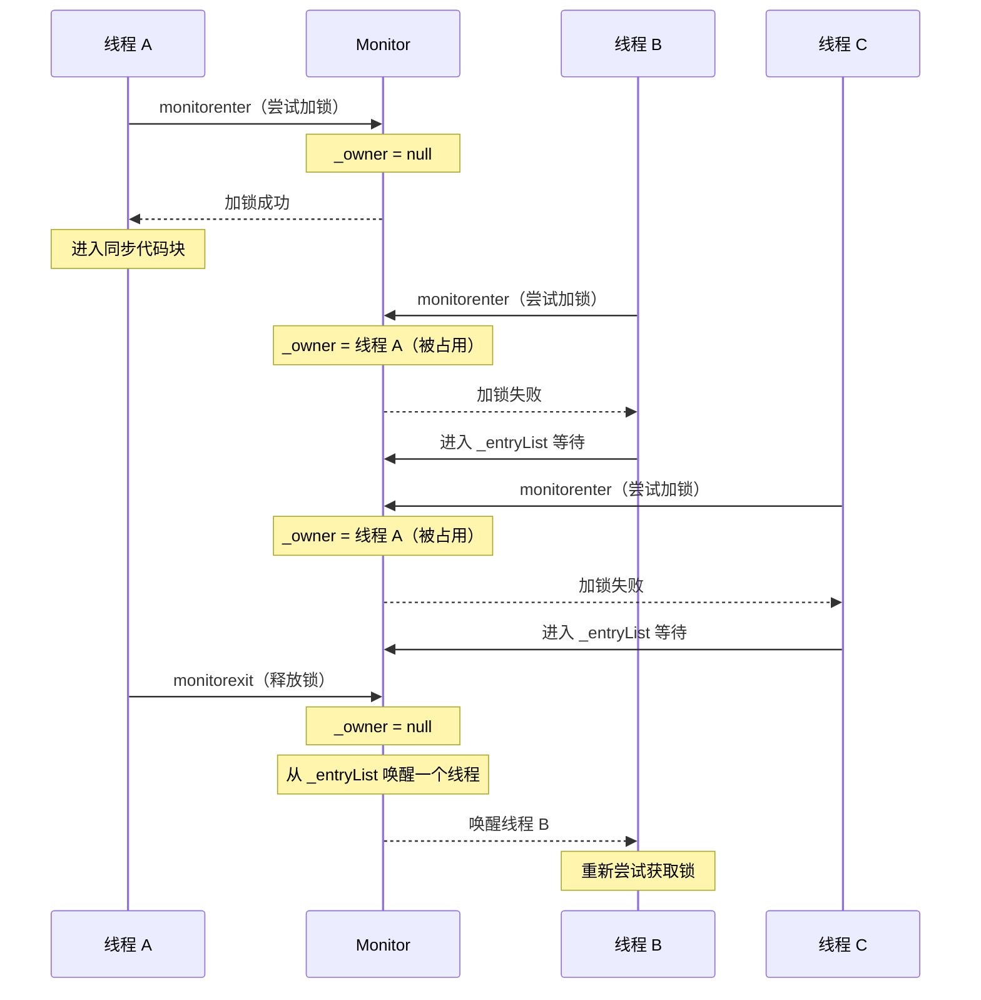
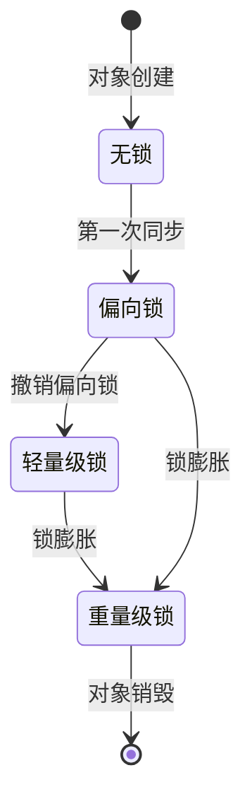

# synchronized 原理

> **目标级别**：P5/P6
> **面试频率**：🔴 高频

面试官问：「synchronized 是怎么实现的？」你说「通过加锁」——然后面试官紧接着追问「那 monitorenter 和 monitorexit 是什么？JDK6 做了哪些优化？」你沉默了。

synchronized 是 Java 并发编程的基础，不理解其原理就无法写出正确的并发代码。

## 面试官最关心的 3 个问题

1. ⚠️ synchronized 的底层实现是什么？
2. ⚠️ monitorenter 和 monitorexit 的作用是什么？
3. ⚠️ synchronized 和 Lock 有什么区别？

## 核心原理

### synchronized 的基本概念

synchronized 是 Java 提供的原生锁，通过 **对象监视器（Monitor）** 实现。

```java
// 三种使用方式
public class SyncDemo {
    private final Object lock = new Object();

    // 1. 同步实例方法（锁 this）
    public synchronized void method1() {
        // ...
    }

    // 2. 同步代码块（锁指定对象）
    public void method2() {
        synchronized (lock) {
            // ...
        }
    }

    // 3. 同步静态方法（锁 Class 对象）
    public static synchronized void method3() {
        // ...
    }
}
```

### 同步方法的字节码

```java
public synchronized void method();
// 字节码：
//   0: aload_0
//   1: monitorenter           ← 进入同步方法
//   2: ...
//   n: monitorexit            ← 退出同步方法

public void block();
// 字节码：
//   0: aload_0
//   1: monitorenter           ← 进入同步块
//   2: ...
//   n: monitorexit            ← 退出同步块
```

### monitorenter 和 monitorexit

每个对象都有一个关联的 **Monitor（监视器锁）**：

| 指令 | 作用 |
|------|------|
| `monitorenter` | 尝试获取对象的监视器锁（加锁） |
| `monitorexit` | 释放对象的监视器锁（解锁） |

### Monitor 的结构



| 字段 | 说明 |
|------|------|
| `_owner` | 指向持有锁的线程 |
| `_WaitSet` | 调用 wait() 方法后进入的等待队列 |
| `_entryList` | 等待获取锁的线程队列 |
| `_recursions` | 锁的重入次数 |

### synchronized 的执行流程



## synchronized 保证的特性

| 特性 | 说明 |
|------|------|
| **原子性** | monitorenter 和 monitorexit 之间的代码是原子的 |
| **可见性** | 锁释放前，会强制刷新工作内存到主内存 |
| **有序性** | 通过 monitor 协议，保证 happens-before |

### 锁释放时的 happens-before

```java
synchronized (lock) {
    x = 10;    // A：写入共享变量
}             // 锁释放：强制刷新到主内存
              // ↓ happens-before
synchronized (lock) {
    int y = x; // B：读取共享变量
}             // 锁获取：强制从主内存读取
```

## JDK 6 的优化

JDK 6 引入了 **偏向锁** 和 **轻量级锁**，优化了 synchronized 的性能：

| 锁类型 | 适用场景 | 开销 |
|--------|---------|------|
| **偏向锁** | 单线程访问 | 最低 |
| **轻量级锁** | 多线程交替访问 | 中等 |
| **重量级锁** | 多线程竞争 | 高 |

### 锁的演变过程



## 高频面试题

### 🔴 题目 1：synchronized 的底层原理是什么？

**参考回答**：

synchronized 的底层依赖于 **Monitor（对象监视器）** 实现：

1. **加锁**：执行 `monitorenter` 指令，尝试获取对象的 Monitor
2. **持有**：Monitor 的 `_owner` 指向持有锁的线程
3. **等待**：其他线程进入 `_entryList` 等待
4. **释放**：执行 `monitorexit` 指令，释放锁并唤醒等待线程

### 🔴 题目 2：synchronized 和 Lock 有什么区别？

**参考回答**：

| 区别 | synchronized | Lock |
|------|-------------|------|
| **获取方式** | 隐式获取/释放 | 显式获取/释放 |
| **锁粒度** | 方法级/代码块级 | 代码块级 |
| **特性** | 可重入、不可中断 | 可重入、可中断、公平/非公平 |
| **等待方式** | 阻塞等待 | 可超时、可中断 |
| **条件变量** | 一个（wait/notify） | 多个（newCondition） |

### 🟡 题目 3：synchronized 锁的对象是什么？

**参考回答**：

| 写法 | 锁对象 |
|------|--------|
| `synchronized` instance method | `this`（当前实例） |
| `synchronized` static method | `ClassName.class`（Class 对象） |
| `synchronized(object)` | 指定的对象 |

## 常见错误与陷阱

### ⚠️ 陷阱 1：锁对象改变

```java
// ❌ 错误：锁对象可变
private String lock = "lock";

public void doSomething() {
    synchronized (lock) {
        lock = "newLock"; // 改变锁对象，导致锁失效
    }
}
```

### ⚠️ 陷阱 2：锁粒度过大

```java
// ❌ 错误：整个方法加锁
public synchronized void process() {
    // 耗时的 IO 操作也在锁内
    networkCall();
    databaseQuery();
}

// ✅ 正确：缩小锁范围
public void process() {
    long id;
    synchronized (this) {
        id = generateId();
    }
    networkCall(id);
    databaseQuery(id);
}
```

### ⚠️ 陷阱 3：字符串作为锁对象

```java
// ❌ 错误：字符串字面量会被 JVM 缓存
private final String lock1 = "LOCK";
private final String lock2 = "LOCK"; // 与 lock1 同一对象！

synchronized (lock1) {
    // 与下面的代码竞争同一把锁！
    synchronized (lock2) {
    }
}
```

## 加分回答

### 💡 synchronized 的可重入性

synchronized 是可重入锁，同一线程可以多次获取同一对象的锁：

```java
public class ReentrantDemo {
    public synchronized void methodA() {
        System.out.println("methodA");
        methodB(); // 可以再次获取锁
    }

    public synchronized void methodB() {
        System.out.println("methodB");
    }
}
```

可重入的实现：Monitor 的 `_recursions` 计数器记录重入次数。

### 💡 synchronized 的优化技术

JDK 6+ 引入了多种优化：

1. **偏向锁**：消除无竞争下的同步开销
2. **轻量级锁**：使用 CAS 替代互斥量
3. **自适应自旋**：自旋次数动态调整
4. **锁消除**：JIT 编译器分析并消除不必要的锁

## 总结对比表

| 维度 | synchronized | Lock |
|------|-------------|------|
| **锁获取** | 隐式 | 显式（lock()） |
| **锁释放** | 隐式（离开作用域） | 显式（unlock()） |
| **可中断** | 否 | 是（lockInterruptibly()） |
| **可超时** | 否 | 是（tryLock()） |
| **公平锁** | 否 | 可选（new ReentrantLock(true)） |
| **多条件** | 否 | 是（newCondition()） |
| **性能** | JDK6+ 优化后性能接近 | 灵活但需手动管理 |

## 延伸思考

### 面试官可能会继续追问

1. 「偏向锁的撤销条件是什么？」
2. 「轻量级锁是如何实现的？」
3. 「synchronized 和 volatile 的区别是什么？」

### 回答方向

关于 synchronized 和 volatile：
- volatile 只保证可见性和有序性，不保证原子性
- synchronized 保证原子性、可见性和有序性
- volatile 轻量，synchronized 重量
