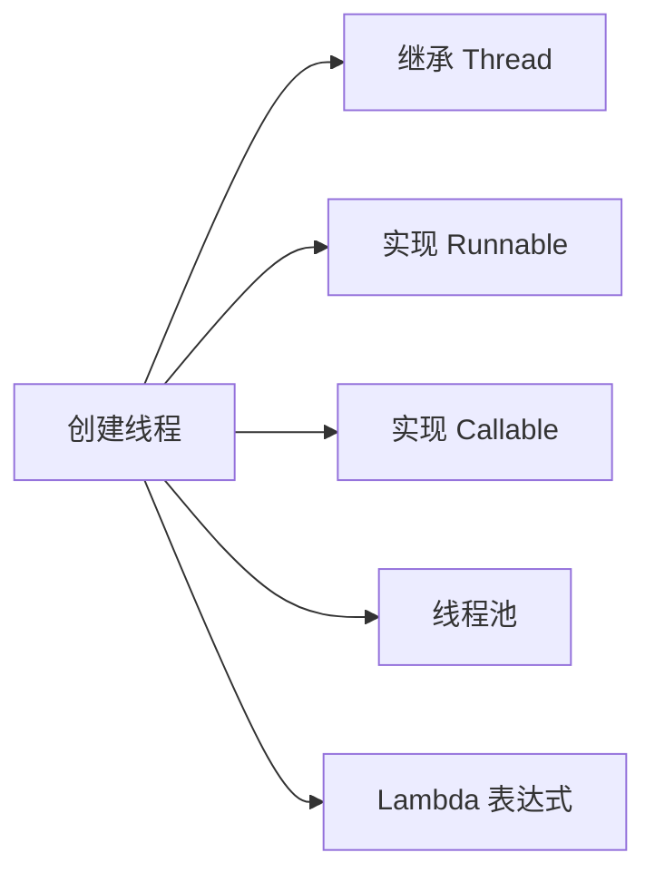

# 创建线程的几种方式

> **目标级别**：P5
> **面试频率**：🔴 高频

面试官问：「创建线程有几种方式？」你说「继承 Thread 和实现 Runnable」——然后面试官紧接着追问「还有呢？为什么不推荐继承 Thread？」你沉默了。

这道题考察的不仅是「会不会用」，更是「理解不理解」。

## 面试官最关心的 3 个问题

1. ⚠️ 创建线程有哪几种方式？
2. ⚠️ 为什么推荐使用 Runnable 而不是继承 Thread？
3. ⚠️ Callable 和 Runnable 的区别是什么？

## 核心原理

### Java 创建线程的 5 种方式



### 方式一：继承 Thread 类

```java
class MyThread extends Thread {
    @Override
    public void run() {
        System.out.println("继承 Thread 创建线程");
    }
}

// 使用
new MyThread().start();
```

### 方式二：实现 Runnable 接口

```java
class MyRunnable implements Runnable {
    @Override
    public void run() {
        System.out.println("实现 Runnable 创建线程");
    }
}

// 使用
new Thread(new MyRunnable()).start();
```

### 方式三：实现 Callable 接口

```java
class MyCallable implements Callable<Integer> {
    @Override
    public Integer call() throws Exception {
        System.out.println("实现 Callable 创建线程");
        return 42;
    }
}

// 使用
FutureTask<Integer> futureTask = new FutureTask<>(new MyCallable());
new Thread(futureTask).start();
Integer result = futureTask.get(); // 获取返回值
```

### 方式四：使用线程池

```java
ExecutorService executor = Executors.newFixedThreadPool(4);
executor.submit(() -> {
    System.out.println("线程池创建线程");
});
executor.shutdown();
```

### 方式五：Lambda 表达式（函数式接口）

```java
new Thread(() -> {
    System.out.println("Lambda 表达式创建线程");
}).start();
```

## 为什么推荐 Runnable 而不是继承 Thread？

### 核心原因

| 对比维度 | 继承 Thread | 实现 Runnable |
|---------|-------------|----------------|
| **单继承限制** | 受限，只能继承一个类 | 不受限，可实现多个接口 |
| **资源共享** | 需要额外处理 | 天然支持多个线程共享同一 Runnable |
| **解耦程度** | 线程与任务耦合 | 线程与任务分离 |
| **灵活性** | 低 | 高 |
| **可测试性** | 差 | 好 |

### Runnable 资源共享的优势

```java
class ShareTask implements Runnable {
    private int count = 0;

    @Override
    public void run() {
        for (int i = 0; i < 1000; i++) {
            count++;
        }
    }
}

// 三个线程共享同一个任务，累加同一个 count
ShareTask task = new ShareTask();
new Thread(task).start();
new Thread(task).start();
new Thread(task).start();
```

如果用 Thread 继承实现，需要把 count 作为静态变量或其他共享机制，代码耦合度更高。

## Callable vs Runnable

### 核心区别

| 对比维度 | Runnable | Callable |
|---------|----------|----------|
| **返回值** | `void` | `V`（泛型） |
| **异常** | 不能抛出受检异常 | 可以抛出受检异常 |
| **提交方式** | `Thread.start()` / `ExecutorService.execute()` | `ExecutorService.submit()` / `FutureTask` |
| **线程执行** | `run()` | `call()` |

### Callable 的使用示例

```java
ExecutorService executor = Executors.newSingleThreadExecutor();

Callable<String> task = () -> {
    // 模拟耗时操作
    Thread.sleep(1000);
    return "任务完成";
};

Future<String> future = executor.submit(task);

// 获取结果（阻塞等待）
String result = future.get(); // 阻塞直到完成
System.out.println(result);

executor.shutdown();
```

### Future 的作用

`Future` 代表异步计算的结果，提供了以下方法：

| 方法 | 说明 |
|------|------|
| `get()` | 阻塞等待获取结果 |
| `get(long timeout, TimeUnit unit)` | 超时等待 |
| `cancel(boolean mayInterruptIfRunning)` | 取消任务 |
| `isDone()` | 判断是否完成 |
| `isCancelled()` | 判断是否被取消 |

## 高频面试题

### 🔴 题目 1：创建线程有几种方式？哪种最好？

**参考回答**：

创建线程有 5 种方式：
1. 继承 Thread 类
2. 实现 Runnable 接口
3. 实现 Callable 接口
4. 使用线程池
5. Lambda 表达式（本质是 Runnable）

**推荐方式**：实现 Runnable 接口或使用线程池。

- 不推荐继承 Thread，因为 Java 单继承的限制
- Runnable 实现了线程与任务的解耦
- 线程池是生产环境的标准做法，能复用线程、控制并发数

### 🔴 题目 2：Thread 和 Runnable 的区别？

**参考回答**：

1. Thread 是类，Runnable 是接口
2. Thread 可以继承，Runnable 可以实现
3. Runnable 更容易实现资源共享
4. Runnable 更好地体现了职责分离（线程和任务分离）

### 🔴 题目 3：线程池创建线程的原理？

**参考回答**：

线程池通过 `ThreadFactory` 创建线程，默认使用 `DefaultThreadFactory`，主要做了三件事：

1. 设置线程为非守护线程
2. 设置线程优先级
3. 设置线程名称（pool-X-thread-Y）

```java
// 线程池内部使用 ThreadFactory 创建线程
public class DefaultThreadFactory implements ThreadFactory {
    public Thread newThread(Runnable r) {
        Thread t = new Thread(group, r, namePrefix + threadNumber.getAndIncrement());
        // 设置守护状态
        if (t.isDaemon()) {
            t.setDaemon(false);
        }
        // 设置优先级
        if (t.getPriority() != Thread.NORM_PRIORITY) {
            t.setPriority(Thread.NORM_PRIORITY);
        }
        return t;
    }
}
```

## 常见错误与陷阱

### ⚠️ 陷阱 1：直接调用 run() 方法

```java
Thread thread = new Thread(() -> {
    System.out.println("线程执行");
});

thread.run(); // ⚠️ 错误：在主线程中执行，没有启动新线程
thread.start(); // ✅ 正确：启动新线程执行
```

### ⚠️ 陷阱 2：忘记处理 Callable 的异常

```java
Callable<Integer> task = () -> {
    throw new Exception("任务异常"); // Callable 可以抛出受检异常
};

Future<Integer> future = executor.submit(task);
try {
    future.get(); // 需要捕获或声明抛出异常
} catch (ExecutionException e) {
    e.getCause().printStackTrace();
}
```

### ⚠️ 陷阱 3：线程池使用不当导致资源耗尽

```java
// 错误：每次请求都创建新的线程池
public void badPractice() {
    ExecutorService executor = Executors.newCachedThreadPool();
    executor.submit(task);
    // 忘记 shutdown，导致资源泄漏
}

// 正确：使用单例或依赖注入管理线程池
private final ExecutorService executor = Executors.newFixedThreadPool(4);
```

## 加分回答

### 💡 线程池的最佳实践

1. **使用 ThreadPoolExecutor 而非 Executors 创建线程池**

```java
// 阿里规范：不推荐使用 Executors
// 推荐使用 ThreadPoolExecutor 明确参数
ThreadPoolExecutor executor = new ThreadPoolExecutor(
    2,                      // corePoolSize
    4,                      // maximumPoolSize
    60L, TimeUnit.SECONDS,  // keepAliveTime
    new LinkedBlockingQueue<>(100), // workQueue
    new ThreadFactoryBuilder().setNameFormat("biz-pool-%d").build(),
    new ThreadPoolExecutor.AbortPolicy()
);
```

2. **区分 CPU 密集型和 IO 密集型任务**

```java
// CPU 密集型：线程数 = CPU 核心数
int cpuCores = Runtime.getRuntime().availableProcessors();
executor.setCorePoolSize(cpuCores);

// IO 密集型：线程数 = CPU 核心数 * 2（或根据 IO 等待时间调整）
executor.setCorePoolSize(cpuCores * 2);
```

### 💡 Future 的局限性

Future 有以下局限性，可以引出 CompletableFuture：

1. 不能手动完成
2. 不能链式调用
3. 不能组合多个 Future
4. 不支持回调

## 总结对比表

| 创建方式 | 返回值 | 异常处理 | 资源共享 | 推荐场景 |
|---------|--------|---------|---------|---------|
| 继承 Thread | ❌ | ❌ | 困难 | 不推荐 |
| 实现 Runnable | ❌ | ❌ | 简单 | 简单任务 |
| 实现 Callable | ✅ | ✅ | 简单 | 需要返回值的任务 |
| 线程池 | - | - | - | 生产环境 |
| Lambda | ❌ | ❌ | 简单 | 函数式任务 |

## 延伸思考

### 面试官可能会继续追问

1. 「线程池的核心参数有哪些？」
2. 「Future 和 CompletableFuture 有什么区别？」
3. 「如何实现一个带超时的异步调用？」

### 回答方向

关于 CompletableFuture：Java 8 引入了 CompletableFuture，它实现了 Future 接口，同时实现了 CompletionStage 接口，支持链式调用、组合多个异步任务、回调等高级特性。
