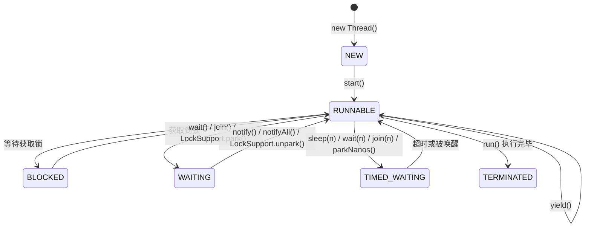
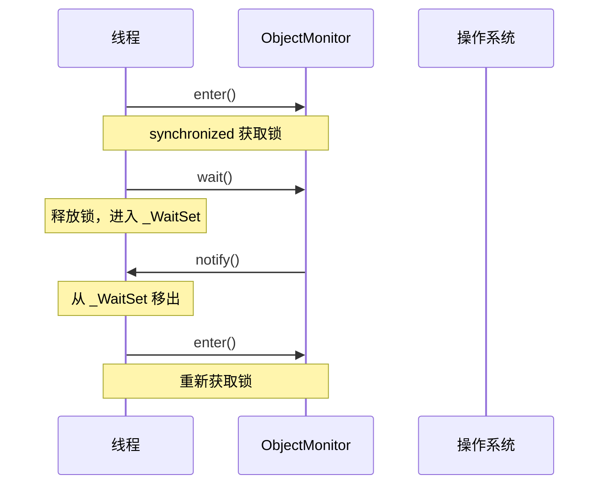

# 线程的生命周期与状态转换

> **目标级别**：P5
> **面试频率**：🔴 高频

面试官问：「线程有哪些状态？」你说「就绪、运行、阻塞」——然后面试官紧接着追问「那 wait 和 sleep 有什么区别？sleep 会释放锁吗？」你沉默了。

线程状态是并发编程的基础，不理解状态转换就写不出正确的多线程代码。

## 面试官最关心的 3 个问题

1. ⚠️ 线程的 6 种状态分别是什么？
2. ⚠️ wait/notify 与 sleep 的本质区别是什么？
3. ⚠️ BLOCKED 和 WAITING 状态有什么区别？

## 核心原理

### Java 线程的 6 种状态

Java 线程共有 6 种状态，定义在 `Thread.State` 枚举中：

```java
public enum State {
    NEW,        // 新建
    RUNNABLE,   // 可运行
    BLOCKED,    // 阻塞
    WAITING,    // 等待
    TIMED_WAITING, // 超时等待
    TERMINATED  // 终止
}
```

### 状态转换图



### 各状态详解

| 状态 | 说明 | 进入条件 | 退出条件 |
|------|------|---------|---------|
| **NEW** | 线程创建但未启动 | `new Thread()` | 调用 `start()` |
| **RUNNABLE** | 可运行状态（可能在等 CPU） | `start()` | CPU 调度执行 |
| **BLOCKED** | 阻塞状态（等待获取锁） | 进入 `synchronized` 代码块 | 获取到锁 |
| **WAITING** | 无限期等待 | `wait()`/`join()`/`park()` | 被唤醒 |
| **TIMED_WAITING** | 限期等待 | `sleep(n)`/`wait(n)`/`join(n)`/`parkNanos()` | 超时或被唤醒 |
| **TERMINATED** | 线程终止 | `run()` 执行完毕 | - |

## wait/notify 与 sleep 的区别

这是面试中极其高频的追问点，必须深入理解。

### 核心区别对比

| 区别 | `wait()` | `sleep()` |
|------|----------|----------|
| **所属类** | Object | Thread |
| **是否释放锁** | ✅ 释放 | ❌ 不释放 |
| **使用场景** | 同步代码块中 | 任意位置 |
| **苏醒方式** | notify/notifyAll/中断 | 超时/中断 |
| **是否抛出 InterruptedException** | 是 | 是 |
| **是否是静态方法** | 否 | 是（也有实例方法） |
| **与 synchronized 关系** | 必须配合 synchronized 使用 | 独立使用 |

### wait 释放锁的原理

```java
public class WaitDemo {
    private final Object lock = new Object();

    public void waitExample() throws InterruptedException {
        synchronized (lock) {
            // 进入同步块，获得 lock 的监视器锁
            while (conditionNotMet) {
                lock.wait(); // 释放 lock 锁，进入 WAITING 状态
            }
            // 继续执行，此时重新获得 lock 锁
        }
    }

    public void notifyExample() {
        synchronized (lock) {
            // 进入同步块，获得 lock 的监视器锁
            conditionMet = true;
            lock.notify(); // 唤醒一个在 lock 上等待的线程
            // 同步块结束，释放 lock 锁
        }
    }
}
```

### sleep 不释放锁的坑

```java
public class SleepTrap {
    private final Object lock = new Object();
    private boolean condition = false;

    public void sleepTrapExample() {
        synchronized (lock) {
            // 获得锁
            while (!condition) {
                try {
                    // ⚠️ sleep 不释放锁！
                    // 其他线程永远无法进入这个同步块来修改 condition
                    Thread.sleep(1000);
                } catch (InterruptedException e) {
                    e.printStackTrace();
                }
            }
        }
    }
}
```

:::danger sleep 不释放锁的陷阱
上面的代码是一个死锁陷阱！`sleep` 不会释放锁，所以其他线程无法修改 `condition`，导致当前线程永远等不到条件满足。
:::

### 正确做法：使用 wait/notify

```java
public class WaitNotifySolution {
    private final Object lock = new Object();
    private boolean condition = false;

    public void correctWaitExample() throws InterruptedException {
        synchronized (lock) {
            while (!condition) {
                lock.wait(); // 释放锁，进入 WAITING 状态
            }
        }
    }

    public void correctNotifyExample() {
        synchronized (lock) {
            condition = true;
            lock.notify(); // 唤醒等待的线程
        }
    }
}
```

## BLOCKED vs WAITING vs TIMED_WAITING

这是面试中的高频追问，需要清晰区分。

### BLOCKED 状态

线程等待获取 `synchronized` 监视器锁时的状态。

```java
// 线程 A
synchronized (object) {
    // 持有锁
}

// 线程 B
synchronized (object) {
    // 会进入 BLOCKED 状态，等待获取锁
}
```

### WAITING 状态

线程无限期等待另一个线程执行特定操作。

| 进入方式 | 退出方式 |
|---------|---------|
| `Object.wait()` | `notify()` / `notifyAll()` |
| `Thread.join()` | 被 join 的线程终止 |
| `LockSupport.park()` | `LockSupport.unpark()` |

### TIMED_WAITING 状态

线程等待指定时间。

| 进入方式 | 退出方式 |
|---------|---------|
| `Thread.sleep(long)` | 超时或中断 |
| `Object.wait(long)` | 超时、notify 或中断 |
| `Thread.join(long)` | 超时或中断 |
| `LockSupport.parkNanos()` | 超时或 unpark |
| `LockSupport.parkUntil()` | 超时或 unpark |

## 高频面试题

### 🔴 题目 1：wait 和 sleep 的区别？

**参考回答**：

1. `wait` 是 Object 的实例方法，`sleep` 是 Thread 的静态方法
2. `wait` 会释放锁，`sleep` 不会释放锁
3. `wait` 必须在同步代码块中使用，`sleep` 可以在任意位置使用
4. `wait` 被唤醒后需要重新竞争锁，`sleep` 直接进入就绪状态

### 🔴 题目 2：yield 和 sleep 有什么区别？

**参考回答**：

| 区别 | `yield()` | `sleep()` |
|------|----------|----------|
| 作用 | 提示调度器让出 CPU | 线程休眠一段时间 |
| 状态变化 | RUNNABLE → RUNNABLE（重新竞争） | RUNNABLE → TIMED_WAITING |
| 锁释放 | 否 | 否 |
| 可中断性 | 否 | 是 |

### 🟡 题目 3：start 和 run 的区别？

**参考回答**：

- `start()` 是启动线程的方法，会创建新线程并执行 `run()` 方法
- `run()` 只是普通方法调用，不会创建新线程

```java
Thread thread = new Thread(() -> {
    System.out.println("线程执行");
});

thread.start(); // 创建新线程执行
thread.run();   // 在主线程中执行（没有启动新线程）
```

## 常见错误与陷阱

### ⚠️ 陷阱 1：在同步块外调用 wait

```java
// 错误写法
public void wrongWait() {
    synchronized (lock) {
        // ...
    }
    lock.wait(); // ⚠️ 抛出 IllegalMonitorStateException
}
```

### ⚠️ 陷阱 2：使用 wait 时用 if 判断条件

```java
// 错误写法
synchronized (lock) {
    if (condition) { // ⚠️ 伪唤醒会导致问题
        lock.wait();
    }
}

// 正确写法
synchronized (lock) {
    while (condition) { // 总是使用 while 循环
        lock.wait();
    }
}
```

### ⚠️ 陷阱 3：notify 和 wait 的顺序颠倒

先 notify 后 wait 会导致线程永远等待（死锁的一种形式）。

## 加分回答

### 💡 虚假唤醒（Spurious Wakeup）

Java 的 Object.wait() 文档说明：

> A thread can also wake up without being notified, interrupted, or timing out, a so-called spurious wakeup. This is only possible in native code, not typical Java code.

因此，必须在 while 循环中调用 wait，而不是 if 语句。这是经典的 Producer-Consumer 模式中的注意点。

### 💡 从 JVM 层面理解线程状态

线程状态转换在 JVM 层通过 `ObjectMonitor` 实现：



## 总结对比表

| 方法 | 所属类 | 释放锁 | 必须同步 | 状态 |
|------|--------|--------|---------|------|
| `wait()` | Object | ✅ | ✅ | WAITING |
| `sleep(long)` | Thread | ❌ | ❌ | TIMED_WAITING |
| `yield()` | Thread | ❌ | ❌ | RUNNABLE |
| `join()` | Thread | ❌ | ❌ | WAITING/TIMED_WAITING |
| `park()` | LockSupport | ❌ | ❌ | WAITING/TIMED_WAITING |

## 延伸思考

### 面试官可能会继续追问

1. 「Lock 接口的 newCondition() 返回的 Condition 是什么？」
2. 「synchronized 和 Lock 的等待方式有什么不同？」
3. 「如何实现一个超时等待的锁？」

### 回答方向

`synchronized` 的等待只能用 Object 的 wait/notify，而 Lock 可以创建多个 Condition，每Condition 维护独立的等待队列，实现更灵活的线程协作。
